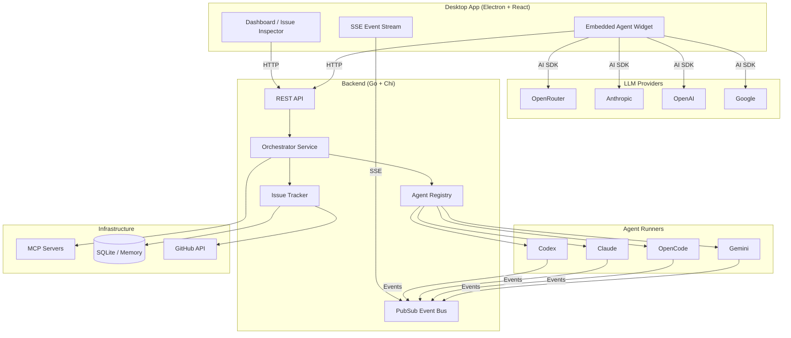

# Orchestra

⚠️ Early Development Notice: This project is in early development and is not yet ready for production use. Features may change, break, or be incomplete. Use at your own risk.

Multi-agent orchestration platform that coordinates machine learning coding agents to autonomously resolve issues from project trackers. Orchestra dispatches work to agents (Claude, Codex, OpenCode, Gemini), monitors their execution via real-time event streaming, and manages retries, workspaces, and MCP tool integrations — all through an Electron desktop app or a terminal TUI.



## Embedded Agent

A floating chat widget built into the desktop app that acts as an ML-powered co-pilot. Converse with the agent via text or voice, and it uses tools to manage your tasks, navigate the UI, query the orchestrator, and render rich interactive components inline.

- **Multi-provider LLM** — OpenRouter, Anthropic (Claude), OpenAI, Google (Gemini) via AI SDK 6
- **Tool system** — 40+ tools across issues, projects, git, sessions, search, code execution, scheduling, and MCP servers
- **Rich UI rendering** — json-render spec produces tables, cards, metrics, badges, alerts, and action buttons inline in chat
- **Voice input** — hold-to-talk STT via Whisper
- **Dynamic model fetching** — models loaded from each provider's API, filtered to tool-calling capable models only
- **Searchable model selector** — type to filter through hundreds of models in Settings
- **Watch mode** — monitors orchestrator events and notifies you of completions, failures, and retries
- **Keyboard shortcut** — `Ctrl+.` toggles the agent panel from anywhere

Configure in **Settings > Integrations** — pick a provider, enter an API key, select a model, and test the connection.

See [docs/guides/embedded-agent-setup.md](docs/guides/embedded-agent-setup.md) for the full setup guide and [docs/architecture/embedded-agent.md](docs/architecture/embedded-agent.md) for architecture details.

## Tech Stack

| Layer | Technology |
|-------|-----------|
| Backend | Go 1.25, Chi router, zerolog, SQLite |
| Desktop | Electron, React 19, TypeScript, Vite, Tailwind CSS v4, Radix UI |
| Embedded Agent | AI SDK 6, json-render, MCP TypeScript SDK, Whisper STT |
| TUI | Go, Bubble Tea |
| Agents | Codex, Claude Code, OpenCode, Gemini CLI |
| Protocol | JSON over HTTP, Server-Sent Events, WebSocket (terminals) |
| CI/CD | GitHub Actions, Docker (GHCR) |

## Project Structure

```
Orchestra/
├── apps/
│   ├── backend/          # Go backend — API server, orchestrator, agent runners
│   │   ├── cmd/          # Entry points: orchestrad (daemon), orchestra (CLI)
│   │   └── internal/     # All business logic (see docs/backend/)
│   ├── desktop/          # Electron + React frontend
│   │   ├── electron/     # Main process, preload, IPC bridge
│   │   └── src/          # React app, components, state management
│   │       └── components/embedded-agent/  # Chat widget, tools, json-render
│   └── tui/              # Terminal UI (Bubble Tea)
├── packages/
│   └── protocol/         # Shared JSON schemas for API contracts
├── ops/
│   └── docker/           # Dockerfile for backend container
├── docs/                 # Documentation wiki (DeepWiki format)
└── .github/
    ├── workflows/        # CI/CD pipelines
    └── actions/          # Reusable composite actions
```

## Quick Start

### Prerequisites

- Go 1.25+
- Node.js 22+ and npm
- At least one agent CLI installed (e.g., `claude`, `codex`)

### Run the Backend

```bash
cd apps/backend
go build -o orchestrad ./cmd/orchestrad/
./orchestrad --workspace-root /path/to/your/project
```

### Run the Desktop App

```bash
cd apps/desktop
npm install
npm run dev
```

### Run the TUI

```bash
cd apps/tui
go run .
```

## Configuration

Orchestra is configured through environment variables. Key settings:

| Variable | Description | Default |
|----------|-------------|---------|
| `ORCHESTRA_WORKSPACE_ROOT` | Root directory for agent workspaces | `.` |
| `ORCHESTRA_AGENT_PROVIDER` | Default agent provider | `CODEX` |
| `ORCHESTRA_TRACKER_TYPE` | Issue tracker backend (`memory`, `sqlite`, `github`) | `memory` |
| `ORCHESTRA_API_TOKEN` | Bearer token for API authentication | _(none)_ |
| `ORCHESTRA_HOST` | Server bind address | `127.0.0.1:3284` |
| `CODEX_COMMAND` | Path to Codex CLI | `codex` |
| `CLAUDE_COMMAND` | Path to Claude CLI | `claude` |
| `OPENCODE_COMMAND` | Path to OpenCode CLI | `opencode` |
| `GEMINI_COMMAND` | Path to Gemini CLI | `gemini` |

See [docs/guides/configuration.md](docs/guides/configuration.md) for the full reference.

## Documentation

Full documentation lives in [`docs/`](docs/index.md), structured as a DeepWiki:

- [Overview](docs/index.md)
- [Architecture](docs/architecture/overview.md)
- [API Reference](docs/api/reference.md)
- [Backend Internals](docs/backend/orchestrator.md)
- [Frontend Architecture](docs/frontend/components.md)
- [Operations](docs/operations/deployment.md)
- [Getting Started](docs/guides/getting-started.md)
- [Embedded Agent Architecture](docs/architecture/embedded-agent.md)
- [Embedded Agent Setup](docs/guides/embedded-agent-setup.md)
- [Embedded Agent Components](docs/frontend/embedded-agent-components.md)
- [Agent Provider API](docs/api/agent-providers.md)
- [Enum Reference](docs/enums.md)

## License

See [LICENSE](LICENSE) for details.
