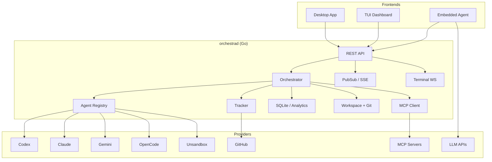

<p align="center">
  
</p>

# Orchestra

Multi-agent orchestration platform for dispatching software tasks to coding agents.

## Status

This repository is under active development and is not production-ready. Interfaces, workflows, and configuration may change.

## What It Does

- Runs a Go backend (`orchestrad`) that owns orchestration, issue state, agent execution, and event streaming.
- Provides an Electron + React desktop app for projects, issues, analytics, terminals, and agent operations.
- Includes an embedded in-app AI assistant with provider-backed chat, tool execution, and inline rich UI rendering.
- Supports multiple coding agents including Codex, Claude, Gemini, OpenCode, and optional Unsandbox integration.
- Streams lifecycle events to clients over SSE and supports interactive terminal sessions over WebSocket.
- Works with memory, SQLite, or GitHub-backed issue tracking.

## Architecture



## Applications

| App | Path | Purpose |
| --- | --- | --- |
| Backend | `apps/backend/` | API server, orchestrator, tracker, agent runners, telemetry, terminals |
| Desktop | `apps/desktop/` | Electron app for issue management, monitoring, analytics, docs, and embedded agent workflows |
| TUI | `apps/tui/` | Bubble Tea dashboard for local orchestration workflows |
| Shared Protocol | `packages/protocol/` | Shared JSON schemas and API contract support |

## Embedded Agent

The desktop app includes an embedded assistant that can talk to external LLM providers and invoke local Orchestra tools. Current capabilities in the repo include:

- Provider-backed chat via Anthropic, OpenAI, Google, and OpenRouter-compatible models
- Tool-driven workflows spanning issues, projects, git, sessions, search, scheduling, and MCP-backed operations
- Inline UI rendering through `json-render`
- Voice input via Whisper-based STT configuration
- Searchable model selection and connection testing in settings
- Watch-mode style notifications tied to backend activity

See [Embedded Agent Architecture](docs/architecture/embedded-agent.md) and [Embedded Agent Setup](docs/guides/embedded-agent-setup.md).

## Quick Start

### Prerequisites

- Go 1.25+
- Node.js 22+
- npm
- Git
- At least one installed agent CLI on `PATH`: `codex`, `claude`, `opencode`, or `gemini`

### 1. Start the Backend

```bash
cd apps/backend
go build -o orchestrad ./cmd/orchestrad/
./orchestrad --workspace-root /path/to/your/project
```

Default bind address is `127.0.0.1:4010`.

### 2. Start the Desktop App

```bash
cd apps/desktop
npm install
npm run dev
```

This launches Vite and Electron together for local development.

### 3. Start the TUI

```bash
cd apps/tui
go run .
```

You can also run the root shortcut:

```bash
make dash
```

## First-Run Configuration

Runtime configuration is loaded from environment variables, with optional overrides from `WORKFLOW.md`.

Common settings:

| Variable | Purpose | Default |
| --- | --- | --- |
| `ORCHESTRA_SERVER_HOST` | Backend bind host | `127.0.0.1` |
| `ORCHESTRA_SERVER_PORT` | Backend bind port | `4010` |
| `ORCHESTRA_API_TOKEN` | Required when binding to a non-loopback host | unset |
| `ORCHESTRA_WORKSPACE_ROOT` | Root directory for agent workspaces | `~/.orchestra/workspaces` |
| `ORCHESTRA_WORKTREE_ROOT` | Root directory for git worktrees | same as workspace root |
| `ORCHESTRA_AGENT_PROVIDER` | Default agent provider | `CODEX` |
| `ORCHESTRA_AGENT_MAX_TURNS` | Max turns per agent run | `25` |
| `ORCHESTRA_TRACKER_TYPE` | Tracker backend: `memory`, `sqlite`, or `github` | `memory` |
| `ORCHESTRA_TRACKER_ENDPOINT` | Tracker endpoint or repo identifier | unset |
| `ORCHESTRA_TRACKER_TOKEN` | Tracker auth token | unset |

Example local setup:

```bash
export ORCHESTRA_AGENT_PROVIDER=CODEX
export ORCHESTRA_TRACKER_TYPE=sqlite
export ORCHESTRA_WORKSPACE_ROOT="$HOME/.orchestra/workspaces"
```

For GitHub-backed issue tracking:

```bash
export ORCHESTRA_TRACKER_TYPE=github
export ORCHESTRA_TRACKER_ENDPOINT=owner/repo
export ORCHESTRA_TRACKER_TOKEN=ghp_xxx
```

Full reference: [Configuration Guide](docs/guides/configuration.md).

## Development

### Backend

```bash
cd apps/backend
go test ./...
go build -o orchestrad ./cmd/orchestrad/
go build -o orchestra ./cmd/orchestra/
```

### Desktop

```bash
cd apps/desktop
npm run typecheck
npm run test
npm run build
```

Additional repo scripts include smoke tests, parity verification, release-readiness checks, and platform packaging via `npm run dist:desktop`.

### TUI

```bash
cd apps/tui
go test ./...
go run .
```

## Repository Layout

```text
.
├── apps/
│   ├── backend/
│   ├── desktop/
│   └── tui/
├── docs/
├── ops/
├── packages/
└── .github/
```

## Documentation

- [Docs Index](docs/index.md)
- [Getting Started](docs/guides/getting-started.md)
- [Architecture Overview](docs/architecture/overview.md)
- [Backend Internals](docs/backend/orchestrator.md)
- [Desktop Architecture](docs/architecture/desktop.md)
- [Embedded Agent Architecture](docs/architecture/embedded-agent.md)
- [API Reference](docs/api/reference.md)
- [Development Guide](docs/guides/development.md)
- [Deployment](docs/operations/deployment.md)

## License

See [LICENSE](LICENSE).
