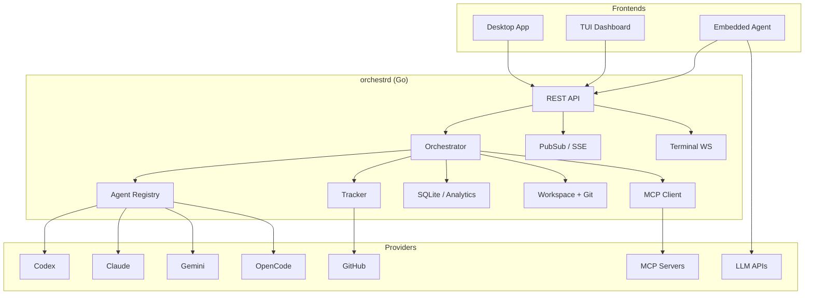

<p align="center">
  
</p>

# Orchestra

Orchestra is a desktop development workspace that integrates AI coding agents with project management, terminals, and real-time collaboration tools.

## Status

⚠️ **Early Development** - Interfaces and workflows may change without notice.

## What It Does

Orchestra connects your local projects and GitHub issues to AI coding agents for automated development workflows.

**Project Integration**
- Connect local Git repositories and remote GitHub projects
- Sync issues, pull requests, and project state automatically
- Track work across multiple repositories and teams
- Maintain isolated git worktrees for safe agent execution


**Automated Task Planning**
- Break down GitHub issues into executable tasks
- Generate implementation plans with agent assignments
- Schedule work across multiple coding agents
- Track dependencies and completion status


**Kanban Workflow**
- Visual issue board with drag-and-drop organization
- Real-time status updates from agent execution  
- Progress tracking from "To Do" to "Done"
- Integration with GitHub project boards


**Multi-Agent Orchestration**
- Deploy Claude, Codex, OpenCode, and Gemini agents simultaneously
- Load balance work across available agents
- Configure agent-specific skills, tools, and permissions
- Monitor agent performance and resource usage


**GitHub Integration**
- Import issues directly from GitHub repositories
- Create pull requests from completed agent work
- Sync labels, milestones, and project metadata
- Authenticate with GitHub tokens for private repos


**Embedded AI Assistant**
- Chat interface with multiple LLM providers
- Execute tools directly in your project context
- Voice input via Whisper and rich UI responses
- Access to 40+ development and automation tools


## Quick Start

### Prerequisites

- Go 1.25+
- Node.js 22+
- npm
- Git
- At least one installed agent CLI on `PATH`: `codex`, `claude`, `opencode`, or `gemini`

### 1. Start the Backend

```bash
cd apps/backend
go build -o orchestrd ./cmd/orchestrd/
./orchestrd --workspace-root /path/to/your/project
```

Default bind address is `127.0.0.1:4010`.

### 2. Start the Desktop App

```bash
cd apps/desktop
npm install
npm run dev
```

This launches Vite and Electron together for local development.

### 3. Start the TUI

```bash
cd apps/tui
go run .
```

You can also run the root shortcut:

```bash
make dash
```

## Configuration

Runtime configuration is loaded from environment variables, with optional overrides from `WORKFLOW.md`.

| Variable | Purpose | Default |
| --- | --- | --- |
| `ORCHESTRA_SERVER_HOST` | Backend bind host | `127.0.0.1` |
| `ORCHESTRA_SERVER_PORT` | Backend bind port | `4010` |
| `ORCHESTRA_API_TOKEN` | Required when binding to a non-loopback host | unset |
| `ORCHESTRA_WORKSPACE_ROOT` | Root directory for agent workspaces | `~/.orchestra/workspaces` |
| `ORCHESTRA_AGENT_PROVIDER` | Default agent provider | `CODEX` |
| `ORCHESTRA_TRACKER_TYPE` | Tracker backend: `github` or `sqlite` | unset |
| `ORCHESTRA_TRACKER_ENDPOINT` | GitHub repo (owner/repo) | unset |
| `ORCHESTRA_TRACKER_TOKEN` | GitHub token | unset |

Example local setup:
```bash
export ORCHESTRA_AGENT_PROVIDER=CODEX
export ORCHESTRA_TRACKER_TYPE=sqlite
export ORCHESTRA_WORKSPACE_ROOT="$HOME/.orchestra/workspaces"
```

For GitHub issues:
```bash
export ORCHESTRA_TRACKER_TYPE=github
export ORCHESTRA_TRACKER_ENDPOINT=owner/repo
export ORCHESTRA_TRACKER_TOKEN=ghp_xxx
```


## Development

### Backend
```bash
cd apps/backend
go test ./...
go build -o orchestrd ./cmd/orchestrd/
```

### Desktop
```bash
cd apps/desktop
npm run typecheck
npm run test
npm run build
```

### TUI
```bash
cd apps/tui
go test ./...
go run .
```

## Architecture



## Applications

| App | Path | Purpose |
| --- | --- | --- |
| Backend | `apps/backend/` | API server, orchestrator, tracker, agent runners |
| Desktop | `apps/desktop/` | Electron app for issue management, monitoring, analytics |
| TUI | `apps/tui/` | Terminal dashboard for local workflows |
| Protocol | `packages/protocol/` | Shared JSON schemas and API contracts |

## Repository Layout

```text
.
├── apps/
│   ├── backend/
│   ├── desktop/
│   └── tui/
├── docs/
├── ops/
├── packages/
└── .github/
```

## Documentation

- [Getting Started](docs/guides/getting-started.md)
- [Architecture Overview](docs/architecture/overview.md)
- [Desktop Architecture](docs/architecture/desktop.md)
- [API Reference](docs/api/reference.md)
- [Development Guide](docs/guides/development.md)
- [Configuration](docs/guides/configuration.md)
- [Deployment](docs/operations/deployment.md)

## License

See [LICENSE](LICENSE).