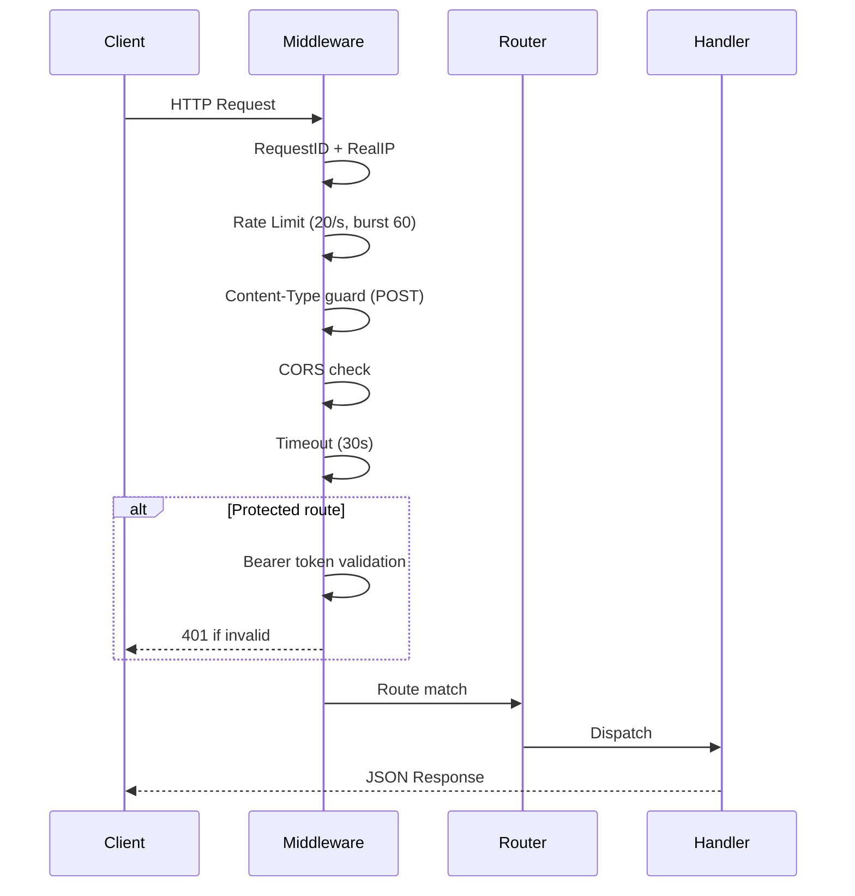

# 2.1 API Reference

> **Source files:**
> - `apps/backend/internal/api/router.go` — Route definitions and middleware
> - `apps/backend/internal/api/events.go` — SSE event stream handler
> - `apps/backend/internal/api/auth.go` — Bearer token authentication
> - `packages/protocol/schemas/v1/` — JSON Schema definitions

Orchestra exposes a REST API under `/api/v1/` served by `orchestrad`. All endpoints return JSON unless otherwise noted. Protected endpoints require a Bearer token in the `Authorization` header when `ORCHESTRA_API_TOKEN` is configured. Mutation requests to `/api/` paths are expected to use `Content-Type: application/json`.

---

### Base URL and Authentication

| Item | Value |
|------|-------|
| Base URL | `http://{host}:{port}/api/v1` |
| Auth header | `Authorization: Bearer {token}` |
| Content type | `application/json` for JSON mutation requests |
| Rate limit | 20 req/s sustained, 60 burst |
| Request timeout | 30 seconds |

If no `APIToken` is set in the server configuration, auth middleware is not applied to the protected route set. The terminal WebSocket route is registered outside the auth wrapper.

---

### Public Endpoints

These endpoints do not require authentication.

| Method | Path | Description |
|--------|------|-------------|
| `GET` | `/` | Dashboard HTML page |
| `GET` | `/healthz` | Health check (returns 200 OK) |
| `GET` | `/api/v1/healthz` | Health check (API-prefixed alias) |
| `GET` | `/api/v1/openapi.yaml` | OpenAPI specification document |
| `GET` | `/api/v1/terminal/{session_id}` | WebSocket terminal connection |
| `GET` | `/api/v1/github/login` | Initiate GitHub OAuth login flow |
| `GET` | `/api/v1/github/callback` | GitHub OAuth callback handler |

---

### State and Events

Real-time system state and server-sent event stream.

| Method | Path | Description |
|--------|------|-------------|
| `GET` | `/api/v1/state` | Current system snapshot (running/retrying issues, token totals) |
| `GET` | `/api/v1/events` | SSE event stream. Query param `once=1` returns a single snapshot and closes. See [2.3 Server-Sent Events](sse-events.md) |
| `POST` | `/api/v1/refresh` | Force a full state refresh |

---

### Issues

CRUD operations on Orchestra issues and their associated resources.

| Method | Path | Description |
|--------|------|-------------|
| `GET` | `/api/v1/issues` | List all issues |
| `POST` | `/api/v1/issues` | Create a new issue. Body: `IssueCreateRequest` (see [2.2 Schemas](schemas.md)) |
| `GET` | `/api/v1/issues/{issue_identifier}` | Get issue detail (status, attempts, logs, events) |
| `PATCH` | `/api/v1/issues/{issue_identifier}` | Update issue fields. Body: `IssueUpdateRequest` |
| `DELETE` | `/api/v1/issues/{issue_identifier}` | Delete an issue |
| `DELETE` | `/api/v1/issues/{issue_identifier}/session` | Delete the agent session for an issue |
| `GET` | `/api/v1/issues/{issue_identifier}/logs` | Retrieve session logs for an issue |
| `GET` | `/api/v1/issues/{issue_identifier}/history` | Get issue event history |
| `GET` | `/api/v1/issues/{issue_identifier}/diff` | Get the git diff produced by the issue's agent |
| `GET` | `/api/v1/issues/{issue_identifier}/artifacts` | List artifacts generated by the issue |
| `GET` | `/api/v1/issues/{issue_identifier}/artifacts/*` | Retrieve a specific artifact's content |
| `POST` | `/api/v1/issues/{issue_identifier}/pr` | Create a GitHub pull request from issue changes |
| `POST` | `/api/v1/issues/{issue_identifier}/stop` | Stop an active agent run for an issue |
| `GET` | `/api/v1/search` | Search issues (query params for filtering) |

---

### Projects

Manage registered projects and their file trees.

| Method | Path | Description |
|--------|------|-------------|
| `GET` | `/api/v1/projects` | List all projects |
| `POST` | `/api/v1/projects` | Register a new project |
| `GET` | `/api/v1/projects/{project_id}` | Get project detail |
| `DELETE` | `/api/v1/projects/{project_id}` | Remove a project |
| `POST` | `/api/v1/projects/{project_id}/refresh` | Refresh project metadata from disk |
| `GET` | `/api/v1/projects/{project_id}/file` | Get file content (query param `path`) |
| `GET` | `/api/v1/projects/{project_id}/tree` | Get the project file tree |

---

### Git Operations

Full git workflow operations scoped to a project.

| Method | Path | Description |
|--------|------|-------------|
| `GET` | `/api/v1/projects/{project_id}/git` | Git statistics (commits, contributors) |
| `GET` | `/api/v1/projects/{project_id}/git/status` | Working tree status (staged, unstaged, untracked) |
| `GET` | `/api/v1/projects/{project_id}/git/diff` | Current diff |
| `GET` | `/api/v1/projects/{project_id}/git/branches` | List branches |
| `GET` | `/api/v1/projects/{project_id}/git/branches/detail` | List branches with detailed metadata and ahead/behind status |
| `POST` | `/api/v1/projects/{project_id}/git/branches` | Create a new branch |
| `DELETE` | `/api/v1/projects/{project_id}/git/branches/{branch}` | Delete a branch |
| `POST` | `/api/v1/projects/{project_id}/git/checkout` | Checkout a branch |
| `POST` | `/api/v1/projects/{project_id}/git/stage` | Stage files |
| `POST` | `/api/v1/projects/{project_id}/git/unstage` | Unstage files |
| `POST` | `/api/v1/projects/{project_id}/git/commit` | Create a commit |
| `POST` | `/api/v1/projects/{project_id}/git/push` | Push to remote |
| `POST` | `/api/v1/projects/{project_id}/git/pull` | Pull from remote |
| `POST` | `/api/v1/projects/{project_id}/git/fetch` | Fetch from remote |
| `POST` | `/api/v1/projects/{project_id}/git/stash` | Stash working changes |
| `POST` | `/api/v1/projects/{project_id}/git/stash/pop` | Pop stashed changes |
| `GET` | `/api/v1/projects/{project_id}/git/stash/list` | List stash entries |
| `POST` | `/api/v1/projects/{project_id}/git/stash/apply` | Apply a stash entry without removing it |
| `POST` | `/api/v1/projects/{project_id}/git/stash/drop` | Drop a stash entry |
| `GET` | `/api/v1/projects/{project_id}/git/conflicts` | List merge conflict files |
| `POST` | `/api/v1/projects/{project_id}/git/merge` | Merge a branch |
| `POST` | `/api/v1/projects/{project_id}/git/merge/abort` | Abort an in-progress merge |
| `POST` | `/api/v1/projects/{project_id}/git/resolve` | Resolve merge conflicts |
| `GET` | `/api/v1/projects/{project_id}/git/default-branch` | Get the default branch name |

---

### GitHub Integration

GitHub issue, PR, and review operations scoped to a project with a connected repository.

| Method | Path | Description |
|--------|------|-------------|
| `POST` | `/api/v1/projects/{project_id}/github/disconnect` | Disconnect GitHub from project |
| `POST` | `/api/v1/projects/{project_id}/github/create-repo` | Create a new GitHub repository for the project |
| `GET` | `/api/v1/projects/{project_id}/github/issues` | List GitHub issues |
| `POST` | `/api/v1/projects/{project_id}/github/issues` | Create a GitHub issue |
| `PATCH` | `/api/v1/projects/{project_id}/github/issues/{number}` | Update a GitHub issue |
| `GET` | `/api/v1/projects/{project_id}/github/pulls` | List pull requests |
| `POST` | `/api/v1/projects/{project_id}/github/pulls` | Create a pull request |
| `GET` | `/api/v1/projects/{project_id}/github/pulls/{number}/diff` | Get PR diff |
| `GET` | `/api/v1/projects/{project_id}/github/pulls/{number}/reviews` | List PR reviews |
| `POST` | `/api/v1/projects/{project_id}/github/pulls/{number}/reviews` | Submit a PR review |
| `PUT` | `/api/v1/projects/{project_id}/github/pulls/{number}/merge` | Merge a PR |
| `GET` | `/api/v1/projects/{project_id}/github/pulls/{number}/comments` | List PR comments |

---

### Agents and Agent Configuration

Manage runtime agent settings plus legacy generic config-item operations.

| Method | Path | Description |
|--------|------|-------------|
| `GET` | `/api/v1/agents` | List active agents and their runtime status |
| `GET` | `/api/v1/config/agents` | Get the active runtime agent configuration used by the app shell |
| `PATCH` | `/api/v1/config/agents` | Patch runtime agent configuration fields |
| `POST` | `/api/v1/config/agents` | Replace runtime agent configuration |
| `GET` | `/api/v1/config/agents/items` | Legacy generic config-item listing API |
| `POST` | `/api/v1/config/agents/new` | Legacy generic config-item creation API |
| `POST` | `/api/v1/config/agents/items` | Legacy generic config-item update API |

Legacy config-item routes now emit deprecation metadata in HTTP response headers:
- `Deprecation: true`
- `Sunset: Wed, 31 Dec 2026 23:59:59 GMT`
- `Link: </api/v1/agents>; rel="successor-version"`

### Per-Provider Configuration

Each provider (`codex`, `claude`, `opencode`, `gemini`) exposes sub-routes for granular configuration.

| Method | Path | Description |
|--------|------|-------------|
| `GET` | `/api/v1/agents/{provider}/mcp` | List MCP servers for a provider |
| `POST` | `/api/v1/agents/{provider}/mcp` | Add an MCP server to a provider |
| `PUT` | `/api/v1/agents/{provider}/mcp/{name}` | Replace a provider MCP server definition |
| `PATCH` | `/api/v1/agents/{provider}/mcp/{name}` | Toggle a provider MCP server's enabled state |
| `DELETE` | `/api/v1/agents/{provider}/mcp/{name}` | Remove an MCP server from a provider |
| `GET` | `/api/v1/agents/{provider}/permissions` | Get provider permissions |
| `POST` | `/api/v1/agents/{provider}/permissions` | Update provider permissions |
| `GET` | `/api/v1/agents/{provider}/model` | Get provider model configuration |
| `POST` | `/api/v1/agents/{provider}/model` | Update provider model configuration |
| `GET` | `/api/v1/agents/{provider}/hooks` | Get provider lifecycle hooks |
| `POST` | `/api/v1/agents/{provider}/hooks` | Update provider lifecycle hooks |

### Provider-Native Configuration

Claude, Codex, Gemini, and OpenCode all expose native-config management routes beyond the shared normalized endpoints. The exact route surface varies by provider resource type.

| Method | Path | Description |
|--------|------|-------------|
| `GET` | `/api/v1/agents/claude/settings` | Get Claude settings document |
| `POST` | `/api/v1/agents/claude/settings` | Update Claude settings |
| `GET` | `/api/v1/agents/claude/instructions` | Get Claude instructions |
| `POST` | `/api/v1/agents/claude/instructions` | Update Claude instructions |
| `DELETE` | `/api/v1/agents/claude/instructions` | Remove Claude instructions |
| `GET` | `/api/v1/agents/claude/rules` | List Claude rules |
| `POST` | `/api/v1/agents/claude/rules` | Add or update a Claude rule |
| `DELETE` | `/api/v1/agents/claude/rules/{name}` | Delete a Claude rule |
| `GET` | `/api/v1/agents/claude/skills` | List Claude skills |
| `POST` | `/api/v1/agents/claude/skills` | Add or update a Claude skill |
| `DELETE` | `/api/v1/agents/claude/skills/{name}` | Delete a Claude skill |
| `GET` | `/api/v1/agents/claude/subagents` | List Claude sub-agents |
| `POST` | `/api/v1/agents/claude/subagents` | Add or update a Claude sub-agent |
| `DELETE` | `/api/v1/agents/claude/subagents/{name}` | Delete a Claude sub-agent |
| `GET` | `/api/v1/agents/codex/config` | Get Codex `config.toml` resources |
| `POST` | `/api/v1/agents/codex/config` | Update Codex `config.toml` |
| `GET` | `/api/v1/agents/codex/instructions` | Get Codex instruction documents |
| `POST` | `/api/v1/agents/codex/instructions` | Add or update Codex instructions |
| `GET` | `/api/v1/agents/codex/subagents` | List Codex sub-agent TOML files |
| `POST` | `/api/v1/agents/codex/subagents` | Add or update a Codex sub-agent |
| `DELETE` | `/api/v1/agents/codex/subagents/{name}` | Delete a Codex sub-agent |
| `GET` | `/api/v1/agents/codex/skills` | List Codex skills |
| `POST` | `/api/v1/agents/codex/skills` | Add or update a Codex skill |
| `DELETE` | `/api/v1/agents/codex/skills/{name}` | Delete a Codex skill |
| `GET` | `/api/v1/agents/codex/rules` | List Codex rules |
| `POST` | `/api/v1/agents/codex/rules` | Add or update a Codex rule |
| `DELETE` | `/api/v1/agents/codex/rules/{name}` | Delete a Codex rule |
| `GET` | `/api/v1/agents/gemini/settings` | Get Gemini `settings.json` |
| `POST` | `/api/v1/agents/gemini/settings` | Update Gemini `settings.json` |
| `GET` | `/api/v1/agents/gemini/context` | Get Gemini context documents |
| `POST` | `/api/v1/agents/gemini/context` | Add or update Gemini context |
| `GET` | `/api/v1/agents/gemini/commands` | List Gemini command files |
| `POST` | `/api/v1/agents/gemini/commands` | Add or update a Gemini command |
| `DELETE` | `/api/v1/agents/gemini/commands/{name}` | Delete a Gemini command |
| `GET` | `/api/v1/agents/opencode/config` | Get OpenCode config resources |
| `POST` | `/api/v1/agents/opencode/config` | Update OpenCode config |
| `GET` | `/api/v1/agents/opencode/agents` | List OpenCode agents |
| `POST` | `/api/v1/agents/opencode/agents` | Add or update an OpenCode agent |
| `DELETE` | `/api/v1/agents/opencode/agents/{name}` | Delete an OpenCode agent |
| `GET` | `/api/v1/agents/opencode/commands` | List OpenCode commands |
| `POST` | `/api/v1/agents/opencode/commands` | Add or update an OpenCode command |
| `DELETE` | `/api/v1/agents/opencode/commands/{name}` | Delete an OpenCode command |
| `GET` | `/api/v1/agents/opencode/skills` | List OpenCode skills |
| `POST` | `/api/v1/agents/opencode/skills` | Add or update an OpenCode skill |
| `DELETE` | `/api/v1/agents/opencode/skills/{name}` | Delete an OpenCode skill |

---

### MCP (Model Context Protocol)

Global MCP server and tool management (not provider-specific).

| Method | Path | Description |
|--------|------|-------------|
| `GET` | `/api/v1/mcp/tools` | List all available MCP tools across servers |
| `GET` | `/api/v1/mcp/servers` | List registered MCP servers |
| `POST` | `/api/v1/mcp/servers` | Register a new MCP server |
| `DELETE` | `/api/v1/mcp/servers/{id}` | Remove an MCP server |

---

### Sessions

Agent session tracking and inspection.

| Method | Path | Description |
|--------|------|-------------|
| `GET` | `/api/v1/sessions` | List all sessions |
| `GET` | `/api/v1/sessions/{session_id}` | Get session detail (events, token usage) |

---

### Analytics

Data warehouse and aggregated telemetry statistics.

| Method | Path | Description |
|--------|------|-------------|
| `GET` | `/api/v1/warehouse/stats` | Global token usage, provider breakdown, recent sessions |
| `GET` | `/api/v1/analytics/daily` | Daily rollup metrics |
| `GET` | `/api/v1/analytics/cost` | Cost analytics summary |
| `GET` | `/api/v1/analytics/cost/optimization` | Cost optimization recommendations |
| `GET` | `/api/v1/analytics/performance` | Performance analytics |
| `GET` | `/api/v1/analytics/rate-limits` | Rate-limit analytics |
| `GET` | `/api/v1/analytics/productivity` | Productivity analytics |
| `GET` | `/api/v1/analytics/productivity/sessions` | Productivity session breakdown |
| `GET` | `/api/v1/analytics/budgets` | List analytics budgets |
| `POST` | `/api/v1/analytics/budgets` | Create or update a budget |
| `DELETE` | `/api/v1/analytics/budgets/{id}` | Delete a budget |
| `POST` | `/api/v1/analytics/external/sync` | Trigger external analytics sync |
| `GET` | `/api/v1/analytics/external/status` | External analytics sync status |
| `GET` | `/api/v1/analytics/external/reconcile` | External analytics reconciliation preview |
| `GET` | `/api/v1/external/status` | Alias for external analytics sync status |
| `GET` | `/api/v1/external/reconcile` | Alias for external analytics reconciliation preview |

---

### Agent Provider Keys

Manage embedded-agent provider credentials stored under the Orchestra user config directory.

| Method | Path | Description |
|--------|------|-------------|
| `GET` | `/api/v1/config/agent-providers` | List saved provider-key status for `openrouter`, `claude`, `openai`, and `gemini` |
| `POST` | `/api/v1/config/agent-providers` | Save or clear a provider API key |

---

### Telemetry and Speech-to-Text

| Method | Path | Description |
|--------|------|-------------|
| `GET` | `/api/v1/telemetry/health` | Telemetry subsystem health |
| `GET` | `/api/v1/stt/health` | Report whether backend Whisper transcription is ready and which binary/model/language are configured |
| `POST` | `/api/v1/stt/transcribe` | Transcribe a multipart `audio` upload with optional `language` override |

---

### Documentation

| Method | Path | Description |
|--------|------|-------------|
| `GET` | `/api/v1/docs` | List available documentation pages |
| `GET` | `/api/v1/docs/*` | Retrieve documentation page content |

---

### Workspace Migration

| Method | Path | Description |
|--------|------|-------------|
| `GET` | `/api/v1/workspace/migration/plan` | Preview a workspace migration plan without executing (query params: `from`, `to`) |
| `POST` | `/api/v1/workspace/migrate` | Execute workspace migration |

---

### Unsandbox (Remote Execution)

Manage remote execution environments via the unsandbox/unturf/permacomputer platform.

| Method | Path | Description |
|--------|------|-------------|
| `GET` | `/api/v1/unsandbox/status` | Unsandbox connection status |
| `POST` | `/api/v1/unsandbox/execute` | Execute a command in unsandbox |
| `GET` | `/api/v1/unsandbox/jobs/*` | Get unsandbox job result by path |
| `GET` | `/api/v1/unsandbox/sessions` | List unsandbox execution sessions |
| `GET` | `/api/v1/unsandbox/services` | List available unsandbox services |
| `GET` | `/api/v1/config/unsandbox` | Get unsandbox configuration (API keys) |
| `POST` | `/api/v1/config/unsandbox` | Update unsandbox configuration |
| `DELETE` | `/api/v1/config/unsandbox` | Delete unsandbox configuration |

---

### Error Responses

All API errors follow a consistent envelope format. See [2.2 JSON Schemas & Types](schemas.md) for the full schema.

```json
{
  "error": {
    "code": "not_found",
    "message": "route not found"
  }
}
```

| HTTP Status | Error Code | Description |
|-------------|-----------|-------------|
| 400 | `bad_request` | Malformed request body or parameters |
| 401 | `unauthorized` | Missing or invalid Bearer token |
| 404 | `not_found` | Resource or route not found |
| 405 | `method_not_allowed` | HTTP method not supported for this route |
| 415 | `unsupported_media_type` | POST body must be `application/json` |
| 429 | `rate_limited` | Rate limit exceeded (20 req/s sustained, 60 burst) |
| 500 | `internal_error` | Server-side failure |
| 500 | `encode_error` | Failed to encode JSON response |

---

### Request Flow



---

### Endpoint Count Summary

| Category | Count |
|----------|-------|
| Public | 7 |
| State & Events | 3 |
| Issues | 14 |
| Projects | 7 |
| Git Operations | 23 |
| GitHub Integration | 12 |
| Agents & Config | 16 |
| MCP | 4 |
| Sessions | 2 |
| Analytics | 1 |
| Telemetry & STT | 3 |
| Documentation | 2 |
| Workspace Migration | 2 |
| Unsandbox | 8 |
| Agent Provider Keys | 2 |
| **Total** | **106** |
