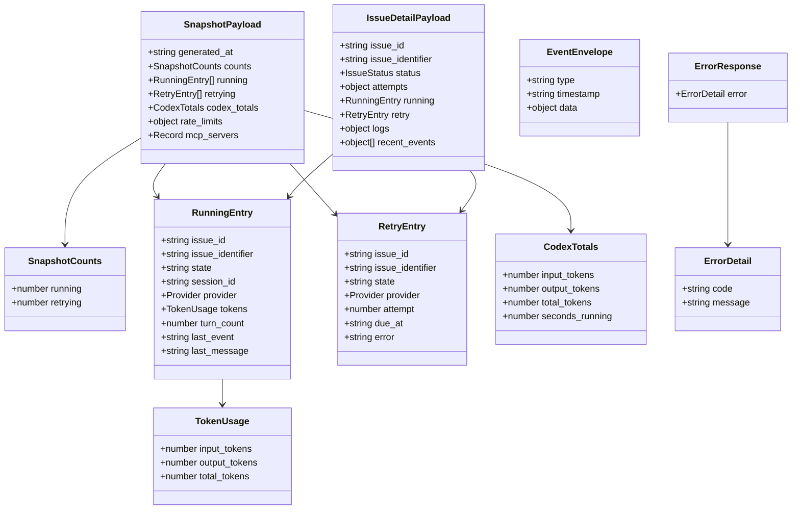

# 2.2 JSON Schemas & Types

> **Source files:**
> - `packages/protocol/schemas/v1/*.schema.json` -- all 21 JSON schema definitions
> - `apps/desktop/src/lib/orchestra-types.ts` -- TypeScript type definitions
> - `apps/backend/internal/tracker/types.go` -- Issue, Blocker, IssueFilter (Go)
> - `apps/backend/internal/agents/types.go` -- Provider, TurnRequest, TurnResult, TokenUsage, Event (Go)
> - `apps/backend/internal/types/enums.go` -- IssueStatus, AgentCategory, SSEEventType (Go)

The Orchestra protocol layer defines a shared set of JSON schemas (draft-07) in `packages/protocol/schemas/v1/` and corresponding TypeScript types in the desktop application. Every HTTP response from `orchestrad` conforms to one of these schemas; request bodies for mutations follow the matching `*.request.schema.json` definition. The Go backend defines parallel struct types that serialize to the same JSON shapes.

---

## Schema inventory

| Schema file | Direction | Root type | Description |
|---|---|---|---|
| `error.response.schema.json` | Response | `object` | Standard error envelope for any 4xx/5xx |
| `issue.create.request.schema.json` | Request | `object` | Body for `POST /api/v1/issues` |
| `issue.update.request.schema.json` | Request | `object` | Body for `PATCH /api/v1/issues/:identifier` |
| `issue.response.schema.json` | Response | `object` | Detailed single-issue response with runtime data |
| `issues.list.response.schema.json` | Response | `array` | Array of issue objects |
| `project.create.request.schema.json` | Request | `object` | Body for `POST /api/v1/projects` |
| `project.response.schema.json` | Response | `object` | Single project with optional stats |
| `projects.list.response.schema.json` | Response | `array` | Array of project objects |
| `sessions.list.response.schema.json` | Response | `array` | Array of session summaries |
| `session.detail.response.schema.json` | Response | `object` | Single session with event timeline |
| `agents.list.response.schema.json` | Response | `array` | Array of agent config entries |
| `agent.config.response.schema.json` | Response | `object` | Single agent config file |
| `warehouse.stats.response.schema.json` | Response | `object` | Global token and session statistics |
| `state.response.schema.json` | Response | `object` | Full runtime snapshot (running/retrying/totals) |
| `refresh.response.schema.json` | Response | `object` | Acknowledgement of a refresh request |
| `mcp.servers.response.schema.json` | Response | `array` | Registered MCP servers |
| `mcp.tools.response.schema.json` | Response | `array` | Available MCP tools |
| `stt.health.response.schema.json` | Response | `object` | Speech-to-text service health |
| `stt.transcribe.response.schema.json` | Response | `object` | Speech-to-text transcription result |
| `workspace.migration.plan.response.schema.json` | Response | `object` | Dry-run migration plan |
| `workspace.migrate.response.schema.json` | Response | `object` | Executed migration result |

---

## Error response

All error responses share a single envelope. The TypeScript equivalent is `APIErrorEnvelope`.

```jsonc
// error.response.schema.json
{
  "error": {
    "code": "not_found",       // machine-readable (e.g. "unauthorized", "not_found")
    "message": "route not found" // human-readable description
  }
}
```

| Field | Type | Required | Description |
|---|---|---|---|
| `error` | object | yes | Error details container |
| `error.code` | string | yes | Machine-readable error code |
| `error.message` | string | yes | Human-readable error description |

---

## Issue schemas

### IssueCreateRequest

**Endpoint:** `POST /api/v1/issues`
**Required fields:** `title`, `description`, `state`

| Field | Type | Required | Constraint | Description |
|---|---|---|---|---|
| `title` | string | yes | | Issue title |
| `description` | string | yes | | Issue body / agent prompt |
| `state` | string | yes | | Initial tracker state (e.g. `open`, `backlog`) |
| `priority` | number | no | | Numeric priority (lower = higher priority) |
| `assignee_id` | string | no | | Agent or user to assign |
| `project_id` | string | no | | Target project UUID |
| `provider` | string | no | enum: `CODEX`, `CLAUDE`, `OPENCODE`, `GEMINI`, `UNSANDBOX` | ML provider for execution |
| `disabled_tools` | string[] | no | | Tool names to exclude from agent runs |

### IssueUpdateRequest

**Endpoint:** `PATCH /api/v1/issues/:identifier`
**Required fields:** none (all optional, partial update)

The schema is identical to the create request except no fields are required. Any subset of fields may be sent to apply a partial update.

### Issue list response

**Root type:** `array`
**Item required fields:** `id`, `identifier`, `title`, `state`

| Field | Type | Required | Description |
|---|---|---|---|
| `id` | string | yes | Internal UUID |
| `identifier` | string | yes | Human-readable identifier (e.g. `ORK-42`) |
| `title` | string | yes | Issue title |
| `state` | string | yes | Tracker state |
| `description` | string | no | Issue body |
| `priority` | number | no | Numeric priority |
| `branch_name` | string | no | Git branch for this issue |
| `url` | string | no | External URL (e.g. GitHub issue link) |
| `project_id` | string | no | Owning project UUID |
| `assignee_id` | string | no | Assigned agent ID |
| `assigned_to_worker` | boolean | no | Whether an agent is actively assigned |
| `labels` | string[] | no | Freeform labels |
| `blocked_by` | Blocker[] | no | Issues blocking this one |
| `created_at` | string | no | ISO-8601 creation timestamp |
| `updated_at` | string | no | ISO-8601 last-update timestamp |
| `provider` | string | no | enum: `CODEX`, `CLAUDE`, `OPENCODE`, `GEMINI`, `UNSANDBOX` |
| `disabled_tools` | string[] | no | Tools excluded from agent runs |
| `base_sha` | string | no | Git SHA of the base commit |

**Blocker sub-object:**

| Field | Type | Description |
|---|---|---|
| `id` | string | Blocking issue UUID |
| `identifier` | string | Blocking issue human-readable ID |
| `state` | string | Current state of the blocker |

### IssueDetailPayload

**Endpoint:** `GET /api/v1/issues/:identifier`
**Required fields:** `issue_id`, `issue_identifier`, `status`, `attempts`, `logs`, `recent_events`

Extends the list-item fields with runtime data, workspace paths, and session logs.

| Field | Type | Required | Description |
|---|---|---|---|
| `issue_id` | string | yes | Internal UUID |
| `issue_identifier` | string | yes | Human-readable identifier |
| `id` | string | no | Alias for `issue_id` |
| `identifier` | string | no | Alias for `issue_identifier` |
| `title` | string | no | Issue title |
| `description` | string | no | Issue description |
| `state` | string | no | Current tracker state |
| `status` | string | yes | enum: `RUNNING`, `RETRYING`, `TRACKED`, `IDLE` -- computed runtime status |
| `priority` | number | no | Priority level |
| `assignee_id` | string | no | Assigned user/worker ID |
| `project_id` | string | no | Parent project ID |
| `branch_name` | string | no | Git branch associated with this issue |
| `url` | string | no | External URL |
| `labels` | array | no | Labels attached to the issue |
| `blocked_by` | array | no | Issues blocking this one |
| `provider` | string | no | enum: `CODEX`, `CLAUDE`, `OPENCODE`, `GEMINI`, `UNSANDBOX` |
| `disabled_tools` | array | no | Tools disabled for this issue |
| `created_at` | string | no | ISO-8601 creation timestamp |
| `updated_at` | string | no | ISO-8601 last-update timestamp |
| `base_sha` | string | no | Git SHA at the start of the run |
| `attempts` | object | yes | `{ restart_count: number, current_retry_attempt: number }` |
| `workspace` | object | no | `{ path: string }` -- workspace directory |
| `workspace_path` | string | no | Alternate workspace path field |
| `running` | RunningEntry/null | no | Current running entry if status is RUNNING |
| `retry` | RetryEntry/null | no | Current retry entry if status is RETRYING |
| `logs` | object | yes | `{ codex_session_logs: [{ label, path, url? }] }` |
| `recent_events` | array | yes | Recent lifecycle events |
| `last_error` | string/null | no | Most recent error message |
| `tracked` | object | no | Tracked state metadata |
| `history` | any | no | Full event history |

---

## Project schemas

### ProjectCreateRequest

**Endpoint:** `POST /api/v1/projects`
**Required fields:** `root_path`

| Field | Type | Required | Description |
|---|---|---|---|
| `root_path` | string | yes | Absolute filesystem path to the project root |

### Project response

**Required fields:** `id`, `name`, `root_path`

| Field | Type | Required | Description |
|---|---|---|---|
| `id` | string | yes | Project UUID |
| `name` | string | yes | Project display name |
| `root_path` | string | yes | Filesystem root path |
| `remote_url` | string | no | Git remote URL |
| `github_owner` | string | no | GitHub repository owner |
| `github_repo` | string | no | GitHub repository name |
| `github_token` | string | no | GitHub access token |
| `path_exists` | boolean | no | Whether `root_path` exists on disk |
| `total_sessions` | number | no | Number of agent sessions (stats, single-project response only) |
| `total_input` | number | no | Cumulative input tokens (stats) |
| `total_output` | number | no | Cumulative output tokens (stats) |
| `last_active` | string | no | ISO-8601 timestamp of last activity (stats) |

### Projects list response

**Root type:** `array`
Same item shape as the project response, excluding the stats fields (`total_sessions`, `total_input`, `total_output`, `last_active`).

---

## Session schemas

### Sessions list response

**Root type:** `array`
**Item required fields:** `id`, `provider`, `created_at`

| Field | Type | Required | Description |
|---|---|---|---|
| `id` | string | yes | Session row ID |
| `provider` | string | yes | ML provider that ran the session |
| `created_at` | string | yes | ISO-8601 creation timestamp |
| `project_id` | string | no | Owning project UUID |
| `project_name` | string | no | Project display name |
| `session_uuid` | string | no | External session UUID |
| `model` | string | no | Model identifier used |
| `branch` | string | no | Git branch during this session |
| `updated_at` | string | no | ISO-8601 last-update timestamp |
| `total_input` | number | no | Input tokens consumed |
| `total_output` | number | no | Output tokens produced |

### SessionDetail response

**Required fields:** `id`, `provider`, `created_at`, `events`

Extends the list item with an `events` array containing the full session timeline.

**Event item required fields:** `id`, `session_id`, `kind`, `timestamp`

| Field | Type | Required | Description |
|---|---|---|---|
| `id` | string | yes | Event row ID |
| `session_id` | string | yes | Parent session ID |
| `kind` | string | yes | Event kind (e.g. `message`, `tool_call`, `error`) |
| `timestamp` | string | yes | ISO-8601 event timestamp |
| `message` | string | no | Human-readable event content |
| `raw_payload` | string | no | Raw JSON payload from the agent |
| `input_tokens` | number | no | Incremental input tokens for this event |
| `output_tokens` | number | no | Incremental output tokens for this event |

---

## Agent config schemas

### Agents list response

**Root type:** `array`
**Item required fields:** `name`, `path`, `category`, `scope`

| Field | Type | Required | Constraint | Description |
|---|---|---|---|---|
| `name` | string | yes | | Config file display name |
| `path` | string | yes | | Absolute filesystem path |
| `category` | string | yes | enum: `CORE`, `SKILL` | Configuration category |
| `scope` | string | yes | enum: `GLOBAL`, `PROJECT` | Scoping level |
| `content` | string | no | | File content body |

### Agent config response

Same shape as a single list item. Required fields: `name`, `path`, `category`, `scope`.

---

## Analytics stats response

**Required fields:** `total_tokens`, `total_input`, `total_output`, `provider_usage`, `model_usage`, `recent_sessions`

| Field | Type | Description |
|---|---|---|
| `total_tokens` | number | Sum of all tokens across all sessions |
| `total_input` | number | Total input (prompt) tokens |
| `total_output` | number | Total output (completion) tokens |
| `provider_usage` | `Record<string, number>` | Token count keyed by provider name |
| `model_usage` | `Record<string, number>` | Token count keyed by model identifier |
| `recent_sessions` | array | Latest session summaries (same item shape as sessions list) |

---

## Runtime state response (SnapshotPayload)

**Required fields:** `generated_at`, `counts`, `running`, `retrying`, `codex_totals`

This is the primary polling/snapshot endpoint (`GET /api/v1/state`). Also sent as the `snapshot` SSE event payload every 5 seconds.

| Field | Type | Description |
|---|---|---|
| `generated_at` | string | ISO-8601 snapshot timestamp |
| `counts.running` | number | Number of currently running issues |
| `counts.retrying` | number | Number of issues awaiting retry |
| `running` | RunningEntry[] | Active agent runs |
| `retrying` | RetryEntry[] | Scheduled retries |
| `codex_totals` | CodexTotals | Cumulative token and time totals |
| `rate_limits` | any | Provider rate-limit info (nullable) |
| `mcp_servers` | `Record<string, string>` | MCP server name to status map |

### RunningEntry

**Required fields:** `issue_id`, `issue_identifier`, `state`, `session_id`, `provider`

| Field | Type | Description |
|---|---|---|
| `issue_id` | string | Issue UUID |
| `issue_identifier` | string | Human-readable ID (e.g. `ORK-42`) |
| `state` | string | Lifecycle state (typically `RUNNING`) |
| `session_id` | string | Active session UUID |
| `provider` | string | enum: `CODEX`, `CLAUDE`, `OPENCODE`, `GEMINI`, `UNSANDBOX` |
| `title` | string | Issue title |
| `description` | string | Issue description |
| `assignee_id` | string | Assigned agent ID |
| `project_id` | string | Owning project UUID |
| `session_log_path` | string | Path to session log file |
| `disabled_tools` | string[] | Excluded tool names |
| `turn_count` | number | Completed conversation turns |
| `last_event` | string | Kind of the most recent event |
| `last_message` | string | Text of the most recent message |
| `last_event_at` | string | ISO-8601 timestamp of last event |
| `started_at` | string | ISO-8601 run start time |
| `tokens` | TokenUsage | `{ input_tokens, output_tokens, total_tokens }` |

### RetryEntry

**Required fields:** `issue_id`, `issue_identifier`

| Field | Type | Description |
|---|---|---|
| `issue_id` | string | Issue UUID |
| `issue_identifier` | string | Human-readable ID |
| `state` | string | Lifecycle state (typically `RETRYING`) |
| `attempt` | number | Zero-based retry attempt number |
| `due_at` | string | ISO-8601 timestamp when the retry fires |
| `error` | string | Error from the failed attempt |
| `provider` | string | enum: `CODEX`, `CLAUDE`, `OPENCODE`, `GEMINI`, `UNSANDBOX` |
| `assignee_id` | string | Assigned agent ID |
| `disabled_tools` | string[] | Excluded tool names |

### CodexTotals

**Required fields:** `input_tokens`, `output_tokens`, `total_tokens`, `seconds_running`

| Field | Type | Description |
|---|---|---|
| `input_tokens` | number | Cumulative input tokens |
| `output_tokens` | number | Cumulative output tokens |
| `total_tokens` | number | Sum of input and output |
| `seconds_running` | number | Total wall-clock seconds spent running |

### TokenUsage

Per-session token consumption, used in `RunningEntry.tokens` and `TurnResult`.

| Field | Type | Description |
|---|---|---|
| `input_tokens` | number | Input tokens consumed |
| `output_tokens` | number | Output tokens generated |
| `total_tokens` | number | Sum of input and output tokens |

---

## Refresh response

**Required fields:** `queued`, `coalesced`, `requested_at`, `operations`

| Field | Type | Description |
|---|---|---|
| `queued` | boolean | Whether the refresh was enqueued |
| `coalesced` | boolean | Whether this request was merged with a pending refresh |
| `requested_at` | string | ISO-8601 timestamp of the request |
| `operations` | string[] | List of refresh operation names executed |

---

## MCP schemas

### MCP servers response

**Root type:** `array`
**Item required fields:** `id`, `name`, `command`

| Field | Type | Description |
|---|---|---|
| `id` | string | Server identifier |
| `name` | string | Display name |
| `command` | string | Shell command used to start the server |

### MCP tools response

**Root type:** `array`
**Item required fields:** `name`

| Field | Type | Description |
|---|---|---|
| `name` | string | Tool name |

---

## Speech-to-text schemas

### STT health response

**Required fields:** `ready`

| Field | Type | Description |
|---|---|---|
| `ready` | boolean | Whether the STT service is operational |
| `binary` | string | Path to the STT binary |
| `model` | string | Loaded model identifier |
| `language` | string | Configured language code |
| `reason` | string | Reason if not ready |

### STT transcribe response

**Required fields:** `text`

| Field | Type | Description |
|---|---|---|
| `text` | string | Transcribed text |
| `elapsed_ms` | number | Processing time in milliseconds |
| `language` | string | Detected or configured language |

---

## Workspace migration schemas

### Migration plan response

**Required fields:** `from`, `to`, `dry_run`, `result`

| Field | Type | Description |
|---|---|---|
| `from` | string | Source workspace layout version |
| `to` | string | Target workspace layout version |
| `dry_run` | boolean | Always `true` for a plan request |
| `result.applied` | boolean | Whether changes would be applied |
| `result.actions` | array | List of planned migration actions |

### Migration execute response

**Required fields:** `from`, `to`, `result`

Same structure as the plan response without the `dry_run` field.

**Migration action object** (required fields: `type`, `source`, `target`):

| Field | Type | Description |
|---|---|---|
| `type` | string | Action type (e.g. `move`, `create`, `delete`) |
| `source` | string | Source path or resource |
| `target` | string | Destination path or resource |
| `note` | string | Optional human-readable note |

---

## EventEnvelope (SSE wrapper)

Wrapper for lifecycle events sent over the SSE stream. No dedicated schema file; defined in `orchestra-types.ts` on the frontend.

| Field | Type | Description |
|---|---|---|
| `type` | string | SSEEventType value (e.g. `RUN_STARTED`, `HOOK_FAILED`) |
| `timestamp` | string | ISO-8601 UTC timestamp of the event |
| `data` | object | Event-specific payload (varies by event type) |

---

## TypeScript type mapping

The desktop application defines TypeScript types in `orchestra-types.ts` that correspond to the JSON schemas. The following table shows the mapping between TypeScript types and their schema or source counterparts.

| TypeScript type | JSON schema / source |
|---|---|
| `APIErrorEnvelope` | `error.response.schema.json` |
| `Issue` | Items in `issues.list.response.schema.json` |
| `Blocker` | `blocked_by` sub-objects in issue schemas |
| `IssueDetailPayload` | `issue.response.schema.json` |
| `Project` | Items in `projects.list.response.schema.json` |
| `ProjectStats` | Stats fields in `project.response.schema.json` |
| `SessionSummary` | Items in `sessions.list.response.schema.json` |
| `SessionDetail` | `session.detail.response.schema.json` |
| `SessionEvent` | Event items within `session.detail.response.schema.json` |
| `AgentConfig` | Items in `agents.list.response.schema.json` |
| `GlobalStats` | `warehouse.stats.response.schema.json` |
| `SnapshotPayload` | `state.response.schema.json` |
| `SnapshotCounts` | `counts` sub-object in `state.response.schema.json` |
| `RunningEntry` | Items in `state.response.schema.json` `running` array |
| `RetryEntry` | Items in `state.response.schema.json` `retrying` array |
| `CodexTotals` | `codex_totals` sub-object in `state.response.schema.json` |
| `EventEnvelope` | SSE event wrapper (no dedicated schema file) |
| `BackendConfig` | Desktop-only client config (no schema file) |
| `BackendProfile` | Desktop-only profile storage (no schema file) |
| `BridgeProfilesPayload` | Desktop-only bridge payload (no schema file) |
| `DocItem` | Desktop-only docs tree node (no schema file) |

### Desktop-only types

These types exist only in the TypeScript frontend and have no corresponding JSON schema or backend struct:

```typescript
type BackendConfig = {
  baseUrl: string   // Base URL of the orchestrator HTTP server
  apiToken: string  // Bearer token for authentication
}

type BackendProfile = {
  id: string        // Unique profile identifier
  name: string      // Human-readable profile name
  baseUrl: string   // Orchestrator HTTP server URL
  apiToken: string  // Bearer token
}

type BridgeProfilesPayload = {
  activeProfileId: string      // Currently active profile ID
  profiles: BackendProfile[]   // All saved backend profiles
}

type DocItem = {
  name: string           // File or folder name
  path: string           // Filesystem path
  category: string       // Documentation category
  is_folder: boolean     // Whether this is a directory
  children?: DocItem[]   // Nested items (folders only)
}
```

---

## Backend Go type mapping

The Go backend defines struct types in several packages that serialize to the same JSON shapes as the schemas.

| Go type | Package | JSON schema equivalent |
|---|---|---|
| `tracker.Issue` | `internal/tracker` | Items in `issues.list.response.schema.json` |
| `tracker.Blocker` | `internal/tracker` | `blocked_by` sub-objects |
| `tracker.IssueFilter` | `internal/tracker` | Query parameters (not a response body) |
| `agents.Provider` | `internal/agents` | `provider` enum field |
| `agents.TurnRequest` | `internal/agents` | Internal dispatch (not exposed via HTTP) |
| `agents.TurnResult` | `internal/agents` | Internal result (not exposed via HTTP) |
| `agents.TokenUsage` | `internal/agents` | `tokens` sub-object in RunningEntry |
| `agents.Event` | `internal/agents` | Streaming events (mapped to SSE) |
| `types.IssueStatus` | `internal/types` | `status` enum in `issue.response.schema.json` |
| `types.AgentCategory` | `internal/types` | `category` enum in `agents.list.response.schema.json` |
| `types.SSEEventType` | `internal/types` | SSE event type identifiers |

### TurnRequest (internal)

Not exposed via HTTP. Used internally to dispatch work to agent runners.

| Field | Go type | Description |
|---|---|---|
| `SessionID` | string | Session identifier |
| `Workspace` | string | Issue workspace path |
| `WorkspaceRoot` | string | Root workspace path |
| `Prompt` | string | Agent prompt text |
| `IssueIdentifier` | string | Human-readable issue ID |
| `Attempt` | int | Retry attempt number |
| `Timeout` | time.Duration | Execution timeout |
| `CommandOverride` | string | Override the default agent command |
| `AutoApprove` | bool | Skip interactive approval |
| `ToolExecutor` | func | Callback for MCP tool execution |
| `ToolSpecs` | []map | MCP tool specifications |
| `ResourceSpecs` | []map | MCP resource specifications |

### TurnResult (internal)

Returned by agent runners after completing a turn.

| Field | Go type | JSON key | Description |
|---|---|---|---|
| `Provider` | Provider | `provider` | Agent provider |
| `SessionID` | string | `session_id` | Session UUID |
| `ExitCode` | int | `exit_code` | Process exit code (0 = success) |
| `Output` | string | `output` | Agent output text |
| `Usage` | TokenUsage | `usage` | Token consumption |

### Agent Event (internal, mapped to SSE)

| Field | Go type | JSON key | Description |
|---|---|---|---|
| `Provider` | Provider | `provider` | Agent provider |
| `SessionID` | string | `session_id` | Session UUID |
| `Kind` | string | `kind` | Event kind |
| `Message` | string | `message` | Human-readable message |
| `RawLine` | string | `raw_line` | Raw log line |
| `Raw` | map[string]any | `raw` | Unstructured payload |
| `Usage` | TokenUsage | `usage` | Token deltas |
| `Timestamp` | time.Time | `timestamp` | Event timestamp |

---

## Type relationship diagram



---

## Cross-references

- **Enum values** used in schemas (Provider, IssueStatus, AgentCategory, ConfigScope, SSEEventType) are documented in [Section 7: Enum Reference](../enums.md).
- **SSE event stream format** is documented in [SSE Events](sse-events.md).
- **API endpoint routes** are documented in [Section 2.1: API Reference](reference.md).
