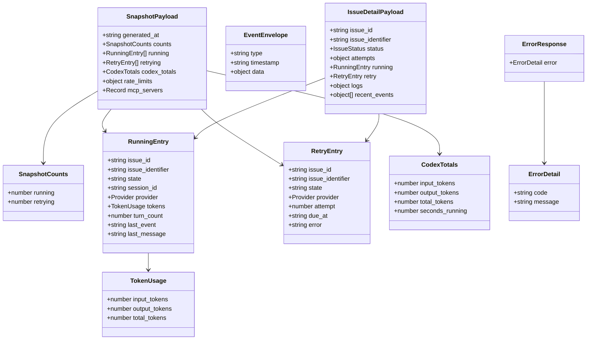

# 3.2 JSON Schemas & Types

> **Source files:**
> - `packages/protocol/schemas/v1/state.response.schema.json` — Snapshot schema
> - `packages/protocol/schemas/v1/issue.response.schema.json` — Issue detail schema
> - `packages/protocol/schemas/v1/issue.create.request.schema.json` — Issue create request
> - `packages/protocol/schemas/v1/issue.update.request.schema.json` — Issue update request
> - `packages/protocol/schemas/v1/error.response.schema.json` — Error envelope schema
> - `apps/desktop/src/lib/orchestra-types.ts` — TypeScript type definitions
> - `apps/backend/internal/observability/pubsub.go` — Event struct
> - `apps/backend/internal/agents/types.go` — TokenUsage, TurnResult types

This document defines all data types used across the Orchestra API. JSON schemas are maintained in `packages/protocol/schemas/v1/` and serve as the single source of truth for both backend serialization and frontend type generation.

---

### SnapshotPayload

Returned by `GET /api/v1/state` and as the `snapshot` SSE event payload. Represents the full system state at a point in time.

| Field | Type | Required | Description |
|-------|------|----------|-------------|
| `generated_at` | `string` (ISO 8601) | Yes | Timestamp when the snapshot was generated |
| `counts` | `SnapshotCounts` | Yes | Summary counts of running and retrying issues |
| `running` | `RunningEntry[]` | Yes | List of currently running agent sessions |
| `retrying` | `RetryEntry[]` | Yes | List of issues awaiting retry |
| `codex_totals` | `CodexTotals` | Yes | Aggregated token usage and runtime across all agents |
| `rate_limits` | `object \| null` | No | Current rate limit state (provider-specific) |
| `mcp_servers` | `Record<string, string>` | No | Map of MCP server names to their status |

**Schema file:** `packages/protocol/schemas/v1/state.response.schema.json`

---

### SnapshotCounts

| Field | Type | Required | Description |
|-------|------|----------|-------------|
| `running` | `number` | Yes | Number of issues currently being processed by agents |
| `retrying` | `number` | Yes | Number of issues in the retry queue |

---

### RunningEntry

Represents an issue currently being processed by an agent.

| Field | Type | Required | Description |
|-------|------|----------|-------------|
| `issue_id` | `string` | Yes | Internal UUID of the issue |
| `issue_identifier` | `string` | Yes | Human-readable issue identifier (e.g., `ORCH-42`) |
| `title` | `string` | No | Issue title |
| `description` | `string` | No | Issue description |
| `state` | `string` | Yes | Current issue state |
| `assignee_id` | `string` | No | ID of the assigned user/worker |
| `project_id` | `string` | No | ID of the project this issue belongs to |
| `session_id` | `string` | Yes | Active agent session ID |
| `provider` | `Provider` | Yes | Agent provider running this issue. Enum: `CODEX`, `CLAUDE`, `OPENCODE`, `GEMINI`, `UNSANDBOX` |
| `session_log_path` | `string` | No | Filesystem path to the session log |
| `disabled_tools` | `string[]` | No | List of tool names disabled for this run |
| `turn_count` | `number` | No | Number of agent turns completed |
| `last_event` | `string` | No | Type of the most recent event |
| `last_message` | `string` | No | Content of the most recent agent message |
| `started_at` | `string` (ISO 8601) | No | When the current run started |
| `last_event_at` | `string` (ISO 8601) | No | Timestamp of the most recent event |
| `tokens` | `TokenUsage` | No | Token consumption for this session |

---

### RetryEntry

Represents an issue scheduled for retry after a failed agent run.

| Field | Type | Required | Description |
|-------|------|----------|-------------|
| `issue_id` | `string` | Yes | Internal UUID of the issue |
| `issue_identifier` | `string` | Yes | Human-readable issue identifier |
| `state` | `string` | No | Current issue state |
| `assignee_id` | `string` | No | ID of the assigned user/worker |
| `provider` | `Provider` | No | Agent provider. Enum: `CODEX`, `CLAUDE`, `OPENCODE`, `GEMINI`, `UNSANDBOX` |
| `disabled_tools` | `string[]` | No | List of tool names disabled for this run |
| `attempt` | `number` | No | Current retry attempt number |
| `due_at` | `string` (ISO 8601) | No | When the next retry attempt is scheduled |
| `error` | `string` | No | Error message from the failed run |

---

### CodexTotals

Aggregated token usage and runtime across all agent sessions.

| Field | Type | Required | Description |
|-------|------|----------|-------------|
| `input_tokens` | `number` | Yes | Total input tokens consumed |
| `output_tokens` | `number` | Yes | Total output tokens generated |
| `total_tokens` | `number` | Yes | Sum of input and output tokens |
| `seconds_running` | `number` | Yes | Total seconds of agent runtime |

---

### TokenUsage

Per-session token consumption (used in `RunningEntry.tokens` and `TurnResult`).

| Field | Type | Description |
|-------|------|-------------|
| `input_tokens` | `number` | Input tokens consumed |
| `output_tokens` | `number` | Output tokens generated |
| `total_tokens` | `number` | Sum of input and output tokens |

**Source:** `apps/backend/internal/agents/types.go`

---

### EventEnvelope

Wrapper for lifecycle events sent over the SSE stream.

| Field | Type | Description |
|-------|------|-------------|
| `type` | `string` | SSEEventType value (e.g., `RUN_STARTED`, `HOOK_FAILED`) |
| `timestamp` | `string` (ISO 8601) | UTC timestamp of the event |
| `data` | `object` | Event-specific payload (varies by event type) |

**Backend source:** `apps/backend/internal/observability/pubsub.go` (`Event` struct)
**Frontend source:** `apps/desktop/src/lib/orchestra-types.ts` (`EventEnvelope` type)

The `normalizeEventEnvelope` function in `events.go` ensures that `type` and `timestamp` are always populated, filling defaults if the original event omits them.

---

### IssueDetailPayload

Returned by `GET /api/v1/issues/{issue_identifier}`.

| Field | Type | Required | Description |
|-------|------|----------|-------------|
| `issue_id` | `string` | Yes | Internal UUID |
| `issue_identifier` | `string` | Yes | Human-readable identifier |
| `id` | `string` | No | Alias for `issue_id` |
| `identifier` | `string` | No | Alias for `issue_identifier` |
| `title` | `string` | No | Issue title |
| `description` | `string` | No | Issue description |
| `state` | `string` | No | Current state string |
| `status` | `IssueStatus` | Yes | Computed runtime status: `RUNNING`, `RETRYING`, `TRACKED`, `IDLE` |
| `priority` | `number` | No | Priority level |
| `assignee_id` | `string` | No | Assigned user/worker ID |
| `project_id` | `string` | No | Parent project ID |
| `branch_name` | `string` | No | Git branch associated with this issue |
| `url` | `string` | No | External URL (e.g., GitHub issue link) |
| `labels` | `string[]` | No | Labels attached to the issue |
| `blocked_by` | `Blocker[]` | No | Issues blocking this one |
| `provider` | `Provider` | No | Assigned agent provider |
| `disabled_tools` | `string[]` | No | Tools disabled for this issue |
| `created_at` | `string` (ISO 8601) | No | Creation timestamp |
| `updated_at` | `string` (ISO 8601) | No | Last update timestamp |
| `base_sha` | `string` | No | Git SHA at the start of the run |
| `attempts` | `object` | Yes | `{ restart_count: number, current_retry_attempt: number }` |
| `workspace` | `object` | No | `{ path: string }` — workspace directory |
| `workspace_path` | `string` | No | Alias for workspace path |
| `running` | `RunningEntry \| null` | No | Current running entry if status is RUNNING |
| `retry` | `RetryEntry \| null` | No | Current retry entry if status is RETRYING |
| `logs` | `object` | Yes | `{ codex_session_logs: SessionLog[] }` |
| `recent_events` | `object[]` | Yes | Recent lifecycle events for this issue |
| `last_error` | `string \| null` | No | Most recent error message |
| `tracked` | `object` | No | Tracked state metadata |
| `history` | `object` | No | Full event history |

**Schema file:** `packages/protocol/schemas/v1/issue.response.schema.json`

---

### IssueCreateRequest

Request body for `POST /api/v1/issues`.

| Field | Type | Required | Description |
|-------|------|----------|-------------|
| `title` | `string` | Yes | Issue title |
| `description` | `string` | Yes | Issue description / agent prompt |
| `state` | `string` | Yes | Initial state (e.g., `open`, `backlog`) |
| `priority` | `number` | No | Priority level (lower = higher priority) |
| `assignee_id` | `string` | No | User/worker to assign |
| `project_id` | `string` | No | Project to associate with |
| `provider` | `Provider` | No | Agent provider: `CODEX`, `CLAUDE`, `OPENCODE`, `GEMINI`, `UNSANDBOX` |
| `disabled_tools` | `string[]` | No | Tools to disable for agent runs on this issue |

**Schema file:** `packages/protocol/schemas/v1/issue.create.request.schema.json`

---

### IssueUpdateRequest

Request body for `PATCH /api/v1/issues/{issue_identifier}`. All fields are optional; only provided fields are updated.

| Field | Type | Required | Description |
|-------|------|----------|-------------|
| `title` | `string` | No | Updated title |
| `description` | `string` | No | Updated description |
| `state` | `string` | No | Updated state |
| `priority` | `number` | No | Updated priority |
| `assignee_id` | `string` | No | Updated assignee |
| `project_id` | `string` | No | Updated project |
| `provider` | `Provider` | No | Updated provider |
| `disabled_tools` | `string[]` | No | Updated disabled tools list |

**Schema file:** `packages/protocol/schemas/v1/issue.update.request.schema.json`

---

### Issue (List Item)

Returned in arrays by `GET /api/v1/issues` and `GET /api/v1/search`.

| Field | Type | Description |
|-------|------|-------------|
| `id` | `string` | Internal UUID |
| `identifier` | `string` | Human-readable identifier |
| `title` | `string` | Issue title |
| `description` | `string` | Issue description |
| `priority` | `number` | Priority level |
| `state` | `string` | Current state |
| `branch_name` | `string` | Associated git branch |
| `url` | `string` | External URL |
| `project_id` | `string` | Parent project ID |
| `assignee_id` | `string` | Assigned user/worker |
| `assigned_to_worker` | `boolean` | Whether the issue is assigned to an active worker |
| `labels` | `string[]` | Labels |
| `blocked_by` | `Blocker[]` | Blocking issues |
| `provider` | `Provider` | Agent provider |
| `disabled_tools` | `string[]` | Disabled tools |
| `created_at` | `string` | Creation timestamp |
| `updated_at` | `string` | Last update timestamp |

**Frontend source:** `apps/desktop/src/lib/orchestra-types.ts` (`Issue` type)

---

### Blocker

Reference to an issue that blocks another.

| Field | Type | Description |
|-------|------|-------------|
| `id` | `string` | Blocking issue UUID |
| `identifier` | `string` | Blocking issue identifier |
| `state` | `string` | Current state of the blocking issue |

---

### ErrorResponse

Returned for all API errors.

```json
{
  "error": {
    "code": "not_found",
    "message": "route not found"
  }
}
```

| Field | Type | Required | Description |
|-------|------|----------|-------------|
| `error` | `object` | Yes | Error details container |
| `error.code` | `string` | Yes | Machine-readable error code (e.g., `not_found`, `unauthorized`) |
| `error.message` | `string` | Yes | Human-readable error description |

**Schema file:** `packages/protocol/schemas/v1/error.response.schema.json`

---

### Project

Returned by `GET /api/v1/projects` and `GET /api/v1/projects/{project_id}`.

| Field | Type | Description |
|-------|------|-------------|
| `id` | `string` | Project UUID |
| `name` | `string` | Project display name |
| `root_path` | `string` | Absolute path to the project root on disk |
| `remote_url` | `string` | Git remote URL |
| `github_owner` | `string` | GitHub owner (user or org) |
| `github_repo` | `string` | GitHub repository name |
| `github_token` | `string` | GitHub authentication token |
| `path_exists` | `boolean` | Whether the `root_path` exists on disk |

**Schema file:** `packages/protocol/schemas/v1/project.response.schema.json`

---

### AgentConfig

Returned by `GET /api/v1/config/agents/items`.

| Field | Type | Description |
|-------|------|-------------|
| `name` | `string` | Config display name (e.g., `claude (Global)`, `codex: skills/review.md`) |
| `content` | `string` | File content (JSON, TOML, or Markdown) |
| `path` | `string` | Absolute filesystem path |
| `category` | `AgentCategory` | `CORE` or `SKILL` |
| `scope` | `ConfigScope` | `GLOBAL` or `PROJECT` |

**Backend source:** `apps/backend/internal/agents/config.go`

---

### SessionDetail

Returned by `GET /api/v1/sessions/{session_id}`.

| Field | Type | Description |
|-------|------|-------------|
| `id` | `string` | Session UUID |
| `provider` | `string` | Agent provider name |
| `project_name` | `string` | Associated project name |
| `created_at` | `string` | Session creation timestamp |
| `total_input` | `number` | Total input tokens |
| `total_output` | `number` | Total output tokens |
| `events` | `SessionEvent[]` | Ordered list of session events |

**Schema file:** `packages/protocol/schemas/v1/session.detail.response.schema.json`

---

### SessionEvent

Individual event within a session.

| Field | Type | Description |
|-------|------|-------------|
| `kind` | `string` | Event kind (e.g., `message`, `tool_call`, `error`) |
| `timestamp` | `string` | ISO 8601 timestamp |
| `message` | `string` | Event message content |
| `input_tokens` | `number` | Input tokens for this event |
| `output_tokens` | `number` | Output tokens for this event |
| `raw_payload` | `string` | Raw event payload from the agent |

---

### TurnResult

Returned by agent runners after completing a turn. Used internally by the orchestrator.

| Field | Type | Description |
|-------|------|-------------|
| `provider` | `Provider` | Agent provider |
| `session_id` | `string` | Session UUID |
| `exit_code` | `number` | Process exit code (0 = success) |
| `output` | `string` | Agent output text |
| `usage` | `TokenUsage` | Token consumption for this turn |

**Source:** `apps/backend/internal/agents/types.go`

---

### Schema File Index

All JSON schema files in `packages/protocol/schemas/v1/`:

| Schema File | Description |
|-------------|-------------|
| `state.response.schema.json` | Snapshot payload |
| `issue.response.schema.json` | Issue detail response |
| `issue.create.request.schema.json` | Issue creation request body |
| `issue.update.request.schema.json` | Issue update request body |
| `issues.list.response.schema.json` | Issue list response |
| `project.response.schema.json` | Project detail response |
| `projects.list.response.schema.json` | Project list response |
| `project.create.request.schema.json` | Project creation request body |
| `session.detail.response.schema.json` | Session detail response |
| `sessions.list.response.schema.json` | Session list response |
| `agents.list.response.schema.json` | Agent list response |
| `agent.config.response.schema.json` | Agent configuration response |
| `warehouse.stats.response.schema.json` | Warehouse statistics response |
| `mcp.servers.response.schema.json` | MCP servers list response |
| `mcp.tools.response.schema.json` | MCP tools list response |
| `stt.health.response.schema.json` | STT health check response |
| `stt.transcribe.response.schema.json` | STT transcription response |
| `error.response.schema.json` | Error response envelope |
| `refresh.response.schema.json` | Refresh response |
| `workspace.migration.plan.response.schema.json` | Migration plan response |
| `workspace.migrate.response.schema.json` | Migration execution response |

---

### Type Relationship Diagram


