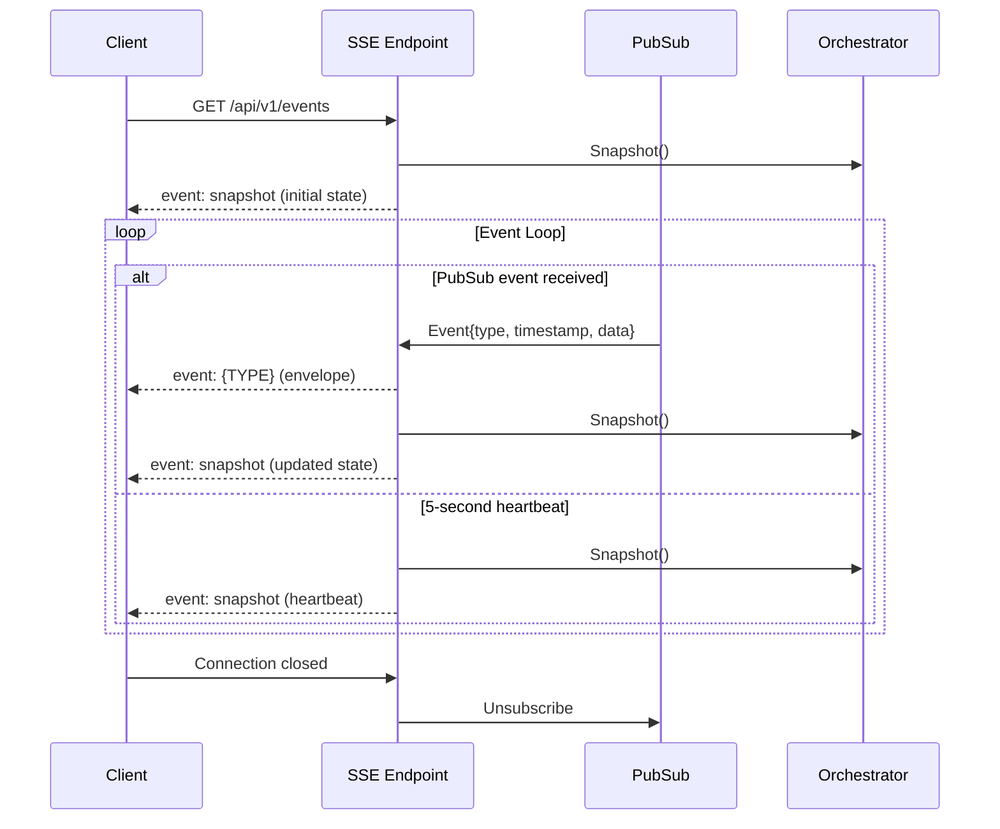
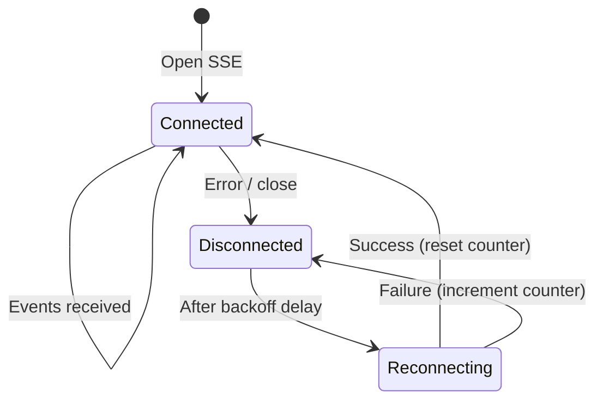
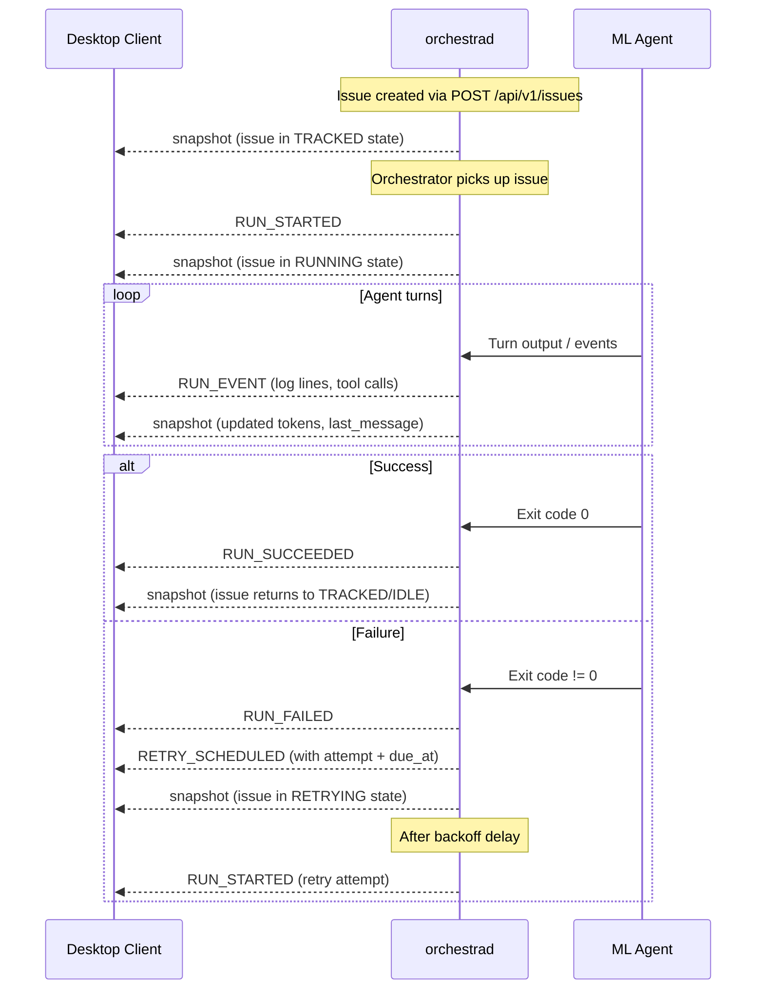

# 3.1 Server-Sent Events

> **Source files:**
> - `apps/backend/internal/api/events.go` — SSE endpoint handler and event serialization
> - `apps/backend/internal/observability/pubsub.go` — PubSub event bus
> - `apps/backend/internal/types/enums.go` — SSEEventType constants
> - `apps/desktop/src/lib/runtime-sync.ts` — Client-side SSE consumer with reconnection
> - `apps/desktop/src/lib/orchestra-types.ts` — TypeScript type definitions

Orchestra uses Server-Sent Events (SSE) to push real-time state updates and lifecycle events to connected clients. The SSE stream is the primary mechanism for keeping the desktop UI synchronized with backend orchestrator state.

---

### Connection Setup

**Endpoint:** `GET /api/v1/events`

**Authentication:** Bearer token passed as a query parameter (required when `APIToken` is configured).

```
GET /api/v1/events?token={api_token}
```

The server responds with `Content-Type: text/event-stream` and keeps the connection open. On connect, the server immediately sends a `snapshot` event with the full system state.

**One-shot mode:** Append `?once=1` to receive a single snapshot event and close the connection. Useful for polling clients or initial state hydration.

```
GET /api/v1/events?once=1&token={api_token}
```

### Response Headers

| Header | Value |
|--------|-------|
| `Content-Type` | `text/event-stream` |
| `Cache-Control` | `no-cache` |
| `Connection` | `keep-alive` |

---

### Event Types

Orchestra emits two categories of SSE events: **system events** (lowercase) and **lifecycle events** (UPPERCASE).

#### System Events

| Event Name | Description |
|------------|-------------|
| `snapshot` | Full system state. Sent on connect, after each lifecycle event, and every 5 seconds as a heartbeat. |
| `error` | Error encoding or processing events. Payload: `{"error": "description"}` |

#### Lifecycle Events

These events correspond to agent run lifecycle transitions. All types are defined in `SSEEventType`.

| Event Name | Description |
|------------|-------------|
| `RUN_EVENT` | Generic event emitted during an agent run (log output, tool calls, etc.) |
| `RUN_STARTED` | An agent run has begun for an issue |
| `RUN_FAILED` | An agent run has failed (may trigger retry) |
| `RUN_CONTINUES` | An agent run continues after a turn boundary |
| `RUN_SUCCEEDED` | An agent run completed successfully |
| `RETRY_SCHEDULED` | A failed run has been scheduled for retry (includes attempt count and due time) |
| `HOOK_STARTED` | A lifecycle hook has begun execution |
| `HOOK_COMPLETED` | A lifecycle hook completed successfully |
| `HOOK_FAILED` | A lifecycle hook failed |

---

### Event Wire Format

Each SSE message follows the standard `event: type\ndata: json\n\n` format.

#### Snapshot Event

```
event: snapshot
data: {"generated_at":"2026-03-17T10:30:00Z","counts":{"running":2,"retrying":1},"running":[...],"retrying":[...],"codex_totals":{...},"rate_limits":null,"mcp_servers":{}}
```

The snapshot payload conforms to the `SnapshotPayload` type. See [3.2 JSON Schemas & Types](schemas.md) for the full field reference.

#### Lifecycle Event Envelope

Lifecycle events are wrapped in an `EventEnvelope`:

```
event: RUN_STARTED
data: {"type":"RUN_STARTED","timestamp":"2026-03-17T10:30:05Z","data":{...}}
```

| Field | Type | Description |
|-------|------|-------------|
| `type` | `string` | The SSEEventType value (e.g., `RUN_STARTED`) |
| `timestamp` | `string` | ISO 8601 timestamp (UTC) |
| `data` | `object` | Event-specific payload (varies by type) |

After each lifecycle event, the server also emits a fresh `snapshot` event so clients can update their full state without additional API calls.

---

### Event Delivery Model



### Server-Side Behavior

1. **Initial snapshot:** On connection, the server calls `orchestrator.Snapshot()` and sends it as a `snapshot` event.
2. **PubSub subscription:** The server subscribes to the `PubSub` event bus with a buffer of 64 events.
3. **Event forwarding:** When a lifecycle event arrives via PubSub, the server writes both the event envelope and a fresh snapshot.
4. **Heartbeat:** Every 5 seconds, a snapshot is sent regardless of whether events occurred, serving as both a heartbeat and state synchronization mechanism.
5. **Cleanup:** When the client disconnects (`r.Context().Done()`), the subscription is released.

---

### Client Reconnection Strategy

The desktop client (`runtime-sync.ts`) implements exponential backoff reconnection:

```
delay = min(3000 * 2^(attempt - 1), 30000) ms
```

| Attempt | Delay |
|---------|-------|
| 1 | 3 seconds |
| 2 | 6 seconds |
| 3 | 12 seconds |
| 4 | 24 seconds |
| 5+ | 30 seconds (cap) |

**Reconnection behavior:**

1. On connection error or unexpected close, the client increments the reconnect attempt counter.
2. After the computed delay, a new SSE connection is opened.
3. On successful reconnection, the attempt counter resets to 0, and the client fetches a fresh full state snapshot to ensure consistency after the disconnect gap.
4. While disconnected, the client may fall back to polling via `loadSnapshot()`.



---

### RETRY_SCHEDULED Deduplication

The client deduplicates `RETRY_SCHEDULED` events to prevent duplicate UI notifications when the same retry is reported multiple times. Deduplication uses a composite key:

```
key = `${issue_id}:${attempt}:${error}`
```

If a `RETRY_SCHEDULED` event arrives with a key already seen in the current SSE session, it is silently dropped. The `seenEventKeys` set is cleared on each new SSE connection.

---

### Lifecycle Event Flow

A typical issue lifecycle produces this sequence of SSE events:



---

### Hook Events

When lifecycle hooks are configured for a provider, hook execution produces its own event sub-sequence:

| Event | When |
|-------|------|
| `HOOK_STARTED` | A hook begins execution (e.g., pre-run validation, post-run cleanup) |
| `HOOK_COMPLETED` | The hook finished successfully |
| `HOOK_FAILED` | The hook encountered an error |

Hook events are interspersed with run events and carry the hook name and provider in their payload.
