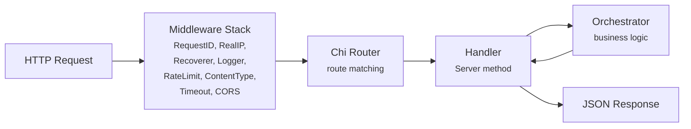
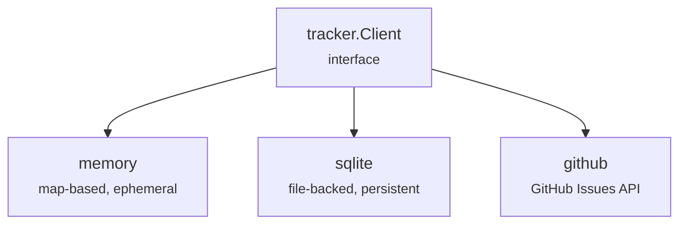

# 1.2 Backend Architecture

> **Source files:** `apps/backend/cmd/orchestrad/`, `apps/backend/internal/`

The Orchestra backend is a single Go binary (`orchestrad`) that serves the REST API, owns the orchestration state machine, tracks issues, streams events to connected frontends, manages PTY terminals, and runs analytics and telemetry background workers. It is structured as internal packages wired together by `internal/app` at startup.

---

### Package Dependency Graph

```mermaid
graph TD
    CMD["cmd/orchestrad<br/><small>main()</small>"]
    APP["app<br/><small>Run(), wiring</small>"]
    API["api<br/><small>HTTP handlers</small>"]
    ORCH["orchestrator<br/><small>state machine</small>"]
    AGENTS["agents<br/><small>runner registry</small>"]
    CONFIG["config<br/><small>env loading</small>"]
    TRACKER["tracker<br/><small>issue interface</small>"]
    TRACKER_MEM["tracker/memory"]
    TRACKER_SQL["tracker/sqlite"]
    TRACKER_GH["tracker/github"]
    TOOLS["tools<br/><small>tool executors</small>"]
    MCP["mcp<br/><small>JSON-RPC client</small>"]
    TELEMETRY["telemetry<br/><small>log watcher</small>"]
    WORKSPACE["workspace<br/><small>git + dirs</small>"]
    DB["db<br/><small>SQLite warehouse</small>"]
    LOGGING["logging<br/><small>zerolog setup</small>"]
    LOGFILE["logfile<br/><small>file logging</small>"]
    OBS["observability<br/><small>PubSub bus</small>"]
    PRESENTER["presenter<br/><small>view formatting</small>"]
    PROMPT["prompt<br/><small>system prompts</small>"]
    RUNTIME["runtime<br/><small>host detection</small>"]
    SPECS["specs<br/><small>agent specs</small>"]
    STATIC["staticassets<br/><small>embedded files</small>"]
    TERMINAL["terminal<br/><small>PTY manager</small>"]
    TYPES["types<br/><small>shared types</small>"]
    UTILS_GIT["utils/git"]
    UTILS_GH["utils/github"]
    WORKFLOW["workflow<br/><small>frontmatter</small>"]
    UNSANDBOX["unsandbox<br/><small>remote exec</small>"]
    UNFIREHOSE["unfirehose<br/><small>event stream</small>"]

    CMD --> APP
    APP --> API
    APP --> CONFIG
    APP --> ORCH
    APP --> AGENTS
    APP --> TRACKER
    APP --> MCP
    APP --> TELEMETRY
    APP --> WORKSPACE
    APP --> DB
    APP --> OBS
    APP --> TOOLS
    APP --> TERMINAL
    APP --> LOGFILE
    APP --> PROMPT
    APP --> RUNTIME
    APP --> UNFIREHOSE
    APP --> UTILS_GIT
    APP --> UTILS_GH

    API --> ORCH
    API --> OBS
    API --> DB
    API --> CONFIG
    API --> STATIC
    API --> TERMINAL

    ORCH --> AGENTS
    ORCH --> TRACKER
    ORCH --> WORKSPACE
    ORCH --> MCP
    ORCH --> DB

    TRACKER --> TRACKER_MEM
    TRACKER --> TRACKER_SQL
    TRACKER --> TRACKER_GH

    AGENTS --> MCP
    AGENTS --> UNSANDBOX
```

---

### Package Reference

| Package | Location | Purpose | Key Types |
|---------|----------|---------|-----------|
| `app` | `internal/app/` | Application bootstrap and wiring | `Run()` |
| `api` | `internal/api/` | HTTP router, handlers, SSE streaming, auth | `Server`, `NewRouter()` |
| `orchestrator` | `internal/orchestrator/` | Central state machine for issue dispatch and reconciliation | `Service`, `RunningEntry`, `RetryEntry`, `CodexTotals` |
| `agents` | `internal/agents/` | Agent provider registry and runner abstraction | `Provider`, `TurnRequest`, `Event`, `TokenUsage` |
| `config` | `internal/config/` | Environment variable and config file loading | `Config`, `Load()` |
| `tracker` | `internal/tracker/` | Issue store interface | `Client` (interface), `Issue`, `IssueFilter`, `Blocker` |
| `tracker/memory` | `internal/tracker/memory/` | In-memory issue store for development | - |
| `tracker/sqlite` | `internal/tracker/sqlite/` | SQLite-backed persistent issue store | - |
| `tracker/github` | `internal/tracker/github/` | GitHub Issues integration | - |
| `tools` | `internal/tools/` | Agent tool specifications and tracker-backed tool executor | `LinearToolExecutor`, `TrackerToolSpecs()` |
| `mcp` | `internal/mcp/` | Model Context Protocol JSON-RPC stdio client | `Client`, `NewClient()` |
| `telemetry` | `internal/telemetry/` | Agent log file watcher for token usage extraction | - |
| `workspace` | `internal/workspace/` | Working directory and git branch management | - |
| `db` | `internal/db/` | SQLite warehouse database connection and migrations | `DB`, `Connect()` |
| `logging` | `internal/logging/` | zerolog configuration and writer setup | - |
| `logfile` | `internal/logfile/` | Structured log file writing | - |
| `observability` | `internal/observability/` | PubSub event bus for lifecycle event broadcasting | `PubSub`, `Event` |
| `presenter` | `internal/presenter/` | Formats orchestrator state into API response shapes | - |
| `prompt` | `internal/prompt/` | System prompt generation for agent sessions | - |
| `runtime` | `internal/runtime/` | Host environment detection (loopback check, port binding) | `HostRequiresToken()` |
| `specs` | `internal/specs/` | Agent specification definitions | - |
| `staticassets` | `internal/staticassets/` | Embedded static file serving (OpenAPI docs, frontend build) | - |
| `terminal` | `internal/terminal/` | PTY-based terminal session manager for WebSocket terminals | `Manager`, `NewManager()` |
| `types` | `internal/types/` | Shared type definitions used across packages | - |
| `utils/git` | `internal/utils/git/` | Git operation helpers (clone, branch, commit) | - |
| `utils/github` | `internal/utils/github/` | GitHub API client utilities | - |
| `workflow` | `internal/workflow/` | YAML frontmatter parser and workflow document store | `Document`, `LoadFile()`, `Parse()` |
| `unsandbox` | `internal/unsandbox/` | Client for the Unsandbox remote execution platform | - |
| `analytics` | `internal/analytics/` | Cost, productivity, rate-limit, and external usage aggregation support | - |
| `pricing` | `internal/pricing/` | Provider pricing helpers used by analytics calculations | - |
| `unfirehose` | `internal/unfirehose/` | Session logging sink for external event capture | `Logger` |

---

### Agent Providers

The `agents` package defines a `Provider` type and registers runners for each supported machine learning agent:

| Provider | Runner File | Description |
|----------|------------|-------------|
| `CLAUDE` | `claude_runner.go` | Anthropic Claude CLI agent |
| `CODEX` | `codex_runner.go` / `codex_appserver.go` | Codex CLI runner and app-server integration support |
| `GEMINI` | `gemini_runner.go` | Google Gemini agent runner |
| `OPENCODE` | `opencode_runner.go` | OpenCode agent runner |
| `UNSANDBOX` | `unsandbox_runner.go` | Remote execution via Unsandbox platform |

Each runner implements the same interface, accepting a `TurnRequest` and streaming `Event` values back to the orchestrator. The `registry.go` file manages provider registration and lookup.

---

### Request Lifecycle

Every HTTP request follows this path through the backend:

1. **Middleware chain** -- Chi applies middleware in order: `RequestID` -> `RealIP` -> `Recoverer` -> `RequestLogger` -> `RateLimit(20, 60)` -> `securityHeaders` -> `contentTypeGuard` -> `Timeout(30s)` -> `CORS`.
2. **Route matching** -- Chi matches the method and path to a registered handler on the `Server` struct.
3. **Handler execution** -- The handler validates the request, calls into the orchestrator or database, and serializes the response as JSON.
4. **Error handling** -- Errors are returned as `{"error": "<code>", "message": "<detail>"}` with appropriate HTTP status codes.

### Middleware Stack

| Middleware | Source | Purpose |
|-----------|--------|---------|
| `RequestID` | Chi built-in | Attaches a unique request ID to every request |
| `RealIP` | Chi built-in | Extracts client IP from `X-Forwarded-For` / `X-Real-IP` |
| `Recoverer` | Chi built-in | Catches panics and returns 500 |
| `RequestLogger` | `api/router.go` | Structured request/response logging via zerolog |
| `RateLimit` | `api/ratelimit.go` | Token bucket rate limiter (20 req/s sustained, 60 burst) |
| `securityHeaders` | `api/router.go` | Adds `nosniff`, frame, referrer, and permissions hardening headers |
| `contentTypeGuard` | `api/router.go` | Validates `Content-Type` on mutation requests |
| `Timeout` | Chi built-in | 30-second request timeout |
| `CORS` | `go-chi/cors` | Cross-origin request handling for desktop app |

---

### Tracker Backends

The `tracker.Client` interface abstracts issue storage. Three implementations are available:

| Backend | Use Case | Persistence | External Dependencies |
|---------|----------|-------------|----------------------|
| `memory` | Tests or explicit in-memory fallback | None (process lifetime) | None |
| `sqlite` | Default local runtime when the warehouse DB is available | `warehouse.db` file | None |
| `github` | GitHub-integrated workflows | GitHub API | GitHub token, network access |

---

### Orchestrator State Machine

The orchestrator (`internal/orchestrator/state.go`) maintains three collections:

- **`running`** -- Active agent sessions (`[]RunningEntry`), each with issue metadata, session ID, token counts, and event timestamps.
- **`retrying`** -- Issues scheduled for retry (`[]RetryEntry`), with exponential backoff scheduling.
- **`claimed`** -- Set of issue IDs currently owned by this instance, preventing duplicate dispatch.

Key operations:

| Operation | Method | Description |
|-----------|--------|-------------|
| Dispatch | `Dispatch()` | Claims an issue and starts an agent session |
| Reconcile | `ReconcileRunningStates()` | Syncs running entries against tracker state, removing terminal issues |
| Snapshot | `Snapshot()` | Returns a point-in-time view of all running/retrying state for SSE |
| Retry | Schedule via `RetryEntry` | Queues a failed issue for re-dispatch after a delay |

At startup, `app.Run()` also:

- opens the warehouse database under `<workspaceRoot>/.orchestra/warehouse.db`
- restores persisted orchestrator state from SQLite
- merges MCP server definitions from config and the database
- starts background workers for execution polling, refreshes, garbage collection, daily metrics rollups, and telemetry ingestion
- initializes the terminal manager, provider registry, tracker client, and optional unfirehose session logger

---

### Cross-References

- [1.1 Architecture Overview](overview.md) -- High-level system diagram
- [1.5 Data Flow & Events](data-flow.md) -- SSE event pipeline and PubSub internals
- [1.3 Desktop Frontend](desktop.md) -- How the frontend consumes the API
