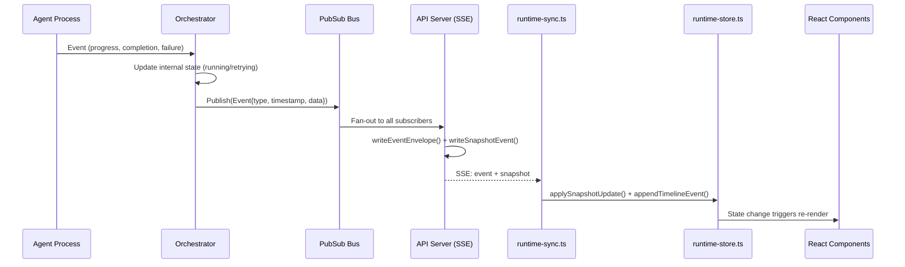
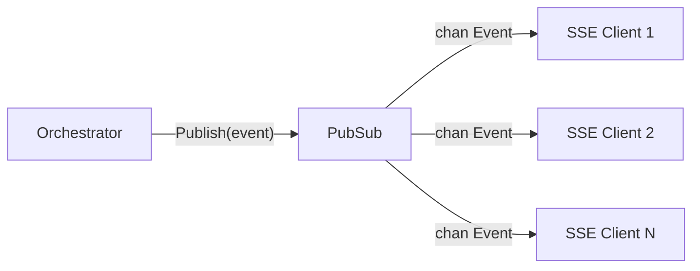
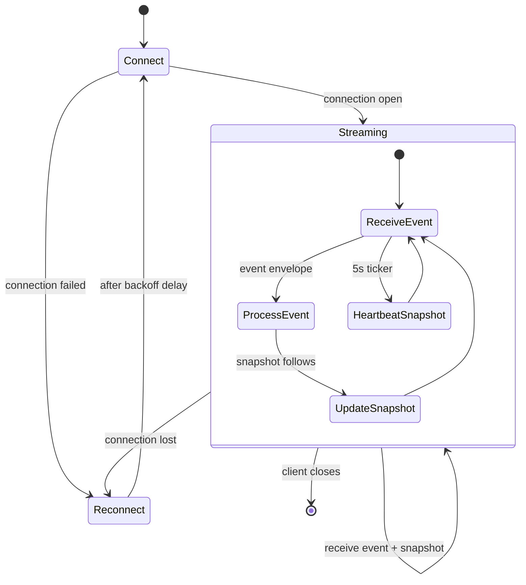
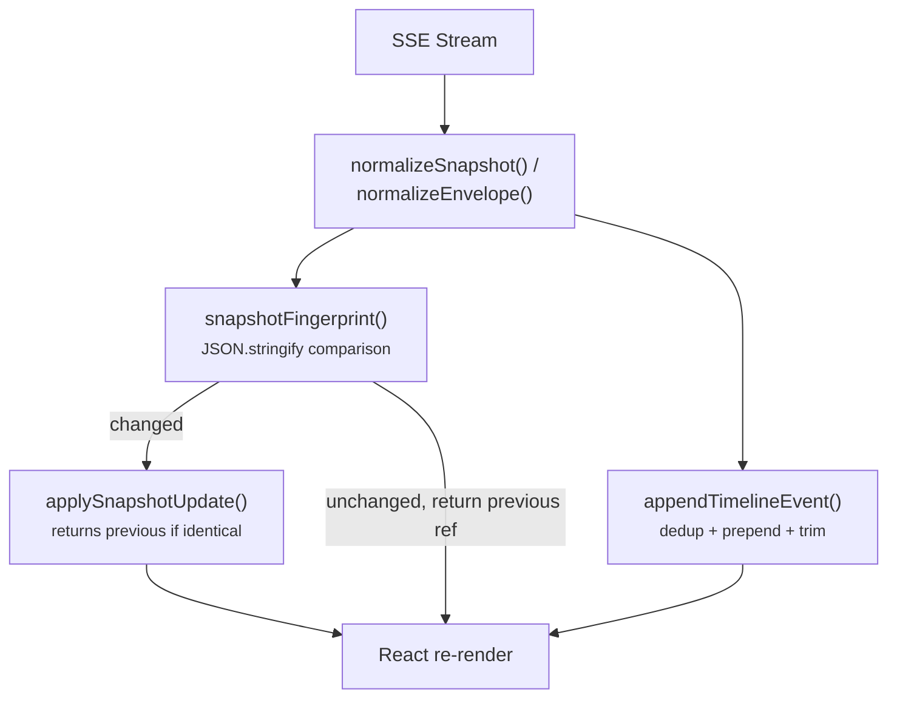
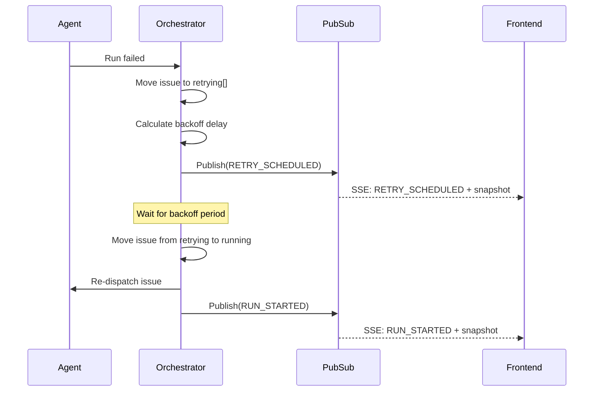

# 1.5 Data Flow & Event Pipeline

> **Source files:** `apps/backend/internal/api/events.go`, `apps/backend/internal/observability/pubsub.go`, `apps/backend/internal/orchestrator/state.go`, `apps/desktop/src/lib/runtime-sync.ts`, `apps/desktop/src/lib/runtime-store.ts`

Data flows through Orchestra as a continuous pipeline: the orchestrator produces state changes and lifecycle events, the PubSub bus broadcasts them, the API server serializes them as SSE, and frontends apply them to their local state. This page documents each stage in detail.

---

### End-to-End Data Flow



---

### PubSub Event Bus

The `observability.PubSub` is an in-process fan-out event bus. It is the central nervous system for real-time event delivery.



#### PubSub Internals

| Aspect | Detail |
|--------|--------|
| **Data structure** | `map[chan Event]struct{}` -- set of subscriber channels |
| **Concurrency** | `sync.RWMutex` -- read lock for publish, write lock for subscribe/unsubscribe |
| **Buffer size** | Configurable per subscriber (default 32, SSE uses 64) |
| **Backpressure** | Non-blocking send: if a subscriber's channel is full, the event is dropped for that subscriber |
| **Cleanup** | `unsubscribe()` closure deletes the channel from the map and closes it |
| **Timestamps** | Auto-set to `time.Now().UTC().Format(time.RFC3339)` if not provided |

#### Event Structure

```
type Event struct {
    Type      string   // event type identifier
    Timestamp string   // RFC3339 UTC timestamp
    Data      any      // event-specific payload
}
```

---

### SSE Event Types

The following lifecycle event types flow through the pipeline:

| Event Type | Trigger | Meaning |
|------------|---------|---------|
| `RUN_EVENT` | Agent emits a progress line | Generic agent activity -- a turn completed, a tool was called, output was produced |
| `RUN_STARTED` | Orchestrator dispatches an issue | A new agent session has begun execution |
| `RUN_FAILED` | Agent exits with an error | The agent session terminated unsuccessfully |
| `RUN_CONTINUES` | Agent reports ongoing work | The agent is still actively working (multi-turn progress) |
| `RUN_SUCCEEDED` | Agent exits cleanly | The agent session completed its task successfully |
| `RETRY_SCHEDULED` | Orchestrator schedules a retry | A failed issue has been queued for re-dispatch after a backoff delay |
| `HOOK_STARTED` | Pre/post-run hook begins | A configured hook script has started execution |
| `HOOK_COMPLETED` | Hook exits cleanly | A hook script completed successfully |
| `HOOK_FAILED` | Hook exits with an error | A hook script failed |

---

### SSE Wire Format

Each SSE frame consists of an event type line and a JSON data line:

```
event: RUN_STARTED
data: {"type":"RUN_STARTED","timestamp":"2026-03-17T12:00:00Z","data":{...}}

event: snapshot
data: {"generated_at":"2026-03-17T12:00:00Z","counts":{"running":1,"retrying":0},"running":[...],"retrying":[...],"codex_totals":{...},"rate_limits":null}
```

The API server sends two things on each event:

1. **Event envelope** -- The lifecycle event itself, via `writeEventEnvelope()`.
2. **Snapshot** -- A full state snapshot immediately after, via `writeSnapshotEvent()`.

This ensures clients always have consistent state, even if they missed previous events.

---

### SSE Connection Lifecycle



#### Server-Side Behavior (`GetEvents`)

1. Client connects to `/events` endpoint.
2. Server immediately sends a `snapshot` event with the current orchestrator state.
3. If `?once=1` query parameter is set, the connection closes after the initial snapshot.
4. Otherwise, the server enters a loop:
   - **PubSub events**: When an event arrives on the subscriber channel, the server writes the event envelope followed by a fresh snapshot.
   - **Heartbeat ticker**: Every 5 seconds, a snapshot is sent even if no events occurred, ensuring the client stays current.
5. When the client disconnects (`r.Context().Done()`), the subscriber is cleaned up.

#### Client-Side Behavior (`runtime-sync.ts`)

1. `startRuntimeSync()` is called with backend config and handler callbacks.
2. An initial snapshot is fetched via REST (`fetchSnapshot()`).
3. An `EventSource` is created for the SSE stream.
4. Lifecycle events (matching the `lifecycleEventTypes` list) are normalized and forwarded to `onTimelineEvent`.
5. Snapshot events are normalized and forwarded to `onSnapshot`.
6. On connection error, reconnection is scheduled with exponential backoff.

---

### Reconnection Strategy

The frontend uses exponential backoff for SSE reconnection:

| Attempt | Delay | Formula |
|---------|-------|---------|
| 1 | 3,000 ms | `base` |
| 2 | 6,000 ms | `base * 2^1` |
| 3 | 12,000 ms | `base * 2^2` |
| 4 | 24,000 ms | `base * 2^3` |
| 5+ | 30,000 ms | `min(base * 2^(n-1), max)` |

Parameters: `base = 3000ms`, `max = 30000ms`.

The reconnect attempt counter resets to 0 on successful connection.

---

### Snapshot Polling

As a fallback alongside SSE, the frontend can enable periodic snapshot polling:

- `startPolling()` -- Begins fetching snapshots at a regular interval via REST.
- `stopPolling()` -- Cancels the polling timer.
- Polling is used as a safety net when SSE connectivity is unreliable.

On the server side, the 5-second heartbeat ticker in `GetEvents` serves a similar purpose, ensuring snapshot freshness even during periods with no lifecycle events.

---

### State Update Pipeline (Frontend)



The `applySnapshotUpdate()` function performs a full JSON fingerprint comparison. If the snapshot has not changed, the previous object reference is returned, preventing unnecessary React re-renders. Timeline events are deduplicated by comparing `type`, `at`, and serialized `data` of the most recent entry.

---

### Retry Scheduling Flow

When an agent run fails, the orchestrator can schedule a retry with exponential backoff:



The `RetryEntry` in the orchestrator state includes the issue metadata and scheduling information. The orchestrator's reconciliation loop picks up retryable entries when their delay has elapsed and re-dispatches them.

---

### Cross-References

- [1.1 Architecture Overview](overview.md) -- System-level communication patterns
- [1.2 Backend Architecture](backend.md) -- Orchestrator state machine and API handler details
- [1.3 Desktop Frontend](desktop.md) -- Runtime sync and store implementation
