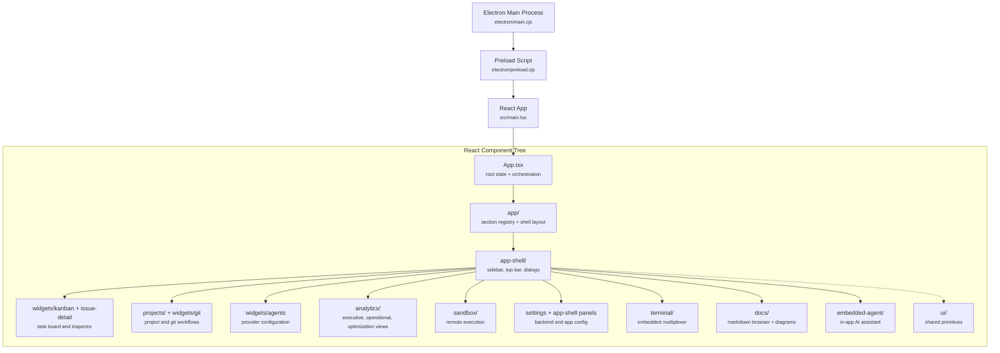
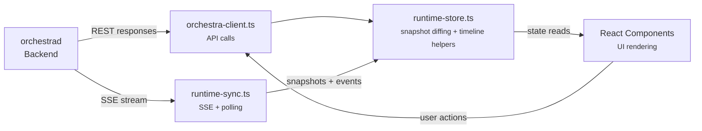
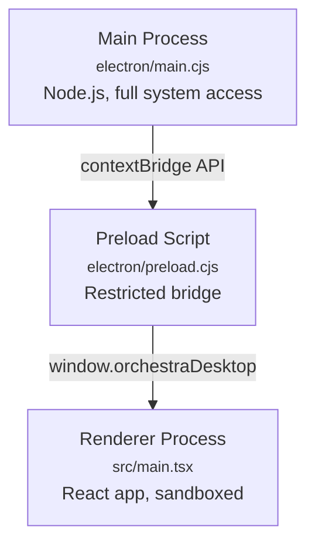

# 1.3 Desktop Frontend Architecture

> **Source files:** `apps/desktop/src/`, `apps/desktop/electron/`, `apps/desktop/vite.config.ts`, `apps/desktop/package.json`

The Orchestra desktop application is an Electron app with a React 19 renderer. It provides a GUI for managing tasks, projects, terminals, agent configuration, analytics, documentation, and sandbox execution. The frontend connects to `orchestrad` via REST API calls and receives live state updates through SSE.

---

### Component Hierarchy

---

### Directory Structure

| Directory | Purpose | Key Files |
|-----------|---------|-----------|
| `electron/` | Electron main process and preload | `main.cjs`, `preload.cjs` |
| `src/` | React application root | `main.tsx`, `App.tsx`, `index.css` |
| `src/app/` | App shell layout and section registry | `layout/AppShell.tsx`, `routes/sections.tsx` |
| `src/components/app-shell/` | Sidebar, top bar, and shared shell panels/dialogs | Shell chrome, inspector dialogs, settings cards |
| `src/components/projects/` | Project-level screens | `ProjectGrid`, `ProjectDetailView` |
| `src/components/analytics/` | Analytics dashboard and session inspection | `AnalyticsDashboard`, `SessionDetailView`, subviews/charts/tables |
| `src/components/docs/` | Documentation browser | Markdown rendering, tree navigation, TOC |
| `src/components/embedded-agent/` | Embedded assistant UI | Widget, tools, provider interactions |
| `src/components/sandbox/` | Remote execution UI | Sandbox dashboard |
| `src/components/terminal/` | Embedded terminal workspace | `TerminalMultiplexer` |
| `src/components/ui/` | Shared primitives | dialogs, tooltips, skeletons, buttons |
| `src/hooks/` | App-level state hooks | backend config, notifications, issue lookup, migration |
| `src/lib/` | API client and runtime synchronization | `orchestra-client`, `runtime-sync`, `runtime-store` |
| `src/types/` | Global browser/Electron type declarations | `global.d.ts` for the preload bridge and window typing |
| `src/widgets/` | Larger reusable feature modules | agents, git, issue-detail, kanban, running |

---

### State Management Architecture

The frontend uses a three-layer state architecture that separates data fetching, state synchronization, and UI rendering:

#### `orchestra-client.ts` -- API Client

The API client provides typed methods for backend endpoints used throughout the app. It accepts a `BackendConfig` object with `baseUrl` and `apiToken`. Methods return typed responses or throw structured errors normalized for the UI.

Key types exported:

| Type | Purpose |
|------|---------|
| `BackendConfig` | Connection configuration (`baseUrl`, `apiToken`) |
| `IssueListItem` | Issue summary for list views |
| `IssueHistoryEntry` | Session event history entry |
| `ProjectTreeNode` | File tree node for project browsing |
| `MCPTool` | Tool definition from MCP server |
| `MCPServer` | MCP server configuration |

#### `runtime-sync.ts` -- SSE Event Synchronization

Manages the real-time connection to the backend's `/events` SSE endpoint. Handles:

- Initial snapshot loading via `fetchSnapshot()`
- SSE stream connection with automatic reconnection
- Exponential backoff on connection failures (3s base, 30s max)
- Periodic snapshot polling as a fallback
- Lifecycle event type filtering and normalization

Lifecycle event types processed:

| Event Type | Meaning |
|------------|---------|
| `RUN_EVENT` | Generic agent activity event |
| `RUN_STARTED` | Agent session has begun |
| `RUN_FAILED` | Agent session has failed |
| `RUN_CONTINUES` | Agent is still working (progress update) |
| `RUN_SUCCEEDED` | Agent session completed successfully |
| `RETRY_SCHEDULED` | Issue will be retried after a delay |
| `HOOK_STARTED` | Pre/post-run hook execution started |
| `HOOK_COMPLETED` | Hook execution completed successfully |
| `HOOK_FAILED` | Hook execution failed |

#### `runtime-store.ts` -- State Container

Provides snapshot diffing and timeline event management:

- `applySnapshotUpdate()` -- Compares fingerprints to avoid unnecessary re-renders when snapshot data has not changed.
- `appendTimelineEvent()` -- Prepends new events to the timeline with deduplication and a configurable max size (default 50 items).

At the application level, `App.tsx` also owns the primary UI state for:

- active section selection
- backend profiles and auth state
- task board data and inspector dialogs
- project list and analytics data loading
- open terminal tabs
- theme, palette, and notification preferences

---

### Electron IPC Bridge

The Electron architecture follows a standard main/preload/renderer separation:

| Layer | File | Capabilities |
|-------|------|-------------|
| **Main process** | `electron/main.cjs` | Window management, native integrations, keyboard shortcuts, external opening |
| **Preload script** | `electron/preload.cjs` | Exposes a safe subset of Node.js APIs to the renderer via `contextBridge` |
| **Renderer process** | `src/main.tsx` | React app running in a Chromium sandbox with access only to the `window.orchestraDesktop` preload API |

---

### Technology Stack

| Technology | Version/Note | Role |
|------------|-------------|------|
| **React** | 19 | UI component framework with concurrent features |
| **TypeScript** | Strict mode | Type safety across the entire frontend |
| **Vite** | Build tool | Development server with HMR, production bundling |
| **Tailwind CSS** | Utility-first | Styling via utility classes, no separate CSS modules |
| **Radix UI** | Headless primitives | Accessible component primitives (dialogs, tooltips, tabs, etc.) |
| **Recharts** | Analytics and dashboard charts | Token usage, cost, productivity, performance visuals |
| **Electron** | Desktop shell | Native window, system tray, IPC bridge, auto-update |

---

### Enum Values

The primary shell sections are currently:

- `ISSUES`
- `PROJECTS`
- `CONSOLE`
- `AGENTS`
- `WAREHOUSE`
- `SANDBOX`
- `SETTINGS`
- `DOCS`

These are defined in `src/app/routes/sections.tsx` alongside the sidebar metadata and visibility helpers.

---

### Cross-References

- [1.1 Architecture Overview](overview.md) -- System-level context
- [1.2 Backend Architecture](backend.md) -- API endpoints consumed by the frontend
- [1.5 Data Flow & Events](data-flow.md) -- SSE event pipeline and snapshot strategy
