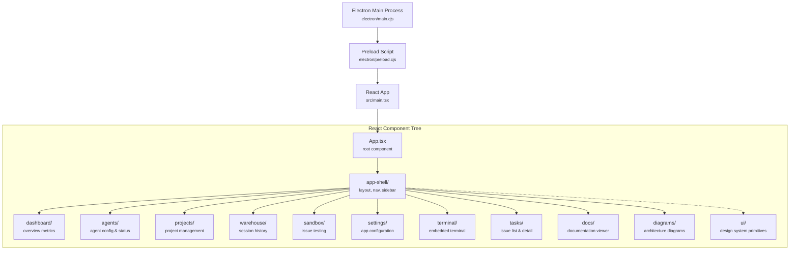
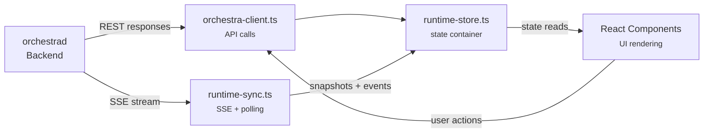
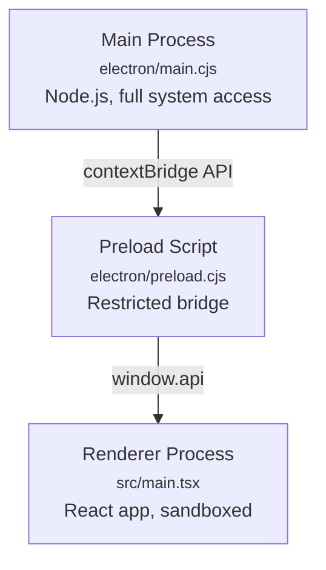

# 2.2 Desktop Frontend Architecture

> **Source files:** `apps/desktop/src/`, `apps/desktop/electron/`, `apps/desktop/vite.config.ts`, `apps/desktop/package.json`

The Orchestra desktop application is an Electron app with a React 19 renderer. It provides a full GUI for managing projects, monitoring agent runs, browsing issues, viewing session logs, and interacting with terminal sessions. The frontend connects to the `orchestrad` backend via REST API calls and receives real-time updates through SSE.

---

### Component Hierarchy

---

### Directory Structure

| Directory | Purpose | Key Files |
|-----------|---------|-----------|
| `electron/` | Electron main process and preload | `main.cjs`, `preload.cjs` |
| `src/` | React application root | `main.tsx`, `App.tsx`, `index.css` |
| `src/components/app-shell/` | Application shell: layout, navigation, sidebar, status bar | Navigation routing, section switching |
| `src/components/dashboard/` | Overview dashboard with metrics and charts | Token usage, active runs, project stats |
| `src/components/agents/` | Agent configuration and status panels | Provider selection, agent settings |
| `src/components/projects/` | Project management views | Project list, project detail, file tree |
| `src/components/warehouse/` | Session history and log browsing | Session list, session detail, log viewer |
| `src/components/sandbox/` | Issue creation and testing sandbox | Quick-dispatch forms |
| `src/components/settings/` | Application and backend configuration | API token, workspace root, provider keys |
| `src/components/terminal/` | Embedded terminal (WebSocket PTY) | Terminal emulator, session management |
| `src/components/tasks/` | Issue list and detail views | Issue table, status badges, filters |
| `src/components/docs/` | Documentation viewer | Markdown rendering |
| `src/components/diagrams/` | Architecture diagram viewer | Mermaid rendering |
| `src/components/ui/` | Design system primitives (Radix-based) | Buttons, inputs, dialogs, tooltips, tabs |
| `src/lib/` | Core libraries and state management | API client, runtime store, SSE sync, enums |
| `src/hooks/` | Custom React hooks | Shared stateful logic |
| `src/types/` | TypeScript type definitions | Shared interfaces |
| `src/widgets/` | Standalone widget components | Reusable composite UI elements |

---

### State Management Architecture

The frontend uses a three-layer state architecture that separates data fetching, state storage, and UI rendering:

#### `orchestra-client.ts` -- API Client

The API client provides typed methods for all backend endpoints. It accepts a `BackendConfig` object with `baseUrl`, `apiToken`, and optional `mcpServers` configuration. All methods return typed responses or throw structured errors.

Key types exported:

| Type | Purpose |
|------|---------|
| `BackendConfig` | Connection configuration (`baseUrl`, `apiToken`, `mcpServers`) |
| `IssueListItem` | Issue summary for list views |
| `IssueHistoryEntry` | Session event history entry |
| `ProjectTreeNode` | File tree node for project browsing |
| `MCPTool` | Tool definition from MCP server |
| `MCPServer` | MCP server configuration |

#### `runtime-sync.ts` -- SSE Event Synchronization

Manages the real-time connection to the backend's `/events` SSE endpoint. Handles:

- Initial snapshot loading via `fetchSnapshot()`
- SSE stream connection with automatic reconnection
- Exponential backoff on connection failures (3s base, 30s max)
- Periodic snapshot polling as a fallback
- Lifecycle event type filtering and normalization

Lifecycle event types processed:

| Event Type | Meaning |
|------------|---------|
| `RUN_EVENT` | Generic agent activity event |
| `RUN_STARTED` | Agent session has begun |
| `RUN_FAILED` | Agent session has failed |
| `RUN_CONTINUES` | Agent is still working (progress update) |
| `RUN_SUCCEEDED` | Agent session completed successfully |
| `RETRY_SCHEDULED` | Issue will be retried after a delay |
| `HOOK_STARTED` | Pre/post-run hook execution started |
| `HOOK_COMPLETED` | Hook execution completed successfully |
| `HOOK_FAILED` | Hook execution failed |

#### `runtime-store.ts` -- State Container

Provides snapshot diffing and timeline event management:

- `applySnapshotUpdate()` -- Compares fingerprints to avoid unnecessary re-renders when snapshot data has not changed.
- `appendTimelineEvent()` -- Prepends new events to the timeline with deduplication and a configurable max size (default 50 items).

---

### Electron IPC Bridge

The Electron architecture follows a standard main/preload/renderer separation:

| Layer | File | Capabilities |
|-------|------|-------------|
| **Main process** | `electron/main.cjs` | Window management, system tray, native menus, file system access |
| **Preload script** | `electron/preload.cjs` | Exposes a safe subset of Node.js APIs to the renderer via `contextBridge` |
| **Renderer process** | `src/main.tsx` | React app running in a Chromium sandbox with access only to the preload API |

---

### Technology Stack

| Technology | Version/Note | Role |
|------------|-------------|------|
| **React** | 19 | UI component framework with concurrent features |
| **TypeScript** | Strict mode | Type safety across the entire frontend |
| **Vite** | Build tool | Development server with HMR, production bundling |
| **Tailwind CSS** | Utility-first | Styling via utility classes, no separate CSS modules |
| **Radix UI** | Headless primitives | Accessible component primitives (dialogs, tooltips, tabs, etc.) |
| **Recharts** | Dashboard charts | Token usage, run metrics, project statistics |
| **Electron** | Desktop shell | Native window, system tray, IPC bridge, auto-update |

---

### Frontend Enums

The `src/lib/enums.ts` file defines the canonical enum values used throughout the frontend:

| Enum | Values | Purpose |
|------|--------|---------|
| `Provider` | `CODEX`, `CLAUDE`, `OPENCODE`, `GEMINI`, `UNSANDBOX` | Agent provider identifiers |
| `IssueStatus` | `RUNNING`, `RETRYING`, `TRACKED`, `IDLE` | Issue lifecycle states in the UI |
| `ConfigScope` | `GLOBAL`, `PROJECT` | Configuration scope levels |
| `AgentCategory` | `CORE`, `SKILL` | Agent classification |
| `SSEEventType` | `RUN_EVENT`, `RUN_STARTED`, `RUN_FAILED`, `RUN_CONTINUES`, `RUN_SUCCEEDED`, `RETRY_SCHEDULED`, `HOOK_STARTED`, `HOOK_COMPLETED`, `HOOK_FAILED` | SSE lifecycle event types |
| `SectionID` | `DASHBOARD`, `RUNNING`, `ISSUES`, `PROJECTS`, `AGENTS`, `WAREHOUSE`, `SANDBOX`, ... | Navigation section identifiers |

---

### Cross-References

- [2. Architecture Overview](overview.md) -- System-level context
- [2.1 Backend Architecture](backend.md) -- API endpoints consumed by the frontend
- [2.4 Data Flow & Events](data-flow.md) -- SSE event pipeline and snapshot strategy
