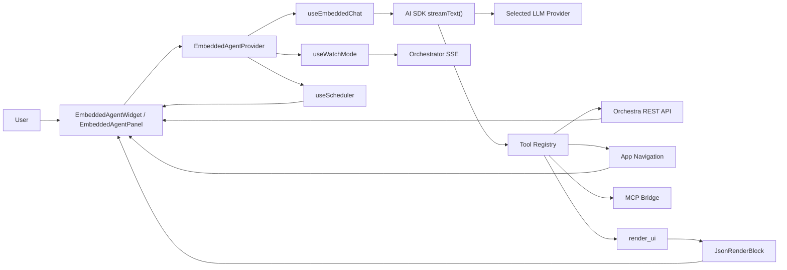
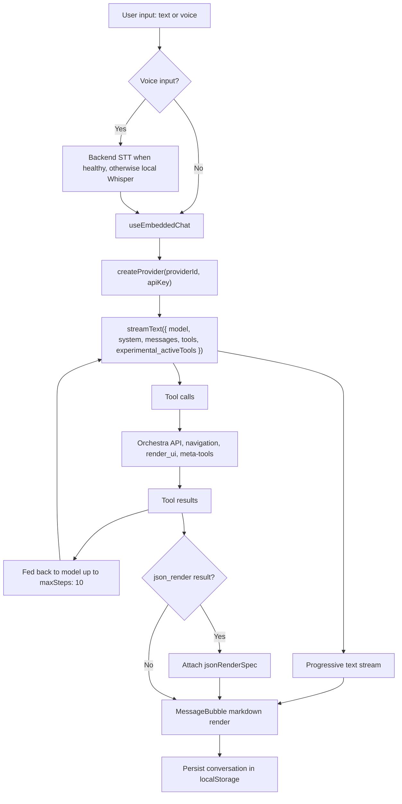

# Embedded Agent — Architecture

**Status:** Implemented (2026-03-18)
**Location:** `apps/desktop/src/components/embedded-agent/`

---

## Overview

The embedded agent is a floating chat widget built into the Orchestra desktop app. It acts as an in-app assistant that can navigate the UI, call Orchestra APIs, render rich UI inline via json-render, and connect to MCP servers for extensible tooling. All inference runs client-side in the renderer using AI SDK `streamText()` — there is no server-side chat endpoint.



---

## Module Structure

```
apps/desktop/src/components/embedded-agent/
├── EmbeddedAgentWidget.tsx        # Root: floating button + panel mount, Ctrl+. shortcut
├── EmbeddedAgentPanel.tsx         # Chat panel shell (header, messages, input)
├── EmbeddedAgentProvider.tsx      # React context: assembles tools, wires hooks
├── index.ts                       # Public export: EmbeddedAgentWidget
├── components/
│   ├── MessageList.tsx            # Scrollable message area with auto-scroll
│   ├── MessageBubble.tsx          # Single message: markdown, json-render, tool feedback
│   ├── ChatInput.tsx              # Text input + send + voice input
│   ├── VoiceInput.tsx             # Click-to-record mic using shared Whisper client
│   ├── ToolFeedback.tsx           # Collapsible tool call/result display
│   ├── JsonRenderBlock.tsx        # Custom json-render renderer (not @json-render/react Renderer)
│   ├── WatchNotifications.tsx     # Proactive notifications from orchestrator events
│   ├── ContextSuggestions.tsx     # Context-aware suggested prompts
│   └── SchedulePanel.tsx          # Scheduled reminders and deferred actions
├── hooks/
│   ├── useEmbeddedChat.ts         # Wraps AI SDK streamText, message list, localStorage
│   ├── useProviderConfig.ts       # Provider/model/key management, localStorage prefs
│   ├── useWatchMode.ts            # SSE-based watch for orchestrator events
│   ├── useScheduler.ts            # Client-side reminder/action scheduler
│   └── useContextSuggestions.ts   # Suggestions based on current view state
├── tools/
│   ├── orchestra-tools.ts         # Issue CRUD, dispatch, project ops, render_ui
│   ├── navigation-tools.ts        # navigate_to, open_settings_tab
│   ├── git-tools.ts               # git_status, git_history, git_branches, git_commit_flow, git_sync, git_stash
│   ├── session-tools.ts           # summarize_session, get_session_logs, get_raw_logs, list_sessions
│   ├── search-tools.ts            # search_issues, search_sessions, search_docs, get_warehouse_stats
│   ├── code-execution-tools.ts    # execute_code, check_sandbox_status, list_sandbox_sessions
│   ├── scheduler-tools.ts         # schedule_reminder, schedule_action, cancel_schedule, list_schedules
│   ├── mcp-bridge-tools.ts        # list_mcp_servers, discover_mcp_tools, mcp_server_status
│   └── meta-tools.ts              # search_tools, get_tool_schema (progressive disclosure)
└── lib/
    ├── providers.ts               # createProvider(), fetchProviderModels() per provider
    ├── json-render-catalog.ts     # defineCatalog() — component + action definitions
    ├── json-render-registry.tsx   # defineRegistry() — React component mappings
    └── types.ts                   # ChatMessage, ChatProviderConfig, ToolCallInfo, etc.
```

### Integration Point

Single mount in `App.tsx`:

```tsx
<EmbeddedAgentWidget
  config={config}
  onNavigate={(section, id) => setActiveSection(section as SectionID)}
  onOpenSettings={() => { /* open settings */ }}
  activeSection={activeSection}
  selectedProjectId={selectedProjectId}
/>
```

The widget communicates with the rest of the app through `onNavigate`, the Orchestra REST API, and the `orchestra-data-changed` browser event used to trigger list refreshes after mutations.

---

## Data Flow



```
User input (text or voice via backend-or-local Whisper)
    │
    v
useEmbeddedChat hook
    │
    ├── createProvider(providerId, apiKey) → AI SDK provider instance
    │
    v
streamText({ model, system, messages, tools, experimental_activeTools })
    │
    ├── Text stream ──────────> Progressive markdown render in MessageBubble
    │
    ├── Tool calls ──────────> onStepFinish callback
    │   │                       │
    │   │                       ├── Orchestra API tools → fetch/mutate via orchestra-client
    │   │                       ├── Navigation tools → onNavigate callback
    │   │                       ├── render_ui tool → jsonRenderSpec on message
    │   │                       └── Meta-tools → search_tools / get_tool_schema
    │   │
    │   └── Tool results fed back to LLM (maxSteps: 10)
    │
    └── Final message ───────> Saved to localStorage
```

### Active Tools Filtering

Not all tools are sent in the model context. A curated subset (`ACTIVE_TOOLS`) is passed via `experimental_activeTools` to keep context lean:

- Meta-tools: `search_tools`, `get_tool_schema`
- Core: `list_issues`, `create_issue`, `update_issue`, `dispatch_agent`
- Projects: `find_projects`, `list_projects`
- Navigation: `navigate_to`, `open_settings_tab`
- Search: `search_issues`
- UI: `render_ui`, `get_orchestrator_state`

Specialized tools (git, sessions, code execution, scheduling, MCP) are discoverable via `search_tools` and callable once the LLM has discovered them.

---

## Provider Configuration

Four providers are supported, each using a different AI SDK adapter:

| Provider | SDK Package | API Style | Model Listing |
|----------|------------|-----------|---------------|
| OpenRouter | `@ai-sdk/openai` (custom baseURL) | Chat Completions | Public `/api/v1/models` (filtered to `tools` support) |
| OpenAI | `@ai-sdk/openai` | Chat Completions | `/v1/models` with API key (filtered to `gpt-*`/`o*`) |
| Claude | `@ai-sdk/anthropic` | Native Anthropic | Static list (no list-models API) |
| Gemini | `@ai-sdk/google` | Native Google | `/v1beta/models` with API key |

Key implementation detail: OpenRouter and OpenAI use `provider.chat(modelId)` (Chat Completions API), not the Responses API. This is set in `lib/providers.ts` via `createProvider()`.

### API Key Storage

Keys are stored by the backend at `~/.orchestra/agent-providers.json` (permissions `0600`):

- `GET /api/v1/config/agent-providers` — returns configured provider status and keys
- `POST /api/v1/config/agent-providers` — save/update a single provider's key

Keys are fetched into memory on panel open and never persisted client-side.

### Model Selection Persistence

Provider and model choices are persisted in `localStorage` under `orchestra-agent-provider-prefs`. On mount, `useProviderConfig` loads saved prefs, fetches configured keys from the backend, and then fetches the model list from the selected provider API. If no saved model exists, it picks from `PREFERRED_DEFAULTS` such as `anthropic/claude-sonnet-4` for OpenRouter, `gpt-4o` for OpenAI, `claude-sonnet-4-6` for Claude, and `gemini-2.5-flash` for Gemini.

---

## Tool System

Tools are assembled in `EmbeddedAgentProvider.tsx` by composing factory functions:

```
createOrchestraTools(config)     → issue CRUD, dispatch, projects, render_ui
createNavigationTools(onNavigate) → navigate_to, open_settings_tab
createGitTools(config)           → git_status, git_history, git_branches, etc.
createSessionTools(config)       → summarize_session, get_session_logs, etc.
createSearchTools(config)        → search_issues, search_sessions, search_docs, etc.
createCodeExecutionTools(config) → execute_code, check_sandbox_status, etc.
createSchedulerTools(scheduler)  → schedule_reminder, schedule_action, etc.
createMCPBridgeTools(config)     → list_mcp_servers, discover_mcp_tools, etc.
createMetaTools(allDomainTools)  → search_tools, get_tool_schema
```

### Progressive Tool Discovery

To avoid overwhelming the model context, `meta-tools.ts` maintains a `TOOL_REGISTRY` — a flat list of tools with category, summary, prerequisites, and mutation/confirmation flags. The LLM calls `search_tools(category="git")` to discover tools, then `get_tool_schema(tool_name="git_stash")` to inspect parameters before calling.

### Confirmation Gates

Destructive tools (delete_issue, git_branches delete/merge, git_sync) are marked `confirm: true` in the registry. The system prompt instructs the LLM to state the action and wait for user confirmation before calling.

---

## json-render Custom Renderer

The implementation uses a **custom renderer** in `JsonRenderBlock.tsx` rather than the `<Renderer>` component from `@json-render/react`. The registry (`json-render-registry.tsx`) defines React components via `defineRegistry()` that map catalog types to Tailwind-styled components matching Orchestra's design system.

### Catalog Components

- **Layout:** Card, Stack, Divider
- **Data:** Metric, Table, Badge, CodeBlock, KeyValue
- **Interactive:** Button, ButtonGroup
- **Feedback:** Alert, Progress

### Actions

Actions wired to buttons/chips: `navigate`, `send_chat`, `copy_to_clipboard`. The `dispatch_agent` tool only sets the provider and assignee on an issue — it does not change issue state directly.

### render_ui Tool

The LLM invokes `render_ui` with a JSON spec. The tool returns `{ type: 'json_render', spec }`. `useEmbeddedChat` detects this in tool results and attaches `jsonRenderSpec` to the assistant message. `MessageBubble` then renders via `JsonRenderBlock`.

---

## Settings Integration

Provider configuration lives in **Settings > Integrations** via `EmbeddedAgentConfigForm` (in `apps/desktop/src/components/settings/SettingsCard.tsx`). The form provides:

- Provider dropdown (OpenRouter, Claude, OpenAI, Gemini)
- API key input with save/test connection
- `ModelSearchDropdown` — searchable model selector populated from the provider API
- Model selection persisted to localStorage on save

---

## State Management

- **React Context:** `EmbeddedAgentProvider` exposes panel state, provider config, messages, streaming status, watch mode, and scheduler via `useEmbeddedAgent()` hook.
- **localStorage Persistence:**
  - `orchestra-embedded-agent-chat` — conversation history (survives app restart, cleared via "Clear chat")
  - `orchestra-agent-provider-prefs` — selected provider ID and model ID
  - `orchestra-watch-mode` — watch-mode enabled state and tracked event types
- **No server-side chat persistence.** Conversations are local only.

---

## Error Handling

`useEmbeddedChat` maps provider/network errors to user-friendly messages via `formatProviderError()`:

| Error Pattern | User Message |
|--------------|-------------|
| 503 / overloaded | "Model temporarily unavailable. Try again or switch to a different model." |
| 401 / 403 / invalid key | "API key invalid or expired. Update in Settings." |
| 429 / rate limit | "Rate limit exceeded. Wait a moment and try again." |
| Network / fetch failed | "Network error. Check your connection." |

Tool execution errors are fed back to the LLM as tool results so it can reason about failures.
