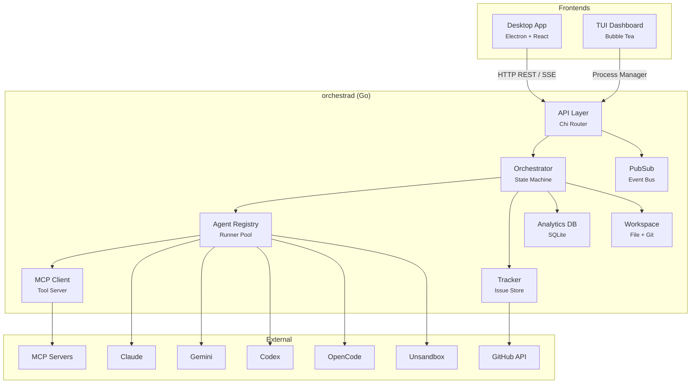
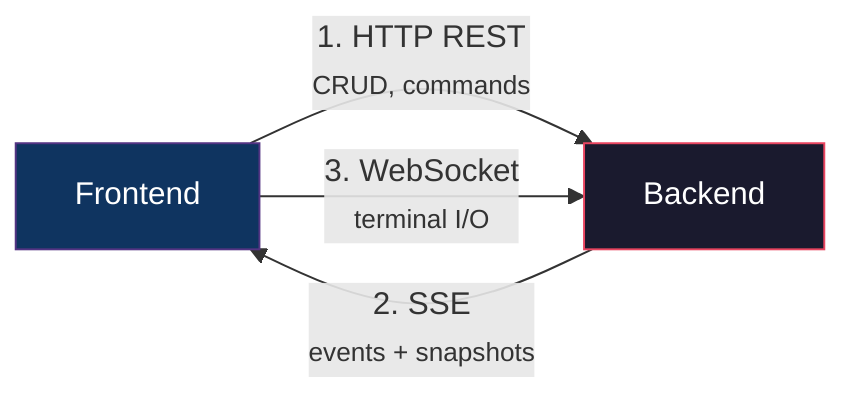
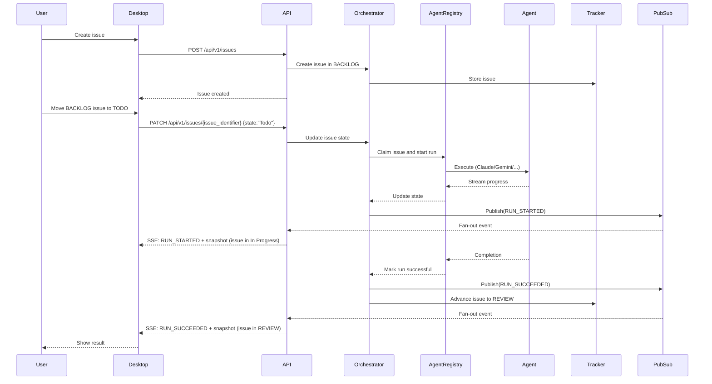

# 1.1 Architecture Overview

> **Source files:** `apps/backend/cmd/orchestrad/`, `apps/backend/internal/`, `apps/desktop/`, `apps/tui/`

Orchestra follows a client-server architecture with a single Go backend serving multiple frontends. The backend owns orchestration logic, issue state, execution dispatch, telemetry, and event broadcasting, while frontends render state and issue commands through the API.

---

### High-Level System Diagram

---

### Component Responsibilities

| Component | Package | Responsibility |
|-----------|---------|----------------|
| **API Server** | `internal/api` | HTTP routing, SSE streaming, auth, rate limiting, WebSocket terminals |
| **Orchestrator** | `internal/orchestrator` | Central state machine -- tracks running/retrying issues, dispatches agents, reconciles states |
| **Agent Registry** | `internal/agents` | Provider abstraction -- registers runners for Claude, Gemini, Codex, OpenCode, Unsandbox |
| **Tracker** | `internal/tracker` | Pluggable issue storage (memory, SQLite, GitHub Issues) |
| **PubSub** | `internal/observability` | In-process event bus -- fan-out lifecycle events to SSE subscribers |
| **Analytics DB** | `internal/db` | SQLite database for sessions, projects, token usage, MCP server configs |
| **Workspace** | `internal/workspace` | Manages working directories, git operations, workspace migration, path guards |
| **MCP Client** | `internal/mcp` | Model Context Protocol client for connecting to external tool servers |
| **Config** | `internal/config` | Loads configuration from environment variables and config files |
| **Telemetry** | `internal/telemetry` | Watches agent log files for token usage and session events |
| **Terminal** | `internal/terminal` | WebSocket-based terminal sessions for the desktop app |
| **Prompt** | `internal/prompt` | Builds system prompts for agent runners |
| **Workflow** | `internal/workflow` | Frontmatter parsing and workflow definition store |
| **Presenter** | `internal/presenter` | Formats orchestrator state for API responses |
| **Unsandbox** | `internal/unsandbox` | Client for remote execution on the Unsandbox platform |

---

### Communication Patterns

Orchestra uses three communication channels between backend and frontends:

| Channel | Protocol | Direction | Use Case |
|---------|----------|-----------|----------|
| **REST API** | HTTP/JSON | Client -> Server | Issue CRUD, project management, git operations, config, agent control |
| **SSE** | `text/event-stream` | Server -> Client | Real-time snapshot broadcasts, lifecycle events (run started/failed/succeeded) |
| **WebSocket** | WS | Bidirectional | Interactive terminal sessions (`/api/v1/terminal/{session_id}`) |

---

### Data Flow: Issue Creation to Resolution

---

### Technology Choices

| Layer | Technology | Rationale |
|-------|-----------|-----------|
| Backend language | **Go 1.25+** | Fast compilation, strong concurrency primitives, single binary deployment |
| HTTP router | **Chi** (`go-chi/chi/v5`) | Lightweight, idiomatic middleware chain, URL parameters |
| Logging | **zerolog** (`rs/zerolog`) | Zero-allocation structured JSON logging |
| CORS | **go-chi/cors** | Chi-native CORS middleware |
| Desktop framework | **Electron** | Cross-platform desktop with web technologies |
| UI library | **React 19** | Component model, hooks, concurrent rendering |
| Build tool | **Vite** | Fast HMR, ESM-native bundling |
| Styling | **Tailwind CSS** | Utility-first, no CSS files to manage |
| Component primitives | **Radix UI** | Accessible, unstyled component primitives |
| Charts | **Recharts** | React-native charting built on D3 |
| TUI framework | **Bubble Tea** | Elm-architecture TUI framework for Go |
| Database | **SQLite** | Zero-config embedded database, single file |
| ID generation | **UUID v4** (`google/uuid`) | Globally unique, no coordination needed |

---

### Cross-References

- [1.2 Backend Architecture](backend.md) -- Package-level internals of `orchestrad`
- [1.3 Desktop Frontend](desktop.md) -- Electron + React component structure
- [1.4 TUI Architecture](tui.md) -- Terminal dashboard details
- [1.5 Data Flow & Events](data-flow.md) -- SSE event types, PubSub, retry logic
