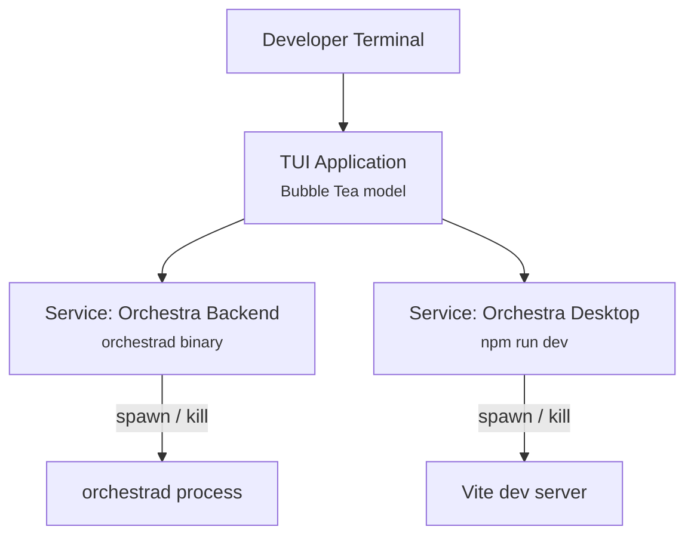
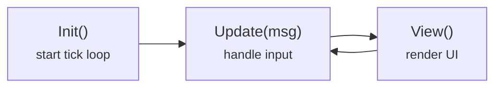
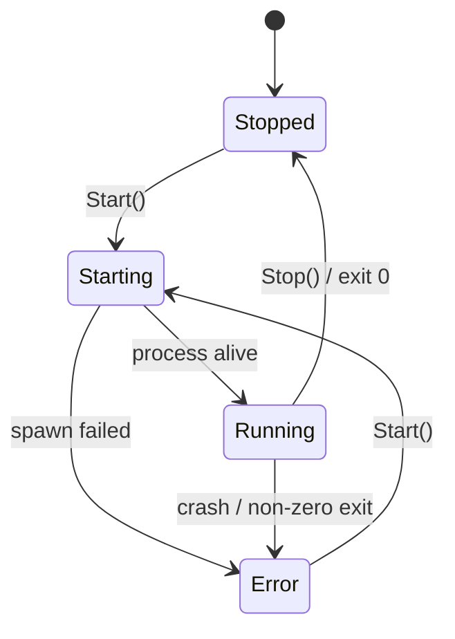

# 1.4 TUI Architecture

> **Source files:** `apps/tui/main.go`, `apps/tui/manager.go`, `apps/tui/styles.go`

The Orchestra TUI is a lightweight terminal dashboard built with Go and Bubble Tea. It manages the lifecycle of the backend (`orchestrad`) and desktop frontend dev process, providing a unified control panel for starting, stopping, and monitoring both services.

---

### Architecture Overview

The TUI itself does not communicate with the backend API. It acts purely as a process manager, spawning and monitoring child processes and displaying their stdout/stderr output in a scrollable viewport.

---

### File Structure

| File | Purpose |
|------|---------|
| `main.go` | Entry point, Bubble Tea model definition, `Init()`, `Update()`, `View()` |
| `manager.go` | `Service` struct and `ServiceStatus` enum, process spawning, log capture |
| `styles.go` | Lipgloss style definitions for the terminal UI |

---

### Bubble Tea Model

The TUI follows the Elm architecture enforced by Bubble Tea:

The `model` struct holds all application state:

| Field | Type | Purpose |
|-------|------|---------|
| `backend` | `*Service` | Backend service (orchestrad) |
| `frontend` | `*Service` | Frontend service (npm run dev) |
| `viewport` | `viewport.Model` | Scrollable log viewer |
| `activeTab` | `int` | Currently selected tab (0=Backend, 1=Frontend) |
| `width`, `height` | `int` | Terminal dimensions |
| `ready` | `bool` | Whether the viewport has been initialized |
| `followLogs` | `bool` | Auto-scroll to latest log output |
| `noStart` | `bool` | Parsed flag retained in the model, though services currently start manually via keyboard control |

### Keyboard Controls

| Key | Action |
|-----|--------|
| `q`, `Ctrl+C` | Quit (stops both services) |
| `Tab` | Switch between Backend and Frontend tabs |
| `1` | Switch to Backend tab |
| `2` | Switch to Frontend tab |
| `s` | Start/stop the currently selected service |
| `f` | Toggle log follow mode |
| `Up`, `k`, `PgUp` | Scroll up (disables follow) |
| `Down`, `j`, `PgDn` | Scroll down (re-enables follow at bottom) |

---

### Service Manager

The `Service` struct in `manager.go` manages the lifecycle of a child process:

#### ServiceStatus Enum

| Value | Iota | String | Meaning |
|-------|------|--------|---------|
| `StatusStopped` | 0 | `STOPPED` | Process is not running |
| `StatusStarting` | 1 | `STARTING` | Process is spawning |
| `StatusRunning` | 2 | `RUNNING` | Process is alive and healthy |
| `StatusError` | 3 | `ERROR` | Process exited with an error |

#### Service Struct Fields

| Field | Type | Purpose |
|-------|------|---------|
| `Name` | `string` | Display name (e.g., "Orchestra Backend") |
| `Cmd` | `string` | Shell command to execute |
| `Cwd` | `string` | Working directory for the process |
| `Env` | `[]string` | Additional environment variables |
| `Status` | `ServiceStatus` | Current lifecycle state |
| `Logs` | `[]string` | Captured stdout/stderr lines |
| `mu` | `sync.Mutex` | Protects concurrent access to state |
| `cancel` | `context.CancelFunc` | Cancels the running process context |
| `cmd` | `*exec.Cmd` | The underlying OS process |
| `onEvent` | `func()` | Callback for log updates |

### Process Management

When a service is started:

1. A new `context.Context` is created with a cancel function.
2. `bash -c <command>` is spawned with `Setpgid: true` for process group isolation.
3. Stdout and stderr pipes are captured line-by-line via `bufio.Scanner`.
4. Log lines are appended to `Service.Logs` under the mutex.
5. The `onEvent` callback is called after each line to trigger a UI refresh.

When a service is stopped, the cancel function is called, which terminates the process group.

---

### Default Service Configuration

| Service | Command | Working Directory | Environment |
|---------|---------|-------------------|-------------|
| Backend | `./apps/backend/orchestrad` | `../..` (repo root from `apps/tui`) | `ORCHESTRA_SERVER_PORT=4010`, `ORCHESTRA_SERVER_HOST=0.0.0.0`, `ORCHESTRA_WORKSPACE_ROOT=/tmp/orchestra`, `ORCHESTRA_API_TOKEN=dev-token` |
| Frontend | `npm run dev` | `../desktop` | `ORCHESTRA_API_TOKEN=dev-token` |

Services currently start manually via the `s` key. `Init()` only starts the UI tick loop; it does not auto-start managed processes.

---

### Cross-References

- [1.1 Architecture Overview](overview.md) -- Where the TUI fits in the system
- [1.2 Backend Architecture](backend.md) -- The backend process that the TUI manages
- [1.3 Desktop Frontend](desktop.md) -- The frontend process that the TUI manages
