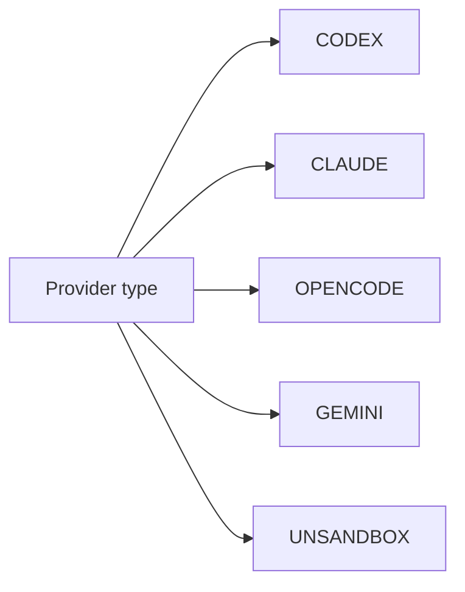
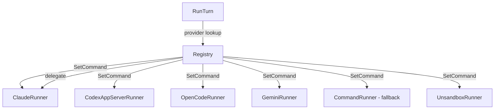
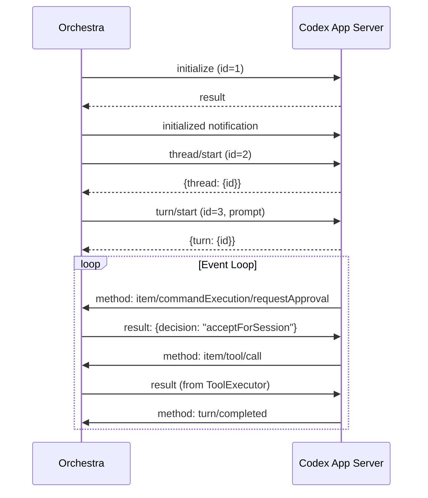

# 3.2 Agent System & Runners

> **Source files:** `apps/backend/internal/agents/types.go`, `apps/backend/internal/agents/registry.go`, `apps/backend/internal/agents/command_runner.go`, `apps/backend/internal/agents/claude_runner.go`, `apps/backend/internal/agents/codex_appserver.go`, `apps/backend/internal/agents/opencode_runner.go`, `apps/backend/internal/agents/gemini_runner.go`, `apps/backend/internal/agents/unsandbox_runner.go`, `apps/backend/internal/agents/config.go`

The agent system provides a unified interface for dispatching work to multiple machine learning coding agents. Each agent provider (Claude, Codex, OpenCode, Gemini, Unsandbox) has a runner implementation that translates the common `TurnRequest` into provider-specific CLI invocations, parses streaming output into normalized events, and returns a `TurnResult`.

### Provider Constants



| Constant | Value | Description |
|---|---|---|
| `ProviderCodex` | `"CODEX"` | OpenAI Codex CLI agent |
| `ProviderClaude` | `"CLAUDE"` | Anthropic Claude Code CLI |
| `ProviderOpenCode` | `"OPENCODE"` | OpenCode CLI agent |
| `ProviderGemini` | `"GEMINI"` | Google Gemini CLI agent |
| `ProviderUnsandbox` | `"UNSANDBOX"` | Remote container execution via unsandbox.com |

`NormalizeProvider(s string)` uppercases and trims a provider string for backward compatibility.

### Core Types

#### TurnRequest

| Field | Type | Description |
|---|---|---|
| `SessionID` | `string` | Session identifier for tracking |
| `Workspace` | `string` | Working directory for the agent |
| `WorkspaceRoot` | `string` | Root workspace directory for validation |
| `Prompt` | `string` | The task prompt to send to the agent |
| `IssueIdentifier` | `string` | Issue being worked on |
| `Attempt` | `int` | Current attempt number |
| `Timeout` | `time.Duration` | Execution timeout |
| `CommandOverride` | `string` | Override the default agent command |
| `AutoApprove` | `bool` | Auto-approve tool/file change requests |
| `ToolExecutor` | `ToolExecutor` | Callback for dynamic tool execution |
| `ToolSpecs` | `[]map[string]any` | Tool definitions to inject |
| `ResourceSpecs` | `[]map[string]any` | Resource definitions to inject |

#### TurnResult

| Field | Type | Description |
|---|---|---|
| `Provider` | `Provider` | Which provider executed |
| `SessionID` | `string` | Session ID used |
| `ExitCode` | `int` | Process exit code |
| `Output` | `string` | Captured stdout/stderr |
| `Usage` | `TokenUsage` | Token consumption |

#### Event

Events are the normalized stream of agent activity:

| Field | Type | Description |
|---|---|---|
| `Provider` | `Provider` | Source provider |
| `SessionID` | `string` | Session context |
| `Kind` | `string` | Event type (e.g. `message_start`, `turn.completed`) |
| `Message` | `string` | Human-readable content |
| `RawLine` | `string` | Original output line |
| `Raw` | `map[string]any` | Parsed JSON payload |
| `Usage` | `TokenUsage` | Token counts from this event |
| `Timestamp` | `time.Time` | Event time |

### Runner Interface

```go
type Runner interface {
    RunTurn(ctx context.Context, request TurnRequest, onEvent EventHandler) (TurnResult, error)
}
```

All runners implement this single method. The `EventHandler` callback `func(Event)` is called for each parsed event during execution.

### Registry

The `Registry` maps providers to their runners and dispatches turn execution:



| Method | Description |
|---|---|
| `NewRegistry(commandByProvider)` | Creates a registry, calling `SetCommand` for each provider |
| `NewRegistryWithTerminal(commands, tm)` | Creates with an optional terminal manager for PTY support |
| `RunTurn(ctx, provider, request, onEvent)` | Dispatches to the provider's runner |
| `HasProvider(provider)` | Checks if a provider is registered |
| `Providers()` | Returns all registered provider keys |
| `SetCommand(provider, command)` | Registers or updates a runner for a provider |

`SetCommand` performs intelligent runner selection:
- If the provider is `CODEX` and the command contains `app-server`, it creates a `CodexAppServerRunner` (JSON-RPC protocol).
- `CLAUDE` -> `ClaudeRunner`, `OPENCODE` -> `OpenCodeRunner`, `GEMINI` -> `GeminiRunner`, `UNSANDBOX` -> `UnsandboxRunner`.
- Unknown providers get a generic `CommandRunner` with optional terminal manager.

### CommandRunner (Base Implementation)

The `CommandRunner` is the foundation for all CLI-based runners. It handles:

1. **Workspace validation** -- Calls `workspace.ValidateWorkspacePath` before execution.
2. **Command resolution** -- Supports `{{prompt}}` template substitution with shell-safe quoting. If no template is present, the prompt is written to stdin.
3. **Tool/resource injection** -- Writes `tools.json` and `resources.json` to the workspace if specs are provided.
4. **Process execution** -- Spawns via `sh -lc` with `ORCHESTRA_SESSION_ID` in the environment.
5. **Stream parsing** -- Parallel goroutines read stdout and stderr, parsing SSE streams (`event:`, `data:`, `id:`) and raw JSON lines.
6. **Event generation** -- Each line is parsed into an `Event` with provider-specific kind extraction, message extraction, and token usage extraction.
7. **Blocking detection** -- Detects approval-required and input-required events; aborts the run on blocking events.
8. **PTY mode** -- If a terminal manager is configured, runs in a persistent PTY session instead of a subprocess pipe.

**Safety limits:**
- `MaxOutputSize` = 5 MB cap on raw output
- `MaxEventCount` = 2,000 events per turn

### Provider-Specific Runners

#### ClaudeRunner

Thin wrapper around `CommandRunner` with `ProviderClaude` set. Claude-specific event kind extraction handles `message_start`, `message_delta`, `message_stop`, `content_block_*`, and `result/*` types.

#### OpenCodeRunner

Thin wrapper around `CommandRunner` with `ProviderOpenCode`. Event extraction looks for `event` and `op`/`operation` fields in JSON payloads.

#### GeminiRunner

Wrapper with a default command of `gemini --output-format stream-json {{prompt}}` when no command is provided. Event extraction uses `type` and `event` fields.

#### CodexAppServerRunner

Implements a full **JSON-RPC protocol** for the Codex app-server mode:



Key features:
- **Auto-approval** -- When `AutoApprove` is true, automatically approves command execution, file changes, and tool user input requests.
- **Tool execution** -- Delegates `item/tool/call` to the `ToolExecutor` callback for dynamic tools (e.g. tracker queries).
- **Dynamic tools** -- Injects `ToolSpecs` as `dynamicTools` in the `thread/start` request.
- **Writable roots** -- Sets both workspace and workspace root as writable directories.

#### UnsandboxRunner

Executes agent turns inside **remote unsandbox.com containers**:

1. **Session creation** -- Creates a persistent session with configurable network mode (`semitrusted` or `zerotrust`).
2. **Credential sync** -- Reads local `~/.claude/.credentials.json` and settings, base64-encodes them, and injects into the container with `chmod 600`.
3. **Project injection** -- Either clones via git remote URL or uploads a gzipped tarball of the workspace.
4. **Agent installation** -- Installs the Claude CLI if the command references `claude`.
5. **Execution** -- Runs the agent command inside the container workspace.
6. **Artifact retrieval** -- Tars and extracts session JSONL artifacts back to the local machine for telemetry ingestion.

### Event Parsing Details

The `parseLineToEvent` function handles multiple output formats:

| Format | Detection | Handling |
|---|---|---|
| SSE stream | Lines prefixed with `event:`, `data:`, `id:` | Accumulated and flushed on blank line or `[DONE]` |
| JSON object | Parses as `map[string]any` | Extracts kind, message, usage from nested fields |
| JSON array | Parses as `[]any` | Iterates items, merges usage, detects blocking events |
| Plain text | Fallback | Stored as message with `source` kind |

Token usage extraction searches multiple nesting patterns: `usage.*`, `tokens.*`, `tokenUsage.*`, `params.usage.*`, `result.usage.*`, `message.usage.*`, `meta.usage.*`.

### Agent Configuration Discovery

The `config.go` file provides agent configuration management across global and project scopes:

| Agent | Global Config Paths | Local Config Paths | Skill Paths |
|---|---|---|---|
| Claude | `~/.claude/settings.json`, `~/.claude.json` | `.claude/settings.json`, `.claude/settings.local.json` | `.claude/agents` |
| Codex | `~/.codex/config.toml` | `.codex/config.toml`, `AGENTS.md` | `.codex/skills` |
| Gemini | `~/.gemini/settings.json` | `.gemini/settings.json` | `.gemini/agents`, `.gemini/skills` |
| OpenCode | `~/.config/opencode/opencode.json` | `opencode.json` | `.config/opencode/agents`, `.config/opencode/skills`, `.config/opencode/tools` |

`ListAgentConfigs(workspaceRoot, projectRoot)` discovers all configurations across:
1. Internal Orchestra core configs (`.orchestra/agents/`)
2. Agent-specific global and project configs
3. Skill/agent subdirectories (deep file discovery)

### Blocking Event Detection

The system detects two categories of blocking events that abort non-interactive runs:

- **Approval methods**: `item/commandExecution/requestApproval`, `item/fileChange/requestApproval`, `execCommandApproval`, `applyPatchApproval`, etc.
- **Input methods**: `item/tool/requestUserInput`, `turn/input_required`, `turn/needs_input`, and various `requiresInput`/`needsInput` boolean fields in payloads.
