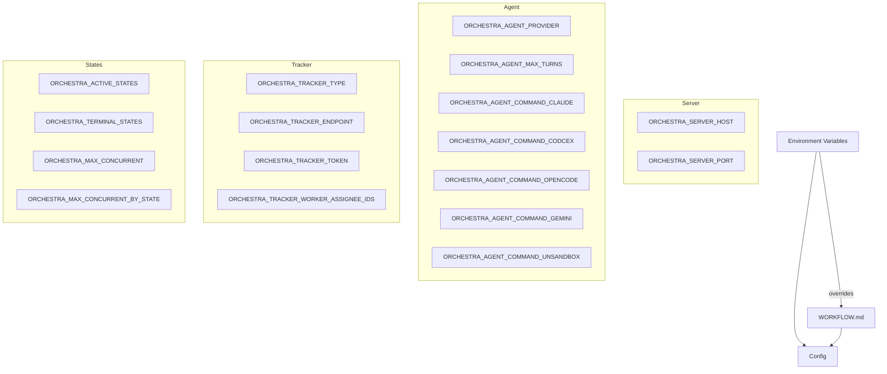
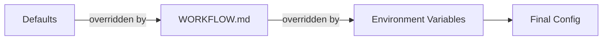

# 4.3 Configuration & Environment

> **Source files:** `apps/backend/internal/config/load.go`, `apps/backend/internal/config/types.go`

The configuration system loads settings from environment variables with fallback to a `WORKFLOW.md` file. Environment variables always take precedence over workflow file values. The `Config` struct is the single source of truth consumed by all backend subsystems.

### Config Struct

| Field | Type | Default | Description |
|---|---|---|---|
| `Host` | `string` | `127.0.0.1` | Server bind address |
| `Port` | `int` | `4010` | Server port |
| `WorkspaceRoot` | `string` | `~/.orchestra/workspaces` | Root directory for issue workspaces |
| `APIToken` | `string` | `""` | Bearer token for API authentication |
| `WorkflowFile` | `string` | `WORKFLOW.md` | Path to workflow configuration file |
| `AgentProvider` | `string` | `CODEX` | Default agent provider |
| `AgentCommands` | `map[string]string` | See below | Provider-to-command mapping |
| `AgentMaxTurns` | `int` | `10` | Maximum turns per agent execution |
| `TrackerType` | `string` | `""` | Tracker backend type (`sqlite`, `github`, or empty for memory) |
| `TrackerEndpoint` | `string` | `""` | Tracker API endpoint (for GitHub: `owner/repo`) |
| `TrackerToken` | `string` | `""` | Tracker authentication token |
| `TrackerWorkerAssigneeIDs` | `[]string` | `[]` | Assignee IDs recognized as workers |
| `ActiveStates` | `[]string` | `["Todo", "In Progress"]` | States eligible for agent dispatch |
| `TerminalStates` | `[]string` | `["Done", "Cancelled", "Canceled", "Closed", "Duplicate"]` | States that end processing |
| `MaxConcurrent` | `int` | `16` | Maximum concurrent agent sessions |
| `MaxConcurrentByState` | `map[string]int` | `{}` | Per-state concurrency limits |
| `WorkspaceHooks` | `workspace.Hooks` | `{}` | Lifecycle hook scripts |
| `ProjectRoots` | `[]string` | `[]` | Allowed project root directories |
| `GitHubClientID` | `string` | `""` | GitHub OAuth client ID |
| `GitHubClientSecret` | `string` | `""` | GitHub OAuth client secret |
| `MCPServers` | `map[string]string` | `{}` | MCP server name-to-command mapping |
| `TelemetryProviders` | `[]string` | `["CLAUDE", "CODEX", "GEMINI", "OPENCODE"]` | Providers to watch for telemetry |
| `TelemetryRetentionDays` | `int` | `7` | Days to retain telemetry events |
| `TelemetryStoreRawPayload` | `bool` | `false` | Store raw JSON payloads in events |
| `STTWhisperBin` | `string` | `""` | Path to Whisper STT binary |
| `STTWhisperModelPath` | `string` | `""` | Path to Whisper model file |
| `STTWhisperThreads` | `int` | `0` | Whisper thread count |
| `STTWhisperLanguage` | `string` | `en` | Whisper language |

### Default Agent Commands

| Provider | Default Command |
|---|---|
| `CODEX` | `codex exec --skip-git-repo-check --dangerously-bypass-approvals-and-sandbox --json {{prompt}}` |
| `CLAUDE` | `claude -p {{prompt}} --output-format stream-json --verbose --dangerously-skip-permissions` |
| `OPENCODE` | `opencode run {{prompt}} --format json` |
| `GEMINI` | `gemini -p {{prompt}} --output-format stream-json --approval-mode yolo` |

### Environment Variables

| Variable | Maps to | Notes |
|---|---|---|
| `ORCHESTRA_SERVER_HOST` | `Host` | Bind address |
| `ORCHESTRA_SERVER_PORT` | `Port` | Must be 1-65535 |
| `ORCHESTRA_WORKSPACE_ROOT` | `WorkspaceRoot` | Workspace directory root |
| `ORCHESTRA_API_TOKEN` | `APIToken` | Bearer auth token |
| `ORCHESTRA_WORKFLOW_FILE` | `WorkflowFile` | Path to WORKFLOW.md |
| `ORCHESTRA_AGENT_PROVIDER` | `AgentProvider` | Uppercased |
| `ORCHESTRA_AGENT_MAX_TURNS` | `AgentMaxTurns` | Must be > 0 |
| `ORCHESTRA_AGENT_COMMAND_CLAUDE` | `AgentCommands["CLAUDE"]` | |
| `ORCHESTRA_AGENT_COMMAND_CODCEX` | `AgentCommands["CODEX"]` | Note: env var has typo |
| `ORCHESTRA_AGENT_COMMAND_OPENCODE` | `AgentCommands["OPENCODE"]` | |
| `ORCHESTRA_AGENT_COMMAND_GEMINI` | `AgentCommands["GEMINI"]` | |
| `ORCHESTRA_AGENT_COMMAND_UNSANDBOX` | `AgentCommands["UNSANDBOX"]` | |
| `ORCHESTRA_TRACKER_TYPE` | `TrackerType` | `sqlite`, `github`, or empty |
| `ORCHESTRA_TRACKER_ENDPOINT` | `TrackerEndpoint` | GitHub: `owner/repo` |
| `ORCHESTRA_TRACKER_TOKEN` | `TrackerToken` | |
| `ORCHESTRA_TRACKER_WORKER_ASSIGNEE_IDS` | `TrackerWorkerAssigneeIDs` | Comma-separated |
| `ORCHESTRA_ACTIVE_STATES` | `ActiveStates` | Comma-separated |
| `ORCHESTRA_TERMINAL_STATES` | `TerminalStates` | Comma-separated |
| `ORCHESTRA_MAX_CONCURRENT` | `MaxConcurrent` | |
| `ORCHESTRA_MAX_CONCURRENT_BY_STATE` | `MaxConcurrentByState` | Format: `state1:limit1,state2:limit2` |
| `ORCHESTRA_WORKSPACE_AFTER_CREATE` | `WorkspaceHooks.AfterCreate` | Shell script |
| `ORCHESTRA_WORKSPACE_BEFORE_REMOVE` | `WorkspaceHooks.BeforeRemove` | Shell script |
| `ORCHESTRA_WORKSPACE_BEFORE_RUN` | `WorkspaceHooks.BeforeRun` | Shell script |
| `ORCHESTRA_WORKSPACE_AFTER_RUN` | `WorkspaceHooks.AfterRun` | Shell script |
| `ORCHESTRA_PROJECT_ROOTS` | `ProjectRoots` | Comma-separated paths |
| `ORCHESTRA_GITHUB_CLIENT_ID` | `GitHubClientID` | |
| `ORCHESTRA_GITHUB_CLIENT_SECRET` | `GitHubClientSecret` | |
| `ORCHESTRA_MCP_SERVERS` | `MCPServers` | Format: `name1=cmd1,name2=cmd2` |
| `ORCHESTRA_TELEMETRY_PROVIDERS` | `TelemetryProviders` | Comma-separated |
| `ORCHESTRA_TELEMETRY_RETENTION_DAYS` | `TelemetryRetentionDays` | |
| `ORCHESTRA_TELEMETRY_STORE_RAW_PAYLOAD` | `TelemetryStoreRawPayload` | `true`/`false`/`1`/`0` |
| `ORCHESTRA_STT_WHISPER_BIN` | `STTWhisperBin` | |
| `ORCHESTRA_STT_WHISPER_MODEL` | `STTWhisperModelPath` | |
| `ORCHESTRA_STT_WHISPER_THREADS` | `STTWhisperThreads` | |
| `ORCHESTRA_STT_WHISPER_LANGUAGE` | `STTWhisperLanguage` | Default: `en` |

### Loading Priority

1. **Hardcoded defaults** -- Built-in values (host `127.0.0.1`, port `4010`, etc.)
2. **Workflow file** -- YAML/Markdown config parsed from `WORKFLOW.md` via nested key lookup (e.g. `server.host`, `agent.provider`)
3. **Environment variables** -- Always take final precedence

### Workflow File Config Paths

The workflow file uses nested YAML configuration under these paths:

| Config Path | Maps to |
|---|---|
| `server.host` | Host |
| `server.port` | Port |
| `server.api_token` | APIToken |
| `workspace.root` | WorkspaceRoot |
| `workspace.after_create` | WorkspaceHooks.AfterCreate |
| `workspace.before_remove` | WorkspaceHooks.BeforeRemove |
| `workspace.before_run` | WorkspaceHooks.BeforeRun |
| `workspace.after_run` | WorkspaceHooks.AfterRun |
| `workspace.project_roots` | ProjectRoots |
| `agent.provider` | AgentProvider |
| `agent.max_turns` | AgentMaxTurns |
| `agent.max_concurrent` | MaxConcurrent |
| `agent.max_concurrent_by_state` | MaxConcurrentByState |
| `agent.commands.codex` | AgentCommands["CODEX"] |
| `agent.commands.claude` | AgentCommands["CLAUDE"] |
| `agent.commands.opencode` | AgentCommands["OPENCODE"] |
| `agent.commands.gemini` | AgentCommands["GEMINI"] |
| `tracker.type` | TrackerType |
| `tracker.endpoint` | TrackerEndpoint |
| `tracker.token` | TrackerToken |
| `tracker.worker_assignee_ids` | TrackerWorkerAssigneeIDs |
| `tracker.active_states` | ActiveStates |
| `tracker.terminal_states` | TerminalStates |
| `github.client_id` | GitHubClientID |
| `github.client_secret` | GitHubClientSecret |
| `mcp.servers` | MCPServers |

### Tracker Type Selection

| `TrackerType` Value | Backend | Requirements |
|---|---|---|
| `""` (empty) | Memory | None (ephemeral) |
| `sqlite` | SQLite | Database path via `db.Connect` |
| `github` | GitHub Issues | `TrackerEndpoint` as `owner/repo`, `TrackerToken` |
