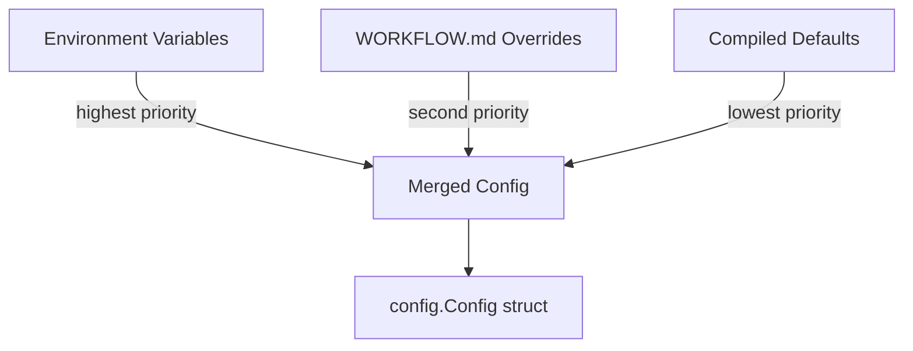
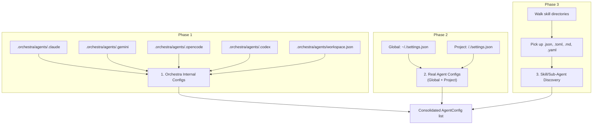

# 3.6 Configuration & Environment

> **Source files:**
> - `apps/backend/internal/config/types.go`
> - `apps/backend/internal/config/load.go`
> - `apps/backend/internal/agents/config.go`

Orchestra's backend configuration is resolved through a layered system: environment variables take highest priority, followed by `WORKFLOW.md` overrides, followed by compiled defaults. The `agents` package provides a parallel config discovery system that locates and aggregates agent-specific configuration files across global and project scopes.

---

## Configuration Loading

The `config.Load()` function builds a `Config` struct by reading environment variables, then falling back to values extracted from the workflow file (`WORKFLOW.md` by default), and finally applying hardcoded defaults.



### Resolution Order

For each configuration field, `Load()` follows this precedence:

1. **Environment variable** -- read via `os.LookupEnv`
2. **Workflow file** -- parsed from a structured Markdown document via `workflow.LoadFile()`
3. **Default value** -- hardcoded in `load.go`

---

## Environment Variables

| Variable | Type | Default | Description |
|----------|------|---------|-------------|
| `ORCHESTRA_SERVER_HOST` | string | `127.0.0.1` | HTTP server bind address |
| `ORCHESTRA_SERVER_PORT` | int | `4010` | HTTP server port |
| `ORCHESTRA_WORKSPACE_ROOT` | string | `~/.orchestra/workspaces` | Root directory for issue workspaces |
| `ORCHESTRA_WORKTREE_ROOT` | string | same as workspace root | Root directory for per-issue git worktrees |
| `ORCHESTRA_API_TOKEN` | string | *(empty)* | Bearer token for API authentication |
| `ORCHESTRA_WORKFLOW_FILE` | string | `WORKFLOW.md` | Path to the workflow definition file |
| `ORCHESTRA_AGENT_PROVIDER` | string | `CODEX` | Default agent provider (CODEX, CLAUDE, OPENCODE, GEMINI) |
| `ORCHESTRA_AGENT_MAX_TURNS` | int | `25` | Maximum agent execution turns per run |
| `ORCHESTRA_AGENT_COMMAND_CODEX` | string | `codex exec ...` | Shell command template for Codex agent |
| `ORCHESTRA_AGENT_COMMAND_CLAUDE` | string | `claude -p ...` | Shell command template for Claude agent |
| `ORCHESTRA_AGENT_COMMAND_OPENCODE` | string | `opencode -p ...` | Shell command template for OpenCode agent |
| `ORCHESTRA_AGENT_COMMAND_GEMINI` | string | `gemini -p ...` | Shell command template for Gemini agent |
| `ORCHESTRA_AGENT_COMMAND_UNSANDBOX` | string | *(empty)* | Shell command template for Unsandbox agent |
| `ORCHESTRA_TRACKER_TYPE` | string | *(empty)* | Tracker backend type. `github` selects GitHub; other values fall back to the local SQLite-backed tracker in normal runtime |
| `ORCHESTRA_TRACKER_ENDPOINT` | string | *(empty)* | Tracker-specific endpoint, such as `owner/repo` for GitHub |
| `ORCHESTRA_TRACKER_TOKEN` | string | *(empty)* | Authentication token for external tracker |
| `ORCHESTRA_TRACKER_WORKER_ASSIGNEE_IDS` | CSV | *(empty)* | Comma-separated assignee IDs that represent worker agents |
| `ORCHESTRA_ACTIVE_STATES` | CSV | `Todo,In Progress` | Issue states considered actionable |
| `ORCHESTRA_TERMINAL_STATES` | CSV | `Done,Cancelled,Canceled,Closed,Duplicate` | Issue states considered terminal |
| `ORCHESTRA_MAX_CONCURRENT` | int | `6` | Global maximum concurrent agent runs |
| `ORCHESTRA_MAX_CONCURRENT_BY_STATE` | CSV | *(empty)* | Per-state concurrency limits (format: `state:limit,state:limit`) |
| `ORCHESTRA_WORKSPACE_AFTER_CREATE` | string | *(empty)* | Shell hook run after workspace creation |
| `ORCHESTRA_WORKSPACE_BEFORE_REMOVE` | string | *(empty)* | Shell hook run before workspace removal |
| `ORCHESTRA_WORKSPACE_BEFORE_RUN` | string | *(empty)* | Shell hook run before each agent run |
| `ORCHESTRA_WORKSPACE_AFTER_RUN` | string | *(empty)* | Shell hook run after each agent run |
| `ORCHESTRA_PROJECT_ROOTS` | CSV | *(empty)* | Allowed project root directories |
| `ORCHESTRA_GITHUB_CLIENT_ID` | string | *(empty)* | GitHub OAuth client ID |
| `ORCHESTRA_GITHUB_CLIENT_SECRET` | string | *(empty)* | GitHub OAuth client secret |
| `ORCHESTRA_MCP_SERVERS` | CSV | *(empty)* | MCP server definitions (format: `name=command,name=command`) |
| `ORCHESTRA_TELEMETRY_PROVIDERS` | CSV | `CLAUDE,CODEX,GEMINI,OPENCODE` | Telemetry providers to watch |
| `ORCHESTRA_TELEMETRY_RETENTION_DAYS` | int | `7` | Days to retain telemetry events before pruning |
| `ORCHESTRA_TELEMETRY_STORE_RAW_PAYLOAD` | bool | `false` | Whether to persist raw event payloads |
| `ORCHESTRA_STT_WHISPER_BIN` | string | *(empty)* | Path to Whisper binary for speech-to-text |
| `ORCHESTRA_STT_WHISPER_MODEL` | string | *(empty)* | Path to Whisper model file |
| `ORCHESTRA_STT_WHISPER_THREADS` | int | `0` | Number of Whisper threads |
| `ORCHESTRA_STT_WHISPER_LANGUAGE` | string | `en` | Whisper language code |
| `ORCHESTRA_ANTHROPIC_ADMIN_KEY` | string | *(empty)* | Anthropic Admin API key for organization-level usage sync |
| `ORCHESTRA_OPENAI_ADMIN_KEY` | string | *(empty)* | OpenAI Admin API key for organization-level usage sync |
| `ORCHESTRA_ANALYTICS_SYNC_INTERVAL` | duration | `1h` | Interval for external analytics sync jobs |
| `ORCHESTRA_ANALYTICS_EXTERNAL_ENABLED` | bool | `false` | Enables external analytics synchronization |

### Default Agent Commands

Each agent provider has a built-in command template using `{{prompt}}` as a placeholder:

| Provider | Default Command |
|----------|----------------|
| CODEX | `codex exec --skip-git-repo-check --dangerously-bypass-approvals-and-sandbox --json {{prompt}}` |
| CLAUDE | `claude -p {{prompt}} --output-format stream-json --verbose --dangerously-skip-permissions` |
| OPENCODE | `opencode -p {{prompt}} -f json` |
| GEMINI | `gemini -p {{prompt}} --output-format stream-json --approval-mode yolo` |

---

## Config Struct

The `Config` struct in `types.go` holds all resolved configuration. Key fields:

```go
type Config struct {
    Host                     string
    Port                     int
    WorkspaceRoot            string
    WorktreeRoot             string
    APIToken                 string
    WorkflowFile             string
    AgentProvider            string
    AgentCommands            map[string]string
    AgentMaxTurns            int
    TrackerType              string
    TrackerEndpoint          string
    TrackerToken             string
    MaxConcurrent            int
    MaxConcurrentByState     map[string]int
    WorkspaceHooks           workspace.Hooks
    MCPServers               map[string]string
    TelemetryProviders       []string
    TelemetryRetentionDays   int
    TelemetryStoreRawPayload bool
    AnthropicAdminKey        string
    OpenAIAdminKey           string
    AnalyticsSyncInterval    time.Duration
    AnalyticsExternalEnabled bool
    // ... additional fields
}
```

---

## AgentMeta Configuration Map

> **Source file:** `apps/backend/internal/agents/config.go`

The `AgentMeta` map defines the filesystem layout for each supported agent provider. It maps agent names to their configuration file paths (global and project-local), config format, and skill/sub-agent discovery directories.

| Agent | Global Paths | Local Paths | Format | Skill Paths |
|-------|-------------|-------------|--------|-------------|
| `claude` | `~/.claude/settings.json`, `~/.claude.json` | `.claude/settings.json`, `.claude/settings.local.json` | JSON | `.claude/agents` |
| `codex` | `~/.codex/config.toml` | `.codex/config.toml`, `AGENTS.md` | TOML | `.codex/skills` |
| `gemini` | `~/.gemini/settings.json` | `.gemini/settings.json` | JSON | `.gemini/agents`, `.gemini/skills` |
| `opencode` | `~/.config/opencode/opencode.json` | `opencode.json` | JSON | `.config/opencode/agents`, `.config/opencode/skills`, `.config/opencode/tools` |

### Config Scope

Each discovered configuration is tagged with a scope:

- **`GLOBAL`** -- User-wide configuration (e.g. `~/.claude/settings.json`)
- **`PROJECT`** -- Project-local configuration (e.g. `<project>/.claude/settings.json`)

And a category:

- **`CORE`** -- Primary agent configuration files
- **`SKILL`** -- Sub-agent, skill, or tool definition files

---

## Config Discovery

The `ListAgentConfigs(workspaceRoot, projectRoot)` function performs a three-phase scan:



**Phase 1 -- Orchestra Internal Configs:** Reads (or creates with defaults) files in `<workspaceRoot>/.orchestra/agents/`. These include `.claude`, `.gemini`, `.opencode`, `.codex`, and `workspace.json`.

**Phase 2 -- Real Agent Configs:** For each agent in `AgentMeta`, reads global config paths from `$HOME` and project-local paths from the project root. The first readable global path wins.

**Phase 3 -- Deep Discovery:** Walks each agent's `SkillPaths` directories (both global and project-scoped) to find skill/sub-agent definitions. Only files with extensions `.json`, `.toml`, `.md`, `.yaml`, or dotfiles are collected.

---

## workspace.json Pointers System

The `workspace.json` file in `.orchestra/agents/` supports a **pointers** mechanism that overrides the default global config paths for any agent:

```json
{
  "pointers": {
    "claude": {
      "global": "~/custom-path/claude-settings.json"
    },
    "gemini": {
      "global": "/etc/orchestra/gemini.json"
    }
  },
  "settings": {
    "theme": "dark"
  }
}
```

When a pointer is defined for an agent, `ListAgentConfigs` reads from the pointer path instead of scanning the default `AgentMeta.GlobalPaths`. This allows workspace-level redirection of agent configuration without modifying the agent's own config directory. Paths prefixed with `~/` are resolved to the user's home directory.

---

## Configuration Updates

Four functions support runtime config operations:

- **`UpdateConfigByPath(path, content)`** -- Writes content to any absolute path, creating intermediate directories
- **`UpdateGlobalAgentConfig(workspaceRoot, name, content)`** -- Writes to `.orchestra/agents/<name>`
- **`GetGlobalConfigMap(workspaceRoot, name)`** -- Reads a JSON config file and returns it as `map[string]any`
- **`LoadGlobalWorkspaceDefaults(workspaceRoot)`** -- Convenience wrapper that reads `workspace.json`

## Runtime Notes

- Binding to a non-loopback host requires `ORCHESTRA_API_TOKEN`; startup fails otherwise.
- `ORCHESTRA_WORKFLOW_FILE` defaults to `WORKFLOW.md` and can override several config fields when environment variables are unset.
- In normal local runtime, the backend opens the warehouse database under `<workspaceRoot>/.orchestra/warehouse.db` and uses the SQLite tracker unless `ORCHESTRA_TRACKER_TYPE=github`.

---

## Cross-References

- [3.7 MCP Server Integration](mcp.md) -- MCP server definitions from `MCPServers` config field
- [3.8 Tool System](tools.md) -- Agent command templates and tool execution
- [3.4 Workspace Management](workspace.md) -- Workspace hooks and root directory configuration
- [3.9 Telemetry & Log Watching](telemetry.md) -- Telemetry provider and retention configuration
