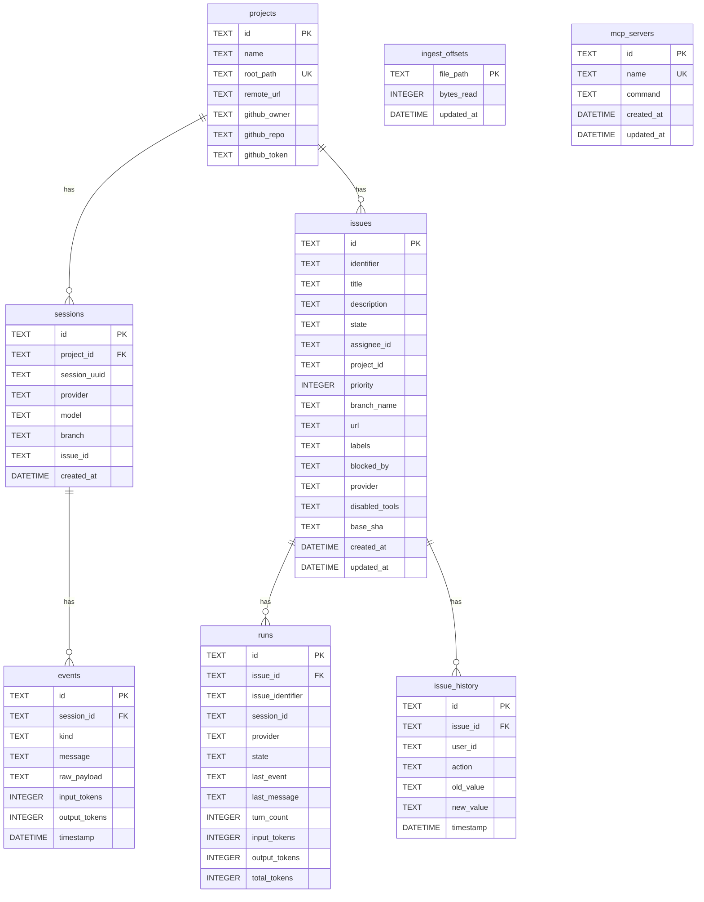

# 4.8 Database Layer

> **Source files:** `apps/backend/internal/db/db.go`, `apps/backend/internal/db/schema.go`, `apps/backend/internal/db/migrate.go`, `apps/backend/internal/db/projects.go`, `apps/backend/internal/db/mcp.go`, `apps/backend/internal/db/crypto.go`

The database layer provides SQLite persistence for Orchestra's runtime state, telemetry data, project management, and MCP server configuration. It uses the pure-Go `modernc.org/sqlite` driver with WAL journaling for concurrent read access.

### Connection Setup

```go
func Connect(dbPath string) (*DB, error)
```

The `Connect` function:
1. Creates the database directory if needed
2. Opens SQLite with `busy_timeout(5000)`, `journal_mode(WAL)`, `foreign_keys(1)`
3. Sets `MaxOpenConns(1)` and `MaxIdleConns(1)` (single-writer model)
4. Applies the base schema
5. Runs incremental migrations
6. Creates the `issue_history` table and index

The `DB` struct embeds `*sql.DB`, inheriting all standard database/sql methods.

### Schema



### Tables

| Table | Purpose |
|---|---|
| `projects` | Registered project directories with optional GitHub integration |
| `sessions` | Agent sessions linked to projects and providers |
| `events` | Individual agent events with token usage and timestamps |
| `issues` | Issue tracker data (for SQLite tracker backend) |
| `runs` | Active orchestrator run state (persisted for crash recovery) |
| `issue_history` | Audit log of issue state/priority/assignee changes |
| `ingest_offsets` | Telemetry watcher file read positions |
| `mcp_servers` | Registered MCP server configurations |

### Migrations

The `runMigrations` function applies incremental schema changes using `ALTER TABLE ADD COLUMN`:

| Table | Column | Type | Purpose |
|---|---|---|---|
| `issues` | `disabled_tools` | `TEXT` | Tool exclusion list |
| `issues` | `branch_name` | `TEXT` | Git branch |
| `issues` | `url` | `TEXT` | External URL |
| `issues` | `labels` | `TEXT` | JSON-encoded labels |
| `issues` | `blocked_by` | `TEXT` | JSON-encoded blockers |
| `issues` | `provider` | `TEXT` | Preferred agent provider |
| `issues` | `updated_at` | `DATETIME` | Last update timestamp |
| `issues` | `base_sha` | `TEXT` | Base git commit SHA |
| `runs` | `provider` | `TEXT` | Agent provider |
| `runs` | `issue_identifier` | `TEXT` | Human-readable identifier |
| `sessions` | `issue_id` | `TEXT` | Linked issue |
| `sessions` | `model` | `TEXT` | Machine learning model used |

Each migration checks `PRAGMA table_info` before attempting the `ALTER TABLE`, making migrations idempotent and safe to re-run.

### Project Management

#### UpsertProject

Creates or updates a project with a deterministic ID based on the SHA-256 hash of the canonical path:

```
id = hex(sha256(filepath.Clean(filepath.EvalSymlinks(rootPath)))[:16])
```

On conflict, updates `name`, `remote_url`, `github_owner`, `github_repo`, and `github_token` only if the new value is non-empty and the existing value is the default.

#### Project Stats (Warehouse)

`GetProjectStats` aggregates per-project metrics:

| Metric | Query |
|---|---|
| `TotalSessions` | `COUNT(DISTINCT s.id)` |
| `TotalInput` | `SUM(e.input_tokens)` |
| `TotalOutput` | `SUM(e.output_tokens)` |
| `LastActive` | `MAX(s.created_at)` |

#### Global Stats

`GetGlobalStats` provides system-wide telemetry:
- Total token usage across all events
- Per-provider token breakdown
- Per-model token breakdown
- 50 most recent sessions

### Session Storage

| Method | Description |
|---|---|
| `RecordSession(ctx, id, projectID, issueID, uuid, provider, model, branch)` | Upserts a session, only overwriting `project_id`, `issue_id`, and `model` if previously empty |
| `UpdateSessionModel(ctx, sessionID, model)` | Sets model if previously unknown |
| `UpdateSessionProject(ctx, sessionID, projectID)` | Sets project if previously unknown |
| `GetSessions(ctx, projectID)` | Lists sessions with aggregated token counts and last event time |
| `GetSessionDetail(ctx, sessionID)` | Returns session with all events ordered by timestamp |

### Event Recording

```go
func (db *DB) RecordEvent(ctx, eventID, sessionID, kind, message string, rawPayload []byte, inputTokens, outputTokens int, timestampStr string) error
```

Safety measures:
- **Event type filtering**: `tool_result`, `stdout`, `stderr`, `file_content` events have their `rawPayload` dropped to prevent storage bloat.
- **Session cap**: Events are silently dropped if the session already has > 2,000 events.
- **Payload size cap**: Raw payloads > 512 KB are truncated with a `[TRUNCATED]` marker.
- **Deduplication**: Uses `ON CONFLICT(id) DO NOTHING` to prevent duplicate inserts.

### Event Pruning

```go
func (db *DB) PruneEvents(ctx, maxAgeDays int) (int64, error)
```

Deletes events older than the specified retention period. Called periodically based on `TelemetryRetentionDays` configuration.

### Unified History

`GetUnifiedHistory` returns a combined timeline for an issue, merging:
1. **Metadata changes** from `issue_history` (state transitions, priority changes, assignee changes)
2. **Agent events** from `events` (filtered to meaningful kinds, excluding noise like `pty`, `stderr`, `system`)

Results are ordered by timestamp ascending, limited to 500 entries, with messages truncated to 500 characters.

### MCP Server CRUD

| Method | Description |
|---|---|
| `ListMCPServers(ctx)` | Returns all registered servers ordered by name |
| `CreateMCPServer(ctx, name, command)` | Creates with a UUID, returns the record |
| `UpdateMCPServer(ctx, id, name, command)` | Updates name and command, sets `updated_at` |
| `DeleteMCPServer(ctx, id)` | Removes by ID |

### Token Encryption

The `crypto.go` module provides `EncryptToken` and `DecryptToken` for storing sensitive values (GitHub tokens) at rest. Project tokens are decrypted on read in `GetProjects` and `GetProjectByID`.

### Cascade Deletion

`DeleteProject` performs a careful transactional cascade:
1. Delete events for project sessions
2. Delete runs linked via project sessions
3. Delete project sessions
4. Delete runs linked to project issues
5. Delete issue history for project issues
6. Clear session.issue_id references
7. Delete project issues
8. Delete the project

Uses `PRAGMA defer_foreign_keys = ON` to avoid intermediate constraint violations during the cascade.
