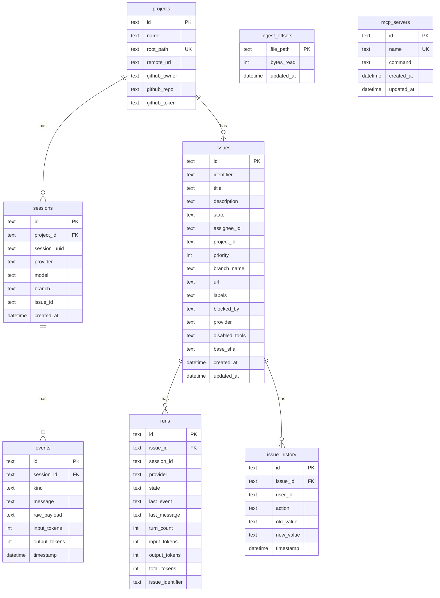
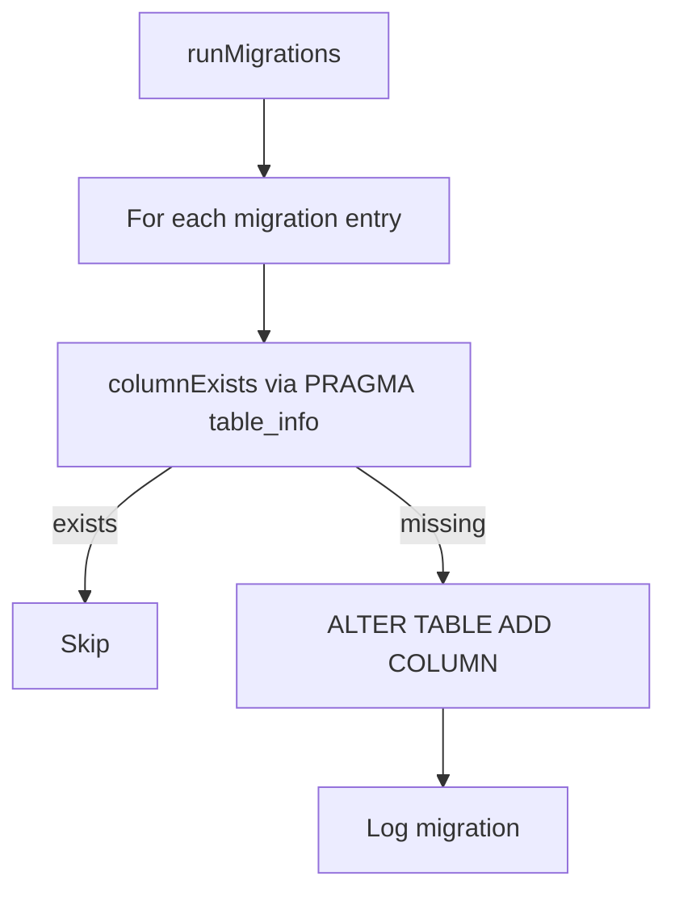
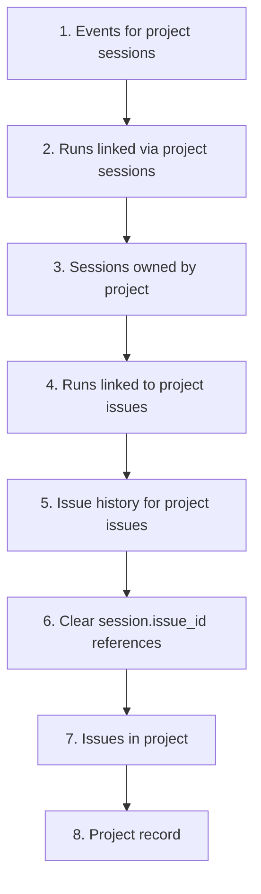

# 3.5 Database Layer

> **Source files:**
> - `apps/backend/internal/db/db.go`
> - `apps/backend/internal/db/schema.go`
> - `apps/backend/internal/db/migrate.go`
> - `apps/backend/internal/db/projects.go`
> - `apps/backend/internal/db/mcp.go`
> - `apps/backend/internal/db/crypto.go`

Orchestra uses a single SQLite database as its local persistence layer, storing projects, sessions, events, issues, runs, and MCP server configurations. The database is accessed through a thin `DB` wrapper around `database/sql` with WAL journaling and automatic schema migrations.

---

## Connection

`Connect(dbPath)` initializes the database:

1. Creates the parent directory if needed
2. Opens a SQLite connection with pragmas: `busy_timeout(5000)`, `journal_mode(WAL)`, `foreign_keys(1)`
3. Sets connection pool to 1 open / 1 idle connection (single-writer model)
4. Applies the base schema via `CREATE TABLE IF NOT EXISTS`
5. Runs additive column migrations
6. Ensures the `issue_history` table and index exist

```go
type DB struct {
    *sql.DB
}
```

The `DB` struct embeds `*sql.DB`, so all standard `database/sql` methods are available directly.

---

## Schema



### Table Descriptions

| Table | Purpose |
|-------|---------|
| `projects` | Registered project roots with optional GitHub integration |
| `sessions` | Agent sessions tied to a project and provider |
| `events` | Individual agent events (messages, tool calls, logs) within a session |
| `issues` | Tracked work items with workflow state |
| `runs` | Agent execution runs linked to issues |
| `ingest_offsets` | Telemetry watcher progress tracking per file |
| `mcp_servers` | Persisted MCP server configurations |
| `issue_history` | Audit trail of issue metadata changes |

### Indexes

| Index | Table | Column(s) |
|-------|-------|-----------|
| `idx_sessions_project_id` | sessions | `project_id` |
| `idx_events_session_id` | events | `session_id` |
| `idx_issues_identifier` | issues | `identifier` |
| `idx_runs_issue_id` | runs | `issue_id` |
| `idx_issue_history_issue_id` | issue_history | `issue_id` |

---

## Migration System

> **Source file:** `apps/backend/internal/db/migrate.go`

Migrations are additive column additions, applied via `ALTER TABLE ADD COLUMN` with existence checks using `PRAGMA table_info`. The system is designed to be idempotent -- running migrations multiple times is safe.

### Migration Registry

| Table | Column | Definition |
|-------|--------|------------|
| `issues` | `disabled_tools` | TEXT |
| `issues` | `branch_name` | TEXT |
| `issues` | `url` | TEXT |
| `issues` | `labels` | TEXT |
| `issues` | `blocked_by` | TEXT |
| `issues` | `provider` | TEXT |
| `issues` | `updated_at` | DATETIME DEFAULT CURRENT_TIMESTAMP |
| `issues` | `base_sha` | TEXT |
| `runs` | `provider` | TEXT |
| `runs` | `issue_identifier` | TEXT |
| `sessions` | `issue_id` | TEXT |
| `sessions` | `model` | TEXT |

### Migration Process



---

## Query Patterns

### Upsert Pattern

Projects and sessions use `INSERT ... ON CONFLICT DO UPDATE` for idempotent writes:

```sql
INSERT INTO projects (id, name, root_path, remote_url, ...)
VALUES (?, ?, ?, ?, ...)
ON CONFLICT(id) DO UPDATE SET
    name = CASE WHEN ... THEN excluded.name ELSE projects.name END,
    ...
```

The `CASE WHEN` guards prevent overwriting existing non-empty values with empty ones.

### Event Recording

Events use `ON CONFLICT(id) DO NOTHING` for deduplication. Additional safeguards:

| Guard | Behavior |
|-------|----------|
| Session event cap | Silently drops events after 2,000 per session |
| Payload size cap | Truncates raw payloads exceeding 512 KB |
| Noise filtering | Drops raw payloads for `tool_result`, `stdout`, `stderr`, `file_content` kinds |

### Project ID Generation

Project IDs are deterministic SHA-256 hashes of the canonicalized root path (first 16 bytes, hex-encoded). This ensures the same directory always produces the same project ID, preventing duplicates even across symlinks.

### Unified History

`GetUnifiedHistory(issueID)` combines two data sources into a single timeline:

1. **Metadata changes** from `issue_history` (state transitions, reassignments)
2. **Agent events** from `events` via `sessions` (messages, tool calls)

Results are ordered by timestamp ascending, limited to 500 entries, and filtered to exclude noisy event kinds (`pty`, `stderr`, `system`, `rate_limit_event`, `item.started`).

### Event Pruning

`PruneEvents(ctx, maxAgeDays)` deletes events older than the specified number of days using SQLite date arithmetic:

```sql
DELETE FROM events WHERE timestamp < date('now', '-' || ? || ' days')
```

---

## Cascade Deletion

Both `DeleteProject` and `DeleteIssue` (in the SQLite tracker client) use transactions to cascade deletions properly.

### DeleteProject Cascade Order



### DeleteIssue Cascade Order

1. Runs referencing the issue
2. Issue history entries
3. Clear `session.issue_id` references
4. Issue record

Both use `defer tx.Rollback()` with explicit `tx.Commit()` for safe transaction handling.

---

## Token Encryption

> **Source file:** `apps/backend/internal/db/crypto.go`

GitHub tokens stored in the `projects` table are encrypted at rest. The `DecryptToken` function is called transparently when reading project records via `GetProjects` and `GetProjectByID`.

---

## Statistics Queries

### Per-Project Stats (`GetProjectStats`)

Aggregates across sessions and events for a single project:

| Metric | Query |
|--------|-------|
| Total sessions | `COUNT(DISTINCT s.id)` |
| Total input tokens | `COALESCE(SUM(e.input_tokens), 0)` |
| Total output tokens | `COALESCE(SUM(e.output_tokens), 0)` |
| Last active | `MAX(s.created_at)` |

### Global Stats (`GetGlobalStats`)

System-wide metrics:

| Metric | Description |
|--------|-------------|
| Total tokens | Sum of all input + output tokens |
| Provider usage | Per-provider token breakdown |
| Model usage | Per-model token breakdown |
| Recent sessions | 50 most recent sessions |

---

## MCP Server Persistence

> **Source file:** `apps/backend/internal/db/mcp.go`

| Method | SQL Operation |
|--------|--------------|
| `ListMCPServers` | `SELECT ... ORDER BY name ASC` |
| `CreateMCPServer` | `INSERT` with UUID generation |
| `UpdateMCPServer` | `UPDATE ... SET updated_at = CURRENT_TIMESTAMP` |
| `DeleteMCPServer` | `DELETE ... WHERE id = ?` |

---

## Cross-References

- [3.6 Configuration & Environment](config.md) -- Database path derived from workspace root
- [3.7 MCP Server Integration](mcp.md) -- `mcp_servers` table for persistent server registration
- [3.8 Tool System](tools.md) -- SQLite tracker client implements `tracker.Client` interface
- [3.9 Telemetry & Log Watching](telemetry.md) -- `sessions`, `events`, and `ingest_offsets` tables
