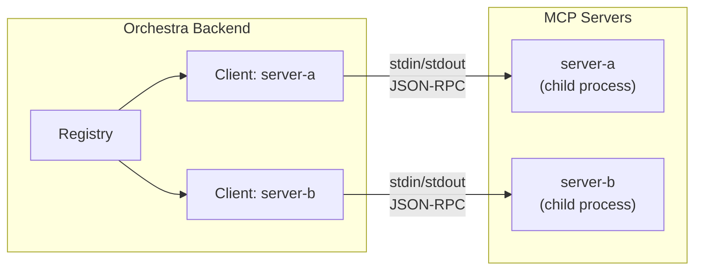
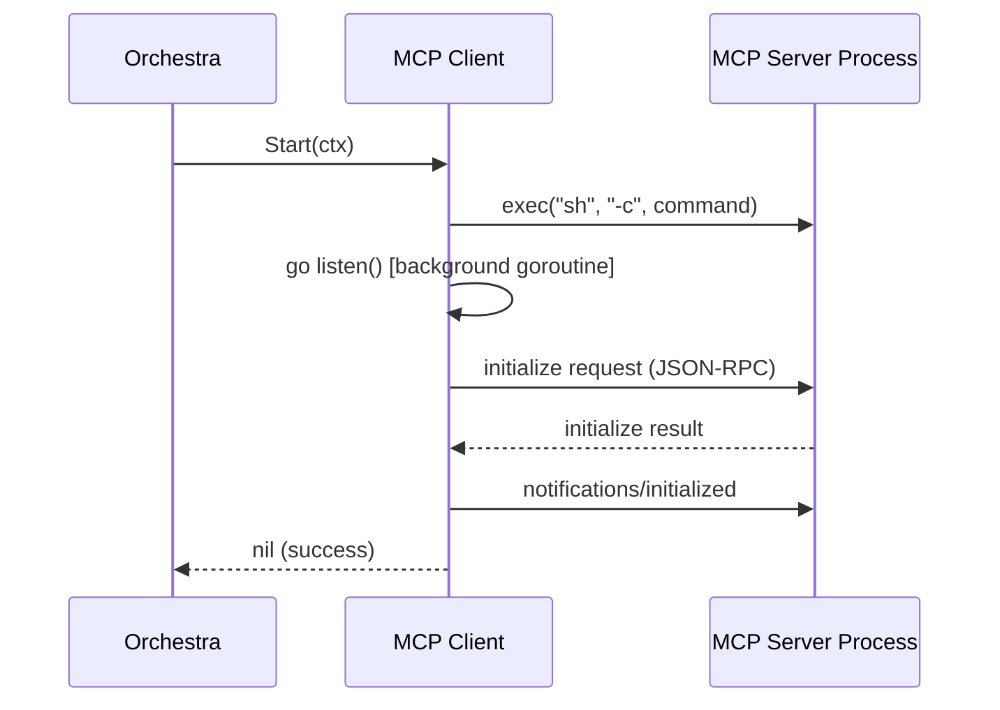

# 4.4 MCP Server Integration

> **Source files:**
> - `apps/backend/internal/mcp/client.go`
> - `apps/backend/internal/db/mcp.go`

Orchestra communicates with Model Context Protocol (MCP) servers using a JSON-RPC client that manages server processes over stdio. The `mcp` package provides both a single-server `Client` and a multi-server `Registry` that aggregates tools and resources across all registered servers.

---

## Architecture Overview



---

## MCPClient Struct

The `Client` struct manages a connection to a single MCP server process:

| Field | Type | Description |
|-------|------|-------------|
| `name` | `string` | Server identifier used for tool name prefixing |
| `command` | `string` | Shell command to launch the server |
| `cmd` | `*exec.Cmd` | Running process handle |
| `stdin` | `io.WriteCloser` | Pipe to server's stdin |
| `stdout` | `io.ReadCloser` | Pipe from server's stdout |
| `logger` | `zerolog.Logger` | Scoped logger with `mcp_server` field |
| `pending` | `map[string]chan json.RawMessage` | In-flight request channels keyed by request ID |
| `isStarted` | `bool` | Guard against double-start |

The `mu sync.Mutex` protects concurrent access to `pending` and `isStarted`.

---

## Lifecycle

### Startup



1. **Process launch:** The server command is executed via `sh -c <command>`, with stdin/stdout pipes established.
2. **Listener goroutine:** `listen()` starts scanning stdout line-by-line for JSON-RPC responses.
3. **Initialize handshake:** Sends an `initialize` request with protocol version `2024-11-05` and client info `orchestra/1.0.0`.
4. **Initialized notification:** Sends a one-way `notifications/initialized` notification to complete the handshake.

### Shutdown

`Close()` closes the stdin and stdout pipes, then waits for the child process to exit via `cmd.Wait()`. The method is guarded by the `isStarted` flag.

---

## JSON-RPC Communication

### Call (Request/Response)

`Call(ctx, method, params, result)` sends a JSON-RPC 2.0 request and blocks until a response arrives:

1. Generates a UUID request ID
2. Registers a response channel in the `pending` map
3. Marshals and writes the request as a newline-delimited JSON message
4. Waits for one of:
   - **Response received** -- unmarshals `result` field into the target
   - **Context cancelled** -- returns `ctx.Err()`
   - **Timeout (30 seconds)** -- returns a timeout error

### Notify (One-Way)

`Notify(method, params)` sends a JSON-RPC notification without an `id` field and does not wait for a response.

### Response Listener

The `listen()` goroutine runs a `bufio.Scanner` on stdout. For each line:

1. Attempts to unmarshal as a JSON-RPC response with `id`, `result`, and optional `error`
2. If the `id` matches a pending request, sends the `result` on the corresponding channel
3. Malformed lines are silently dropped

---

## Registry

The `Registry` manages a collection of named `Client` instances:

```go
type Registry struct {
    clients map[string]*Client
    logger  zerolog.Logger
}
```

### Construction

`NewRegistry(servers, logger)` takes a `map[string]string` of server names to shell commands and creates a `Client` for each.

### Aggregate Operations

| Method | Description |
|--------|-------------|
| `StartAll(ctx)` | Launches all registered MCP server processes; logs errors but does not abort |
| `ListTools(ctx)` | Queries `tools/list` on every server, prefixing each tool name with `servername_` to avoid collisions |
| `ListResources(ctx)` | Queries `resources/list` on every server, tagging each resource with its `server` name |
| `ReadResource(ctx, serverName, uri)` | Reads a specific resource from a named server via `resources/read` |
| `ExecuteTool(ctx, serverName, toolName, args)` | Invokes a tool on a specific server via `tools/call` |

### Tool Name Namespacing

When listing tools, each tool name is prefixed with the server name and an underscore:

```
server_name + "_" + original_tool_name
```

This prevents collisions when multiple MCP servers expose tools with the same name.

---

## Database Persistence

> **Source file:** `apps/backend/internal/db/mcp.go`

MCP server configurations are also persisted in the SQLite database for management via the API:

| Operation | Method | Description |
|-----------|--------|-------------|
| List | `ListMCPServers(ctx)` | Returns all servers ordered by name |
| Create | `CreateMCPServer(ctx, name, command)` | Inserts a new server with a UUID |
| Update | `UpdateMCPServer(ctx, id, name, command)` | Updates name and command by ID |
| Delete | `DeleteMCPServer(ctx, id)` | Removes a server by ID |

See [4.8 Database Layer](database.md) for the `mcp_servers` table schema.

---

## Error Handling

| Scenario | Behavior |
|----------|----------|
| Server process fails to start | `Start()` returns error; logged by Registry but does not block other servers |
| Initialize handshake fails | `Start()` returns wrapped error |
| Call timeout (30s) | Returns `"mcp call timeout: <method>"` |
| Context cancellation | Returns `ctx.Err()` |
| Malformed JSON response | Silently dropped by `listen()` |
| JSON-RPC error response | Currently passed through as raw result (noted as a known limitation in code) |

---

## Cross-References

- [4.3 Configuration & Environment](config.md) -- `ORCHESTRA_MCP_SERVERS` environment variable and `MCPServers` config field
- [4.5 Tool System](tools.md) -- Tool execution patterns that complement MCP tools
- [4.8 Database Layer](database.md) -- `mcp_servers` table for persistent server registration
