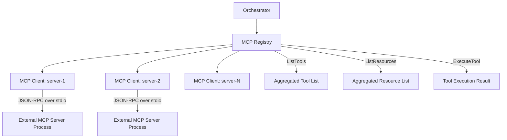
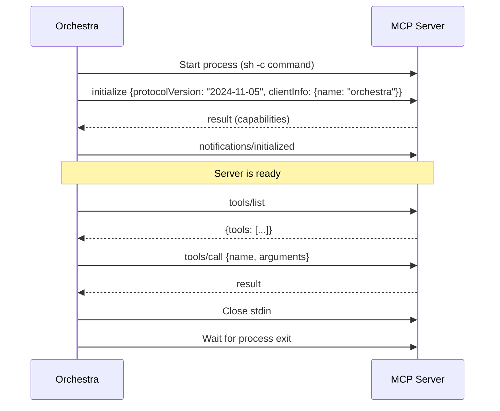

# 4.4 MCP Server Integration

> **Source files:** `apps/backend/internal/mcp/client.go`, `apps/backend/internal/db/mcp.go`

The MCP (Model Context Protocol) integration allows Orchestra to discover and interact with external tool servers that implement the MCP specification. MCP servers expose tools and resources that can be injected into agent sessions, extending agent capabilities without modifying the agent itself.

### Architecture



### MCP Client

The `Client` struct manages a single MCP server connection over JSON-RPC 2.0 via stdin/stdout:

| Field | Type | Description |
|---|---|---|
| `name` | `string` | Human-readable server name |
| `command` | `string` | Shell command to start the server |
| `cmd` | `*exec.Cmd` | Running process |
| `stdin` | `io.WriteCloser` | Write JSON-RPC requests |
| `stdout` | `io.ReadCloser` | Read JSON-RPC responses |
| `pending` | `map[string]chan json.RawMessage` | In-flight request channels keyed by UUID |
| `isStarted` | `bool` | Whether the server has been initialized |

### Server Lifecycle



### Client Methods

| Method | Description |
|---|---|
| `NewClient(name, command, logger)` | Creates an unstarted client |
| `Start(ctx)` | Spawns the server process, initializes the MCP protocol, starts the response listener goroutine |
| `Call(ctx, method, params, result)` | Sends a JSON-RPC request with a UUID `id`, waits for response (30s timeout) |
| `Notify(method, params)` | Sends a JSON-RPC notification (no `id`, no response expected) |
| `Close()` | Closes stdin/stdout and waits for process exit |

The `listen()` goroutine runs continuously, reading JSON lines from stdout. Each response is matched to its pending request channel by `id`. Unmatched responses (notifications from the server) are silently dropped.

### Registry

The `Registry` manages multiple MCP clients and provides aggregate operations:

```go
type Registry struct {
    clients map[string]*Client
    logger  zerolog.Logger
}
```

| Method | Description |
|---|---|
| `NewRegistry(servers, logger)` | Creates clients for each `name -> command` mapping |
| `StartAll(ctx)` | Starts all registered MCP servers (logs errors but continues) |
| `ListTools(ctx)` | Aggregates tools from all servers, prefixing names with `{server}_` to avoid collisions |
| `ListResources(ctx)` | Aggregates resources from all servers, tagging each with `server` field |
| `ReadResource(ctx, serverName, uri)` | Reads a specific resource from a named server |
| `ExecuteTool(ctx, serverName, toolName, args)` | Calls a tool on a specific server |

### Tool Name Namespacing

When listing tools, the registry prefixes each tool name with the server name to prevent collisions:

```
Server "linear" tool "create_issue" -> "linear_create_issue"
Server "github" tool "create_issue" -> "github_create_issue"
```

### Database Persistence

MCP server configurations are persisted in the `mcp_servers` SQLite table:

| Column | Type | Description |
|---|---|---|
| `id` | `TEXT PRIMARY KEY` | UUID |
| `name` | `TEXT UNIQUE NOT NULL` | Server name |
| `command` | `TEXT NOT NULL` | Shell command |
| `created_at` | `DATETIME` | Creation timestamp |
| `updated_at` | `DATETIME` | Last update timestamp |

CRUD operations are provided by `db.ListMCPServers`, `db.CreateMCPServer`, `db.UpdateMCPServer`, and `db.DeleteMCPServer`.

### Integration with Agents

MCP tools are injected into agent sessions through the `ToolSpecs` field on `TurnRequest`. During a refresh cycle, the orchestrator:

1. Calls `registry.ListTools(ctx)` to get all available MCP tools.
2. Merges them with built-in tool specs (e.g. tracker tools).
3. Passes the combined list to the agent runner, which writes them as `tools.json` in the workspace or injects them via the `dynamicTools` parameter (Codex app-server).

The MCP server status is included in the orchestrator's `Snapshot` under the `mcp_servers` field, showing each server's name and connection state.

### Configuration

MCP servers are configured via:

- **Environment variable**: `ORCHESTRA_MCP_SERVERS` with format `name1=command1,name2=command2`
- **Workflow file**: Under `mcp.servers` key
- **API**: Dynamic CRUD via the MCP server management endpoints (persisted to SQLite)
