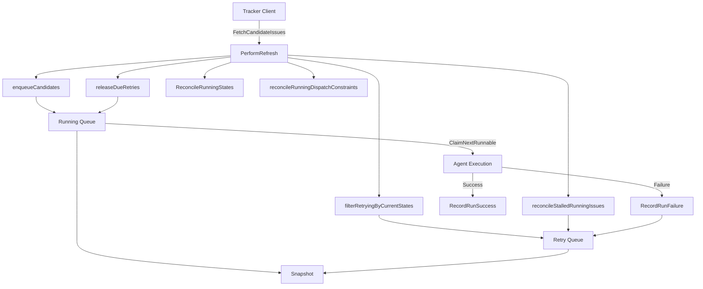
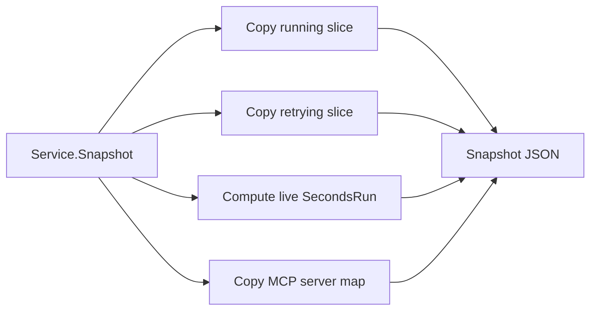
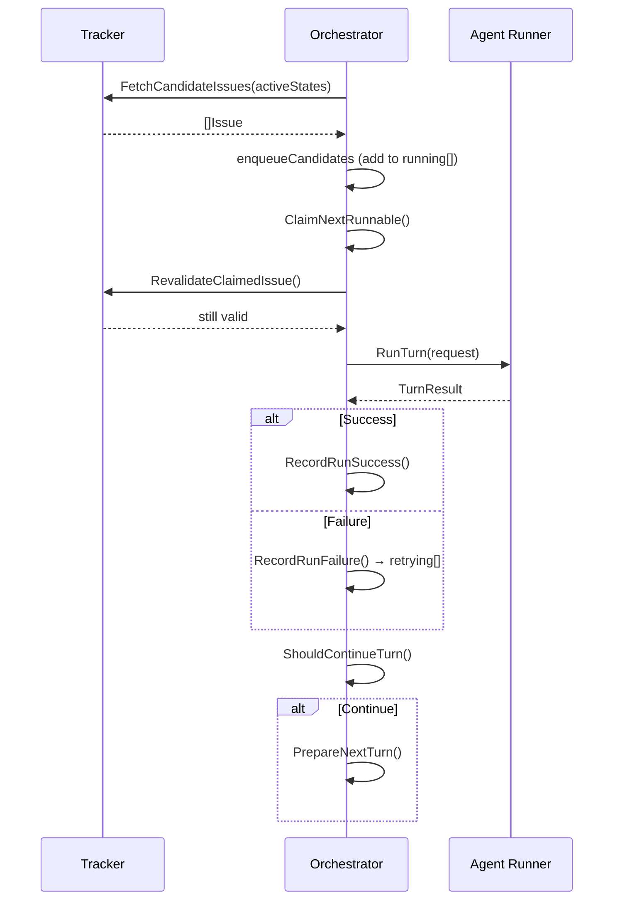

# 3.1 Orchestrator Service

> **Source files:** `apps/backend/internal/orchestrator/state.go`, `apps/backend/internal/orchestrator/reconcile.go`

The orchestrator is the core state machine of Orchestra. It manages the lifecycle of issue-to-agent dispatch: tracking which issues are running, which are retrying after failure, claiming work for execution, reconciling state changes from external trackers, and enforcing concurrency limits.

### Architecture Overview



### Service Struct

The `Service` struct holds all orchestrator state under a `sync.RWMutex` for safe concurrent access:

| Field | Type | Description |
|---|---|---|
| `running` | `[]RunningEntry` | Issues currently dispatched to agents |
| `retrying` | `[]RetryEntry` | Issues waiting for retry after failure |
| `codexTotals` | `CodexTotals` | Cumulative token usage and runtime |
| `rateLimits` | `any` | Last-seen rate limit data from agent events |
| `refreshPending` | `bool` | Coalescing flag for refresh requests |
| `trackerClient` | `tracker.Client` | Backend issue tracker |
| `agentRegistry` | `*agents.Registry` | Multi-agent runner registry |
| `agentCommands` | `map[string]string` | Provider-to-command mapping |
| `agentProvider` | `string` | Default provider (e.g. `CODEX`) |
| `activeStates` | `[]string` | States eligible for dispatch (default: `["in progress"]`) |
| `terminalStates` | `[]string` | States that end processing (default: `["done", "cancelled", ...]`) |
| `maxConcurrent` | `int` | Global concurrency cap (default: `4`) |
| `maxByState` | `map[string]int` | Per-state concurrency limits |
| `claimed` | `map[string]bool` | Issues currently claimed for execution |
| `cancels` | `map[string]context.CancelFunc` | Cancel functions for running sessions |
| `maxRetryAttempts` | `int64` | Max retries before abandoning (default: `5`) |
| `retryBaseDelay` | `time.Duration` | Base delay for exponential backoff (default: `5s`) |
| `retryMaxDelay` | `time.Duration` | Maximum retry delay cap (default: `10m`) |
| `stallTimeout` | `time.Duration` | Timeout for stalled claimed issues (default: `20m`) |
| `workspaceService` | `workspace.Service` | Workspace isolation layer |
| `db` | `*db.DB` | SQLite persistence |
| `mcpRegistry` | `*mcp.Registry` | MCP server registry |

### RunningEntry and RetryEntry

`RunningEntry` represents an issue actively dispatched to an agent:

| Field | Description |
|---|---|
| `IssueID` / `IssueIdentifier` | Tracker-level identifiers |
| `Title` / `Description` | Issue metadata |
| `State` | Current tracker state |
| `Provider` | Agent provider handling this issue |
| `SessionID` / `SessionLogPath` | Agent session tracking |
| `DisabledTools` | Tools excluded from this run |
| `TurnCount` | Number of turns executed |
| `LastEvent` / `LastMessage` | Most recent agent event |
| `StartedAt` / `LastEventAt` | Timestamps |
| `Tokens` | Input/output/total token usage |

`RetryEntry` represents an issue waiting for its next retry attempt:

| Field | Description |
|---|---|
| `IssueID` / `IssueIdentifier` | Tracker-level identifiers |
| `Provider` | Provider for retry (may cascade after 3 failures) |
| `Attempt` | Current retry attempt number |
| `DueAt` | RFC3339 timestamp when retry becomes eligible |
| `Error` | Error message from the failed run |

### Snapshot Generation

`Snapshot()` produces a thread-safe, point-in-time view of the orchestrator state. It copies the `running` and `retrying` slices, calculates live `SecondsRun` from currently active entries, and includes MCP server status. The snapshot is serialized to JSON for the API.



### Refresh Cycle and Reconciliation

The `PerformRefresh` method drives the main reconciliation loop:

1. **Stall detection** -- `reconcileStalledRunningIssues()` moves claimed issues with no event activity past `stallTimeout` into the retry queue.

2. **Candidate enqueue** -- `enqueueCandidates()` fetches issues in active states from the tracker and adds eligible ones to the running queue, respecting `maxConcurrent` and per-state limits. Issues must be `AssignedToWorker` and not blocked by non-terminal dependencies.

3. **Retry filtering** -- `filterRetryingByCurrentStates()` removes retrying issues that have moved to terminal states, been unassigned, or become blocked.

4. **Due retry release** -- `releaseDueRetries()` promotes retrying entries whose `DueAt` has passed back into the running queue.

5. **State reconciliation** -- `ReconcileRunningStates()` checks running issues against the tracker's current states, removing entries that have moved to terminal or non-active states.

6. **Dispatch constraint reconciliation** -- `reconcileRunningDispatchConstraints()` drops running entries for issues that are no longer assigned to the worker or are blocked by dependencies.

### State Reconciliation (reconcile.go)

```go
func (s *Service) ReconcileRunningStates(activeStates, terminalStates []string, refreshed map[string]string)
```

This method compares each running entry against freshly-fetched tracker states. If an issue has moved to a terminal or non-active state, it is removed from the running queue and its token totals are accumulated. State normalization is case-insensitive via `normalizeState()` (lowercase + trim).

### Claim System

The claim system prevents multiple goroutines from executing the same issue:

| Method | Description |
|---|---|
| `ClaimNextRunnable()` | Iterates running entries, returns the first unclaimed one and marks it claimed |
| `ReleaseClaim(issueID)` | Releases a claim without removing the entry |
| `RevalidateClaimedIssue(ctx, issueID)` | Re-checks the tracker to ensure the issue is still valid before execution |

`RevalidateClaimedIssue` performs a fresh fetch from the tracker to verify the issue is still in an active state, still assigned to the worker, and not blocked. If invalid, the issue is dropped from the running queue and the claim is released.

### Turn Execution Tracking

| Method | Description |
|---|---|
| `ShouldContinueTurn(ctx, issueID, provider, attempt, maxTurns)` | Checks whether another turn should be executed (respects `maxTurns` and issue state) |
| `PrepareNextTurn(issueID, provider, attempt)` | Updates the running entry's turn count and releases the claim for the next cycle |
| `RecordRunEvent(issueID, provider, event)` | Updates last event, message, timestamp, and token usage on the running entry |
| `RecordRunResult(issueID, provider, sessionID, usage...)` | Records final usage totals and releases the claim |
| `RecordRunArtifact(issueID, provider, sessionID, logPath)` | Records session log path |

### Exponential Backoff Retries

When a run fails, `RecordRunFailure` moves the issue from running to retrying with an exponential backoff delay:

```
delay = attempt^2 * retryBaseDelay     (capped at retryMaxDelay)
jitter = FNV32(issueID + minute) % 1000ms
dueAt = now + delay + jitter
```

**Provider cascading**: After 3 consecutive failures, the orchestrator rotates to the next available provider in the registry ring, giving alternative agents a chance to handle the issue.

If `attempt > maxRetryAttempts` (default: 5), the issue is permanently dropped.

### Issue Dispatch Flow



### Session Management

| Method | Description |
|---|---|
| `RegisterCancel(issueID, provider, cancel)` | Stores a context cancel function for a running session |
| `DeregisterCancel(issueID, provider)` | Removes the cancel function |
| `StopSession(issueID, provider)` | Cancels a specific session |
| `StopAllSessionsForIssue(issueID)` | Cancels and removes all sessions for an issue |

### Persistence

The orchestrator can persist and restore its running state to SQLite:

- `PersistStateToDB(ctx)` -- Writes all running entries to the `runs` table in a single transaction (DELETE + INSERT pattern).
- `RestoreStateFromDB(ctx)` -- On boot, restores running entries from the database if the in-memory state is empty.

### Issue CRUD

The orchestrator delegates issue operations to the tracker client:

- `CreateIssue` -- Creates an issue and records history events for audit.
- `UpdateIssue` -- Updates issue fields, logs state/priority/assignee changes to `issue_history`, and triggers a refresh.
- `DeleteIssue` -- Removes the issue from running/retrying/claimed state with rollback on tracker failure, then deletes from the tracker.

### Blocked Issue Detection

The `isBlockedTodoByNonTerminal` function prevents dispatch of issues in the `todo` state that have blockers in non-terminal states. This enforces dependency ordering without requiring the tracker to implement blocking logic.
