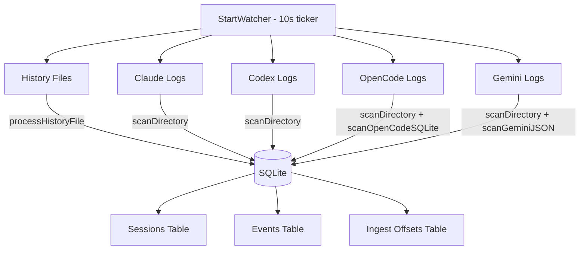
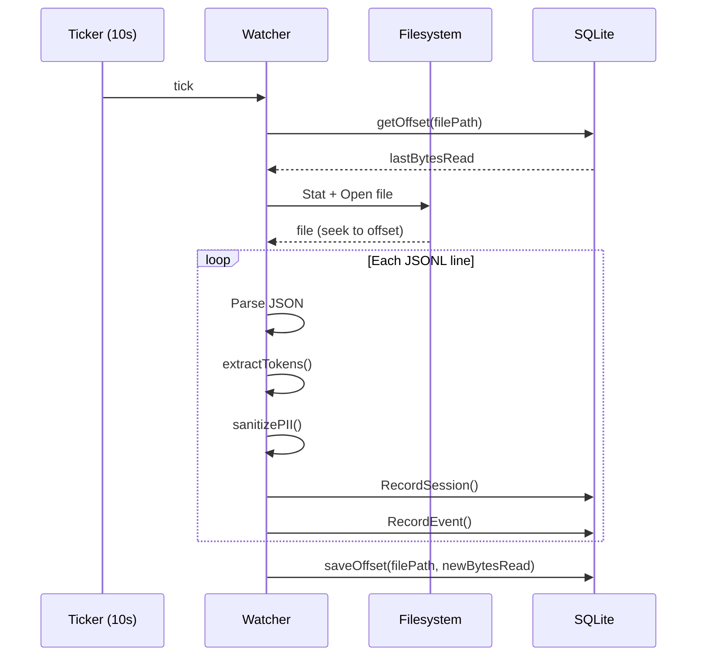

# 4.6 Telemetry & Log Watching

> **Source files:** `apps/backend/internal/telemetry/watcher.go`

The telemetry system watches external agent log directories on a 10-second polling interval, ingesting session events from Claude, Codex, Gemini, and OpenCode into Orchestra's SQLite database. It provides unified token usage tracking, session discovery, and health monitoring across all agent providers.

### Architecture

### Watcher Configuration

| Option | Type | Description |
|---|---|---|
| `Providers` | `[]string` | Which providers to watch (default: all four) |
| `StoreRawPayload` | `bool` | Whether to store raw JSON event payloads (default: `false`) |

The watcher is started via `StartWatcher(ctx, database, manualRoots, opts, logger)` and runs until the context is cancelled.

### Provider Log Sources

| Provider | Log Directories | Additional Sources |
|---|---|---|
| Claude | `~/.claude/projects/`, `~/.claude/logs/` | `~/.claude/history.jsonl` |
| Codex | `~/.codex/sessions/`, `~/.codex/log/` | `~/.codex/history.jsonl` |
| OpenCode | `~/.opencode/logs/`, `~/.opencode/sessions/` | `~/.local/share/opencode/opencode.db` (SQLite) |
| Gemini | `~/.gemini/logs/`, `~/.gemini/sessions/` | `~/.gemini/tmp/*/chats/session-*.json`, `~/.gemini/tmp/*/logs.json`, `~/.gemini/history.jsonl` |

### Ingestion Flow

### Offset Tracking

The `ingest_offsets` table tracks how many bytes have been read from each log file:

| Column | Type | Description |
|---|---|---|
| `file_path` | `TEXT PRIMARY KEY` | Absolute path to the log file |
| `bytes_read` | `INTEGER` | Last read position |
| `updated_at` | `DATETIME` | Last update time |

For JSON files (Gemini chat/logs), both `mtime` and `size` are tracked to detect changes.

If a file shrinks (e.g. rotation), the offset is reset to 0.

### Session Event Parsing

#### JSONL Files (Claude, Codex)

Each line is parsed as a `ClaudeLogEntry` with:
- `timestamp` -- Event time
- `type` -- Event kind (stripped of preamble prefixes like `shadow clone:`)
- `message` -- Content (PII-sanitized)
- `tokens.input` / `tokens.output` -- Token counts

Token extraction searches multiple nesting patterns:
1. `tokens.{input,output}` (old format)
2. `message.usage.{input_tokens,output_tokens}` (Claude)
3. `payload.info.last_token_usage.{input_tokens,output_tokens}` (Codex)

#### Model Extraction

Session model identification is provider-specific:
- **Claude**: `type == "assistant"` -> `message.model`
- **Codex**: `type == "turn_context"` -> `payload.model`
- **OpenCode**: `data.model.modelID`

#### Gemini JSON Chats

Gemini stores structured chat files at `~/.gemini/tmp/{project-hash}/chats/session-*.json`. Each file contains a `geminiChatFile` with:
- `sessionId`, `projectHash`, `startTime`, `lastUpdated`
- `messages[]` with `id`, `timestamp`, `type`, `content`, `tokens`

Project resolution uses `~/.gemini/projects.json` to map project hashes to filesystem paths.

#### OpenCode SQLite

OpenCode stores sessions in its own SQLite database at `~/.local/share/opencode/opencode.db`. The watcher reads:
- `message` table -- Messages with role, summary, tokens, model
- `part` table -- Message parts with type, text, tool references

Checkpoints use `rowid` tracking (`opencode:message:rowid`, `opencode:part:rowid`).

### History File Processing

History files (`history.jsonl`) map session IDs to project directories:
- Each line contains `sessionId`/`session_id` and `project` fields
- The watcher matches the `project` path against existing projects in the database
- Sessions are linked to projects via `UpdateSessionProject` -- projects are never auto-created

### PII Sanitization

All message content is passed through `sanitizePII()` before storage:

| Pattern | Replacement |
|---|---|
| Email addresses | `[REDACTED:{sha256_prefix}]` |
| IP addresses | `[REDACTED:{sha256_prefix}]` |
| API keys/secrets/passwords/tokens (16+ chars) | Key name + `[REDACTED:{sha256_prefix}]` |

The SHA-256 hash prefix (8 bytes, hex-encoded) allows correlation without exposing the original value.

### Project Resolution

The `deriveProjectFromPath` function reconstructs filesystem paths from Claude's encoded path segments (e.g. `-home-user-Development-project` -> `/home/user/Development/project`).

The `greedyResolvePath` algorithm:
1. Splits the encoded segment on `-`
2. Greedily tries the longest filesystem match at each level
3. Handles double-dashes (`--`) as `. ` separators (e.g. `1--Personal` -> `1. Personal`)
4. Verifies each candidate exists on disk before accepting

The watcher **never creates projects** -- it only matches against existing projects in the database. Users add projects explicitly via the API.

### Health Monitoring

The `telemetryHealthState` tracks per-provider metrics:

| Metric | Description |
|---|---|
| `LastSuccessAt` | Timestamp of last successful scan |
| `SourcesScanned` | Number of directories/files scanned |
| `EventsWritten` | Total events ingested |
| `EventsDropped` | Events skipped (e.g. duplicates) |
| `ParseErrors` | JSON parse failures |
| `LastScanDurationMs` | Duration of last scan cycle |

The `Health()` function returns a `HealthSnapshot` with the last tick time and per-provider health data.

### Preamble Stripping

Event types are cleaned of preamble prefixes using `stripPreamble`:
- Patterns like `shadow clone:` or `blackops session:` are removed from event type strings
- This normalizes event kinds across different agent configurations
