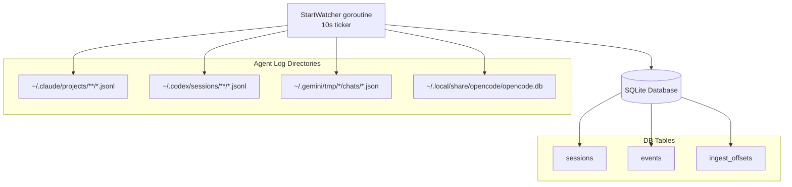
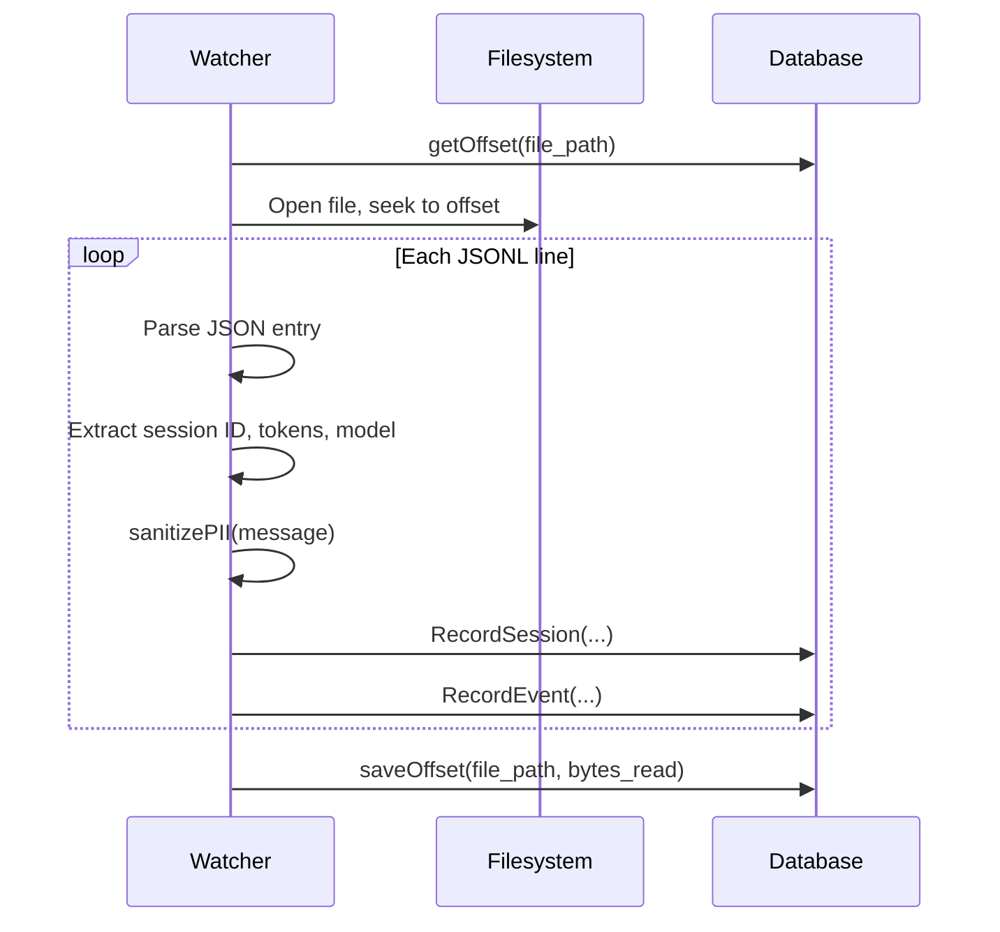

# 3.9 Telemetry & Log Watching

> **Source files:**
> - `apps/backend/internal/telemetry/watcher.go`

The telemetry package provides a file watcher that continuously ingests session logs from external agent providers (Claude, Codex, Gemini, OpenCode) and records events and sessions into the local SQLite database. It runs as a background goroutine on a 10-second polling interval, tracking file offsets for incremental processing.

---

## Architecture



---

## StartWatcher

`StartWatcher(ctx, database, manualRoots, opts, logger)` launches the background watcher loop. It accepts:

| Parameter | Type | Description |
|-----------|------|-------------|
| `ctx` | `context.Context` | Cancellation context for graceful shutdown |
| `database` | `*db.DB` | SQLite database handle for recording sessions/events |
| `manualRoots` | `[]string` | Additional project root directories for project matching |
| `opts` | `Options` | Watcher configuration (providers, raw payload storage) |
| `logger` | `zerolog.Logger` | Structured logger |

### Options

| Field | Type | Default | Description |
|-------|------|---------|-------------|
| `Providers` | `[]string` | `[claude, codex, gemini, opencode]` | Which providers to scan |
| `StoreRawPayload` | `bool` | `false` | Whether to persist raw JSON payloads in event records |

---

## Provider Scan Paths

Each tick of the watcher scans the following directories per provider:

| Provider | Scan Targets |
|----------|-------------|
| **Claude** | `~/.claude/history.jsonl` (session-project linking), `~/.claude/projects/` and `~/.claude/logs/` (JSONL event files) |
| **Codex** | `~/.codex/history.jsonl`, `~/.codex/sessions/` and `~/.codex/log/` |
| **Gemini** | `~/.gemini/history.jsonl`, `~/.gemini/logs/`, `~/.gemini/sessions/`, `~/.gemini/tmp/*/chats/session-*.json` and `~/.gemini/tmp/*/logs.json` |
| **OpenCode** | `~/.opencode/logs/`, `~/.opencode/sessions/`, `~/.local/share/opencode/opencode.db` (SQLite) |

---

## Processing Pipeline

### JSONL Files (Claude, Codex)



### Gemini JSON Chat Files

Gemini stores structured chat files as full JSON documents (not JSONL). The watcher:

1. Checks file modification time and size against stored checkpoints
2. Parses the entire `geminiChatFile` structure with messages array
3. Resolves project association via `projects.json` alias map
4. Generates deterministic event IDs using SHA-256 hashes

### OpenCode SQLite

For OpenCode, the watcher reads directly from the external `opencode.db` SQLite database:

1. Opens the database in read-only mode
2. Queries `message` and `part` tables using rowid checkpoints
3. Extracts model info from the message payload's `model.modelID` field
4. Records events and updates checkpoints

---

## Offset Tracking

The watcher uses the `ingest_offsets` table to track processing progress:

| Column | Type | Description |
|--------|------|-------------|
| `file_path` | TEXT (PK) | Absolute path or checkpoint key |
| `bytes_read` | INTEGER | Byte offset (for JSONL) or rowid (for SQLite), or mtime/size (for JSON) |
| `updated_at` | DATETIME | Last update timestamp |

For JSONL files, the offset is a byte position. For OpenCode SQLite, it tracks rowids. For Gemini JSON files, separate keys track `<path>:mtime` and `<path>:size`.

If a file shrinks (truncation detected), the offset resets to 0.

---

## PII Sanitization

All event messages pass through `sanitizePII()` before storage. The function redacts:

| Pattern | Regex | Replacement |
|---------|-------|-------------|
| Email addresses | Standard email pattern | `[REDACTED:<hash>]` |
| IP addresses | IPv4 dotted-quad pattern | `[REDACTED:<hash>]` |
| API keys/secrets | Key names followed by long alphanumeric values | Key name preserved, value replaced with `[REDACTED:<hash>]` |

Redaction uses truncated SHA-256 hashes (first 8 bytes, hex-encoded) for deterministic anonymization.

---

## Token Extraction

The watcher extracts input/output token counts from multiple provider formats:

| Provider | Location in JSON |
|----------|-----------------|
| Claude (old) | `tokens.input`, `tokens.output` |
| Claude (new) | `message.usage.input_tokens`, `message.usage.output_tokens` |
| Codex | `payload.info.last_token_usage.input_tokens` / `output_tokens` |
| OpenCode | `tokens.input`, `tokens.output` |
| Gemini | `messages[].tokens.input`, `messages[].tokens.output` |

---

## Model Extraction

Session model identifiers are extracted from provider-specific log formats:

| Provider | Condition | Path |
|----------|-----------|------|
| Claude | `type == "assistant"` | `message.model` |
| Codex | `type == "turn_context"` | `payload.model` |
| OpenCode | *(any message)* | `model.modelID` |

---

## Project Resolution

The watcher matches log files to existing projects but never creates new projects automatically. Resolution follows this order:

1. **Direct path match** -- Check if the log file path falls under a known project root
2. **Derived path** -- For Claude, decode the dash-encoded project path from the log directory structure (e.g. `-home-user-myproject` becomes `/home/user/myproject`) using a greedy filesystem resolution algorithm
3. **History files** -- Parse `history.jsonl` to link session IDs to project directories
4. **Gemini aliases** -- Use `~/.gemini/projects.json` to map project hashes to filesystem paths

### Claude Path Decoding

Claude encodes project directories as dash-separated path segments in its log directory structure:

```
~/.claude/projects/-home-user-Development-myproject/session.jsonl
```

The `greedyResolvePath` algorithm reconstructs the real filesystem path by greedily consuming dash-separated segments, checking the filesystem at each level to find the longest valid directory match. It handles edge cases like directory names containing dashes (`symphony-main`) and dots (`1. Personal`).

---

## Health Monitoring

The `HealthSnapshot` provides real-time observability into the watcher:

| Metric | Description |
|--------|-------------|
| `last_tick_at` | Timestamp of the most recent scan cycle |
| `sources_scanned` | Number of directories/files checked per provider |
| `events_written` | Total events recorded per provider |
| `events_dropped` | Events skipped (e.g. due to session cap) |
| `parse_errors` | JSON parse failures per provider |
| `last_scan_duration_ms` | Duration of the most recent scan per provider |

Access the health snapshot via `telemetry.Health()`.

---

## Cross-References

- [3.6 Configuration & Environment](config.md) -- `ORCHESTRA_TELEMETRY_PROVIDERS`, `ORCHESTRA_TELEMETRY_RETENTION_DAYS`, `ORCHESTRA_TELEMETRY_STORE_RAW_PAYLOAD`
- [3.5 Database Layer](database.md) -- `sessions`, `events`, and `ingest_offsets` table schemas
- [3.8 Tool System](tools.md) -- Sessions can be linked to issues tracked by the tool system
