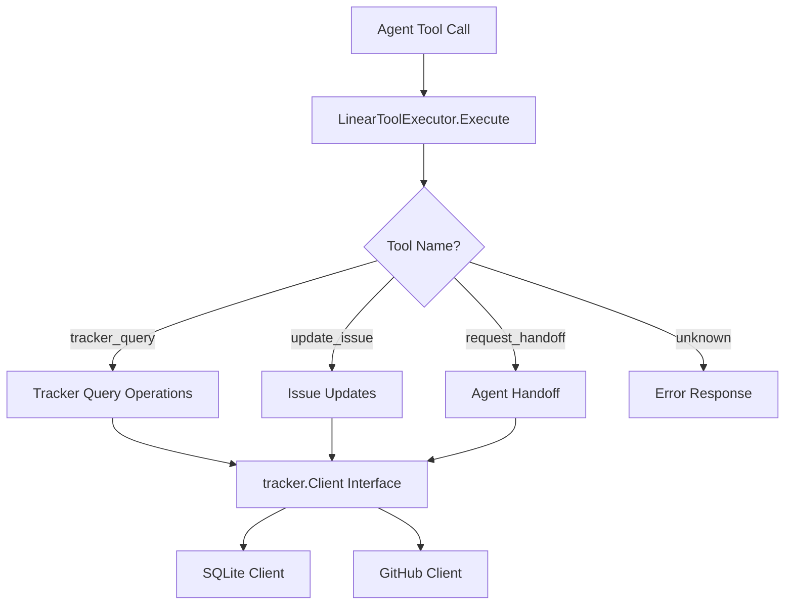

# 3.8 Tool System

> **Source files:**
> - `apps/backend/internal/tools/linear_executor.go`
> - `apps/backend/internal/tracker/types.go`
> - `apps/backend/internal/tracker/sqlite/client.go`
> - `apps/backend/internal/tracker/github/client.go`

The tool system bridges agent tool calls to tracker operations, providing agents with the ability to query issues, update issue state, and request handoffs to other agent providers. Tools are defined as MCP-compatible specifications and executed through the `LinearToolExecutor`, which is injected into the execution worker during backend startup.

---

## Architecture



---

## LinearToolExecutor

The `LinearToolExecutor` is the current tool dispatcher. It wraps a `tracker.Client` and routes tool calls by name.

```go
type LinearToolExecutor struct {
    tracker tracker.Client
}
```

### Construction

```go
executor := tools.NewLinearToolExecutor(trackerClient)
```

### Execution Pattern

`Execute(tool, arguments)` follows a consistent pattern:

1. **Validate** the tool name (empty name returns error)
2. **Check** that the tracker client is available (returns `"tracker unavailable"` if nil)
3. **Dispatch** to the appropriate handler based on tool name
4. **Return** a response map with `success` (bool) and `contentItems` (array of text items)

The current runtime exposes three tracker-backed tools:

- `tracker_query`
- `update_issue`
- `request_handoff`

---

## Tool Specifications

`TrackerToolSpecs()` returns MCP-compatible tool definitions. These are injected into agent system prompts so agents know which tools are available.

### tracker_query

Queries issue tracker state for dispatch and refresh operations.

| Parameter | Type | Required | Description |
|-----------|------|----------|-------------|
| `mode` | string | No | Query mode: `issue_states_by_ids`, `issues_by_ids`, `issues_by_states`, or default (candidates) |
| `issue_ids` | string[] | No | Issue IDs to query (for `issue_states_by_ids` and `issues_by_ids` modes) |
| `states` | string[] | No | States to filter by (for `issues_by_states` mode) |
| `active_states` | string[] | No | Active states for candidate query (default mode) |
| `query` | string | No | Reserved query text field. The current implementation does not use it directly |

#### Query Modes

| Mode | Method Called | Description |
|------|-------------|-------------|
| `issue_states_by_ids` | `FetchIssueStatesByIDs` | Returns a map of issue ID to current state |
| `issues_by_ids` | `FetchIssuesByIDs` | Returns full issue objects by ID |
| `issues_by_states` | `FetchIssuesByStates` | Returns issues filtered by state |
| *(default)* | `FetchCandidateIssues` | Returns issues in active states, ready for dispatch |

### update_issue

Updates an issue's state, priority, or assignee.

| Parameter | Type | Required | Description |
|-----------|------|----------|-------------|
| `identifier` | string | Yes | Issue identifier (e.g. `OPS-123`) |
| `state` | string | No | New state (e.g. `In Progress`, `Done`) |
| `assignee_id` | string | No | Agent or user ID to assign (e.g. `agent-claude`) |
| `priority` | integer | No | Priority level (0-4) |

### request_handoff

Requests transfer of the current task to another agent provider.

| Parameter | Type | Required | Description |
|-----------|------|----------|-------------|
| `provider` | string | Yes | Target agent provider (e.g. `claude`, `gemini`, `codex`) |
| `reason` | string | Yes | Explanation for the handoff |
| `identifier` | string | Yes | Issue identifier for the handoff |

The handoff sets `assignee_id` to `agent-<provider>` on the issue. The orchestrator picks up the reassignment on the next turn cycle.

---

## Response Format

All tool responses follow a consistent structure:

```json
{
  "success": true,
  "contentItems": [
    {
      "type": "inputText",
      "text": "{ ... JSON payload ... }"
    }
  ]
}
```

The payload within `contentItems[0].text` is a pretty-printed JSON string containing the operation result or error details.

---

## Tracker Backends

The `tracker.Client` interface defines the contract for issue tracking operations. Orchestra currently ships with three implementations:

### SQLite Client

> **Source file:** `apps/backend/internal/tracker/sqlite/client.go`

The default local tracker that persists issues in the Orchestra SQLite database. Features:

- Auto-generated identifiers based on project prefix (e.g. `FETCH-1`, `OPS-42`)
- Column whitelist for updates to prevent SQL injection
- Worker assignment detection via `workerAssigneeIDs` set
- Transactional deletion that cascades to runs, history, and session references
- LIKE-based text search across titles, identifiers, and IDs

### Memory Client

> **Source file:** `apps/backend/internal/tracker/memory/client.go`

An in-memory tracker used for tests and fallback scenarios. It keeps issue state in process memory only and does not persist across restarts.

### GitHub Client

> **Source file:** `apps/backend/internal/tracker/github/client.go`

A GitHub Issues-backed tracker that maps Orchestra operations to the GitHub REST API:

- Uses GitHub token authentication via `Authorization: token {token}`
- Maps internal states to GitHub `open`/`closed` states
- Uses `repo-number` format for identifiers (e.g. `orchestra-123`)
- `UpdateIssue` patches the GitHub issue and then re-fetches the canonical issue payload
- `DeleteIssue` closes the issue rather than deleting (GitHub does not support true deletion) and cleans up related local database rows when a local warehouse DB is attached
- `SearchIssues` and `CreateIssue` currently return explicit "not implemented" errors

---

## tracker.Client Interface

The `tracker.Client` interface defines the full contract for issue tracking backends:

| Method | Description |
|--------|-------------|
| `FetchCandidateIssues(ctx, activeStates)` | Returns issues in actionable states |
| `FetchIssuesByIDs(ctx, issueIDs)` | Returns issues matching given IDs |
| `FetchIssuesByStates(ctx, states)` | Returns issues filtered by state |
| `FetchIssueStatesByIDs(ctx, issueIDs)` | Returns ID-to-state map |
| `FetchIssues(ctx, filter)` | Returns issues matching filter criteria |
| `SearchIssues(ctx, query)` | Full-text search across issues |
| `FetchIssueByIdentifier(ctx, identifier)` | Returns a single issue by identifier or ID |
| `CreateIssue(ctx, ...)` | Creates a new issue |
| `UpdateIssue(ctx, identifier, updates)` | Applies field updates |
| `DeleteIssue(ctx, identifier)` | Removes an issue |

## Runtime Wiring

At startup, `app.Run()` creates the tool executor with:

```go
toolExecutor := tools.NewLinearToolExecutor(trackerClient)
```

That executor and `TrackerToolSpecs()` are then passed into the execution worker so agent turns can invoke tracker-backed tools while running.

---

## Issue Data Model

The `tracker.Issue` struct represents a work item across all backends:

| Field | Type | Description |
|-------|------|-------------|
| `ID` | string | Unique identifier (UUID or GitHub number) |
| `Identifier` | string | Human-readable identifier (e.g. `OPS-123`) |
| `Title` | string | Issue title |
| `Description` | string | Full description |
| `State` | string | Current workflow state |
| `Priority` | int | Priority level (0-4) |
| `AssigneeID` | string | Assigned agent or user |
| `AssignedToWorker` | bool | Whether assigned to a known worker agent |
| `ProjectID` | string | Associated project |
| `BranchName` | string | Git branch for this issue |
| `Labels` | []string | Applied labels |
| `BlockedBy` | []Blocker | Issues blocking this one |
| `Provider` | string | Agent provider preference |
| `DisabledTools` | []string | Tools disabled for this issue |
| `BaseSHA` | string | Git base commit SHA |
| `Feedback` | string | Review feedback persisted on the issue |
| `PRURL` | string | Linked pull request URL |
| `Plan` | string | Stored markdown plan shared across phases |

---

## Cross-References

- [3.6 Configuration & Environment](config.md) -- Tracker type and agent provider configuration
- [3.7 MCP Server Integration](mcp.md) -- MCP tool specs complement the tracker tools
- [3.4 Workspace Management](workspace.md) -- Workspaces are provisioned per-issue
- [3.5 Database Layer](database.md) -- SQLite schema for `issues`, `runs`, and `issue_history` tables
