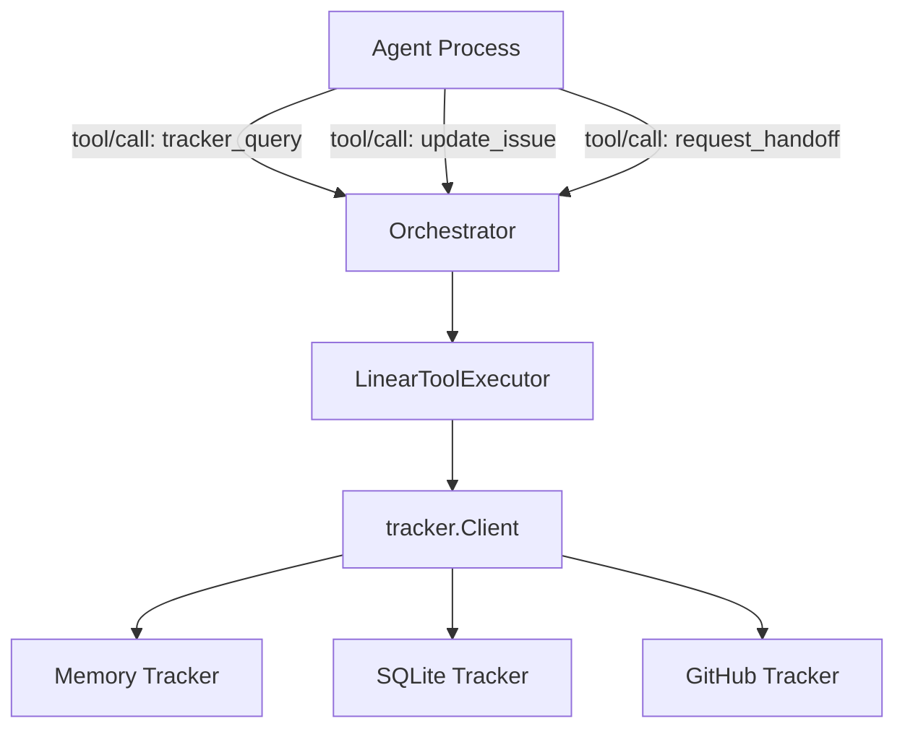
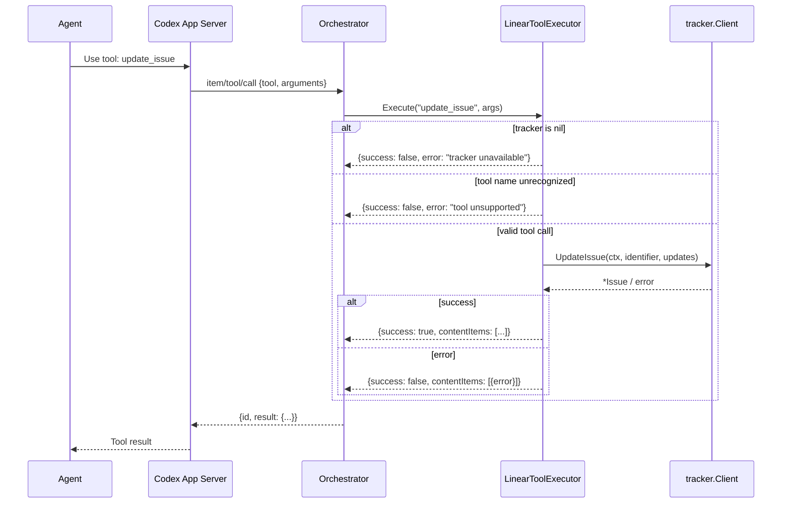

# 4.5 Tool System

> **Source files:** `apps/backend/internal/tools/linear_executor.go`, `apps/backend/internal/tools/linear_executor_test.go`

The tool system provides built-in tools that agents can invoke during execution. These tools are injected into agent sessions as MCP-compatible tool specifications and executed via the `ToolExecutor` callback pattern. The primary implementation is the `LinearToolExecutor`, which bridges agent tool calls to issue tracker operations.

## 4.5.1 Tool Executor Pattern

The tool system follows a dispatcher pattern: a single `Execute` method receives a tool name and argument map, switches on the name, delegates to the backing `tracker.Client`, and returns a standardized response envelope.

```go
type LinearToolExecutor struct {
    tracker tracker.Client
}

func (e *LinearToolExecutor) Execute(tool string, arguments map[string]any) map[string]any
```

Key design decisions:

- **Single dispatch point** -- All tool calls route through `Execute`, which normalizes the tool name, validates the tracker is available, and delegates to the appropriate handler via `switch`.
- **Stateless execution** -- The executor holds no mutable state; all persistence is delegated to the `tracker.Client`.
- **Fail-closed** -- If the tracker is `nil` or the tool name is unrecognized, the executor returns a failure response rather than silently succeeding.

### Response Envelope

All tool responses follow a consistent structure compatible with the Codex app-server protocol:

| Field | Type | Description |
|---|---|---|
| `success` | `bool` | Whether the tool call succeeded |
| `contentItems` | `[]map` | Array containing a single `inputText` item with JSON-encoded payload |

**Success example:**
```json
{
  "success": true,
  "contentItems": [{"type": "inputText", "text": "{\"issues\": [...]}"}]
}
```

**Failure example:**
```json
{
  "success": false,
  "contentItems": [{"type": "inputText", "text": "{\"error\": {\"message\": \"...\"}}"}]
}
```

The payload is JSON-encoded with indentation inside the `text` field. This format is designed for the Codex app-server's `item/tool/call` response protocol.

## 4.5.2 LinearExecutor for Linear Issue Tracking Integration

The `LinearToolExecutor` exposes three tools that allow agents to query and mutate issue tracker state. Despite its name (a historical artifact from early Linear API integration), it operates against the generic `tracker.Client` interface, supporting memory, SQLite, and GitHub backends.

### Construction

```go
executor := tools.NewLinearToolExecutor(trackerClient)
```

### Registered Tools

The `TrackerToolSpecs()` function returns MCP-compatible tool definitions injected into agent sessions:

#### tracker_query

Queries the issue tracker for dispatch candidates, issue states, or issue details.

| Parameter | Type | Description |
|---|---|---|
| `mode` | `string` | Query mode (see table below) |
| `issue_ids` | `[]string` | Issue IDs to look up |
| `states` | `[]string` | States to filter by |
| `active_states` | `[]string` | Active states for candidate lookup |
| `query` | `string` | Search query string |

**Query modes:**

| Mode | Description | Required Parameters |
|---|---|---|
| `issue_states_by_ids` | Returns a map of issue ID to current state | `issue_ids` |
| `issues_by_ids` | Returns full issue objects by ID | `issue_ids` |
| `issues_by_states` | Returns issues in specified states | `states` |
| _(default)_ | Fetches candidate issues for dispatch | `active_states` |

#### update_issue

Updates an issue's state, priority, or assignee. Allows agents to transition issues through the workflow.

| Parameter | Type | Required | Description |
|---|---|---|---|
| `identifier` | `string` | Yes | Issue identifier (e.g. `OPS-123`) |
| `state` | `string` | No | New state (e.g. `In Progress`, `In Review`, `Done`) |
| `assignee_id` | `string` | No | Agent or user to assign (e.g. `agent-claude`) |
| `priority` | `integer` | No | Priority level (0-4) |

#### request_handoff

Enables agent-initiated handoffs to a different provider. When an agent determines the task requires capabilities it lacks (e.g. larger context window, better reasoning), it can request reassignment.

| Parameter | Type | Required | Description |
|---|---|---|---|
| `provider` | `string` | Yes | Target provider (e.g. `claude`, `gemini`, `codex`) |
| `reason` | `string` | Yes | Explanation for the handoff |
| `identifier` | `string` | Yes | Issue identifier (e.g. `OPS-123`) |

The handoff is implemented by updating the issue's `assignee_id` to `agent-{provider}`. The orchestrator picks up the change on the next reconciliation cycle and dispatches to the new provider.

## 4.5.3 GitHub Tool Integration

The tool system integrates with GitHub Issues through the `tracker.Client` interface. When the tracker backend is configured as the GitHub client (`tracker/github`), all tool calls flow through the same `LinearToolExecutor` dispatch path. The GitHub tracker maps Orchestra states to GitHub's `open`/`closed` binary and uses the REST API v3 for mutations. See [Section 4.2: Issue Trackers](tracker.md) for GitHub client details.

## 4.5.4 Tool Registration and Invocation Flow

Tools are made available to agents through two mechanisms:

1. **Tool specs injection** -- `TrackerToolSpecs()` returns the tool definitions that are written to `tools.json` in the workspace or passed as `dynamicTools` to the Codex app-server.
2. **ToolExecutor callback** -- The `TurnRequest.ToolExecutor` field is set to `executor.Execute`, which the `CodexAppServerRunner` calls when it receives an `item/tool/call` message from the agent.

For non-Codex agents (Claude, Gemini, OpenCode), the tool specs are written as a JSON file in the workspace. The agent reads this file and can invoke tools through its own mechanism, though the callback-based execution is specific to the Codex app-server protocol.

### Architecture



### Execution Flow



### Helper Functions

| Function | Purpose |
|---|---|
| `successResponse(payload)` | Wraps payload in success envelope with `contentItems` |
| `failureResponse(payload)` | Wraps payload in failure envelope with `contentItems` |
| `encodePayload(payload)` | JSON-marshals payload with indentation |
| `toStringSlice(value)` | Converts `[]any` or `[]string` to `[]string`, trimming whitespace |
| `isObjectOrNil(value)` | Type-checks for `map[string]any` or `nil` |
