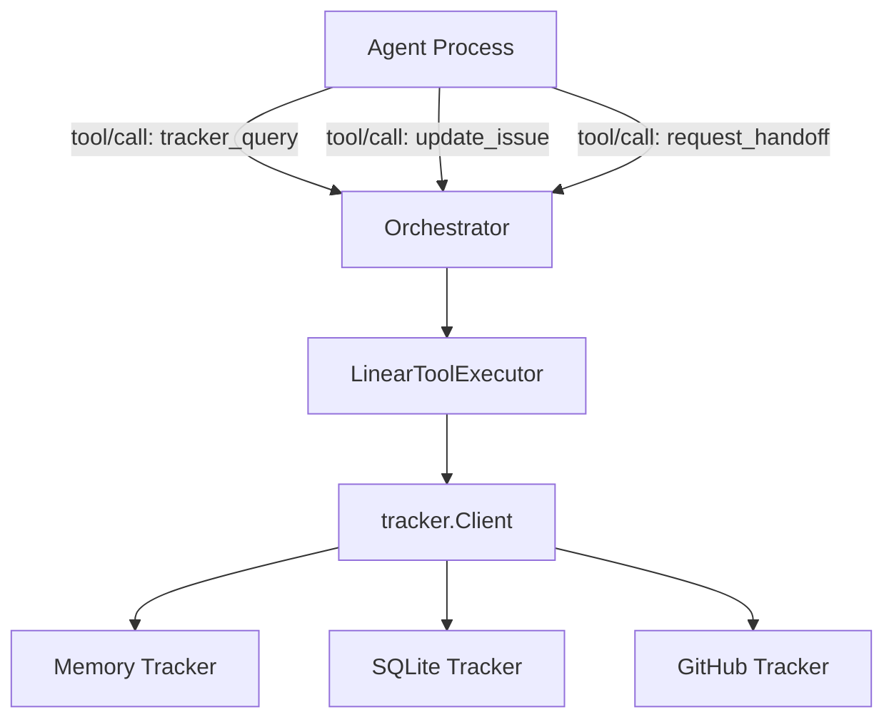
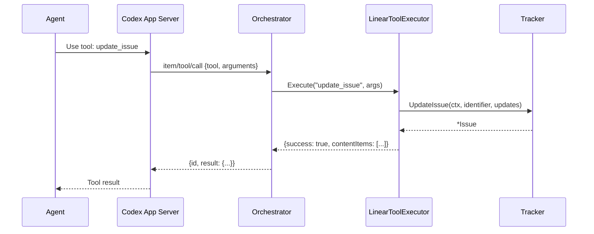

# 4.5 Tool System

> **Source files:** `apps/backend/internal/tools/linear_executor.go`

The tool system provides built-in tools that agents can invoke during execution. These tools are injected into agent sessions as dynamic tool specifications and executed via the `ToolExecutor` callback pattern. The primary implementation is the `LinearToolExecutor`, which exposes issue tracker operations to agents.

### Architecture



### Tool Specifications

The `TrackerToolSpecs()` function returns the tool definitions that are injected into agent sessions:

#### tracker_query

Queries the issue tracker for dispatch candidates, issue states, or issue details.

| Parameter | Type | Description |
|---|---|---|
| `mode` | `string` | Query mode (see below) |
| `issue_ids` | `[]string` | Issue IDs to look up |
| `states` | `[]string` | States to filter by |
| `active_states` | `[]string` | Active states for candidate lookup |
| `query` | `string` | Search query string |

**Query modes:**

| Mode | Description | Required Parameters |
|---|---|---|
| `issue_states_by_ids` | Returns a map of issue ID to current state | `issue_ids` |
| `issues_by_ids` | Returns full issue objects by ID | `issue_ids` |
| `issues_by_states` | Returns issues in specified states | `states` |
| (default) | Fetches candidate issues for dispatch | `active_states` |

#### update_issue

Updates an issue's state, priority, or assignee. Allows agents to transition issues through the workflow.

| Parameter | Type | Required | Description |
|---|---|---|---|
| `identifier` | `string` | Yes | Issue identifier (e.g. `OPS-123`) |
| `state` | `string` | No | New state (e.g. `In Progress`, `In Review`, `Done`) |
| `assignee_id` | `string` | No | Agent or user to assign (e.g. `agent-claude`) |
| `priority` | `integer` | No | Priority level (0-4) |

#### request_handoff

Enables agent-initiated handoffs to a different provider. When an agent determines the task requires capabilities it lacks (e.g. larger context window, better reasoning), it can request a handoff.

| Parameter | Type | Required | Description |
|---|---|---|---|
| `provider` | `string` | Yes | Target provider (e.g. `claude`, `gemini`, `codex`) |
| `reason` | `string` | Yes | Explanation for the handoff |
| `identifier` | `string` | Yes | Issue identifier |

The handoff is implemented by updating the issue's `assignee_id` to `agent-{provider}`. The orchestrator picks up the change on the next reconciliation cycle and dispatches to the new provider.

### LinearToolExecutor

```go
type LinearToolExecutor struct {
    tracker tracker.Client
}
```

The executor is created with `NewLinearToolExecutor(client)` and exposes a single method:

```go
func (e *LinearToolExecutor) Execute(tool string, arguments map[string]any) map[string]any
```

### Response Format

All tool responses follow a consistent structure compatible with the Codex app-server protocol:

**Success:**
```json
{
  "success": true,
  "contentItems": [{
    "type": "inputText",
    "text": "{\"issues\": [...]}"
  }]
}
```

**Failure:**
```json
{
  "success": false,
  "contentItems": [{
    "type": "inputText",
    "text": "{\"error\": {\"message\": \"...\"}}"
  }]
}
```

The payload is JSON-encoded with indentation inside the `text` field of a `contentItems` array. This format is designed for the Codex app-server's `item/tool/call` response protocol.

### Tool Execution Flow



### Integration with Agent Sessions

Tools are made available to agents through two mechanisms:

1. **Tool specs injection** -- `TrackerToolSpecs()` returns the tool definitions that are written to `tools.json` in the workspace or passed as `dynamicTools` to the Codex app-server.

2. **ToolExecutor callback** -- The `TurnRequest.ToolExecutor` field is set to `executor.Execute`, which the `CodexAppServerRunner` calls when it receives an `item/tool/call` message from the agent.

For non-Codex agents (Claude, Gemini, OpenCode), the tool specs are written as a JSON file in the workspace. The agent reads this file and can invoke tools through its own mechanism, though the callback-based execution is specific to the Codex app-server protocol.
