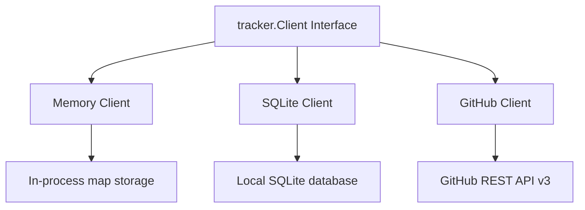
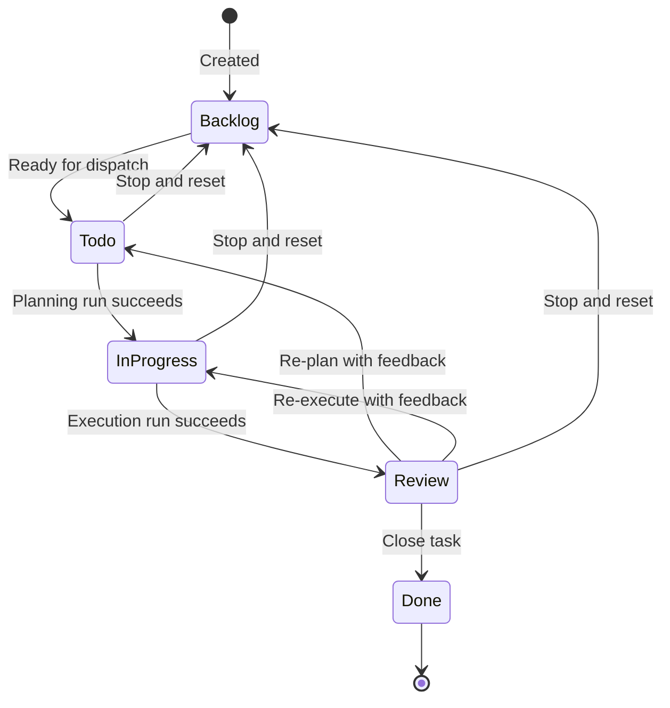

# 3.3 Issue Trackers

> **Source files:** `apps/backend/internal/tracker/types.go`, `apps/backend/internal/tracker/memory/client.go`, `apps/backend/internal/tracker/sqlite/client.go`, `apps/backend/internal/tracker/github/client.go`

The tracker package defines a pluggable issue tracking interface with three backend implementations: in-memory, SQLite, and GitHub Issues. The orchestrator interacts exclusively through the `tracker.Client` interface, allowing seamless switching between backends via configuration.

### Tracker Interface

```go
type Client interface {
    FetchCandidateIssues(ctx context.Context, activeStates []string) ([]Issue, error)
    FetchIssuesByIDs(ctx context.Context, issueIDs []string) ([]Issue, error)
    FetchIssuesByStates(ctx context.Context, states []string) ([]Issue, error)
    FetchIssueStatesByIDs(ctx context.Context, issueIDs []string) (map[string]string, error)
    FetchIssues(ctx context.Context, filter IssueFilter) ([]Issue, error)
    SearchIssues(ctx context.Context, query string) ([]Issue, error)
    FetchIssueByIdentifier(ctx context.Context, identifier string) (*Issue, error)
    CreateIssue(ctx context.Context, title, description, state string, priority int, assigneeID, projectID string, provider string, disabledTools []string) (*Issue, error)
    UpdateIssue(ctx context.Context, identifier string, updates map[string]any) (*Issue, error)
    DeleteIssue(ctx context.Context, identifier string) error
}
```

### Issue Struct

| Field | Type | Description |
|---|---|---|
| `ID` | `string` | Internal unique identifier |
| `Identifier` | `string` | Human-readable identifier (e.g. `OPS-123`) |
| `Title` | `string` | Issue title |
| `Description` | `string` | Detailed description |
| `Priority` | `int` | Priority level (0-4) |
| `State` | `string` | Current workflow state |
| `BranchName` | `string` | Associated git branch |
| `URL` | `string` | External URL |
| `ProjectID` | `string` | Associated project |
| `AssigneeID` | `string` | Assigned agent or user |
| `AssignedToWorker` | `bool` | Whether assigned to an Orchestra worker |
| `Labels` | `[]string` | Issue labels |
| `BlockedBy` | `[]Blocker` | Dependency blockers |
| `Provider` | `string` | Preferred agent provider |
| `DisabledTools` | `[]string` | Tools to exclude from runs |
| `BaseSHA` | `string` | Base git commit SHA |
| `Feedback` | `string` | Review feedback captured for re-plan or re-execute flows |
| `PRURL` | `string` | Linked GitHub pull request URL |
| `Plan` | `string` | Stored markdown plan used across planning and execution phases |
| `CreatedAt` / `UpdatedAt` | `string` | Timestamps |

### IssueFilter

| Field | Type | Description |
|---|---|---|
| `States` | `[]string` | Filter by state (case-insensitive) |
| `ProjectID` | `string` | Filter by project |
| `AssigneeID` | `string` | Filter by assignee |

### Implementation Comparison



| Feature | Memory | SQLite | GitHub |
|---|---|---|---|
| Persistence | None (in-process) | Local SQLite file | Remote GitHub |
| Identifier format | `OPS-{n}` | `{PREFIX}-{n}` (project-based) | `{repo}-{number}` |
| Worker assignment | Configurable assignee set | Configurable assignee set | Not implemented |
| Search | Title/description/identifier substring | SQL LIKE on title/identifier/id | Not implemented |
| Create/Update/Delete | Full support | Full support | Partial (delete closes the remote issue instead of deleting it) |
| Ordering | By identifier, then ID | By `created_at DESC` or `identifier ASC` | By GitHub API order |

### Memory Client

The in-memory client (`memory.NewClient`) stores issues in a `map[string]tracker.Issue` protected by `sync.RWMutex`. It supports an optional worker assignee ID set: if provided, only issues assigned to one of those IDs have `AssignedToWorker = true`. With no assignee set, all issues are considered assigned to the worker.

**State normalization**: All state comparisons use `strings.ToLower(strings.TrimSpace(state))`.

**Identifier generation**: New issues get sequential IDs (`1`, `2`, ...) with identifiers in `OPS-{id}` format.

### SQLite Client

The SQLite client (`sqlite.NewClient`) stores issues in the `issues` table of Orchestra's SQLite database. It uses the shared `db.DB` wrapper.

Key behaviors:
- **Identifier generation**: Uses the project name as a prefix (e.g. `FETCH-1`, `NUDGE-1`). Falls back to `OPS-{n}` if no project.
- **Worker assignment**: Same assignee set logic as memory client.
- **Update safety**: Uses a whitelist of allowed columns (`title`, `description`, `state`, `assignee_id`, `project_id`, `priority`, `branch_name`, `url`, `labels`, `blocked_by`, `provider`, `disabled_tools`, `base_sha`) to prevent SQL injection via dynamic column names.
- **Delete cascade**: Transactionally deletes related `runs`, `issue_history`, clears `session.issue_id` references, then deletes the issue.
- **Labels/BlockedBy**: Stored as JSON strings, deserialized on read.
- **DisabledTools**: Stored as comma-separated string, split on read.

### GitHub Client

The GitHub client (`github.NewClient`) interfaces with GitHub Issues via the REST API v3:

- **Authentication**: Bearer token via `Authorization: token {token}` header.
- **State mapping**: Maps Orchestra states to GitHub's `open`/`closed` binary. States like `done`, `closed`, `completed` map to GitHub `closed`.
- **Identifier format**: `{repo}-{number}` (e.g. `orchestra-42`).
- **Delete**: Implemented as closing the issue (GitHub does not support true deletion).
- **Limitations**: `SearchIssues` and `CreateIssue` currently return explicit "not implemented" errors. `FetchIssuesByIDs` makes individual API calls per issue.

### Issue Lifecycle



At the API layer, valid transitions are currently `Backlog -> Todo`, `Todo -> In Progress|Backlog`, `In Progress -> Review|Backlog`, and `Review -> Done|Todo|In Progress|Backlog`. Review-to-Todo and Review-to-In Progress require `feedback`. States are configurable via `ORCHESTRA_ACTIVE_STATES` and `ORCHESTRA_TERMINAL_STATES`. Default active states are `Todo` and `In Progress`. Default terminal states are `Done`, `Cancelled`, `Canceled`, `Closed`, and `Duplicate`.

### Query Filtering

The `FetchIssues` method supports filtering by:
- **States**: Case-insensitive match using normalized state sets
- **ProjectID**: Exact match
- **AssigneeID**: Exact match

All filters are combined with AND logic. Results are ordered by `identifier ASC` (memory) or `created_at DESC` (SQLite).
