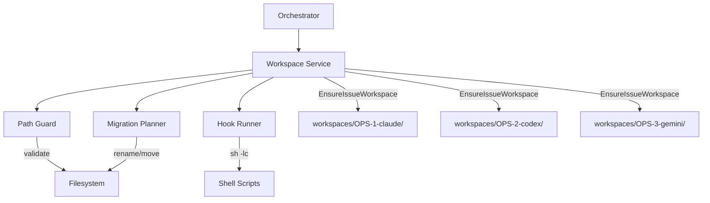
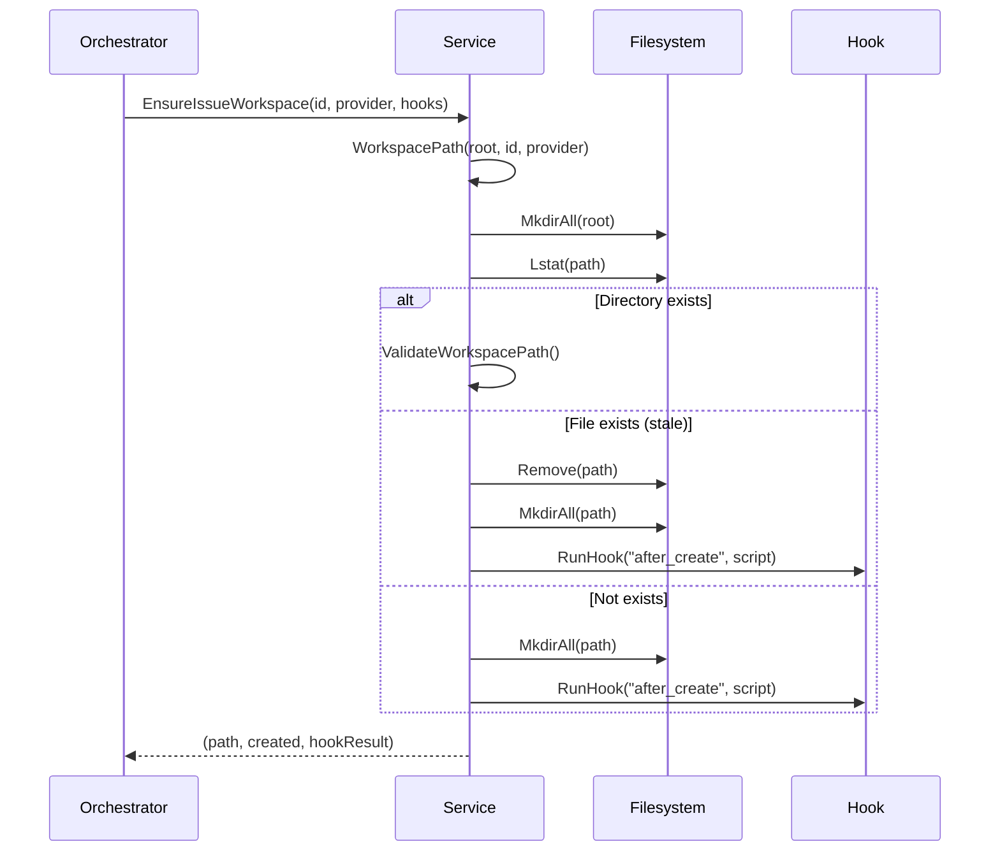
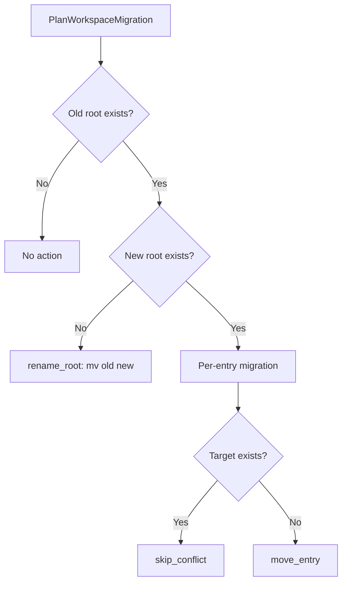

# 4.7 Workspace Management

> **Source files:** `apps/backend/internal/workspace/service.go`, `apps/backend/internal/workspace/path_guard.go`, `apps/backend/internal/workspace/hooks.go`, `apps/backend/internal/workspace/migration.go`

The workspace package provides isolated working directories for each issue-agent combination, with path traversal protection, lifecycle hooks, and migration support. Each dispatched issue gets its own workspace directory where the agent operates, preventing cross-issue interference.

### Architecture



### Service Struct

```go
type Service struct {
    Root        string        // Base directory for all workspaces
    HookTimeout time.Duration // Timeout for hook scripts (default: 60s)
}
```

### Workspace Path Convention

Workspace directories follow the pattern: `{Root}/{sanitized_identifier}-{provider}`

The `WorkspacePath` function:
1. Sanitizes the issue identifier -- replaces non-alphanumeric characters (except `.`, `_`, `-`) with underscores
2. Appends the lowercase provider name
3. Validates the result against path traversal

Example: issue `OPS-123` with provider `CLAUDE` -> `~/.orchestra/workspaces/OPS-123-claude/`

### Path Guard

The path guard prevents directory traversal attacks and symlink escapes:

#### WorkspacePath Validation

```go
func ValidateWorkspacePath(root string, candidate string) error
```

| Check | Error |
|---|---|
| Candidate equals root | `workspace equals root` |
| Candidate outside root | `workspace escapes root` |
| Symlink resolves outside root | `workspace symlink escape` |

The validation uses `filepath.Abs` and `filepath.Rel` for reliable path comparison. If the candidate path exists and is a symlink, it evaluates the symlink target and verifies it also falls within the root.

#### Project Path Validation

```go
func ValidateProjectPath(candidate string, allowedRoots []string) error
```

Project paths must be within one of the configured `allowedRoots`. If no roots are configured, any path under the user's home directory is allowed.

### Workspace Lifecycle



### Hooks

Lifecycle hooks execute shell scripts at key moments:

| Hook | When | Use Case |
|---|---|---|
| `AfterCreate` | After workspace directory is first created | Clone repo, initialize project |
| `BeforeRemove` | Before workspace deletion | Backup artifacts, clean up |
| `BeforeRun` | Before agent execution starts | Pull latest code, reset state |
| `AfterRun` | After agent execution completes | Commit changes, run tests |

```go
type Hooks struct {
    AfterCreate  string  // Shell script
    BeforeRemove string
    BeforeRun    string
    AfterRun     string
}
```

Hook execution:
- Runs via `sh -lc {script}` with `cwd` set to the workspace directory
- Has a configurable timeout (default: 60 seconds)
- Returns `HookResult{Output string}` with combined stdout/stderr
- `BeforeRemove` hook failure is logged as a warning but does not block removal
- Timeout produces a `workspace hook timeout` error

### Workspace Operations

| Method | Description |
|---|---|
| `EnsureIssueWorkspace(id, provider, hooks)` | Creates workspace if needed, runs AfterCreate hook. Returns path, created flag, hook result |
| `RemoveIssueWorkspaces(id, provider, hooks)` | Runs BeforeRemove hook then deletes workspace directory |
| `RunBeforeRunHook(path, hooks)` | Executes BeforeRun hook in the workspace |
| `RunAfterRunHook(path, hooks)` | Executes AfterRun hook in the workspace |
| `ListArtifacts(id, provider)` | Walks workspace directory, returns relative file paths (excludes `.git/` and `.orchestra`) |
| `GetArtifactContent(id, provider, relPath)` | Reads a specific file with path traversal validation |
| `GetDiff(id, provider)` | Runs `git diff HEAD` in the workspace to get uncommitted changes |

### Migration Support

The migration system handles workspace root relocations:



#### MigrationAction Types

| Type | Description |
|---|---|
| `rename_root` | Simple rename of entire old root to new root |
| `move_entry` | Move individual workspace directory to new root |
| `skip_conflict` | Target already exists, skip this entry |

#### Migration Functions

| Function | Description |
|---|---|
| `PlanWorkspaceMigration(old, new)` | Generates a migration plan without executing |
| `ExecuteWorkspaceMigration(old, new, dryRun)` | Plans and optionally executes the migration |

The `dryRun` flag allows previewing changes before applying them. The `MigrationResult` reports whether the migration was applied and lists all planned actions.

### Marker File

`MarkerPath(path)` returns `{path}/.orchestra`, used as a marker file to identify Orchestra-managed workspace directories. This file is excluded from artifact listings.
