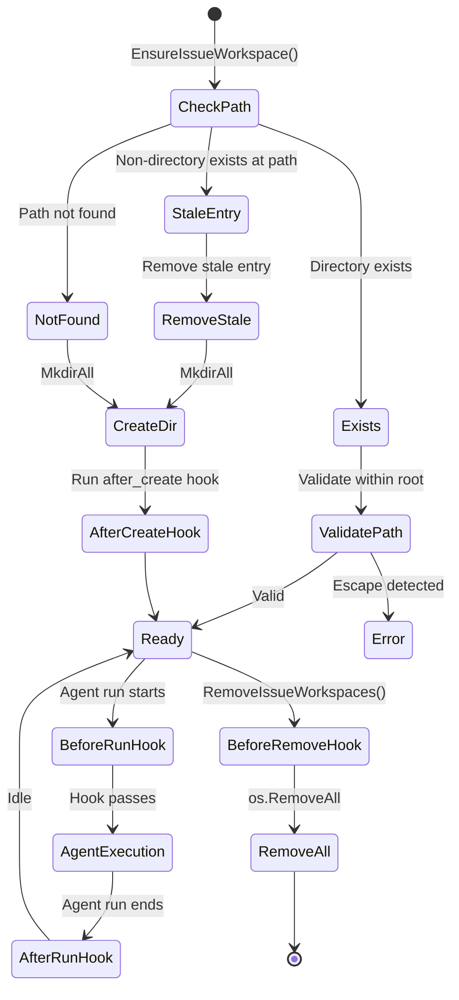
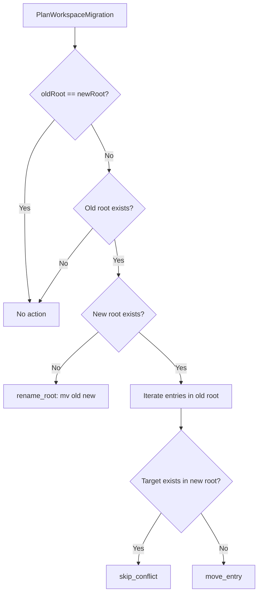

# 4.7 Workspace Management

> **Source files:**
> - [`apps/backend/internal/workspace/service.go`](../../apps/backend/internal/workspace/service.go)
> - [`apps/backend/internal/workspace/hooks.go`](../../apps/backend/internal/workspace/hooks.go)
> - [`apps/backend/internal/workspace/path_guard.go`](../../apps/backend/internal/workspace/path_guard.go)
> - [`apps/backend/internal/workspace/migration.go`](../../apps/backend/internal/workspace/migration.go)

The `workspace` package provides isolated working directories for each issue-agent combination, with path traversal protection, lifecycle hooks, and migration support. Each dispatched issue gets its own workspace directory where the agent operates, preventing cross-issue interference.

---

## 4.7.1 WorkspaceService Struct and Operations

The central type is `Service`, which anchors all workspace operations to a configured root directory.

```go
type Service struct {
    Root        string        // Base directory for all workspaces
    HookTimeout time.Duration // Timeout for hook scripts (default: 60s)
}
```

| Field | Type | Description |
|-------|------|-------------|
| `Root` | `string` | Absolute path to the top-level workspace directory. All issue directories are created beneath this root. |
| `HookTimeout` | `time.Duration` | Maximum duration for any lifecycle hook. Defaults to **60 seconds** if unset or zero. |

### Operations Summary

| Method | Signature | Purpose |
|--------|-----------|---------|
| `EnsureIssueWorkspace` | `(issueIdentifier, provider string, hooks Hooks) (string, bool, HookResult, error)` | Creates or verifies a workspace directory for an issue; runs `after_create` hook if newly created. Returns path, created flag, and hook result. |
| `RemoveIssueWorkspaces` | `(issueIdentifier, provider string, hooks Hooks) error` | Deletes a workspace directory, running the `before_remove` hook first. |
| `RunBeforeRunHook` | `(workspacePath string, hooks Hooks) (HookResult, error)` | Executes the `before_run` hook in an existing workspace. |
| `RunAfterRunHook` | `(workspacePath string, hooks Hooks) (HookResult, error)` | Executes the `after_run` hook in an existing workspace. |
| `ListArtifacts` | `(issueIdentifier, provider string) ([]string, error)` | Returns relative paths of all files in a workspace, excluding `.git/` and `.orchestra`. |
| `GetArtifactContent` | `(issueIdentifier, provider, relPath string) ([]byte, error)` | Reads and returns the content of a single file within the workspace (path-validated). |
| `GetDiff` | `(issueIdentifier, provider string) (string, error)` | Returns `git diff HEAD` output for the workspace, or empty string if not a git repo. |

---

## 4.7.2 Directory Provisioning for Agent Runs

Workspace directories are provisioned by `EnsureIssueWorkspace`. The path is derived from the issue identifier and provider using `WorkspacePath()`.

### Path Construction

```
<Root>/<sanitized_identifier>-<provider>
```

- The issue identifier is sanitized via regex `[^a-zA-Z0-9._-]` (non-matching characters replaced with `_`).
- If a provider is supplied, it is appended in lowercase with a `-` separator.
- The resulting path is validated against the root to prevent directory traversal and symlink escapes.

**Example:** issue `OPS-123` with provider `CLAUDE` produces `~/.orchestra/workspaces/OPS-123-claude/`

### Provisioning Logic

`EnsureIssueWorkspace` handles three cases:

| Condition | Action | Returns |
|-----------|--------|---------|
| Path exists and is a directory | Validates it is within root | `created=false` |
| Path exists but is not a directory | Removes the stale entry, creates the directory | `created=true` |
| Path does not exist | Creates the directory tree via `MkdirAll` | `created=true` |

When a workspace is newly created and an `AfterCreate` hook is configured, the hook runs immediately and its result is returned to the caller.

### Marker File

`MarkerPath(path)` returns `{path}/.orchestra`, used as a marker file to identify Orchestra-managed workspace directories. This file is excluded from artifact listings.

---

## 4.7.3 Git Operations

### Diff Retrieval

The `GetDiff` method provides git diff retrieval for workspaces that are git repositories:

1. Checks if a `.git` directory exists in the workspace.
2. Runs `git diff HEAD` to capture changes against the last commit.
3. Falls back to `git diff` (no HEAD) for new repositories without an initial commit.
4. Returns an empty string for non-git workspaces.

### Branch and Clone via Hooks

Git clone, branch creation, and checkout operations are not built into the service directly. Instead, they are performed through lifecycle hooks:

| Operation | Typical Hook | Example Script |
|-----------|-------------|----------------|
| Clone repository | `AfterCreate` | `git clone $REPO_URL .` |
| Create feature branch | `BeforeRun` | `git checkout -b issue/$ID` |
| Pull latest changes | `BeforeRun` | `git pull origin main` |
| Commit and push | `AfterRun` | `git add . && git commit -m "..." && git push` |

This design keeps the workspace service decoupled from any particular git workflow while enabling full git operations through configurable shell scripts.

---

## 4.7.4 Lifecycle Hooks

Hooks are shell scripts executed at defined points in the workspace lifecycle. They are configured via the `Hooks` struct:

```go
type Hooks struct {
    AfterCreate  string  // Shell script run after workspace creation
    BeforeRemove string  // Shell script run before workspace deletion
    BeforeRun    string  // Shell script run before agent execution
    AfterRun     string  // Shell script run after agent execution
}
```

| Hook | Trigger | Failure Behavior | Use Case |
|------|---------|-----------------|----------|
| `AfterCreate` | Workspace directory is newly created | Error propagated to caller | Clone repo, initialize project |
| `BeforeRemove` | Before workspace deletion | Warning logged; removal proceeds | Backup artifacts, clean up |
| `BeforeRun` | Before agent execution starts | Error propagated to caller | Pull latest code, reset state |
| `AfterRun` | After agent execution completes | Error propagated to caller | Commit changes, run tests |

### Execution Model

Hooks are executed by `RunHook()` in `hooks.go`:

- Runs the script via `sh -lc {script}` (login shell) with `cwd` set to the workspace directory.
- Uses `context.WithTimeout` for enforcement; a `DeadlineExceeded` error produces a distinct `workspace hook timeout` message.
- Returns a `HookResult{Output string}` containing the combined stdout/stderr output.

---

## 4.7.5 Path Safety and Validation

The `path_guard.go` module enforces workspace path security through two validators.

### WorkspacePath Validation

`ValidateWorkspacePath(root, candidate)` checks:

| Check | Error Message |
|-------|--------------|
| Candidate equals root | `workspace equals root` |
| Candidate resolves outside root (via `filepath.Rel`) | `workspace escapes root` |
| Symlink target resolves outside root (via `EvalSymlinks`) | `workspace symlink escape` |

### Project Path Validation

`ValidateProjectPath(candidate, allowedRoots)` ensures a project path is within an approved set of directories:

- If `allowedRoots` is populated, the candidate must fall within at least one.
- If `allowedRoots` is empty, the candidate must be within the user's home directory.

---

## 4.7.6 Workspace Migration

The `migration.go` module handles relocating workspace directories when the configured root changes.

### MigrationAction Types

| Action Type | Description |
|-------------|-------------|
| `rename_root` | Old root directory is renamed to the new root (when new root does not exist). |
| `move_entry` | Individual workspace entry is moved from old root into existing new root. |
| `skip_conflict` | Entry skipped because a target with the same name already exists in the new root. |

### Migration Functions

| Function | Description |
|----------|-------------|
| `PlanWorkspaceMigration(oldRoot, newRoot)` | Computes migration actions without executing them. Returns `MigrationResult` with `Applied=false`. |
| `ExecuteWorkspaceMigration(oldRoot, newRoot, dryRun)` | Plans and optionally applies migration. When `dryRun=true`, behaves identically to plan-only. |

### Migration Result

```go
type MigrationResult struct {
    Applied bool              `json:"applied"`
    Actions []MigrationAction `json:"actions"`
}
```

---

## 4.7.7 Workspace Lifecycle Diagram



### Migration Decision Flow



---

## 4.7.8 Artifact Management

`ListArtifacts` walks the workspace directory tree and returns relative paths of all files, applying two exclusion rules:

| Exclusion | Reason |
|-----------|--------|
| `.git/` directories | Internal git metadata, not user artifacts |
| `.orchestra` marker file | Internal Orchestra metadata |

`GetArtifactContent` reads a single file by relative path, validating the resolved path against the workspace root before reading to prevent path traversal attacks.

---

## See Also

- [4.2 Issue Trackers](tracker.md) -- tracker interface and implementations
- [4.3 Configuration](config.md) -- workspace root and hook configuration
- [4.5 Orchestrator](orchestrator.md) -- dispatches issues to workspaces
