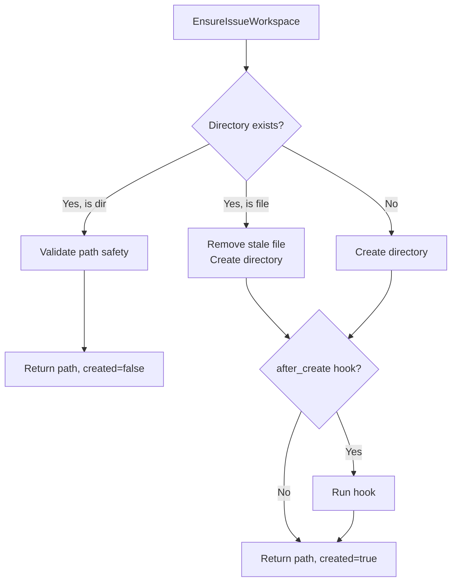
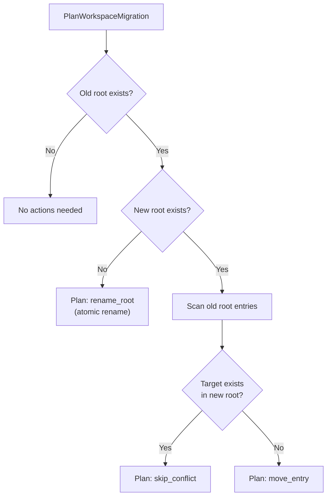

# 3.4 Workspace Management

> **Source files:**
> - `apps/backend/internal/workspace/service.go`
> - `apps/backend/internal/workspace/hooks.go`
> - `apps/backend/internal/workspace/path_guard.go`
> - `apps/backend/internal/workspace/migration.go`

The workspace package manages per-issue working directories where agents execute tasks. It handles directory provisioning, lifecycle hooks, artifact listing, git diff retrieval, path safety validation, and workspace migration between root directories.

---

## WorkspaceService

The `Service` struct is the primary entry point for workspace operations:

```go
type Service struct {
    Root        string         // Base directory for all workspaces
    HookTimeout time.Duration  // Timeout for hook scripts (default: 60s)
}
```

All workspaces are created as subdirectories of `Root`, named by a sanitized combination of issue identifier and provider.

---

## Directory Provisioning

### EnsureIssueWorkspace

`EnsureIssueWorkspace(issueIdentifier, provider, hooks)` creates or verifies a workspace directory:



**Returns:** `(path string, created bool, hookResult HookResult, err error)`

### Workspace Path Format

The `WorkspacePath(root, issueIdentifier, provider)` function computes the directory path:

```
<root>/<sanitized_identifier>-<lowercase_provider>
```

The issue identifier is sanitized by replacing any character not in `[a-zA-Z0-9._-]` with underscores.

**Examples:**
- Issue `OPS-123`, provider `claude` -> `<root>/OPS-123-claude`
- Issue `FETCH/42`, provider `CODEX` -> `<root>/FETCH_42-codex`

---

## Lifecycle Hooks

Four hook points are available throughout the workspace lifecycle:

| Hook | When | Failure Behavior |
|------|------|-----------------|
| `AfterCreate` | After a new workspace directory is created | Error propagated to caller |
| `BeforeRemove` | Before a workspace is deleted | Warning logged, removal continues |
| `BeforeRun` | Before an agent run starts in the workspace | Error propagated to caller |
| `AfterRun` | After an agent run completes | Error propagated to caller |

### Hook Execution

> **Source file:** `apps/backend/internal/workspace/hooks.go`

Hooks are shell scripts executed via `sh -lc <script>` with the workspace path as the working directory. Each hook runs with a configurable timeout (default: 60 seconds).

```go
type HookResult struct {
    Output string  // Combined stdout/stderr
}
```

If a hook exceeds its timeout, it returns a `"workspace hook timeout"` error. The `BeforeRemove` hook is special: its failure is logged as a warning but does not prevent workspace removal.

---

## Workspace Operations

| Method | Description |
|--------|-------------|
| `EnsureIssueWorkspace(id, provider, hooks)` | Creates or verifies workspace directory |
| `RemoveIssueWorkspaces(id, provider, hooks)` | Deletes workspace after running `BeforeRemove` hook |
| `RunBeforeRunHook(path, hooks)` | Executes the `BeforeRun` hook script |
| `RunAfterRunHook(path, hooks)` | Executes the `AfterRun` hook script |
| `ListArtifacts(id, provider)` | Returns relative paths of all workspace files |
| `GetArtifactContent(id, provider, relPath)` | Reads a file within the workspace |
| `GetDiff(id, provider)` | Returns `git diff HEAD` output from workspace |

### Artifact Listing

`ListArtifacts` walks the workspace directory and returns relative paths, excluding:
- `.git` directories (skipped entirely via `filepath.SkipDir`)
- The `.orchestra` marker file

### Git Diff

`GetDiff` returns the output of `git diff HEAD` within the workspace. If `HEAD` does not exist (new repository), falls back to plain `git diff`. Returns an empty string if the workspace is not a git repository (no `.git` directory).

---

## Path Safety

> **Source file:** `apps/backend/internal/workspace/path_guard.go`

### ValidateWorkspacePath

Ensures a candidate path is a proper subdirectory of the workspace root:

1. Resolves both paths to absolute form
2. Rejects if candidate equals root
3. Verifies the candidate is within root using `filepath.Rel` (rejects `..` prefixes)
4. If the path already exists on disk, evaluates symlinks to detect symlink escapes

### ValidateProjectPath

Ensures a project path falls within allowed boundaries:

- If `allowedRoots` are configured, checks if the candidate is within any of them
- If no roots are configured, allows any path under the user's home directory
- Returns a descriptive error with the list of allowed roots if validation fails

---

## Workspace Migration

> **Source file:** `apps/backend/internal/workspace/migration.go`

When the workspace root directory changes, the migration system moves existing workspaces to the new location.



### Migration Actions

| Action Type | Description |
|-------------|-------------|
| `rename_root` | Old root does not exist at new location; rename the entire directory |
| `move_entry` | Move an individual workspace entry to the new root |
| `skip_conflict` | Target already exists in new root; entry is skipped with a note |

### API

- **`PlanWorkspaceMigration(oldRoot, newRoot)`** -- computes actions without executing; returns `MigrationResult` with `applied: false`
- **`ExecuteWorkspaceMigration(oldRoot, newRoot, dryRun)`** -- plans and optionally applies the migration; sets `applied: true` on success

---

## Marker File

Each workspace can contain an `.orchestra` marker file at its root. This file is excluded from artifact listings and serves as a workspace identification marker.

---

## Cross-References

- [3.6 Configuration & Environment](config.md) -- `ORCHESTRA_WORKSPACE_ROOT` and hook environment variables (`ORCHESTRA_WORKSPACE_AFTER_CREATE`, etc.)
- [3.8 Tool System](tools.md) -- Agents execute within provisioned workspaces
- [3.5 Database Layer](database.md) -- Issues reference workspaces via `branch_name` and workspace state
