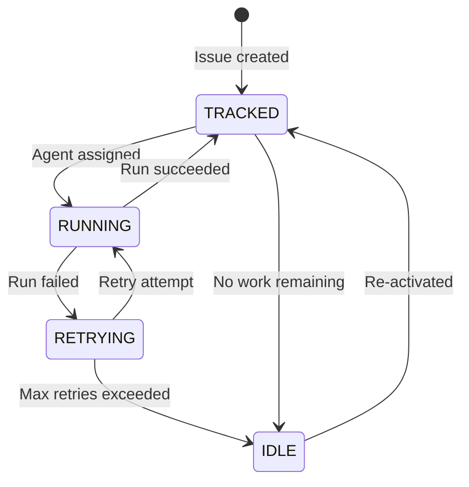
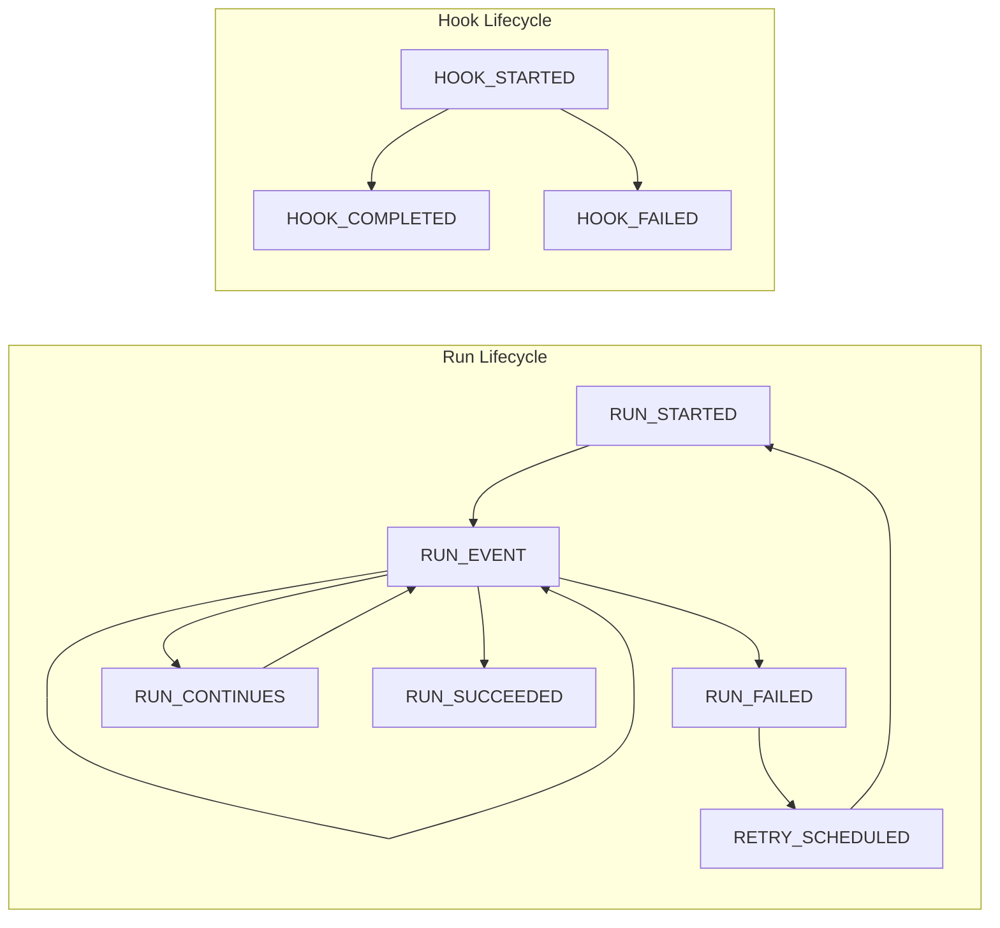

# 7. Enum Reference

> **Source files:**
> - `apps/backend/internal/types/enums.go` -- IssueStatus, AgentCategory, SSEEventType (Go)
> - `apps/backend/internal/agents/types.go` -- Provider (Go)
> - `apps/backend/internal/tracker/types.go` -- Issue.State, Blocker.State (Go)
> - `packages/protocol/schemas/v1/` -- JSON schema enum constraints

Orchestra uses a consistent set of enums across the backend (Go) and protocol schemas (JSON Schema). All enum values are UPPERCASE strings. The backend provides a normalization function (`NormalizeProvider`) that accepts case-insensitive input for backward compatibility.

---

## Provider

Identifies which ML agent backend processes an issue. Defined in all three layers.

| Value | Description | Layer |
|---|---|---|
| `CODEX` | OpenAI Codex agent (CLI-based) | Backend, Frontend, Schema |
| `CLAUDE` | Anthropic Claude Code agent | Backend, Frontend, Schema |
| `OPENCODE` | OpenCode agent | Backend, Frontend, Schema |
| `GEMINI` | Google Gemini agent | Backend, Frontend, Schema |
| `UNSANDBOX` | Remote execution via the unsandbox platform | Frontend, Schema only |

**Backend definition** (`apps/backend/internal/agents/types.go`):

```go
type Provider string

const (
    ProviderCodex    Provider = "CODEX"
    ProviderClaude   Provider = "CLAUDE"
    ProviderOpenCode Provider = "OPENCODE"
    ProviderGemini   Provider = "GEMINI"
)
```

**JSON Schema usage:** The `provider` field in `issue.create.request.schema.json`, `issue.update.request.schema.json`, `issue.response.schema.json`, `issues.list.response.schema.json`, and `state.response.schema.json` constrains values to `["CODEX", "CLAUDE", "OPENCODE", "GEMINI", "UNSANDBOX"]`.

**Note:** `UNSANDBOX` is defined in the frontend and JSON schemas but not in the backend Go constants, as unsandbox execution is handled through a separate code path rather than the standard `Runner` interface.

**Normalization:** `NormalizeProvider(s string)` converts any input to UPPERCASE for backward compatibility.

---

## IssueStatus

Computed runtime status of an issue, derived from orchestrator state rather than stored directly in the tracker. This is distinct from the tracker `state` field (e.g. `open`, `backlog`, `done`) which represents the issue's workflow state.

| Value | Description | Layer |
|---|---|---|
| `RUNNING` | An agent is actively processing this issue | Backend, Frontend, Schema |
| `RETRYING` | The issue failed and is queued for retry with exponential backoff | Backend, Frontend, Schema |
| `TRACKED` | The issue is known to the tracker but not currently running | Backend, Frontend, Schema |
| `IDLE` | The issue exists but has no active or pending work | Backend, Frontend, Schema |

**Backend definition** (`apps/backend/internal/types/enums.go`):

```go
type IssueStatus string

const (
    IssueStatusRunning  IssueStatus = "RUNNING"
    IssueStatusRetrying IssueStatus = "RETRYING"
    IssueStatusTracked  IssueStatus = "TRACKED"
    IssueStatusIdle     IssueStatus = "IDLE"
)
```

**JSON Schema usage:** The `status` field in `issue.response.schema.json` constrains values to `["RUNNING", "RETRYING", "TRACKED", "IDLE"]`.

**State transitions:**



---

## AgentCategory

Classifies agent configuration files into core settings versus skill/tool definitions.

| Value | Description | Layer |
|---|---|---|
| `CORE` | Primary agent configuration (settings, model config, permissions) | Backend, Frontend, Schema |
| `SKILL` | Skill, sub-agent, or tool definitions (markdown prompts, tool specs) | Backend, Frontend, Schema |

**Backend definition** (`apps/backend/internal/types/enums.go`):

```go
type AgentCategory string

const (
    CategoryCore  AgentCategory = "CORE"
    CategorySkill AgentCategory = "SKILL"
)
```

**JSON Schema usage:** The `category` field in `agents.list.response.schema.json` and `agent.config.response.schema.json` constrains values to `["CORE", "SKILL"]`.

**Config discovery paths by category:**

| Provider | CORE paths | SKILL paths |
|---|---|---|
| `claude` | `~/.claude/settings.json`, `~/.claude.json`, `{project}/.claude/settings.json` | `~/.claude/agents/`, `{project}/.claude/agents/` |
| `codex` | `~/.codex/config.toml`, `{project}/.codex/config.toml`, `{project}/AGENTS.md` | `~/.codex/skills/`, `{project}/.codex/skills/` |
| `gemini` | `~/.gemini/settings.json`, `{project}/.gemini/settings.json` | `~/.gemini/agents/`, `~/.gemini/skills/`, `{project}/.gemini/agents/` |
| `opencode` | `~/.config/opencode/opencode.json`, `{project}/opencode.json` | `~/.config/opencode/agents/`, `~/.config/opencode/skills/`, `~/.config/opencode/tools/` |

---

## ConfigScope

Indicates whether a configuration file applies globally or to a specific project.

| Value | Description | Layer |
|---|---|---|
| `GLOBAL` | Applies to all projects (stored in `$HOME` or workspace root) | Backend, Frontend, Schema |
| `PROJECT` | Applies only to a specific project (stored in the project directory) | Backend, Frontend, Schema |

**JSON Schema usage:** The `scope` field in `agents.list.response.schema.json` and `agent.config.response.schema.json` constrains values to `["GLOBAL", "PROJECT"]`.

Global configs are resolved from `$HOME/{provider_paths}` or from the Orchestra workspace at `.orchestra/agents/`. Project configs are resolved from `{project_root}/{provider_paths}`.

---

## SSEEventType

Event types emitted over the Server-Sent Events stream. See [Section 2.3: SSE Events](api/sse-events.md) for protocol details.

| Value | Category | Description | Layer |
|---|---|---|---|
| `RUN_EVENT` | Run | Generic event during an agent run (log output, tool calls) | Backend, Frontend |
| `RUN_STARTED` | Run | Agent run has begun for an issue | Backend, Frontend |
| `RUN_FAILED` | Run | Agent run ended with a failure | Backend, Frontend |
| `RUN_CONTINUES` | Run | Agent run continues after a turn boundary | Backend, Frontend |
| `RUN_SUCCEEDED` | Run | Agent run completed successfully | Backend, Frontend |
| `RETRY_SCHEDULED` | Retry | Failed run has been queued for retry (includes attempt count) | Backend, Frontend |
| `HOOK_STARTED` | Hook | Lifecycle hook execution began | Backend, Frontend |
| `HOOK_COMPLETED` | Hook | Lifecycle hook completed successfully | Backend, Frontend |
| `HOOK_FAILED` | Hook | Lifecycle hook ended with a failure | Backend, Frontend |

**Backend definition** (`apps/backend/internal/types/enums.go`):

```go
type SSEEventType string

const (
    SSERunEvent       SSEEventType = "RUN_EVENT"
    SSERunStarted     SSEEventType = "RUN_STARTED"
    SSERunFailed      SSEEventType = "RUN_FAILED"
    SSERunContinues   SSEEventType = "RUN_CONTINUES"
    SSERunSucceeded   SSEEventType = "RUN_SUCCEEDED"
    SSERetryScheduled SSEEventType = "RETRY_SCHEDULED"
    SSEHookStarted    SSEEventType = "HOOK_STARTED"
    SSEHookCompleted  SSEEventType = "HOOK_COMPLETED"
    SSEHookFailed     SSEEventType = "HOOK_FAILED"
)
```

In addition to these typed events, the SSE stream emits two system-level events that are not part of this enum:

| System Event | Description |
|---|---|
| `snapshot` | Full system state (sent as heartbeat every 5s and after each lifecycle event) |
| `error` | Error during event encoding or processing |

**Event lifecycle flow:**



---

## SectionID

Frontend navigation section identifiers. Used by the desktop app to track which section/view is active. This enum is frontend-only and does not have a backend Go counterpart or JSON schema constraint.

| Value | Description | Layer |
|---|---|---|
| `DASHBOARD` | Main dashboard overview | Frontend only |
| `RUNNING` | Currently running agent sessions | Frontend only |
| `ISSUES` | Issue list and management | Frontend only |
| `PROJECTS` | Project list and management | Frontend only |
| `AGENTS` | Agent configuration and status | Frontend only |
| `WAREHOUSE` | Data warehouse and analytics | Frontend only |
| `SANDBOX` | Unsandbox remote execution | Frontend only |
| `SETTINGS` | Application settings | Frontend only |
| `DOCS` | Documentation viewer | Frontend only |
| `CONSOLE` | Terminal/console interface | Frontend only |

**Frontend definition** (`apps/desktop/src/app/routes/sections.tsx`): Section identifiers are defined inline as string literal union types in the navigation routes configuration.

---

## Enum cross-reference

Summary of where each enum is defined and used across the stack:

| Enum | Backend (Go) | JSON Schema |
|---|---|---|
| `Provider` | `internal/agents/types.go` | `issue.*.schema.json`, `state.response.schema.json` |
| `IssueStatus` | `internal/types/enums.go` | `issue.response.schema.json` |
| `AgentCategory` | `internal/types/enums.go` | `agents.list.response.schema.json`, `agent.config.response.schema.json` |
| `ConfigScope` | `internal/agents/config.go` | `agents.list.response.schema.json`, `agent.config.response.schema.json` |
| `SSEEventType` | `internal/types/enums.go` | -- |
| `SectionID` | -- | -- |

---

## Cross-references

- **JSON schema definitions** that use these enums are documented in [Section 2.2: JSON Schemas & Types](api/schemas.md).
- **SSE event stream protocol** is documented in [SSE Events](api/sse-events.md).
- **API endpoint routes** are documented in [Section 2.1: API Reference](api/reference.md).
