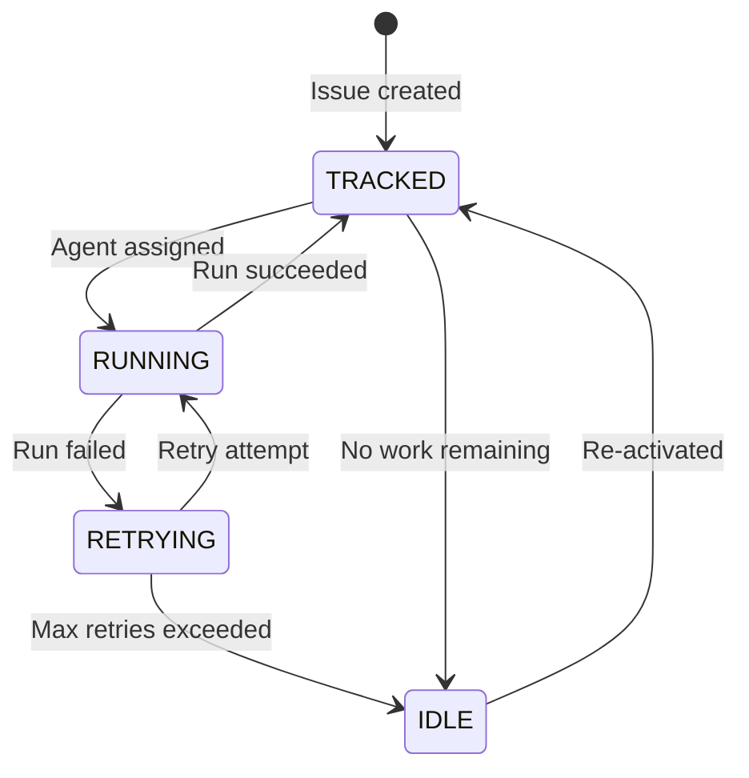
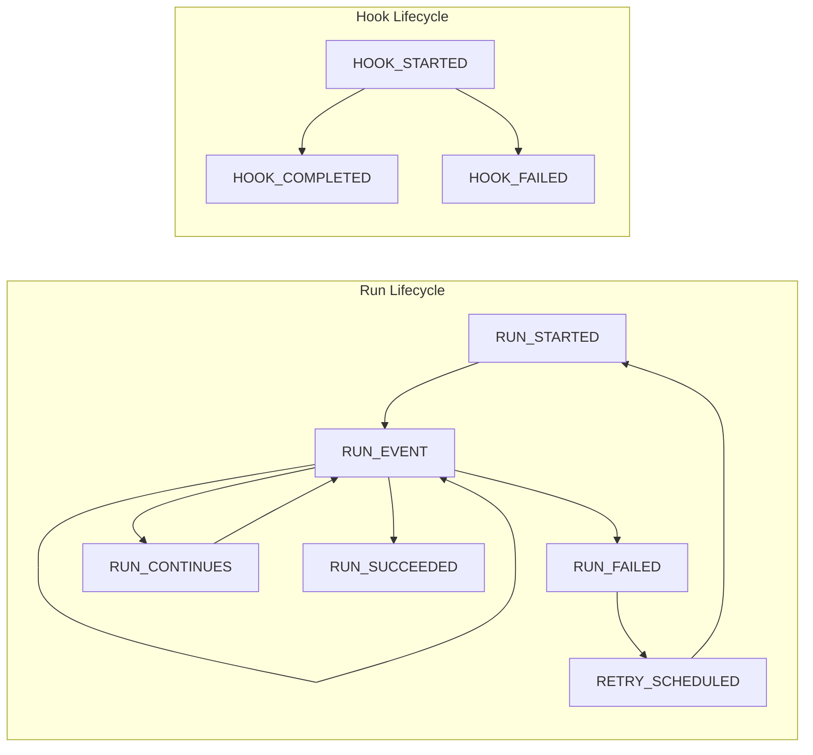

# 8. Enum Reference

> **Source files:**
> - `apps/backend/internal/types/enums.go` — IssueStatus, AgentCategory, SSEEventType
> - `apps/backend/internal/agents/types.go` — Provider
> - `apps/backend/internal/agents/config.go` — ConfigScope
> - `apps/desktop/src/lib/enums.ts` — All enums (TypeScript mirrors)
> - `packages/protocol/schemas/v1/` — JSON schema enum constraints

Orchestra uses a consistent set of enums across the backend (Go), frontend (TypeScript), and protocol schemas (JSON Schema). All enum values are UPPERCASE strings. The backend provides normalization functions (`NormalizeProvider`, `NormalizeSSEEventType`) that accept case-insensitive input for backward compatibility.

---

### Provider

Identifies which ML agent backend processes an issue.

| Value | Description |
|-------|-------------|
| `CODEX` | OpenAI Codex agent (CLI-based) |
| `CLAUDE` | Anthropic Claude Code agent |
| `OPENCODE` | OpenCode agent |
| `GEMINI` | Google Gemini agent |
| `UNSANDBOX` | Remote execution via the unsandbox platform |

**Backend definition:** `apps/backend/internal/agents/types.go`

```go
type Provider string

const (
    ProviderCodex    Provider = "CODEX"
    ProviderClaude   Provider = "CLAUDE"
    ProviderOpenCode Provider = "OPENCODE"
    ProviderGemini   Provider = "GEMINI"
)
```

**Frontend definition:** `apps/desktop/src/lib/enums.ts`

```typescript
export const Provider = {
  CODEX: 'CODEX',
  CLAUDE: 'CLAUDE',
  OPENCODE: 'OPENCODE',
  GEMINI: 'GEMINI',
  UNSANDBOX: 'UNSANDBOX',
} as const
```

**JSON Schema usage:** The `provider` field in `issue.create.request.schema.json`, `issue.response.schema.json`, and `state.response.schema.json` constrains values to `["CODEX", "CLAUDE", "OPENCODE", "GEMINI", "UNSANDBOX"]`.

Note: `UNSANDBOX` is defined in the frontend and JSON schemas but not in the backend Go constants, as unsandbox execution is handled through a separate code path rather than the standard `Runner` interface.

---

### IssueStatus

Computed runtime status of an issue, derived from orchestrator state rather than stored directly.

| Value | Description |
|-------|-------------|
| `RUNNING` | An agent is actively processing this issue |
| `RETRYING` | The issue failed and is queued for retry with backoff |
| `TRACKED` | The issue is tracked in the system but not currently running |
| `IDLE` | The issue exists but has no active or pending work |

**Backend definition:** `apps/backend/internal/types/enums.go`

```go
type IssueStatus string

const (
    IssueStatusRunning  IssueStatus = "RUNNING"
    IssueStatusRetrying IssueStatus = "RETRYING"
    IssueStatusTracked  IssueStatus = "TRACKED"
    IssueStatusIdle     IssueStatus = "IDLE"
)
```

**JSON Schema usage:** The `status` field in `issue.response.schema.json` constrains values to `["RUNNING", "RETRYING", "TRACKED", "IDLE"]`.



---

### AgentCategory

Classifies agent configuration files into core settings versus skill/tool definitions.

| Value | Description |
|-------|-------------|
| `CORE` | Primary agent configuration (settings, model config, permissions) |
| `SKILL` | Skill, sub-agent, or tool definitions (markdown prompts, tool specs) |

**Backend definition:** `apps/backend/internal/types/enums.go`

```go
type AgentCategory string

const (
    CategoryCore  AgentCategory = "CORE"
    CategorySkill AgentCategory = "SKILL"
)
```

**Config discovery paths by category:**

| Provider | CORE paths | SKILL paths |
|----------|-----------|-------------|
| `claude` | `~/.claude/settings.json`, `~/.claude.json`, `{project}/.claude/settings.json` | `~/.claude/agents/`, `{project}/.claude/agents/` |
| `codex` | `~/.codex/config.toml`, `{project}/.codex/config.toml`, `{project}/AGENTS.md` | `~/.codex/skills/`, `{project}/.codex/skills/` |
| `gemini` | `~/.gemini/settings.json`, `{project}/.gemini/settings.json` | `~/.gemini/agents/`, `~/.gemini/skills/`, `{project}/.gemini/agents/` |
| `opencode` | `~/.config/opencode/opencode.json`, `{project}/opencode.json` | `~/.config/opencode/agents/`, `~/.config/opencode/skills/`, `~/.config/opencode/tools/` |

**Source:** `apps/backend/internal/agents/config.go` (`AgentMeta` map)

---

### ConfigScope

Indicates whether a configuration file applies globally or to a specific project.

| Value | Description |
|-------|-------------|
| `GLOBAL` | Applies to all projects (stored in `$HOME` or workspace root) |
| `PROJECT` | Applies only to a specific project (stored in the project directory) |

**Backend definition:** `apps/backend/internal/agents/config.go`

```go
type ConfigScope string

const (
    ScopeGlobal  ConfigScope = "GLOBAL"
    ScopeProject ConfigScope = "PROJECT"
)
```

Global configs are resolved from `$HOME/{provider_paths}` or from the Orchestra workspace at `.orchestra/agents/`. Project configs are resolved from `{project_root}/{provider_paths}`. The `workspace.json` file can override global config paths via the `pointers` map.

---

### SSEEventType

Event types emitted over the Server-Sent Events stream. See [3.1 Server-Sent Events](api/sse-events.md) for protocol details.

| Value | Category | Description |
|-------|----------|-------------|
| `RUN_EVENT` | Run | Generic event during an agent run (log output, tool calls) |
| `RUN_STARTED` | Run | Agent run has begun |
| `RUN_FAILED` | Run | Agent run has failed |
| `RUN_CONTINUES` | Run | Agent run continues after a turn boundary |
| `RUN_SUCCEEDED` | Run | Agent run completed successfully |
| `RETRY_SCHEDULED` | Retry | Failed run scheduled for retry (includes attempt count) |
| `HOOK_STARTED` | Hook | Lifecycle hook execution began |
| `HOOK_COMPLETED` | Hook | Lifecycle hook completed successfully |
| `HOOK_FAILED` | Hook | Lifecycle hook failed |

**Backend definition:** `apps/backend/internal/types/enums.go`

```go
type SSEEventType string

const (
    SSERunEvent       SSEEventType = "RUN_EVENT"
    SSERunStarted     SSEEventType = "RUN_STARTED"
    SSERunFailed      SSEEventType = "RUN_FAILED"
    SSERunContinues   SSEEventType = "RUN_CONTINUES"
    SSERunSucceeded   SSEEventType = "RUN_SUCCEEDED"
    SSERetryScheduled SSEEventType = "RETRY_SCHEDULED"
    SSEHookStarted    SSEEventType = "HOOK_STARTED"
    SSEHookCompleted  SSEEventType = "HOOK_COMPLETED"
    SSEHookFailed     SSEEventType = "HOOK_FAILED"
)
```

In addition to these typed events, the SSE stream emits two system-level events that are not part of this enum:

| System Event | Description |
|--------------|-------------|
| `snapshot` | Full system state (sent as heartbeat every 5s and after each lifecycle event) |
| `error` | Error during event encoding or processing |

**Normalization:** `NormalizeSSEEventType(s string)` converts any input to UPPERCASE for backward compatibility with clients that may send lowercase event type strings.



---

### SectionID

Frontend navigation section identifiers. Used by the desktop app to track which section/view is active.

| Value | Description |
|-------|-------------|
| `DASHBOARD` | Main dashboard overview |
| `RUNNING` | Currently running agent sessions |
| `ISSUES` | Issue list and management |
| `PROJECTS` | Project list and management |
| `AGENTS` | Agent configuration and status |
| `WAREHOUSE` | Data warehouse and analytics |
| `SANDBOX` | Unsandbox remote execution |
| `SETTINGS` | Application settings |
| `DOCS` | Documentation viewer |
| `CONSOLE` | Terminal/console interface |

**Frontend definition:** `apps/desktop/src/lib/enums.ts`

```typescript
export const SectionID = {
  DASHBOARD: 'DASHBOARD',
  RUNNING: 'RUNNING',
  ISSUES: 'ISSUES',
  PROJECTS: 'PROJECTS',
  AGENTS: 'AGENTS',
  WAREHOUSE: 'WAREHOUSE',
  SANDBOX: 'SANDBOX',
  SETTINGS: 'SETTINGS',
  DOCS: 'DOCS',
  CONSOLE: 'CONSOLE',
} as const
```

This enum is frontend-only and does not have a backend Go counterpart.

---

### Enum Cross-Reference

Summary of where each enum is defined and used:

| Enum | Backend (Go) | Frontend (TS) | JSON Schema |
|------|-------------|---------------|-------------|
| `Provider` | `agents/types.go` | `enums.ts` | `issue.*.schema.json`, `state.response.schema.json` |
| `IssueStatus` | `types/enums.go` | `enums.ts` | `issue.response.schema.json` |
| `AgentCategory` | `types/enums.go` | `enums.ts` | -- |
| `ConfigScope` | `agents/config.go` | `enums.ts` | -- |
| `SSEEventType` | `types/enums.go` | `enums.ts` | -- |
| `SectionID` | -- | `enums.ts` | -- |
