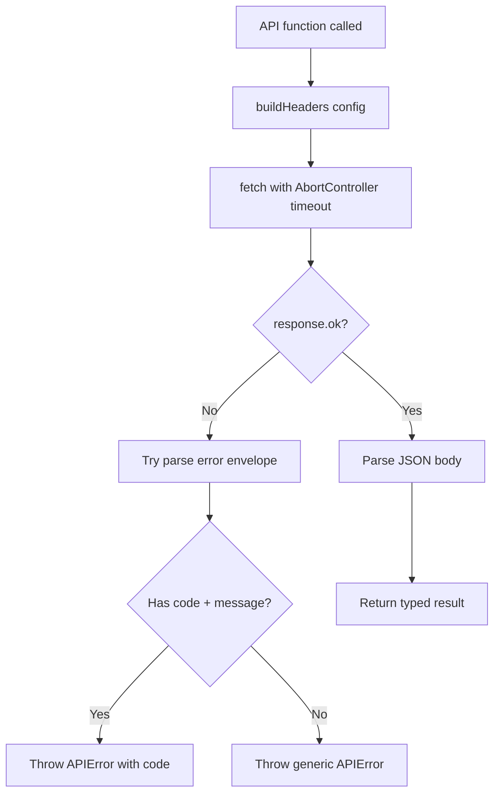

# 4.3 Orchestra Client & API Layer

> **Source files:**
> - `apps/desktop/src/lib/orchestra-client.ts` -- All HTTP client functions, types, and normalization

The Orchestra frontend communicates with the `orchestrad` backend exclusively through the functions exported from `orchestra-client.ts`. This module provides typed wrappers around every API endpoint, response normalization, error handling, and type coercion helpers.

---

### BackendConfig

Every API function takes a `BackendConfig` as its first argument:

```typescript
type BackendConfig = {
  baseUrl: string       // e.g. "http://127.0.0.1:4010"
  apiToken: string      // Bearer token for authentication
  mcpServers?: Record<string, string>
}
```

Authentication is handled by `buildHeaders()`, which attaches an `Authorization: Bearer <token>` header when the token is non-empty.

---

### Request Infrastructure

#### requestJSON\<T\>

The core request function used by all API calls:

- Constructs a `fetch()` call with the base URL and path
- Applies a **30-second** abort timeout via `AbortController`
- Attaches authorization and `Accept: application/json` headers
- On non-OK responses, attempts to parse an `APIErrorEnvelope` (`{ error: { code, message } }`) and throws a typed `APIError`
- Handles `204 No Content` responses gracefully
- Falls back to `{}` for empty response bodies

#### APIError

Custom error class with a `code` field for programmatic error handling:

```typescript
class APIError extends Error {
  code: string
  constructor(code: string, message: string)
}
```

#### isUnauthorizedError

Utility to detect authentication failures across error types (APIError, Error, string).

#### toDisplayError

Converts any error to a user-friendly display string.

---

### API Functions Reference

#### State & Snapshot

| Function | Method | Endpoint | Returns |
|----------|--------|----------|---------|
| `fetchState` | GET | `/api/v1/state` | `SnapshotPayload` |
| `postRefresh` | POST | `/api/v1/refresh` | `RefreshResult` |

#### Issues (Tasks)

| Function | Method | Endpoint | Returns |
|----------|--------|----------|---------|
| `fetchIssues` | GET | `/api/v1/issues?states=&project_id=&assignee_id=` | `IssueListItem[]` |
| `createIssue` | POST | `/api/v1/issues` | `IssueListItem` |
| `fetchIssueDetail` | GET | `/api/v1/issues/{issue_identifier}` | `IssueListItem` |
| `updateIssue` | PATCH | `/api/v1/issues/{issue_identifier}` | `IssueListItem` |
| `deleteIssue` | DELETE | `/api/v1/issues/{issue_identifier}` | `void` |
| `searchIssues` | GET | `/api/v1/search?q=` | `IssueListItem[]` |
| `stopIssueSession` | DELETE | `/api/v1/issues/{issue_identifier}/session` | `void` |
| `stopIssue` | POST | `/api/v1/issues/{issue_identifier}/stop` | `IssueListItem` |
| `fetchIssueHistory` | GET | `/api/v1/issues/{issue_identifier}/history` | `IssueHistoryEntry[]` |
| `fetchIssueLogs` | GET | `/api/v1/issues/{issue_identifier}/logs` | `string` (raw text) |
| `fetchIssueDiff` | GET | `/api/v1/issues/{issue_identifier}/diff` | `string` (unified diff) |
| `fetchArtifacts` | GET | `/api/v1/issues/{issue_identifier}/artifacts` | `string[]` |
| `fetchArtifactContent` | GET | `/api/v1/issues/{issue_identifier}/artifacts/{path}` | `string` |

#### Sessions

| Function | Method | Endpoint | Returns |
|----------|--------|----------|---------|
| `fetchSessions` | GET | `/api/v1/sessions` | `SessionSummary[]` |
| `fetchSessionDetail` | GET | `/api/v1/sessions/{session_id}` | `SessionDetail` |

#### Projects

| Function | Method | Endpoint | Returns |
|----------|--------|----------|---------|
| `fetchProjects` | GET | `/api/v1/projects` | `Project[]` |
| `fetchProjectStats` | GET | `/api/v1/projects/{project_id}` | `ProjectStats` |
| `createProject` | POST | `/api/v1/projects` | `Project` |
| `deleteProject` | DELETE | `/api/v1/projects/{project_id}` | `void` |
| `refreshProject` | POST | `/api/v1/projects/{project_id}/refresh` | `void` |
| `fetchProjectTree` | GET | `/api/v1/projects/{project_id}/tree` | `ProjectTreeNode[]` |
| `fetchProjectFileContent` | GET | `/api/v1/projects/{project_id}/file?path=` | `string` |

#### Git Operations

| Function | Method | Endpoint | Returns |
|----------|--------|----------|---------|
| `fetchProjectGitHistory` | GET | `/api/v1/projects/{project_id}/git` | `GitCommit[]` |
| `fetchProjectGitStatus` | GET | `/api/v1/projects/{project_id}/git/status` | `GitStatusEntry[]` |
| `fetchProjectGitDiff` | GET | `/api/v1/projects/{project_id}/git/diff` | `string` |
| `fetchProjectGitBranches` | GET | `/api/v1/projects/{project_id}/git/branches` | `GitBranches` |
| `gitCommit` | POST | `/api/v1/projects/{project_id}/git/commit` | `void` |
| `gitPush` | POST | `/api/v1/projects/{project_id}/git/push` | `void` |
| `gitPull` | POST | `/api/v1/projects/{project_id}/git/pull` | `void` |
| `gitFetch` | POST | `/api/v1/projects/{project_id}/git/fetch` | `void` |
| `gitCheckout` | POST | `/api/v1/projects/{project_id}/git/checkout` | `void` |
| `gitCreateBranch` | POST | `/api/v1/projects/{project_id}/git/branches` | `void` |
| `gitDeleteBranch` | DELETE | `/api/v1/projects/{project_id}/git/branches/{branch}` | `void` |
| `gitStage` | POST | `/api/v1/projects/{project_id}/git/stage` | `void` |
| `gitUnstage` | POST | `/api/v1/projects/{project_id}/git/unstage` | `void` |
| `gitMerge` | POST | `/api/v1/projects/{project_id}/git/merge` | `void` |
| `gitStash` | POST | `/api/v1/projects/{project_id}/git/stash` | `void` |
| `gitStashPop` | POST | `/api/v1/projects/{project_id}/git/stash/pop` | `void` |
| `gitStashList` | GET | `/api/v1/projects/{project_id}/git/stash/list` | `StashEntry[]` |
| `gitStashApply` | POST | `/api/v1/projects/{project_id}/git/stash/apply` | `void` |
| `gitStashDrop` | POST | `/api/v1/projects/{project_id}/git/stash/drop` | `void` |
| `gitGetConflicts` | GET | `/api/v1/projects/{project_id}/git/conflicts` | `ConflictStatus` |
| `gitMergeAbort` | POST | `/api/v1/projects/{project_id}/git/merge/abort` | `void` |
| `gitConflictResolve` | POST | `/api/v1/projects/{project_id}/git/resolve` | `void` |
| `fetchDefaultBranch` | GET | `/api/v1/projects/{project_id}/git/default-branch` | `string` |
| `fetchProjectGitBranchesDetail` | GET | `/api/v1/projects/{project_id}/git/branches/detail` | `BranchesDetailResponse` |

#### GitHub Integration

| Function | Method | Endpoint | Returns |
|----------|--------|----------|---------|
| `fetchProjectGitHubIssues` | GET | `/api/v1/projects/{project_id}/github/issues` | `GitHubIssue[]` |
| `createProjectGitHubIssue` | POST | `/api/v1/projects/{project_id}/github/issues` | `GitHubIssue` |
| `updateProjectGitHubIssue` | PATCH | `/api/v1/projects/{project_id}/github/issues/{number}` | `GitHubIssue` |
| `fetchProjectGitHubPulls` | GET | `/api/v1/projects/{project_id}/github/pulls` | `GitHubPR[]` |
| `fetchProjectGitHubPullDiff` | GET | `/api/v1/projects/{project_id}/github/pulls/{number}/diff` | `string` |
| `createProjectGitHubPull` | POST | `/api/v1/projects/{project_id}/github/pulls` | `{ html_url, number }` |
| `fetchPRReviews` | GET | `/api/v1/projects/{project_id}/github/pulls/{number}/reviews` | `unknown[]` |
| `submitPRReview` | POST | `/api/v1/projects/{project_id}/github/pulls/{number}/reviews` | `void` |
| `mergePR` | PUT | `/api/v1/projects/{project_id}/github/pulls/{number}/merge` | `void` |
| `fetchPRComments` | GET | `/api/v1/projects/{project_id}/github/pulls/{number}/comments` | `unknown[]` |
| `disconnectProjectGitHub` | POST | `/api/v1/projects/{project_id}/github/disconnect` | `void` |
| `createGitHubPR` | POST | `/api/v1/issues/{issue_identifier}/pr` | `GitHubPRResult` |
| `createGitHubRepo` | POST | `/api/v1/projects/{project_id}/github/create-repo` | `CreateRepoResult` |

#### Agent Configuration

| Function | Method | Endpoint | Returns |
|----------|--------|----------|---------|
| `fetchAgents` | GET | `/api/v1/agents` | `string[]` |
| `fetchAgentConfig` | GET | `/api/v1/config/agents` | `{ commands, agent_provider, max_turns }` |
| `updateAgentConfig` | POST | `/api/v1/config/agents` | `void` |
| `patchAgentConfig` | PATCH | `/api/v1/config/agents` | `{ commands, agent_provider, max_turns }` |
| `fetchAgentConfigs` | GET | `/api/v1/config/agents/items` | `AgentConfig[]` |
| `updateAgentConfigByPath` | POST | `/api/v1/config/agents/items` | `void` |
| `createAgentResource` | POST | `/api/v1/config/agents/new` | `{ path }` |

#### Provider-Level Configuration

| Function | Method | Endpoint | Returns |
|----------|--------|----------|---------|
| `fetchProviderPermissions` | GET | `/api/v1/agents/:provider/permissions` | `ProviderPermissions` |
| `updateProviderPermissions` | POST | `/api/v1/agents/:provider/permissions` | `void` |
| `fetchProviderModel` | GET | `/api/v1/agents/:provider/model` | `ProviderModelConfig` |
| `updateProviderModel` | POST | `/api/v1/agents/:provider/model` | `void` |
| `fetchProviderHooks` | GET | `/api/v1/agents/:provider/hooks` | `ProviderHook[]` |
| `updateProviderHooks` | POST | `/api/v1/agents/:provider/hooks` | `void` |
| `fetchClaudeSettings` | GET | `/api/v1/agents/claude/settings` | `ClaudeSettingsResponse` |
| `updateClaudeSettings` | POST | `/api/v1/agents/claude/settings` | `void` |
| `fetchClaudeInstructions` | GET | `/api/v1/agents/claude/instructions` | `ClaudeInstructionsResponse` |
| `updateClaudeInstructions` | POST | `/api/v1/agents/claude/instructions` | `void` |
| `deleteClaudeInstructions` | DELETE | `/api/v1/agents/claude/instructions` | `void` |
| `fetchClaudeRules` | GET | `/api/v1/agents/claude/rules` | `ClaudeFileListResponse` |
| `updateClaudeRule` | POST | `/api/v1/agents/claude/rules` | `void` |
| `deleteClaudeRule` | DELETE | `/api/v1/agents/claude/rules/{name}` | `void` |
| `fetchClaudeSkills` | GET | `/api/v1/agents/claude/skills` | `ClaudeFileListResponse` |
| `updateClaudeSkill` | POST | `/api/v1/agents/claude/skills` | `void` |
| `deleteClaudeSkill` | DELETE | `/api/v1/agents/claude/skills/{name}` | `void` |
| `fetchClaudeSubAgents` | GET | `/api/v1/agents/claude/subagents` | `ClaudeFileListResponse` |
| `updateClaudeSubAgent` | POST | `/api/v1/agents/claude/subagents` | `void` |
| `deleteClaudeSubAgent` | DELETE | `/api/v1/agents/claude/subagents/{name}` | `void` |
| `fetchProviderMCPServers` | GET | `/api/v1/agents/{provider}/mcp?project_id=` | `ProviderMCPServer[]` |
| `addProviderMCPServer` | POST | `/api/v1/agents/{provider}/mcp` | `void` |
| `updateProviderMCPServer` | PUT | `/api/v1/agents/{provider}/mcp/{name}` | `void` |
| `toggleProviderMCPServer` | PATCH | `/api/v1/agents/{provider}/mcp/{name}` | `void` |
| `deleteProviderMCPServer` | DELETE | `/api/v1/agents/{provider}/mcp/{name}` | `void` |

#### MCP (Model Context Protocol)

| Function | Method | Endpoint | Returns |
|----------|--------|----------|---------|
| `fetchMCPTools` | GET | `/api/v1/mcp/tools` | `MCPTool[]` |
| `fetchMCPServers` | GET | `/api/v1/mcp/servers` | `MCPServer[]` |
| `createMCPServer` | POST | `/api/v1/mcp/servers` | `MCPServer` |
| `deleteMCPServer` | DELETE | `/api/v1/mcp/servers/{id}` | `void` |

#### Analytics

| Function | Method | Endpoint | Returns |
|----------|--------|----------|---------|
| `fetchWarehouseStats` | GET | `/api/v1/warehouse/stats` | `GlobalStats` |
| `fetchAnalyticsDaily` | GET | `/api/v1/analytics/daily` | `DailyStats[]` |
| `fetchAnalyticsCost` | GET | `/api/v1/analytics/cost` | `CostRecord[]` |
| `fetchAnalyticsCostOptimization` | GET | `/api/v1/analytics/cost/optimization` | `CostOptimization` |
| `fetchAnalyticsPerformance` | GET | `/api/v1/analytics/performance` | `PerformanceRecord[]` |
| `fetchAnalyticsRateLimits` | GET | `/api/v1/analytics/rate-limits` | `unknown` |
| `fetchAnalyticsProductivity` | GET | `/api/v1/analytics/productivity` | `ProductivityRecord[]` |
| `fetchAnalyticsBudgets` | GET | `/api/v1/analytics/budgets` | `BudgetRecord[]` |
| `fetchExternalReconcile` | GET | `/api/v1/analytics/external/reconcile` | `ExternalReconciliation` |
| `fetchExternalStatus` | GET | `/api/v1/analytics/external/status` | `ExternalStatus` |

#### Workspace Migration

| Function | Method | Endpoint | Returns |
|----------|--------|----------|---------|
| `fetchWorkspaceMigrationPlan` | GET | `/api/v1/workspace/migration/plan?from=&to=` | `WorkspaceMigrationResult` |
| `applyWorkspaceMigration` | POST | `/api/v1/workspace/migrate` | `WorkspaceMigrationResult` |

#### Unsandbox (Remote Execution)

| Function | Method | Endpoint | Returns |
|----------|--------|----------|---------|
| `fetchUnsandboxConfig` | GET | `/api/v1/config/unsandbox` | `UnsandboxConfig` |
| `saveUnsandboxConfig` | POST | `/api/v1/config/unsandbox` | `UnsandboxConfig` |
| `deleteUnsandboxConfig` | DELETE | `/api/v1/config/unsandbox` | `void` |
| `fetchUnsandboxStatus` | GET | `/api/v1/unsandbox/status` | `UnsandboxStatus` |
| `executeUnsandbox` | POST | `/api/v1/unsandbox/execute` | `UnsandboxExecuteResult` |
| `fetchUnsandboxSessions` | GET | `/api/v1/unsandbox/sessions` | `{ sessions }` |
| `fetchUnsandboxServices` | GET | `/api/v1/unsandbox/services` | `{ services }` |

#### Speech-to-Text

| Function | Method | Endpoint | Returns |
|----------|--------|----------|---------|
| `fetchSTTHealth` | GET | `/api/v1/stt/health` | `STTHealth` |
| `transcribeAudio` | POST | `/api/v1/stt/transcribe` | `STTTranscriptionResult` |

#### Embedded Agent Provider Keys

| Function | Method | Endpoint | Returns |
|----------|--------|----------|---------|
| `fetchAgentProviderKeys` | GET | `/api/v1/config/agent-providers` | provider-key status map |
| `saveAgentProviderKey` | POST | `/api/v1/config/agent-providers` | `void` |

#### Documentation

| Function | Method | Endpoint | Returns |
|----------|--------|----------|---------|
| `fetchDocs` | GET | `/api/v1/docs` | `DocItem[]` |
| `fetchDocContent` | GET | `/api/v1/docs/:path` | `string` |

---

### Response Normalization

#### normalizeSnapshotPayload

Defensively normalizes the raw `/api/v1/state` response into a typed `SnapshotPayload`. Handles missing fields, wrong types, and absent arrays by falling back to safe defaults.

#### normalizeEventEnvelope

Normalizes a raw SSE event payload into an `EventEnvelope` with guaranteed `type`, `timestamp`, and `data` fields.

---

### Type Coercion Helpers

Two internal functions provide safe type narrowing used throughout the normalization layer:

| Helper | Signature | Behavior |
|--------|-----------|----------|
| `asString` | `(value: unknown, fallback?: string) => string` | Returns value if string, otherwise fallback |
| `asNumber` | `(value: unknown, fallback?: number) => number` | Returns value if finite number, otherwise fallback |
| `isRecord` | `(value: unknown) => value is Record<string, unknown>` | Type guard for non-null objects |

---

### Request Flow


