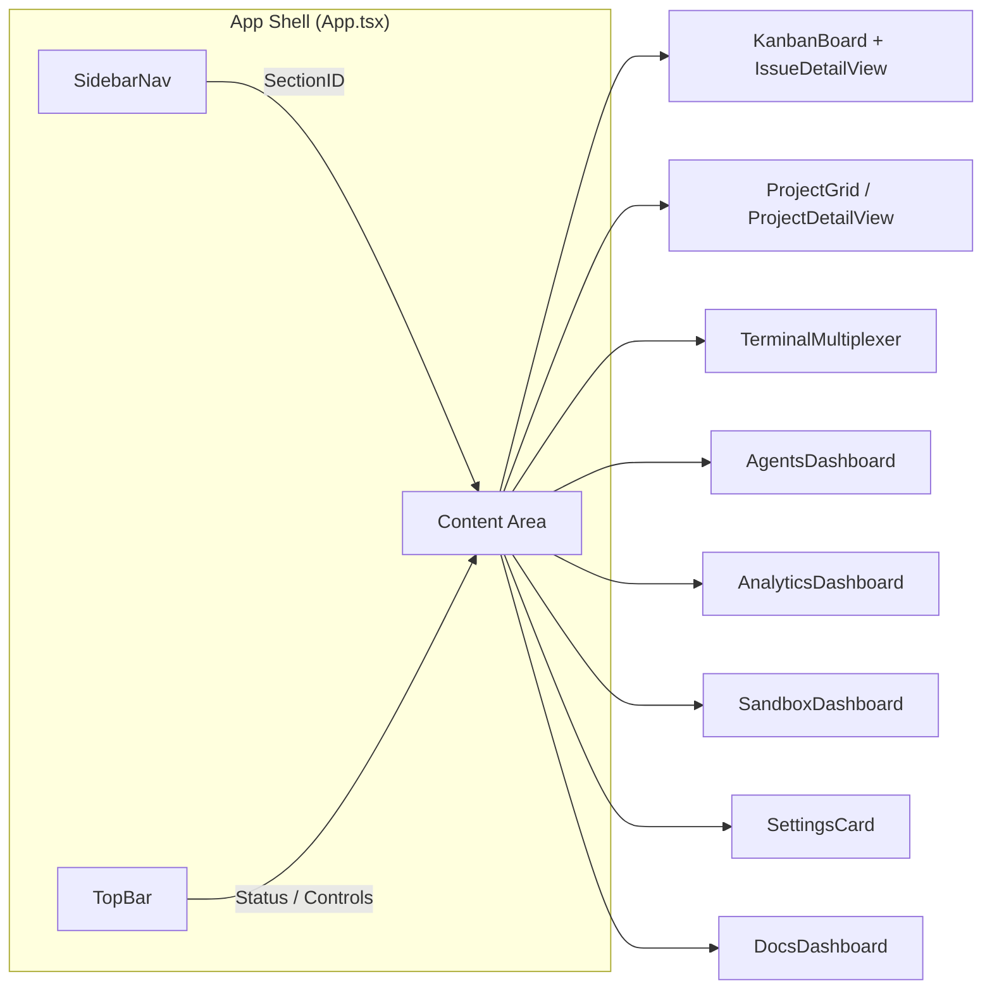
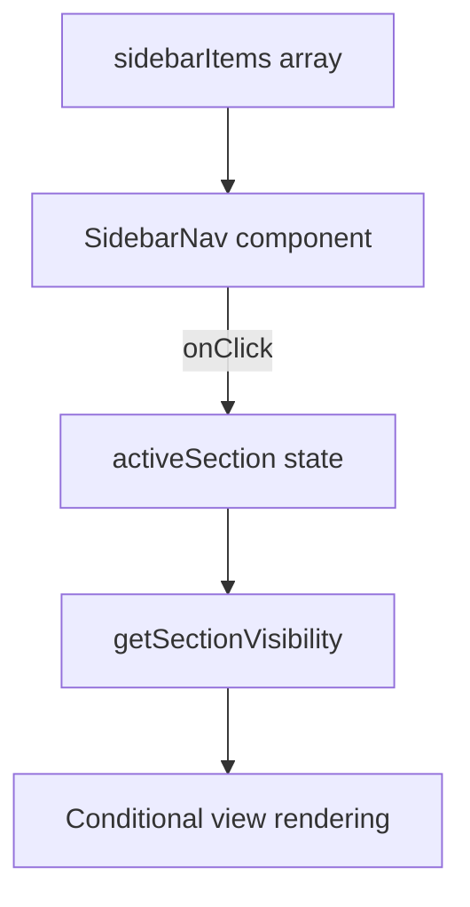

# 4.1 Component Architecture

> **Source files:**
> - `apps/desktop/src/App.tsx` -- Root application shell and state orchestration
> - `apps/desktop/src/app/routes/sections.tsx` -- Section routing and visibility
> - `apps/desktop/src/components/app-shell/sidebar-nav.tsx` -- Sidebar navigation
> - `apps/desktop/src/components/app-shell/panels.tsx` -- Panel re-exports
> - `apps/desktop/src/components/app-shell/types.ts` -- Shared UI types
> - `apps/desktop/src/components/ui/*` -- Radix UI primitives

The Orchestra desktop frontend is a single-page React application rendered inside an Electron shell. The component hierarchy follows a **shell + section** pattern: a persistent app shell (sidebar, top bar) wraps a content area that swaps between discrete section views based on a `SectionID` string-literal union plus helper metadata in `sections.tsx`.

---

### Section Routing

All navigation is driven by the `SectionID` type defined in `apps/desktop/src/app/routes/sections.tsx`. There is no client-side router -- the active section is held in React state and toggled by the sidebar.

| SectionID | Label | Category | Description |
|-----------|-------|----------|-------------|
| `ISSUES` | Tasks | Tracker | Task board and inspector |
| `PROJECTS` | Projects | Workspace | Local workspace grouping |
| `CONSOLE` | Terminals | Runtime | Coding harnesses and development shells |
| `AGENTS` | Agents | Compute | Global agent configurations |
| `WAREHOUSE` | Analytics | Analytics | Token usage and session archives |
| `SANDBOX` | Sandbox | Compute | Remote code execution via unsandbox |
| `SETTINGS` | Settings | System | Backend and migration controls |
| `DOCS` | Documentation | Knowledge | User and engineering guides |

The `getSectionVisibility()` function returns a `SectionVisibility` record mapping each section to a boolean, used by `App.tsx` to conditionally render the appropriate view component.

---

### App Shell Layout



The `App.tsx` component is the root orchestrator. It:

1. Loads backend configuration via `window.orchestraDesktop.getBackendConfig()` (Electron IPC) or falls back to environment variables for web mode.
2. Bootstraps runtime sync (SSE + polling) via `startRuntimeSync()`.
3. Maintains all top-level state: snapshot, issues, projects, agents, timeline, warehouse stats.
4. Renders the sidebar, top bar, and a conditional content area based on `activeSection`.

---

### Component Groups

#### Dashboard Helpers (`components/dashboard/`)

| Component | File | Purpose |
|-----------|------|---------|
| `DashboardOverview` | `DashboardOverview.tsx` | Shared overview surface and metric summary used by shell-level panels |
| `MetricCard` | `DashboardOverview.tsx` | Reusable stat card (active agents, throughput, project load) |

#### Tasks (`widgets/kanban/`, `widgets/issue-detail/`, `components/tasks/`)

| Component | File | Purpose |
|-----------|------|---------|
| `KanbanBoard` | `widgets/kanban/KanbanBoard.tsx` | Drag-and-drop task board with column grouping by state |
| `IssueDetailView` | `widgets/issue-detail/IssueDetailView.tsx` | Full inspector with tabs for details, plan, session output, and generated changes |
| `CreateTaskDialog` | `components/tasks/CreateTaskDialog.tsx` | Modal for creating new tasks |

#### Projects (`components/projects/`)

| Component | File | Purpose |
|-----------|------|---------|
| `ProjectGrid` | `ProjectGrid.tsx` | Grid/list view of all registered projects with stats |
| `ProjectDetailView` | `ProjectDetailView.tsx` | Single project inspector: overview, file tree, git tab |
| `CreateProjectDialog` | `CreateProjectDialog.tsx` | Dialog to register a new project by root path |

#### Agents (`components/agents/`, `widgets/agents/`)

| Component | File | Purpose |
|-----------|------|---------|
| `AgentsDashboard` | `components/agents/AgentsDashboard.tsx` | Entry point that re-exports the provider configuration workspace from `widgets/agents/` |
| `CategoryList` | `widgets/agents/CategoryList.tsx` | Provider category rail used to switch between settings panels |
| `ProviderHeader` | `widgets/agents/ProviderHeader.tsx` | Provider summary header with connection and model context |

Supported providers: `claude`, `codex`, `gemini`, `opencode`, and optional unsandbox-backed tools surfaced through settings/integrations.

#### Analytics (`components/analytics/`)

| Component | File | Purpose |
|-----------|------|---------|
| `AnalyticsDashboard` | `AnalyticsDashboard.tsx` | Token usage charts, session archives, global stats |
| `SessionDetailView` | `SessionDetailView.tsx` | Individual session inspector |

#### Sandbox (`components/sandbox/`)

| Component | File | Purpose |
|-----------|------|---------|
| `SandboxDashboard` | `SandboxDashboard.tsx` | Remote code execution UI via unsandbox platform |

#### Settings (`components/settings/`)

| Component | File | Purpose |
|-----------|------|---------|
| `SettingsCard` | `SettingsCard.tsx` | Backend URL config, API token, workspace migration controls |

#### Terminal / Console (`components/terminal/`)

| Component | File | Purpose |
|-----------|------|---------|
| `TerminalMultiplexer` | `TerminalMultiplexer.tsx` | Multi-pane terminal dock for concurrent agent sessions |
| `TerminalView` | `TerminalView.tsx` | Single terminal instance |

#### Docs (`components/docs/`)

| Component | File | Purpose |
|-----------|------|---------|
| `DocsDashboard` | `DocsDashboard.tsx` | Markdown documentation viewer |

#### Diagrams (`components/diagrams/`)

| Component | File | Purpose |
|-----------|------|---------|
| `D3ArchitectureGraph` | `D3ArchitectureGraph.tsx` | Interactive D3-based architecture visualization |

---

### Sidebar Navigation

The sidebar is defined declaratively in `sections.tsx` via the `sidebarItems` array. Each entry maps an `id` (SectionID), a human-readable `label`, a `description`, and a Lucide icon. The `SidebarNav` component renders these items with keyboard navigation support (arrow keys) and a collapsible rail mode.



---

### Radix UI Primitives

The `components/ui/` directory contains thin wrappers around Radix UI and shadcn/ui primitives used throughout the application:

| Primitive | File | Base |
|-----------|------|------|
| `Badge` | `badge.tsx` | Custom styled badge |
| `Button` | `button.tsx` | Radix slot-compatible button |
| `Card` | `card.tsx` | Card layout (header, content, footer) |
| `Chart` | `chart.tsx` | Recharts wrapper |
| `Dialog` | `dialog.tsx` | Radix Dialog (modal) |
| `ScrollArea` | `scroll-area.tsx` | Radix ScrollArea |
| `Skeleton` | `skeleton.tsx` | Loading placeholder |
| `Table` | `table.tsx` | HTML table with styled variants |
| `TooltipWrapper` | `tooltip-wrapper.tsx` | App-wide tooltip component (`AppTooltip`) |
| `SectionErrorBoundary` | `section-error-boundary.tsx` | Error boundary per section with recovery |

---

### Panel Re-exports

The `components/app-shell/panels.tsx` file acts as a barrel export for top-level view components, keeping imports in `App.tsx` clean:

```typescript
export { DashboardOverview, MetricCard } from '@/components/dashboard/DashboardOverview'
export { SettingsCard } from '@/components/settings/SettingsCard'
export { CreateProjectDialog } from '@/components/projects/CreateProjectDialog'
export { CreateTaskDialog } from '@/components/tasks/CreateTaskDialog'
export { IssueDetailView } from '@widgets/issue-detail/IssueDetailView'
export { KanbanBoard } from '@widgets/kanban/KanbanBoard'
export { OperationsQueueCard } from '@widgets/running/OperationsQueueCard'
```

### Shared Types

The `app-shell/types.ts` module defines two core types used across the component tree:

- **`TimelineItem`** -- `{ type: string; at: string; data: Record<string, unknown> }` representing an SSE event rendered in the timeline.
- **`SidebarItem`** -- `{ id: string; label: string; description: string; icon: LucideIcon }` for sidebar navigation entries.
- **`periodFilters`** -- `['Today', 'Week', 'Month']` tuple for time-scoped data filtering.
