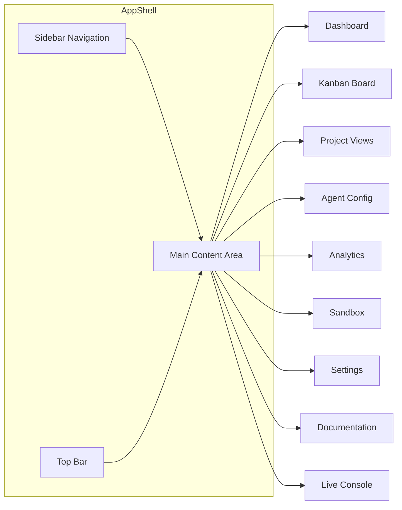
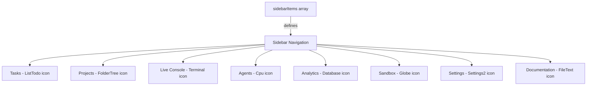
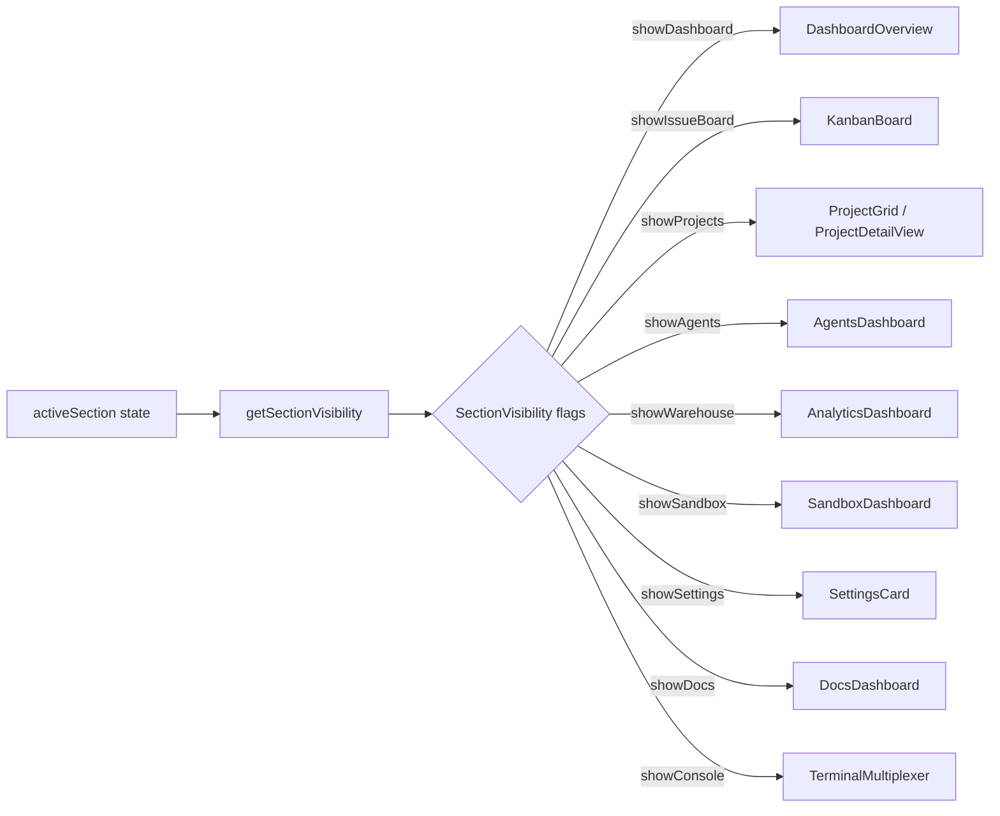

# 5. Component Architecture

> **Source files:**
> - `apps/desktop/src/App.tsx` — Root application component and state orchestration
> - `apps/desktop/src/app/routes/sections.ts` — Section routing, SectionID enum, sidebar items
> - `apps/desktop/src/components/app-shell/` — Shell layout, sidebar, top bar, shared controls
> - `apps/desktop/src/components/ui/` — Radix UI primitive wrappers
> - `apps/desktop/src/components/dashboard/` — Operations hub dashboard
> - `apps/desktop/src/components/agents/` — Agent configuration views
> - `apps/desktop/src/components/projects/` — Project management views
> - `apps/desktop/src/components/warehouse/` — Analytics and session archive views
> - `apps/desktop/src/components/sandbox/` — Remote code execution sandbox
> - `apps/desktop/src/components/settings/` — Backend configuration settings
> - `apps/desktop/src/components/terminal/` — Multi-agent terminal multiplexer
> - `apps/desktop/src/components/tasks/` — Task creation dialog
> - `apps/desktop/src/components/docs/` — Documentation browser
> - `apps/desktop/src/components/diagrams/` — D3-based architecture visualizations

The Orchestra desktop frontend is a React application rendered inside an Electron shell. The component tree follows a top-level App shell pattern where a single `App` component manages global state, delegates section visibility to a routing system based on `SectionID`, and renders domain-specific views conditionally.

---

### App Shell Layout

The root `App` component in `App.tsx` acts as the central orchestrator. It:

1. Initializes backend configuration via `useBackendConfig()` hook (IPC bridge to Electron)
2. Establishes real-time sync with the backend via `startRuntimeSync()`
3. Maintains global state: `snapshot`, `timeline`, `boardIssues`, `agentConfig`, `availableAgents`
4. Delegates rendering to section-specific components based on the active `SectionID`

The visual shell is composed of three regions:



| Shell Component | File | Purpose |
|---|---|---|
| `AppShell` | `@app/layout/AppShell` | Outer layout wrapper with sidebar + content |
| `SidebarNav` | `components/app-shell/sidebar-nav.tsx` | Collapsible icon sidebar |
| `TopBar` | `components/app-shell/top-bar.tsx` | Section title, breadcrumb, status |
| `panels` | `components/app-shell/panels.tsx` | Re-exports: IssueDetailView, CreateTaskDialog, CreateProjectDialog, SettingsCard |

---

### Sidebar Navigation

The sidebar is driven by a static configuration array in `sections.ts`:



Each sidebar item maps to a `SectionID` and uses a Lucide icon:

| SectionID | Label | Icon | Description |
|---|---|---|---|
| `ISSUES` | Tasks | `ListTodo` | Task board and inspector |
| `PROJECTS` | Projects | `FolderTree` | Local workspace grouping |
| `CONSOLE` | Live Console | `Terminal` | Multi-agent terminal dock |
| `AGENTS` | Agents | `Cpu` | Global agent configurations |
| `WAREHOUSE` | Analytics | `Database` | Token usage and session archives |
| `SANDBOX` | Sandbox | `Globe` | Remote code execution via unsandbox |
| `SETTINGS` | Settings | `Settings2` | Backend and migration controls |
| `DOCS` | Documentation | `FileText` | User and engineering guides |

---

### Section Routing (SectionID Enum)

Orchestra does not use a traditional router. Instead, section visibility is computed from a single `activeSection: SectionID` state variable. The `SectionID` type is a string union:

```typescript
type SectionID =
  | 'DASHBOARD' | 'RUNNING' | 'ISSUES' | 'PROJECTS'
  | 'AGENTS'    | 'WAREHOUSE' | 'SANDBOX' | 'SETTINGS'
  | 'DOCS'      | 'CONSOLE'
```

The function `getSectionVisibility(activeSection)` returns a `SectionVisibility` record of booleans. Each section component checks its corresponding flag to determine render:



Each section also carries metadata (label and title) accessed via `getCurrentSectionMeta()`:

| SectionID | Label | Title |
|---|---|---|
| `DASHBOARD` | Operations | Dashboard |
| `RUNNING` | Operations | Running |
| `ISSUES` | Tracker | Tasks |
| `PROJECTS` | Workspace | Projects |
| `AGENTS` | Compute | Agents |
| `WAREHOUSE` | Analytics | Analytics |
| `SANDBOX` | Compute | Sandbox |
| `SETTINGS` | System | Settings |
| `DOCS` | Knowledge | Documentation |
| `CONSOLE` | Runtime | Live Console |

---

### Component Groups

#### Dashboard (`components/dashboard/`)

| Component | File | Purpose |
|---|---|---|
| `DashboardOverview` | `DashboardOverview.tsx` | Operations hub with metric cards, project grid, runtime events panel |
| `MetricCard` | `DashboardOverview.tsx` | Reusable card showing title/value/hint with hover animations |

#### Tasks / Issues (`widgets/issue-detail/`, `components/tasks/`)

| Component | File | Purpose |
|---|---|---|
| `IssueDetailView` | `widgets/issue-detail/IssueDetailView.tsx` | Full-screen issue inspector with tabs |
| `CreateTaskDialog` | `widgets/issue-detail/CreateTaskDialog.tsx` | Dialog for creating new tasks |
| `KanbanBoard` | `@widgets/kanban` | Drag-and-drop Kanban board for issue states |

#### Projects (`components/projects/`)

| Component | File | Purpose |
|---|---|---|
| `ProjectGrid` | `ProjectGrid.tsx` | Card grid of all registered projects |
| `ProjectDetailView` | `ProjectDetailView.tsx` | Single project view: file tree, git tab, Kanban sub-board, GitHub integration |
| `CreateProjectDialog` | `CreateProjectDialog.tsx` | Dialog for registering new project roots |

#### Agents (`components/agents/`)

| Component | File | Purpose |
|---|---|---|
| `AgentsDashboard` | `AgentsDashboard.tsx` | Multi-provider config editor: permissions, model, hooks, MCP servers |

#### Analytics / Warehouse (`components/warehouse/`)

| Component | File | Purpose |
|---|---|---|
| `AnalyticsDashboard` | `AnalyticsDashboard.tsx` | Token usage statistics, provider/model breakdown, session list |
| `SessionDetailView` | `SessionDetailView.tsx` | Individual session inspector with event timeline |

#### Sandbox (`components/sandbox/`)

| Component | File | Purpose |
|---|---|---|
| `SandboxDashboard` | `SandboxDashboard.tsx` | Unsandbox remote code execution interface |

#### Settings (`components/settings/`)

| Component | File | Purpose |
|---|---|---|
| `SettingsCard` | `SettingsCard.tsx` | Backend URL/token config, profile management, workspace migration |

#### Terminal (`components/terminal/`)

| Component | File | Purpose |
|---|---|---|
| `TerminalMultiplexer` | `TerminalMultiplexer.tsx` | Multi-pane terminal dock for watching agent sessions |
| `TerminalView` | `TerminalView.tsx` | Single terminal pane rendering agent log output |

#### Documentation (`components/docs/`)

| Component | File | Purpose |
|---|---|---|
| `DocsDashboard` | `DocsDashboard.tsx` | Browsable documentation tree with markdown rendering |

#### Diagrams (`components/diagrams/`)

| Component | File | Purpose |
|---|---|---|
| `D3ArchitectureGraph` | `D3ArchitectureGraph.tsx` | D3.js force-directed architecture graph visualization |

---

### Radix UI Primitives Usage

The `components/ui/` directory wraps Radix UI primitives with Orchestra-specific styling using Tailwind CSS. These are used throughout all sections:

| Component | File | Radix Primitive |
|---|---|---|
| `Badge` | `badge.tsx` | Custom (no Radix) |
| `Button` | `button.tsx` | Custom (no Radix) |
| `Card` | `card.tsx` | Custom container |
| `Chart` | `chart.tsx` | Recharts integration |
| `Dialog` | `dialog.tsx` | `@radix-ui/react-dialog` |
| `ScrollArea` | `scroll-area.tsx` | `@radix-ui/react-scroll-area` |
| `Skeleton` | `skeleton.tsx` | Animated loading placeholder |
| `Table` | `table.tsx` | HTML table wrappers |
| `AppTooltip` | `tooltip-wrapper.tsx` | `@radix-ui/react-tooltip` |
| `SectionErrorBoundary` | `section-error-boundary.tsx` | React error boundary per section |

All UI primitives follow the shadcn/ui pattern: thin wrapper components that compose Radix headless primitives with Tailwind utility classes, exported for use across the application.
