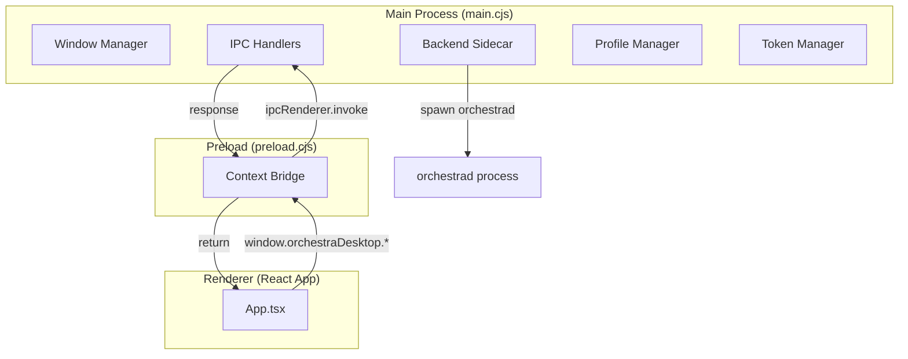
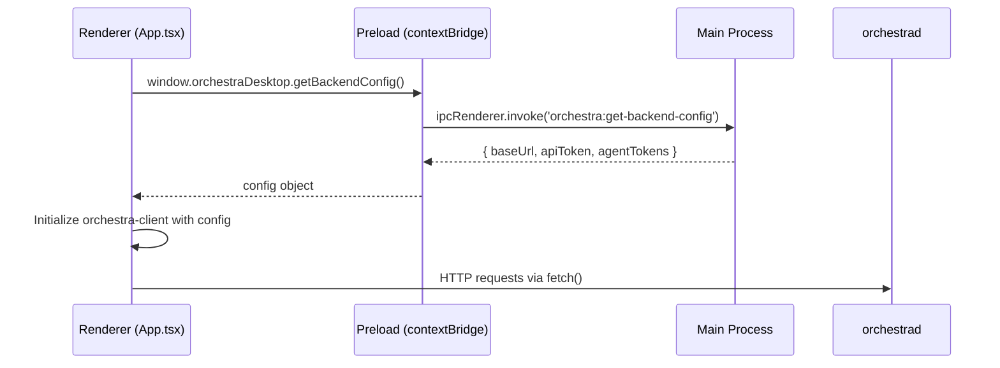
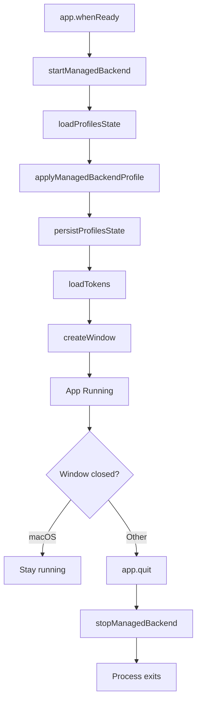

# 5.4 Electron Shell & IPC

> **Source files:**
> - `apps/desktop/electron/main.cjs` -- Main process: window management, backend sidecar, IPC handlers
> - `apps/desktop/electron/preload.cjs` -- Preload script: context bridge to renderer

The Orchestra desktop application uses Electron to wrap the React frontend in a native window with access to the local filesystem, secure credential storage, and a managed backend sidecar process.

---

### Architecture Overview



---

### Main Process

The main process (`electron/main.cjs`) handles five responsibilities:

#### 1. Backend Sidecar Lifecycle

The desktop app can automatically launch and manage an `orchestrad` backend process:

**Startup decision logic:**
- If `ORCHESTRA_MANAGED_BACKEND=1`, always start
- If `ORCHESTRA_MANAGED_BACKEND=0`, never start
- Otherwise, start only when NOT in dev mode (no `VITE_DEV_SERVER_URL`)

**Binary resolution** (`resolveManagedBackendBinaryPath`):
- Checks `ORCHESTRA_BACKEND_BIN` env override first
- In packaged mode: looks in `resources/backend/<platform>-<arch>/orchestrad`
- In dev mode: searches multiple candidate paths relative to the project

**Sidecar startup** (`startManagedBackend`):
1. Finds an available port starting from `ORCHESTRA_SERVER_PORT` (default 4010)
2. Generates a random 48-character hex API token
3. Creates the workspace directory at `<userData>/workspaces`
4. Spawns `orchestrad` with environment variables for host, port, workspace root, and token
5. Polls `/api/v1/state` until the backend responds (20-second timeout)
6. Returns the child process handle and connection config

**Sidecar shutdown** (`stopManagedBackend`):
- Sends `SIGTERM` to the child process
- Falls back to `SIGKILL` after 1.2 seconds if the process does not exit

#### 2. Window Management

```typescript
createWindow() {
  // 1360x900 default, 1024x720 minimum
  // Dark background (#0d1117)
  // Preload script for context isolation
  // No application menu (clean look)
  // Zoom level -3 (~0.6x for design scale)
}
```

The window loads either the Vite dev server URL (development) or the built `dist/index.html` (production).

GPU features (`Vulkan`, `WebGPU`) are enabled for WebGPU-based Whisper inference in the browser.

#### 3. Profile Management

Backend connection profiles are persisted to `<userData>/backend-profiles.json`. Each profile contains:

| Field | Type | Description |
|-------|------|-------------|
| `id` | `string` | Unique profile identifier |
| `name` | `string` | Display name |
| `baseUrl` | `string` | Backend URL |
| `apiToken` | `string` | Authentication token |

The system maintains an `activeProfileId` and supports CRUD operations on profiles. When a managed backend is running, its connection details are injected into the `default` profile.

#### 4. Secure Token Storage

Agent API tokens (for Claude, OpenAI, etc.) are stored in `<userData>/agent-tokens.json` using Electron's `safeStorage` API for OS-level encryption:

- **Persist**: Each token is encrypted with `safeStorage.encryptString()` and stored as base64
- **Load**: Tokens are decrypted with `safeStorage.decryptString()`
- **Fallback**: If encryption is unavailable, tokens are stored in plaintext

#### 5. System Integration

| IPC Channel | Purpose |
|-------------|---------|
| `orchestra:open-external` | Open URL in default browser via `shell.openExternal` |
| `orchestra:open-path` | Open file/folder in OS file manager via `shell.openPath` |
| `orchestra:select-folder` | Native folder picker dialog via `dialog.showOpenDialog` |

---

### Preload Script

The preload script (`electron/preload.cjs`) uses `contextBridge.exposeInMainWorld` to create the `window.orchestraDesktop` API, maintaining context isolation between the renderer and main process.

#### Exposed API

| Method | IPC Channel | Description |
|--------|-------------|-------------|
| `getBackendConfig()` | `orchestra:get-backend-config` | Get active backend URL, token, and agent tokens |
| `setBackendConfig(config)` | `orchestra:set-backend-config` | Update the active profile's connection settings |
| `getBackendProfiles()` | `orchestra:get-backend-profiles` | List all backend connection profiles |
| `setActiveBackendProfile(id)` | `orchestra:set-active-backend-profile` | Switch to a different profile |
| `saveBackendProfile(profile)` | `orchestra:save-backend-profile` | Create or update a profile |
| `deleteBackendProfile(id)` | `orchestra:delete-backend-profile` | Remove a profile |
| `getAgentTokens()` | `orchestra:get-agent-tokens` | Get masked agent tokens (`********`) |
| `setAgentToken(name, value)` | `orchestra:set-agent-token` | Store or delete an agent token |
| `openExternal(url)` | `orchestra:open-external` | Open URL in default browser |
| `openPath(path)` | `orchestra:open-path` | Open path in file manager |
| `selectFolder()` | `orchestra:select-folder` | Show native folder picker |
| `getScaleFactor()` | -- | Returns `1` (no-op, for layout compatibility) |

---

### IPC Bridge Flow



---

### Application Lifecycle



On startup failure (e.g., backend binary not found in packaged mode), the app shows a native error dialog and quits.

---

### Development vs Production

| Aspect | Development | Production |
|--------|------------|------------|
| Content source | Vite dev server (`VITE_DEV_SERVER_URL`) | Built `dist/index.html` |
| Backend sidecar | Disabled by default | Auto-started |
| Binary search | Multiple dev paths | `resources/backend/<target>/` |
| Menu bar | Hidden | Hidden |
| DevTools | Available | Not shown |

---

### Security Configuration

The Electron shell applies several security hardening measures:

| Setting | Value | Purpose |
|---------|-------|---------|
| `nodeIntegration` | `false` | Prevents renderer from accessing Node.js APIs directly |
| `contextIsolation` | `true` | Isolates preload script globals from renderer globals |
| `sandbox` | `false` | Disabled to allow preload script access to Node.js `require` (CJS modules) |
| Application menu | `null` | Removed entirely via `Menu.setApplicationMenu(null)` to prevent default Electron menu exposure |

**Context Bridge isolation**: The renderer can only access main-process functionality through the `window.orchestraDesktop` object defined in the preload script. No raw `ipcRenderer` or Node.js APIs are exposed. Agent tokens returned via `getAgentTokens()` are masked (`********`) to prevent accidental leakage in the renderer.

**Credential encryption**: Agent API tokens are encrypted at rest using Electron's `safeStorage` API, which delegates to the OS keychain (macOS Keychain, Windows DPAPI, or Linux libsecret). If OS-level encryption is unavailable, tokens fall back to plaintext storage.

---

### Build & Packaging Configuration

Packaging is handled by `electron-builder` (configured in `package.json` under the `build` key):

| Field | Value |
|-------|-------|
| `appId` | `com.orchestra.desktop` |
| `productName` | `Orchestra Desktop` |
| `output` | `release/` |
| `files` | `dist/**/*`, `electron/**/*`, `package.json` |
| `extraResources` | `resources/backend` &rarr; bundled as `backend/` in the app resources directory |

**Platform targets:**

| Platform | Formats | Notes |
|----------|---------|-------|
| macOS | `dmg`, `zip` | Universal artifact naming with `${arch}` |
| Windows | `nsis` (x64) | Installer-based distribution |
| Linux | `AppImage`, `deb` | Category: `Utility` |

**Build scripts:**

- `dist:prep` -- Runs `vite build` then stages the backend binary via `scripts/stage-backend-binary.mjs`
- `dist:dir` -- Unpacked build for testing
- `dist:desktop` -- Full packaged build for distribution

---

### Cross-references

- [2.2 Desktop Frontend Architecture](../architecture/desktop.md) -- High-level component hierarchy and how Electron fits into the stack
- [5.2 Orchestra Client & API Layer](client.md) -- The HTTP client that the renderer initializes with config obtained through the IPC bridge
- [5.3 State Management](state-management.md) -- React state layer that consumes backend config from the Electron bridge
- [5.1 UI Components](components.md) -- React components rendered inside the Electron window
- [3.1 API Reference](../api/reference.md) -- REST endpoints that `orchestrad` exposes (polled during sidecar health check)
- [4.2 Backend Configuration](../backend/config.md) -- Backend environment variables passed to the managed sidecar process
