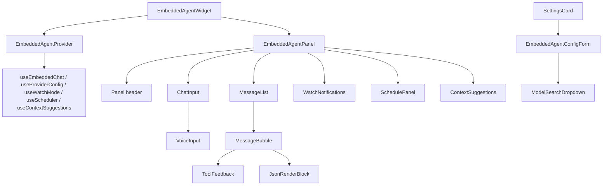

# Embedded Agent — Component Reference

**Location:** `apps/desktop/src/components/embedded-agent/`

---

## Component Map

## Root Components

### EmbeddedAgentWidget

`EmbeddedAgentWidget.tsx` — Top-level component mounted once in `App.tsx`.

**Props:**
- `config: BackendConfig | null` — backend connection config
- `onNavigate: (section: string, id?: string) => void` — app navigation callback
- `onOpenSettings?: () => void` — open settings panel
- `activeSection?: string` — current app section (for context suggestions)
- `selectedProjectId?: string` — current project (for context suggestions)

**Behavior:**
- Renders a floating action button (bottom-right, 56px circle using `/Orchesta.png`)
- Button hidden when panel is open
- Global keyboard shortcut: `Ctrl+.` (or `Cmd+.`) toggles the panel
- Button pulses when streaming or watch mode is active
- Badge shows unread watch-mode notifications

### EmbeddedAgentPanel

`EmbeddedAgentPanel.tsx` — The chat panel shell.

**Layout:** ~420px wide, anchored bottom-right, `z-50`, backdrop blur.

**Sections:**
- **Header:** Clear chat button, close button, watch mode indicator
- **Body:** `MessageList` with scrollable conversation
- **Footer:** `ChatInput` with voice input

### EmbeddedAgentProvider

`EmbeddedAgentProvider.tsx` — React context provider wrapping the widget tree.

**Responsibilities:**
- Assembles all tool sets from factory functions
- Wires `useProviderConfig`, `useEmbeddedChat`, `useWatchMode`, `useScheduler`, `useContextSuggestions`
- Exposes `EmbeddedAgentContextValue` via `useEmbeddedAgent()` hook

**Context value includes:** `messages`, `sendMessage`, `isStreaming`, `stop`, `clearChat`, `isPanelOpen`, `togglePanel`, `providerConfig`, `availableKeys`, `watchMode`, `scheduler`, `contextSuggestions`.

---

## Chat Components

### MessageList

`components/MessageList.tsx` — Scrollable container for chat messages.

- Auto-scrolls to bottom on new messages
- Maps messages to `MessageBubble` components

### MessageBubble

`components/MessageBubble.tsx` — Renders a single chat message.

- **User messages:** Right-aligned, primary background
- **Assistant messages:** Left-aligned, full container width, card background
- Renders markdown via `react-markdown`
- Detects `jsonRenderSpec` on message and renders via `JsonRenderBlock`
- Renders `ToolFeedback` for tool calls/results
- Hides empty assistant bubble while loading (no text + no tool calls yet)
- Removes bubble styling when message contains only tool calls and no text

### ChatInput

`components/ChatInput.tsx` — Text input with send and voice.

- Enter to send, Shift+Enter for newline
- `VoiceInput` button on the right side
- Disabled during streaming (shows stop button instead)

### VoiceInput

`components/VoiceInput.tsx` — Click-to-record microphone button.

- Uses the shared Whisper client from `@/lib/whisper-client`
- Prefers backend STT when `/api/v1/stt/health` reports ready, otherwise falls back to the local worker pipeline
- Visual states: idle, loading model, recording, processing
- Transcription is inserted into the chat input after the second click; user can edit before sending

---

## Tool & Render Components

### ToolFeedback

`components/ToolFeedback.tsx` — Collapsible display for tool call metadata.

- Shows tool name, arguments (collapsed by default), and result summary
- Groups by step index for multi-step chains

### JsonRenderBlock

`components/JsonRenderBlock.tsx` — Custom json-render renderer.

Uses `defineRegistry()` from `@json-render/react` with the agent catalog, but renders via a **custom component tree** — not the library's `<Renderer>`. The registry maps catalog types to Tailwind-styled React components:

- Card, Stack, Divider (layout)
- Metric, Table, Badge, CodeBlock, KeyValue (data display)
- Button, ButtonGroup (interactive — fires catalog actions)
- Alert, Progress (feedback)

Table rendering handles object values in cells and adds horizontal scroll for wide content.

---

## Tier 3 Components

### WatchNotifications

`components/WatchNotifications.tsx` — Displays proactive notifications from orchestrator events.

- Connected via `useWatchMode` hook (SSE subscription)
- Shows inline notifications for completions, failures, retries, stalls, and informational events
- Supports action buttons such as review diff, view issue, view logs, retry, and stop

### SchedulePanel

`components/SchedulePanel.tsx` — UI for scheduled reminders and deferred actions.

- Displays active schedules from `useScheduler`
- Allows cancellation of pending items

### ContextSuggestions

`components/ContextSuggestions.tsx` — Suggested prompts based on current app context.

- Powered by `useContextSuggestions` hook
- Suggestions vary by active section and selected project
- Clicking a suggestion sends it as a chat message

---

## Settings Components

Located in `apps/desktop/src/components/settings/SettingsCard.tsx`:

### EmbeddedAgentConfigForm

Helper component defined inside `SettingsCard.tsx`, rendered under Settings > Integrations tab.

- Provider dropdown (OpenRouter, Claude, OpenAI, Gemini)
- API key input with save and test connection actions
- Model selector via `ModelSearchDropdown`
- Saves provider/model preference to localStorage
- Saves API key to backend via `POST /api/v1/config/agent-providers`

### ModelSearchDropdown

Helper component defined inside `SettingsCard.tsx`, used for the searchable model selector populated from provider APIs.

- Text filter narrows the model list as you type
- Shows loading state while models are being fetched
- Displays model ID and friendly name
- Filters client-side and caps the open dropdown to the first 100 matches
