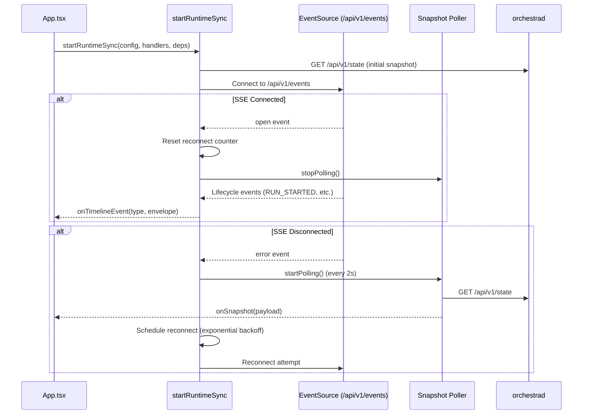
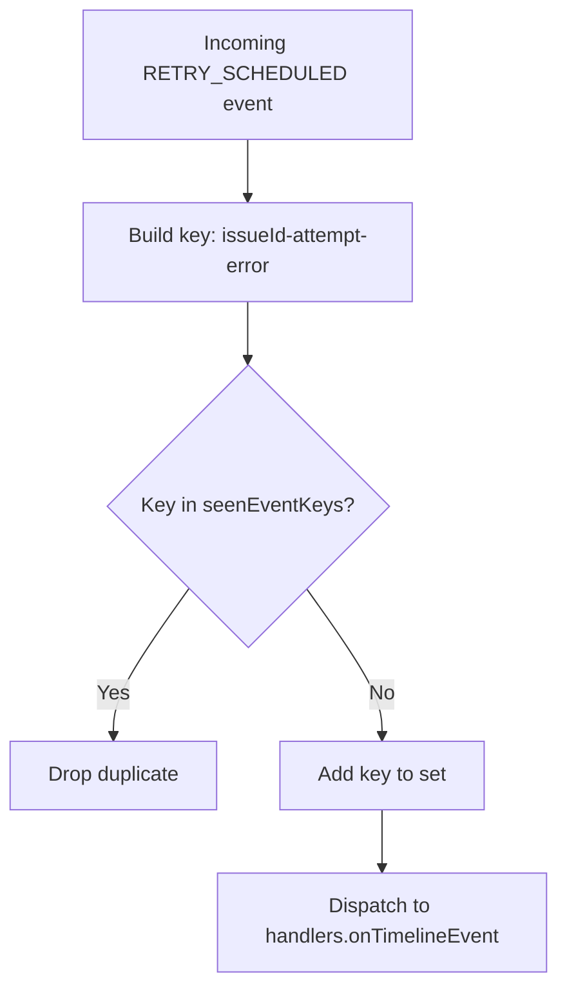

# 5.1 State Management & Runtime Sync

> **Source files:**
> - `apps/desktop/src/lib/runtime-sync.ts` -- SSE connection lifecycle and polling fallback
> - `apps/desktop/src/lib/runtime-store.ts` -- Snapshot diffing and timeline management
> - `apps/desktop/src/App.tsx` -- Top-level state holder and sync consumer

The Orchestra frontend maintains real-time synchronization with the backend through a dual-channel strategy: **Server-Sent Events (SSE)** for streaming lifecycle events and **snapshot polling** as a fallback. The `runtime-sync` module manages the connection lifecycle while `runtime-store` handles state diffing and event deduplication.

---

### Architecture Overview



---

### startRuntimeSync Function

The `startRuntimeSync` function in `runtime-sync.ts` is the entry point. It accepts three arguments:

| Parameter | Type | Purpose |
|-----------|------|---------|
| `config` | `BackendConfig` | Base URL and API token for the backend |
| `handlers` | `RuntimeSyncHandlers` | Callback functions for snapshot, events, status, and errors |
| `deps` | `RuntimeSyncDeps` | Dependency-injected timer and EventSource factories (testable) |

It returns a control object:

```typescript
{ stop: () => void; startPolling: () => void; stopPolling: () => void }
```

### SSE Connection Lifecycle

1. **Initial load**: Immediately fetches a full snapshot via `deps.fetchSnapshot(config)`.
2. **Stream attach**: Creates an EventSource to `/api/v1/events` with optional `?token=` query parameter for authentication.
3. **On open**: Resets the reconnect counter, stops any active polling, and reports `'SSE Live'` status. If this was a reconnection, refetches the full snapshot to ensure consistency.
4. **On snapshot event**: Parses and normalizes the incoming snapshot, then calls `handlers.onSnapshot()`.
5. **On lifecycle events**: Listens for all event types in the `lifecycleEventTypes` array and dispatches normalized envelopes.
6. **On error**: Closes the stream, starts fallback polling, and schedules a reconnection with exponential backoff.

### Lifecycle Event Types

The SSE stream dispatches these event types:

| Event Type | Description |
|------------|-------------|
| `RUN_EVENT` | Generic runtime event |
| `RUN_STARTED` | Agent session began executing |
| `RUN_FAILED` | Agent session encountered a fatal error |
| `RUN_CONTINUES` | Agent session is continuing execution |
| `RUN_SUCCEEDED` | Agent session completed successfully |
| `RETRY_SCHEDULED` | Failed session scheduled for retry |
| `HOOK_STARTED` | Workspace hook began executing |
| `HOOK_COMPLETED` | Workspace hook completed |
| `HOOK_FAILED` | Workspace hook failed |

---

### Reconnection with Exponential Backoff

When the SSE connection drops, the `reconnectDelayMs` function calculates the delay before the next attempt:

```
delay = min(3000 * 2^(attempt-1), 30000)
```

| Attempt | Delay |
|---------|-------|
| 1 | 3s |
| 2 | 6s |
| 3 | 12s |
| 4 | 24s |
| 5+ | 30s (capped) |

During disconnection, snapshot polling runs every **2 seconds** as a fallback to keep the UI current.

---

### Event Deduplication

`RETRY_SCHEDULED` events are deduplicated by a composite key of `(issue_id, attempt, error)`. A `Set<string>` tracks seen keys within a single SSE session, preventing duplicate retry notifications from cluttering the timeline.



---

### Runtime Store

The `runtime-store.ts` module provides two pure functions for state management:

#### applySnapshotUpdate

```typescript
function applySnapshotUpdate(
  previous: SnapshotPayload | null,
  next: SnapshotPayload
): SnapshotPayload
```

Compares the JSON fingerprint of the previous and next snapshots. Returns the **previous reference** if unchanged (preventing unnecessary React re-renders) or the **next snapshot** if different.

#### appendTimelineEvent

```typescript
function appendTimelineEvent(
  previous: TimelineItem[],
  next: TimelineItem,
  maxItems = 50
): TimelineItem[]
```

Prepends a new timeline event, but **deduplicates** against the head item by comparing `type`, `at` (timestamp), and serialized `data`. The timeline is capped at `maxItems` (default 50) entries.

---

### Snapshot Payload Shape

The runtime snapshot returned by `/api/v1/state` and normalized by `normalizeSnapshotPayload` contains:

| Field | Type | Description |
|-------|------|-------------|
| `generated_at` | `string` | ISO timestamp of snapshot generation |
| `counts.running` | `number` | Number of currently running sessions |
| `counts.retrying` | `number` | Number of sessions awaiting retry |
| `running[]` | `RunningEntry[]` | Active session details (issue_id, state, turn_count, etc.) |
| `retrying[]` | `RetryingEntry[]` | Retry queue entries (issue_id, attempt, due_at, error) |
| `codex_totals` | `TokenTotals` | Aggregate token usage (input, output, total, seconds_running) |
| `rate_limits` | `Record \| null` | Current rate limit state |
| `mcp_servers` | `Record<string, string>` | Registered MCP servers |

---

### Integration in App.tsx

The `App.tsx` component wires everything together:

1. Constructs the `BackendConfig` from Electron IPC or environment variables.
2. Calls `startRuntimeSync(config, handlers, deps)` inside a `useEffect`.
3. The `onSnapshot` handler calls `applySnapshotUpdate` and sets the React state.
4. The `onTimelineEvent` handler calls `appendTimelineEvent` to update the timeline.
5. On cleanup (unmount or config change), calls `stop()` to tear down the SSE connection and polling.
