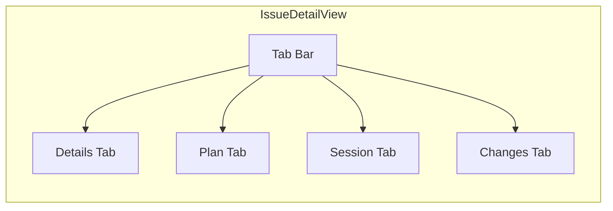

# 4.2 Views & Dashboards

> **Source files:**
> - `apps/desktop/src/App.tsx` -- Section routing and top-level state
> - `apps/desktop/src/widgets/issue-detail/IssueDetailView.tsx` -- Task inspector
> - `apps/desktop/src/widgets/issue-detail/types.ts` -- Issue detail types
> - `apps/desktop/src/widgets/issue-detail/IssueDetailUtils.tsx` -- Diff parsing, plan extraction
> - `apps/desktop/src/components/projects/ProjectGrid.tsx` -- Project listing
> - `apps/desktop/src/components/projects/ProjectDetailView.tsx` -- Project inspector
> - `apps/desktop/src/components/agents/AgentsDashboard.tsx` -- Agent configuration
> - `apps/desktop/src/components/analytics/AnalyticsDashboard.tsx` -- Analytics views
> - `apps/desktop/src/components/docs/DocsDashboard.tsx` -- Documentation browser

The Orchestra desktop application provides several interconnected views for managing task execution, project workspaces, terminals, agent configuration, analytics, documentation, and sandbox execution. Each view corresponds to a sidebar section rendered from `App.tsx`.

---

### Section Model

The sidebar currently exposes these top-level sections:

| Section ID | Label | Purpose |
|------------|-------|---------|
| `ISSUES` | Tasks | Kanban board and task inspector |
| `PROJECTS` | Projects | Repository management, files, and git workflows |
| `CONSOLE` | Terminals | Embedded terminal tabs |
| `AGENTS` | Agents | Global agent/provider configuration |
| `WAREHOUSE` | Analytics | Usage analytics and session inspection |
| `SANDBOX` | Sandbox | Remote execution via unsandbox |
| `SETTINGS` | Settings | Backend profiles, integrations, notifications, and shortcuts |
| `DOCS` | Documentation | In-app docs browser |

---

### Issue Detail View (Task Inspector)

**Component:** `IssueDetailView`
**Section:** Opened from the `ISSUES` board as a modal inspector

The issue detail view is the main task inspector. It provides a multi-tab interface for individual tasks with lifecycle controls, stored plan display, live session output, and worktree diff inspection.

#### IssueDetailResult Type

The inspector works with a flexible issue type:

| Field | Type | Description |
|-------|------|-------------|
| `id` / `issue_id` | `string` | Internal identifier |
| `identifier` / `issue_identifier` | `string` | Display identifier |
| `title` | `string` | Task title |
| `description` | `string` | Markdown description (editable) |
| `state` | `string` | Current workflow state |
| `assignee_id` | `string` | Assigned agent |
| `project_id` | `string` | Parent project |
| `branch_name` | `string` | Git branch for this task |
| `url` | `string` | External tracker URL |
| `provider` | `string` | Agent provider (claude, codex, etc.) |
| `disabled_tools` | `string[]` | Tools disabled for this task |
| `feedback` | `string` | Stored review feedback |
| `pr_url` | `string` | Linked pull request URL |
| `plan` | `string` | Backend-stored markdown plan |

#### Tabs

**Details** -- Displays task metadata, editable title/description in Backlog only, assignee/provider state, and review controls such as Create PR, View PR, Request Changes, and Close when applicable. Creating a PR from Review currently updates the task with the PR URL and advances it to Done.

**Plan** -- Renders the backend-stored markdown plan as checkbox items. The backend updates this plan during planning, during execution progress, and again when a run completes.

**Session** -- Shows live PTY output while the issue is running, and historical logs once the run is complete.

**Changes** -- Shows the issue worktree diff generated by the agent session via `fetchIssueDiff()`. Diffs are parsed into per-file hunks with syntax highlighting.

#### Operational Plan Extraction

The `IssueDetailUtils.tsx` module extracts structured plan items from markdown:

- `extractOperationalPlanItems()` -- Parses checkbox lists from the description
- `extractPlanFromText()` -- Extracts plan items from freeform text
- `parseDiff()` -- Parses unified diff format into `DiffFile[]` structures

---

### Project Management View

**Components:** `ProjectGrid`, `ProjectDetailView`
**Section:** `PROJECTS`

#### ProjectGrid

Displays all registered projects in either grid or list layout. Each project card shows:

- Project name and root path
- Activity level indicator (High / Active / Low / Idle based on session count thresholds)
- Token usage formatted with SI suffixes (k, M)
- Session statistics from `ProjectStats`

Activity thresholds:

| Sessions | Level | Visual |
|----------|-------|--------|
| 20+ | High | Green with pulse animation |
| 5-19 | Active | Primary color |
| 1-4 | Low | Amber |
| 0 | Idle | Muted |

#### ProjectDetailView

The single-project inspector currently has three tabs:

| Tab | Content |
|-----|---------|
| **Overview** | Project metadata, connectivity state, GitHub issue list, and project-scoped kanban board |
| **Files** | Interactive file tree browser with filtering, lazy folder loading, and content preview |
| **Git** | Branch/status/diff/stash/conflict/PR workflows via `GitTab` |

The project view also handles:

- GitHub connect/disconnect flows
- file-tree refresh and preview
- project deletion confirmation
- jumping from project work into terminal tabs

---

### Agent Configuration Dashboard

**Component:** `AgentsDashboard`
**Section:** `AGENTS`

Provides a provider-native configuration interface for the supported agent CLIs. The `components/agents/AgentsDashboard.tsx` entry point re-exports the widget implementation from `src/widgets/agents/`.

| Provider | Description |
|----------|-------------|
| `claude` | Anthropic's Claude Code -- deep reasoning and careful analysis |
| `codex` | OpenAI's Codex -- fast iteration and broad knowledge |
| `gemini` | Google's Gemini CLI -- multimodal and context-aware |
| `opencode` | OpenCode -- provider-configured JSON and markdown resources |

The current agent dashboard is organized into provider-oriented categories and panels rather than a single flat form. Each provider is treated as its own domain and maps to the provider's real config files and resource layouts.

Current provider domains:

- `claude`: dedicated settings, instructions, hooks, rules, skills, and sub-agent panels backed by Claude-specific routes.
- `codex`: dedicated panels for config, approvals, models/providers, environment, profiles, instructions, sub-agents, skills, hooks, MCP, and rules.
- `gemini`: dedicated panels for settings, models, permissions, context, commands, and MCP, backed by `settings.json`, `GEMINI.md`, and command files.
- `opencode`: dedicated panels for config, models, instructions, permissions, agents, commands, skills, and MCP, backed by merged `opencode.json` config plus markdown resources.

Shared normalized APIs still exist for cross-provider concerns:

- **Model config** (`fetchProviderModel` / `updateProviderModel`)
- **Permissions** (`fetchProviderPermissions` / `updateProviderPermissions`)
- **MCP Servers** (`fetchProviderMCPServers` / `addProviderMCPServer` / `updateProviderMCPServer` / `toggleProviderMCPServer` / `deleteProviderMCPServer`)
- **Hooks** (`fetchProviderHooks` / `updateProviderHooks`)

But the dashboard no longer treats Codex, Gemini, and OpenCode as one generic file editor with light provider labels, and the last shared non-Claude config panel has been removed.

---

### Analytics Dashboard

**Components:** `AnalyticsDashboard`, `SessionDetailView`
**Section:** `WAREHOUSE`

The analytics area is no longer just a warehouse summary. `AnalyticsDashboard` exposes three views:

| View | Purpose |
|------|---------|
| `executive` | High-level spend, usage, and ROI summaries |
| `operational` | Session-level inspection and operational health |
| `optimization` | Cost-efficiency and optimization guidance |

It pulls data through `useAnalyticsData()` and combines `/warehouse/stats` with analytics-specific endpoints. `SessionDetailView` provides drill-down for individual sessions.

---

### Sandbox Dashboard

**Component:** `SandboxDashboard`
**Section:** `SANDBOX`

Provides a UI for remote code execution via the unsandbox platform. Manages unsandbox configuration, execution requests, and remote session/service monitoring.

---

### Documentation Browser

**Component:** `DocsDashboard`
**Section:** `DOCS`

The docs view is an in-app documentation browser backed by `/api/v1/docs` and `/api/v1/docs/*`. It supports:

- tree navigation through the docs hierarchy
- markdown rendering with GitHub-flavored markdown
- generated table-of-contents navigation
- authenticated image loading for doc assets
- Mermaid and D3-based diagram rendering inline

---

### Supporting Widgets

Additional widget modules used across views:

| Widget | Location | Used By |
|--------|----------|---------|
| `KanbanBoard` | `widgets/kanban/` | ISSUES section, ProjectDetailView |
| `OperationsQueueCard` | `widgets/running/` | Running-queue summaries embedded in task and operations surfaces |
| `GitTab` | `widgets/git/` | ProjectDetailView |
| `TerminalMultiplexer` | `components/terminal/` | CONSOLE section |

`RUNNING` is no longer a top-level sidebar section; running activity is surfaced through the task board, analytics, and inspector flows.
