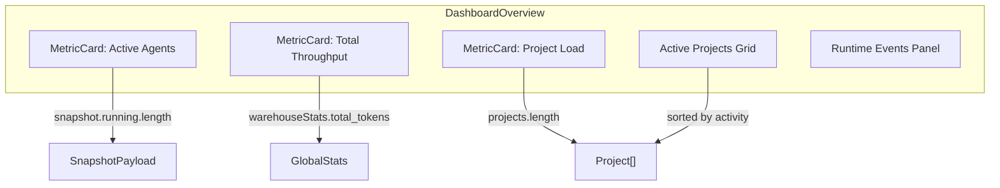
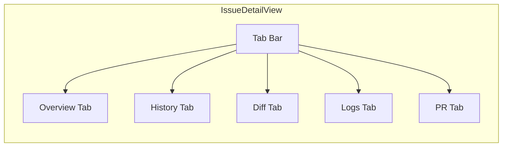
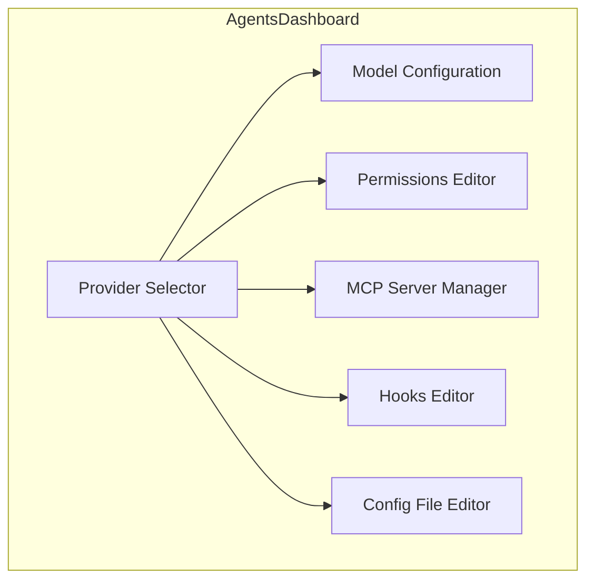

# 4.2 Views & Dashboards

> **Source files:**
> - `apps/desktop/src/components/dashboard/DashboardOverview.tsx` -- Operations hub
> - `apps/desktop/src/widgets/issue-detail/IssueDetailView.tsx` -- Task inspector
> - `apps/desktop/src/widgets/issue-detail/types.ts` -- Issue detail types
> - `apps/desktop/src/widgets/issue-detail/IssueDetailUtils.tsx` -- Diff parsing, plan extraction
> - `apps/desktop/src/components/projects/ProjectGrid.tsx` -- Project listing
> - `apps/desktop/src/components/projects/ProjectDetailView.tsx` -- Project inspector
> - `apps/desktop/src/components/agents/AgentsDashboard.tsx` -- Agent configuration

The Orchestra desktop application provides several interconnected views for managing machine learning agent operations. Each view corresponds to a sidebar section and renders as the main content area.

---

### Dashboard View (Operations Hub)

**Component:** `DashboardOverview`
**Section:** `DASHBOARD`

The operations hub is the landing page. It displays three metric cards at the top, an active projects grid, and a runtime events panel.

#### Metric Cards

| Card | Data Source | Description |
|------|------------|-------------|
| Active Agents | `snapshot.running.length` | Number of agent sessions currently executing |
| Total Throughput | `warehouseStats.total_tokens` | Cumulative tasks finalized since epoch |
| Project Load | `projects.length` | Number of repositories managed |

#### Project Sorting

Projects in the grid are sorted by:
1. **Active sessions** -- projects with running agent sessions appear first
2. **Session count** -- projects with more total sessions rank higher
3. **Alphabetical** -- fallback sort by project name

Each project card displays the project name, root path, in-progress session count, and cumulative token usage.

---

### Issue Detail View (Task Inspector)

**Component:** `IssueDetailView`
**Section:** Opened as an overlay from the `ISSUES` kanban board

The issue detail view is the most complex component in the application. It provides a multi-tab inspector for individual tasks with full lifecycle management.

#### IssueDetailResult Type

The inspector works with a flexible issue type:

| Field | Type | Description |
|-------|------|-------------|
| `id` / `issue_id` | `string` | Internal identifier |
| `identifier` / `issue_identifier` | `string` | Display identifier |
| `title` | `string` | Task title |
| `description` | `string` | Markdown description (editable) |
| `state` | `string` | Current workflow state |
| `assignee_id` | `string` | Assigned agent |
| `project_id` | `string` | Parent project |
| `branch_name` | `string` | Git branch for this task |
| `url` | `string` | External tracker URL |
| `provider` | `string` | Agent provider (claude, codex, etc.) |
| `disabled_tools` | `string[]` | Tools disabled for this task |

#### Tabs

**Overview** -- Displays the task description with an inline markdown editor (toggle between edit and preview modes), agent assignment selector, state management, and an operational plan extracted from the description.

**History** -- Fetches and displays the issue's activity timeline via `fetchIssueHistory()`. Each entry shows the event kind, message, timestamp, provider, and token usage (input/output).

**Diff** -- Shows the workspace diff generated by the agent session via `fetchIssueDiff()`. Diffs are parsed into per-file hunks with syntax highlighting.

**Logs** -- Raw agent session logs fetched via `fetchIssueLogs()`.

**PR** -- GitHub pull request creation and management. Supports creating PRs from the task's branch, viewing PR status, and managing the merge lifecycle.

#### Operational Plan Extraction

The `IssueDetailUtils.tsx` module extracts structured plan items from task descriptions using markdown parsing:

- `extractOperationalPlanItems()` -- Parses checkbox lists from the description
- `extractPlanFromText()` -- Extracts plan items from freeform text
- `parseDiff()` -- Parses unified diff format into `DiffFile[]` structures

---

### Project Management View

**Components:** `ProjectGrid`, `ProjectDetailView`
**Section:** `PROJECTS`

#### ProjectGrid

Displays all registered projects in either grid or list layout. Each project card shows:

- Project name and root path
- Activity level indicator (High / Active / Low / Idle based on session count thresholds)
- Token usage formatted with SI suffixes (k, M)
- Session statistics from `ProjectStats`

Activity thresholds:

| Sessions | Level | Visual |
|----------|-------|--------|
| 20+ | High | Green with pulse animation |
| 5-19 | Active | Primary color |
| 1-4 | Low | Amber |
| 0 | Idle | Muted |

#### ProjectDetailView

The single-project inspector has three tabs:

| Tab | Content |
|-----|---------|
| **Overview** | Project stats, GitHub issue list, kanban board scoped to this project |
| **Files** | Interactive file tree browser with content preview (`fetchProjectTree`, `fetchProjectFileContent`) |
| **Git** | Git history, status, diff viewer, branch management via `GitTab` widget |

Props include handlers for issue CRUD, session stopping, terminal navigation, and project deletion.

---

### Agent Configuration Dashboard

**Component:** `AgentsDashboard`
**Section:** `AGENTS`

Provides a per-provider configuration interface for the four supported agent providers:

| Provider | Description |
|----------|-------------|
| `claude` | Anthropic's Claude Code -- deep reasoning and careful analysis |
| `codex` | OpenAI's Codex -- fast iteration and broad knowledge |
| `gemini` | Google's Gemini CLI -- multimodal and context-aware |
| `opencode` | OpenCode -- JSON-formatted agent sessions |

For each provider, the dashboard manages:

- **Model config** (`fetchProviderModel` / `updateProviderModel`) -- model name, effort level, temperature
- **Permissions** (`fetchProviderPermissions` / `updateProviderPermissions`) -- approval mode, allow/deny/ask tool lists, sandbox config
- **MCP Servers** (`fetchProviderMCPServers` / `addProviderMCPServer` / `deleteProviderMCPServer`) -- per-provider MCP server registration
- **Hooks** (`fetchProviderHooks` / `updateProviderHooks`) -- lifecycle hooks (event matchers, commands, timeouts)
- **Config files** (`fetchAgentConfigs` / `updateAgentConfigByPath`) -- raw configuration file editor with markdown preview

---

### Analytics Dashboard

**Components:** `AnalyticsDashboard`, `SessionDetailView`
**Section:** `WAREHOUSE`

The analytics view displays aggregate token usage statistics and session archives fetched from `/api/v1/warehouse/stats`. The `SessionDetailView` provides detailed inspection of individual completed sessions.

---

### Sandbox Dashboard

**Component:** `SandboxDashboard`
**Section:** `SANDBOX`

Provides a UI for remote code execution via the unsandbox platform. Manages unsandbox API key configuration, code execution with language selection, and session/service monitoring.

---

### Supporting Widgets

Additional widget modules used across views:

| Widget | Location | Used By |
|--------|----------|---------|
| `KanbanBoard` | `widgets/kanban/` | ISSUES section, ProjectDetailView |
| `OperationsQueueCard` | `widgets/running/` | RUNNING section |
| `GitTab` | `widgets/git/` | ProjectDetailView |
| `TerminalMultiplexer` | `components/terminal/` | CONSOLE section |
