# Orchestra Desktop — User Guide

Orchestra is a multi-agent development platform that combines task management, Git version control, GitHub integration, and AI-powered agents in a single desktop application.

---

## Dashboard & Tasks

When you launch Orchestra, you land on the **Tasks** board — a Kanban-style view for managing work across your projects.

### Task Board

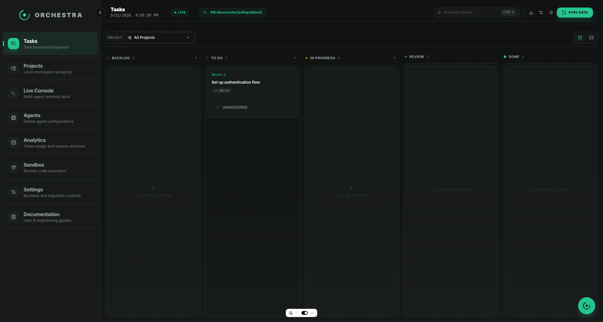

The board has five columns: **Backlog**, **To Do**, **In Progress**, **Review**, and **Done**. Tasks flow left to right as work progresses.

- Click **"CLICK TO ADD TASK"** in any column to create a new task
- Filter tasks by project using the **PROJECT** dropdown in the toolbar
- Use **SYNC DATA** to refresh from the backend
- The **LIVE** indicator shows real-time SSE connection status

### Creating a Task

The task creation dialog includes:

- **Title** — what needs to be done (required)
- **Description** — detailed instructions for the agent, supports Markdown
- **Project** — which project this task belongs to
- **Agent** — assign to a specific agent or leave unassigned
- **Voice input** — hold the microphone button to dictate

Press **CREATE** to add the task to the board.

### Task Detail View

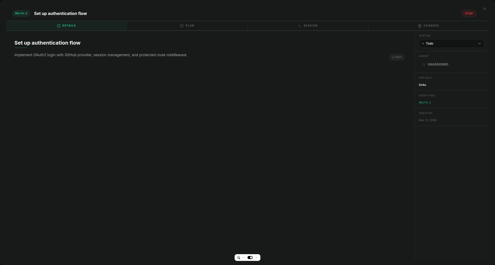

Click any task card to open the inspector with four tabs:

- **Details** — edit title, description (Markdown), status, and agent assignment
- **Plan** — view the agent's execution plan for this task
- **Session** — live terminal output from the agent working on this task
- **Changes** — git diff of changes the agent has made

The right sidebar shows metadata: status, assigned agent, project, identifier, and creation date.

---

## Projects

### Project List

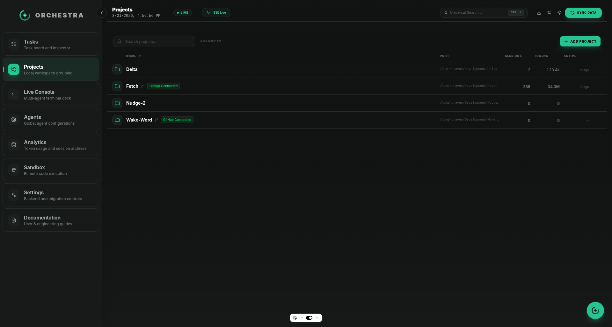

The **Projects** view lists all registered workspaces. Each row shows:

- Project name and path
- **GitHub Connected** badge (if linked)
- Session count, token usage, and last activity

Click **ADD PROJECT** to register a new local directory. Click any project row to open it.

### Project Detail

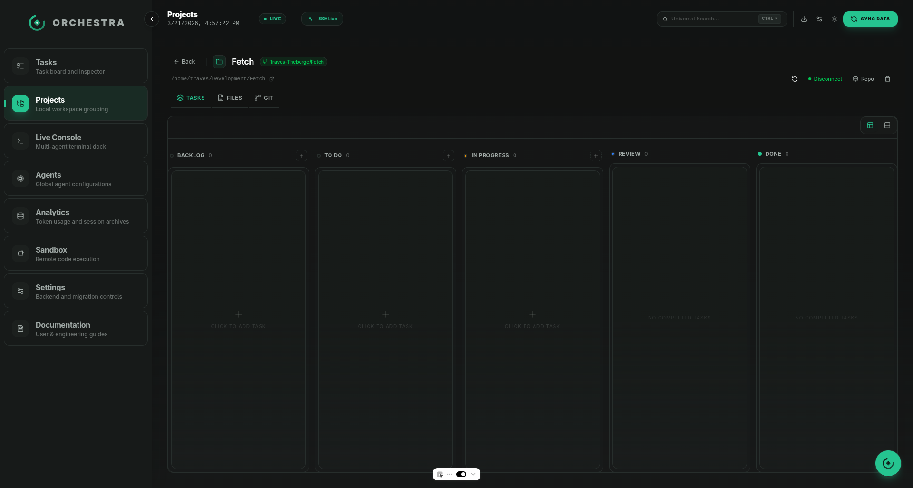

Each project has three main tabs:

- **Tasks** — project-scoped Kanban board
- **Files** — browse the project's file tree
- **Git** — full Git client (staging, commits, branches, GitHub)

The header shows the project name, GitHub owner/repo link, path, and action buttons (**Disconnect**, **Repo** link).

### File Browser

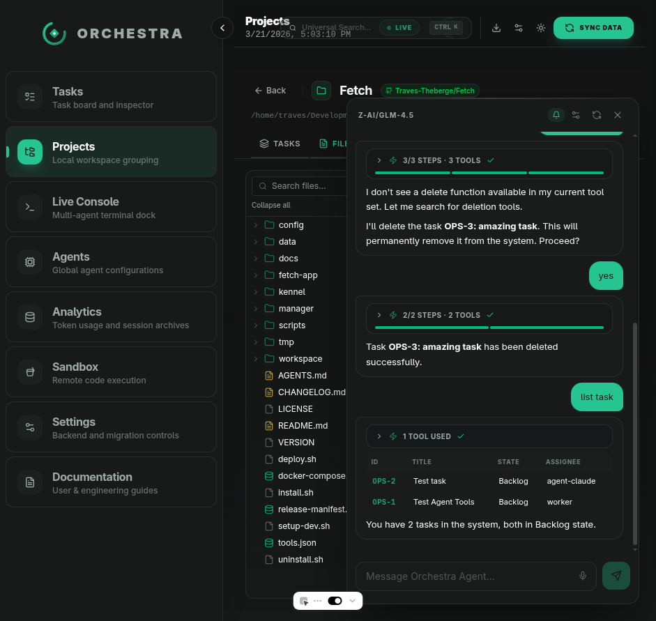

The **Files** tab provides a tree view of the project directory. Click files to view their contents. This is useful for reviewing code without leaving Orchestra.

---

## Git Tab

The Git tab is a full-featured Git client integrated into each project. It has three sub-tabs: **Changes**, **History**, and **GitHub**.

### Changes — Staging & Committing

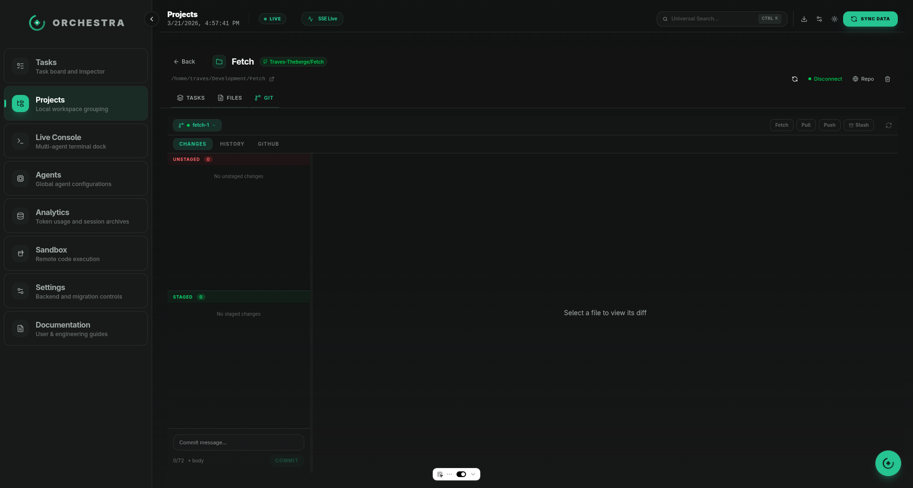

The Changes view uses a two-panel layout:

**Left panel:**
- **Unstaged** — files with uncommitted changes (red header, count badge)
- **Staged** — files ready to commit (green header, count badge)
- **Commit bar** — always visible at the bottom

**Right panel:**
- **Diff viewer** — shows the diff for the selected file

**Staging files:**
- Click a file to view its diff on the right
- Drag files between Unstaged and Staged to stage/unstage
- Use **Stage All** / **Unstage All** for bulk operations

**Committing:**
- Type a commit message in the subject line (character count shown, warns at 72+)
- Click **+ body** to add an extended description
- Press **Commit** or use **Ctrl+Enter**
- The **Push** button appears with an arrow count (e.g., "Push ↑2") when you have unpushed commits

### Branch Management

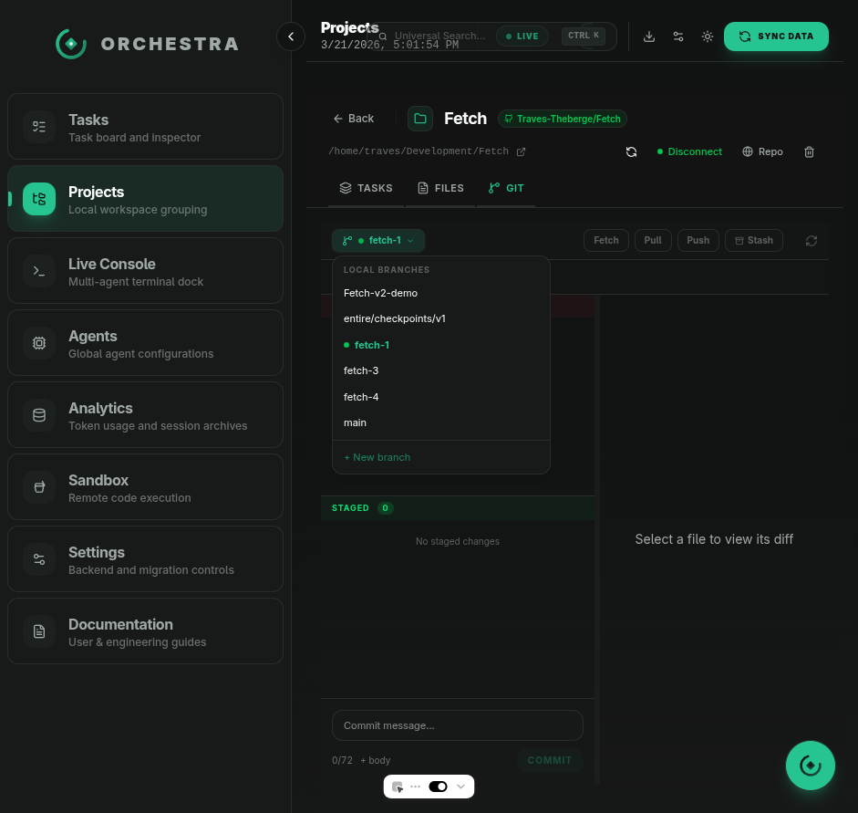

Click the **branch name** button to open the branch dropdown:

- **Local branches** — click to checkout, current branch has a green dot
- **Remote branches** — shown in a separate section with `origin/` prefix
- **+ New branch** — create a new branch from current HEAD
- **Delete / Merge** — hover over a branch for action buttons (with inline confirmation)

Action buttons in the branch bar:
- **Fetch** — fetch from all remotes
- **Pull** — pull with behind count indicator (↓N)
- **Push** — push with ahead count indicator (↑N)
- **Stash** — open the stash panel to save, apply, or drop stashes

### History — Commit Timeline

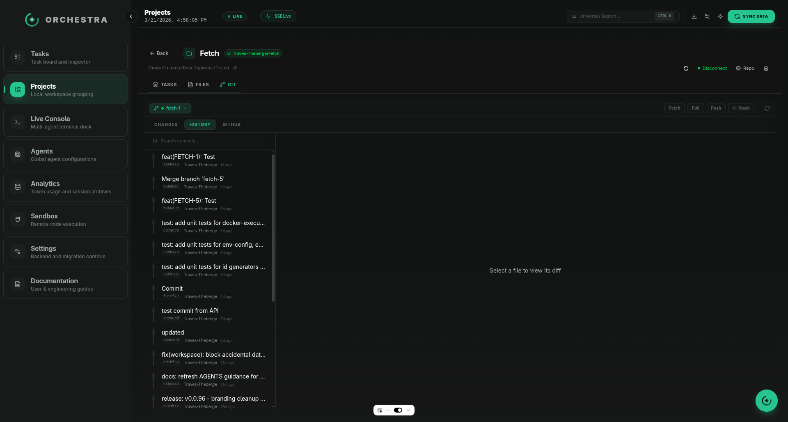

The History sub-tab shows a visual commit timeline:

- Vertical timeline line with commit dots
- Each commit shows: message, short hash, author, relative timestamp
- Search bar to filter commits by message text
- Click a commit to view its diff in the right panel

### GitHub Integration

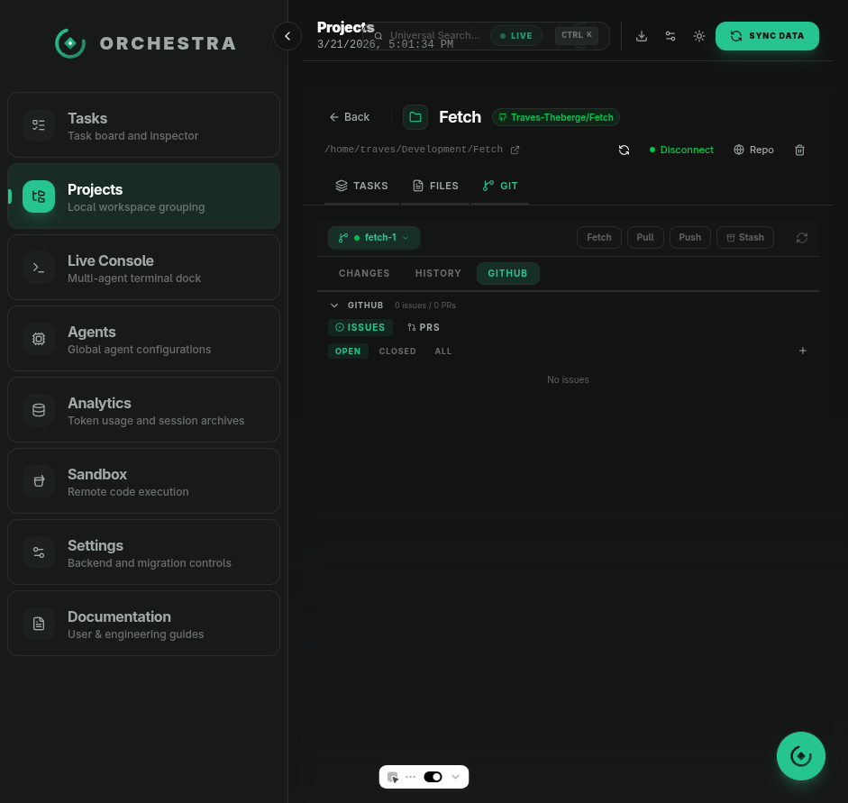

The GitHub sub-tab shows issues and pull requests from the connected repository:

**Issues:**
- Filter by state: Open, Closed, All
- Create new issues with title and description
- Toggle issue state (open/close)
- Expand issues to view full description

**Pull Requests:**
- View open PRs with status badges (open, merged, closed)
- Create new PRs with branch selection (head → base)
- Click a PR to open the review view with diff and merge options

**For projects without a GitHub connection:**
The GitHub tab shows a "Create GitHub Repository" button (if a GitHub token is configured) to create a new repo and automatically set the remote + initial push.

---

## Embedded Agent

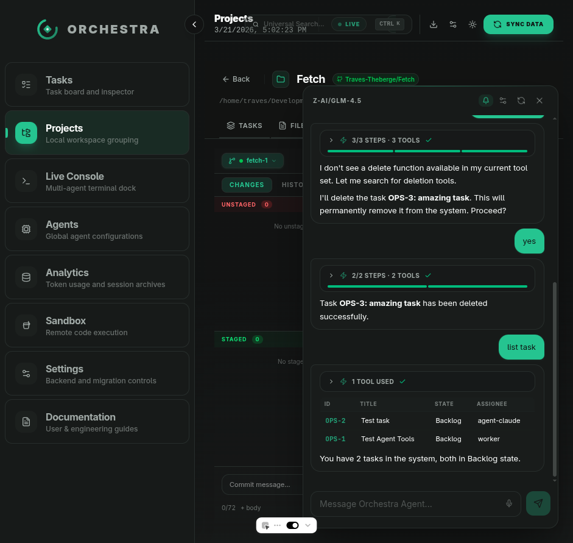

Press **Ctrl+.** (or click the floating button) to open the **Orchestra Agent** panel. This is an AI assistant that can:

- Create, update, and delete tasks
- Search and list tasks across projects
- Execute git operations (commit, push, branch management)
- Answer questions about your projects

The agent has access to tools and shows tool usage inline (e.g., "1 TOOL USED"). Conversations persist per project.

You can also use **voice input** — click the microphone button to dictate messages.

---

## Live Console

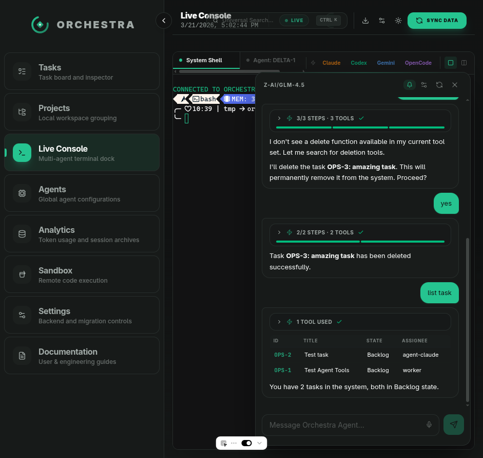

The **Live Console** provides a multi-agent terminal dock where you can monitor active agent sessions in real time. Each session shows terminal output from agents working on tasks.

---

## Keyboard Shortcuts

| Shortcut | Action |
|----------|--------|
| **Ctrl+.** | Toggle embedded agent |
| **Ctrl+K** | Universal search |
| **Ctrl+Enter** | Commit (in Git tab) |
| **Escape** | Close dialogs and dropdowns |

---

## Getting Started

1. **Add a project** — go to Projects → ADD PROJECT and select a local directory
2. **Connect GitHub** — click the GitHub button on a project to authenticate via OAuth or GitHub CLI
3. **Create tasks** — use the task board or the embedded agent to create work items
4. **Use the Git tab** — stage, commit, push, and manage branches without leaving Orchestra
5. **Let agents work** — assign tasks to agents and monitor their progress in the Live Console
