# Orchestra Desktop — User Guide

Orchestra combines task orchestration, local project management, Git/GitHub workflows, analytics, terminals, and an embedded assistant in a single desktop application.

---

## Task Workflow

The current desktop workflow centers on a five-state board. Tasks still move through the same broad lifecycle, but the desktop now combines manual drag transitions with backend-enforced rules and automatic state changes after agent execution.

```
BACKLOG → TODO → IN PROGRESS → REVIEW → DONE
```

### Task Board

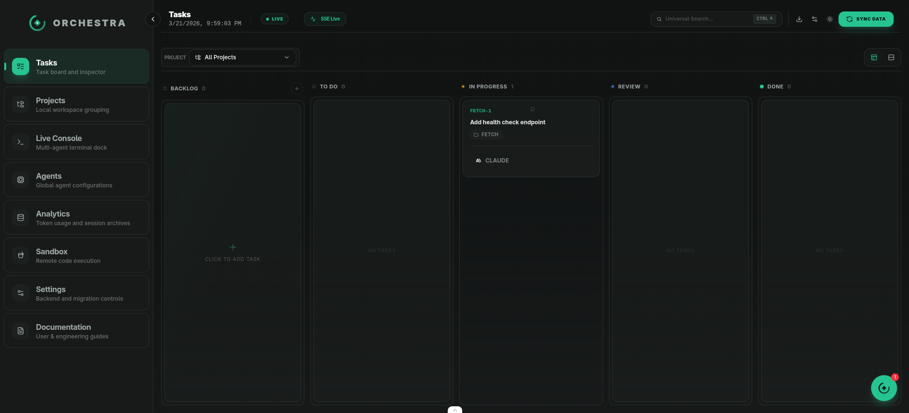

The Kanban board has five columns:

- **Backlog** — drafting area where new tasks land
- **Todo** — planning queue; moving here dispatches the agent
- **In Progress** — active execution
- **Review** — human review, PR creation, and feedback loop
- **Done** — completed/closed task

The toolbar includes task creation, project filtering, and a board/list toggle.

### Creating a Task

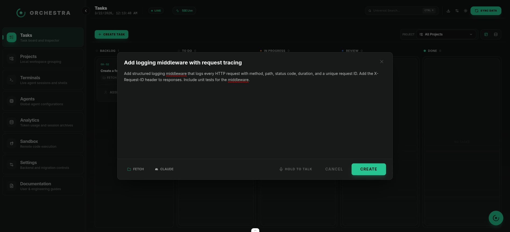

Click **Create Task** in the toolbar. The task is created in **Backlog** and can then be prepared for dispatch.

- **Title** — what needs to be done
- **Description** — detailed instructions for the agent
- **Project** — which codebase the agent works in
- **Agent** — which AI agent to assign (Claude, Codex, Gemini, OpenCode)

### Backlog — The Staging Area

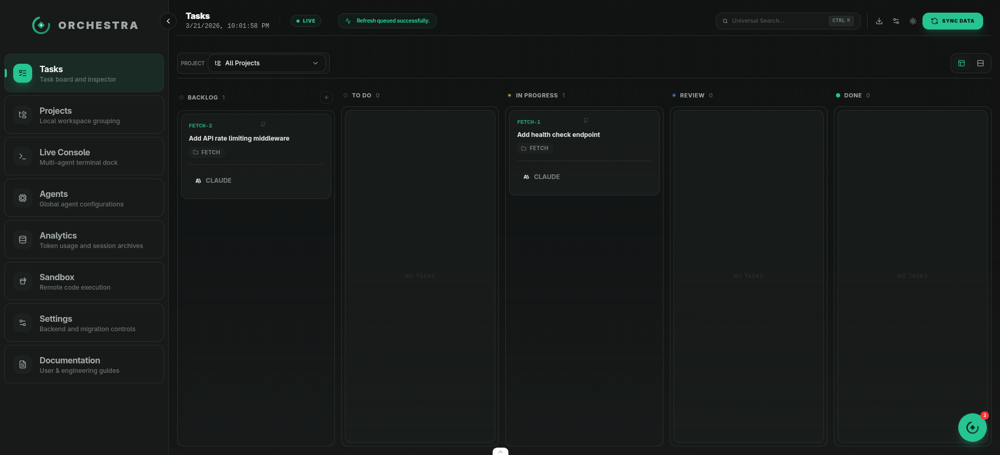

Tasks in Backlog are fully editable drafts. This is the only state where the key task fields remain editable.

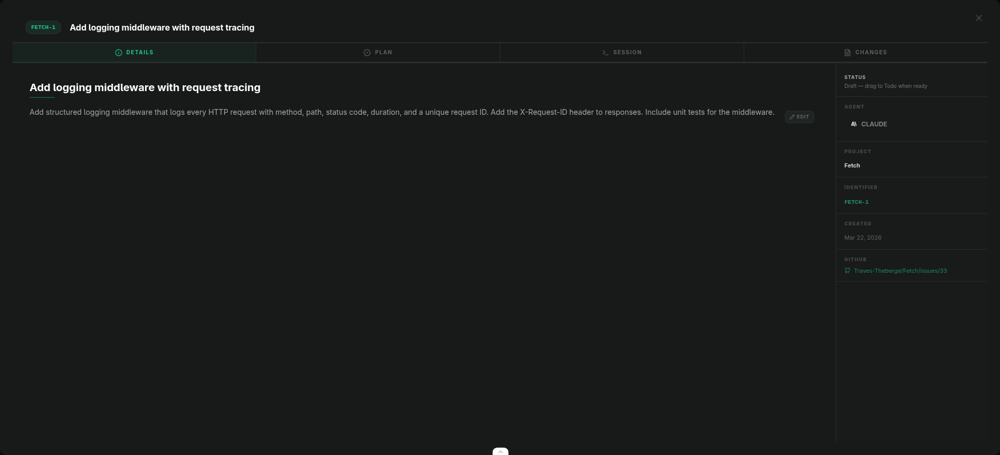

The inspector shows:
- Editable title and description (with Edit button)
- Agent and project selectors
- Status: **"Draft — drag to Todo when ready"**
- GitHub link when the task is connected to an external GitHub issue

**Moving to Todo:** Drag the task card from Backlog to Todo. The backend rejects the transition unless title, description, assignee, and project are all present.

### Todo — Planning Phase

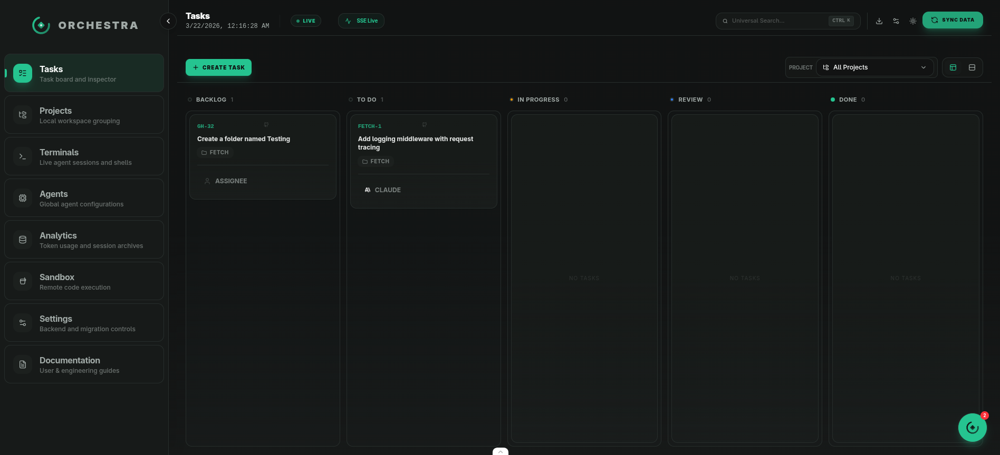

When a task enters Todo, the backend dispatches the task to the selected agent.

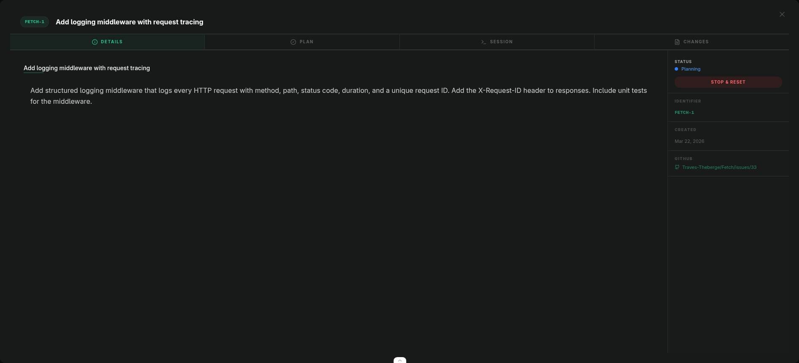

The inspector shows the task metadata, extracted plan, session output, generated changes, and state-specific controls. Once the task leaves Backlog, the title/description/assignee/project fields become locked.


The agent uses Todo as the planning stage. On a successful planning run, the backend auto-advances the task to **In Progress**; some UI surfaces also still expose manual promotion controls.

### In Progress — Execution Phase

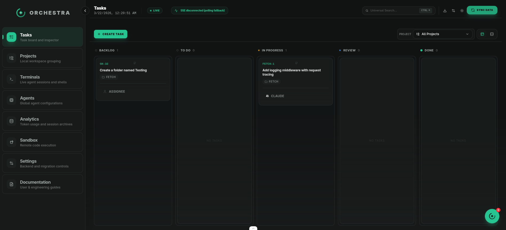

The agent executes the task in this state.

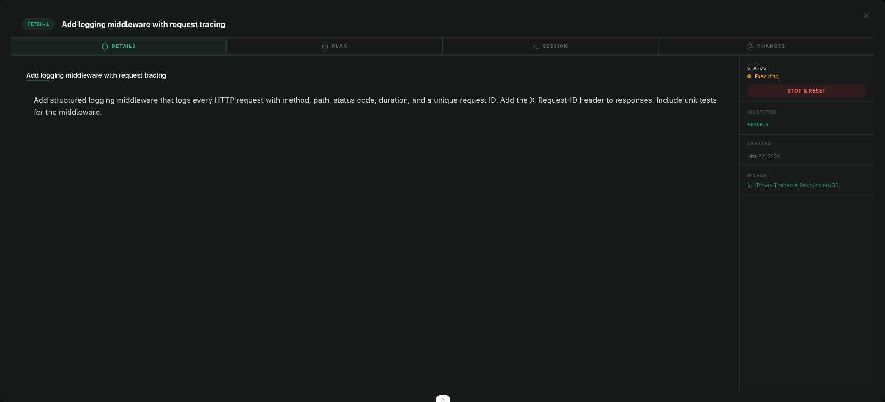

Use the **Session** tab for live PTY output while the run is active. On successful completion, the backend advances the task to **Review**.

### Review — Human QA

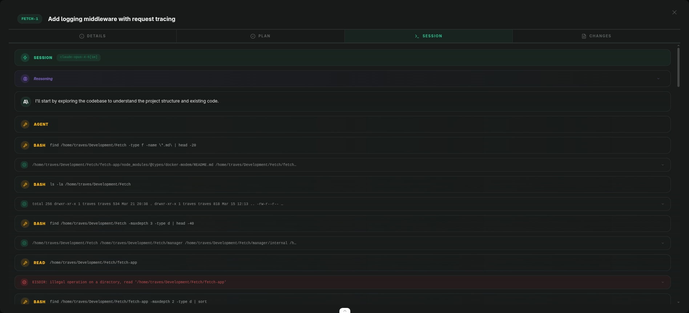

The task is ready for human review.

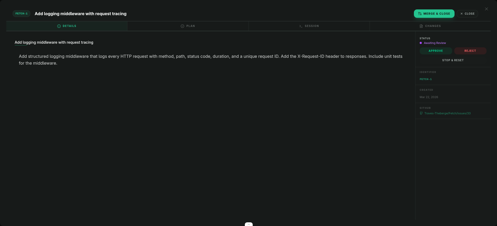

The review header exposes the current review actions:
- **Create PR** or **View PR** depending on whether the task branch has already been published
- **Request Changes** to send feedback back to the agent
- **Close** to move the task to **Done**

Review the work across all tabs:
- **Plan** — what the agent intended
- **Session** — what happened
- **Changes** — the code diff

If a PR already exists, **Request Changes** sends the task directly back to **In Progress**. If no PR exists yet, the same action sends the task back to **Todo** for re-planning with feedback context.

Creating a PR currently publishes the branch and then auto-advances the task to **Done**. If a PR already exists, the header switches to **View PR** instead.

### Done — Completed

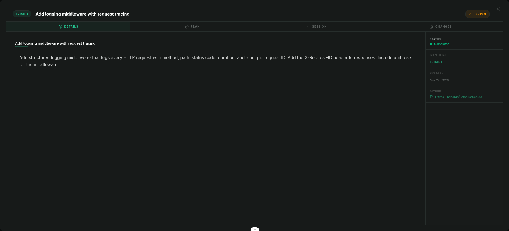

The inspector shows:
- Status: **"Completed"** with green dot
- **REOPEN** button in header
- All tabs viewable

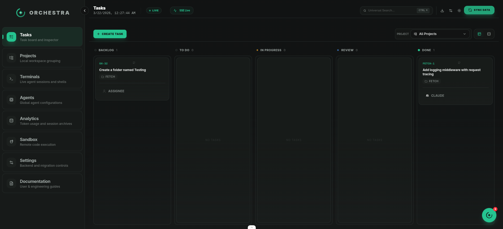

Completed tasks can still be inspected, but the task itself is closed.

### Stop & Reset

The stop/reset flow is available from active states. It:
- Kills any running agent session
- Clears the plan and changes
- Returns the task to **Backlog** for editing
- Requires confirmation dialog

---

## Drag Rules

| Transition | Allowed? | Gate |
|------------|----------|------|
| Backlog → Todo | Drag | Title + description + agent + project required |
| Todo → In Progress | Automatic or button | Successful planning run auto-advances; some views also expose a launch/promotion control |
| In Progress → Review | Automatic | Agent completes |
| Review → Done | Automatic | Create PR publishes the branch and closes the task |
| Review → Done | Button | Close the task |
| Review → Todo | Button | Request Changes without an existing PR |
| Review → In Progress | Button | Request Changes when a PR already exists |
| Any active state → Backlog | Button | Stop & Reset (clears artifacts) |
| Backward drag | Blocked | Cannot drag cards left |
| Skip states | Blocked | Must go through each state in order |

---

## Projects & Git

Navigate to **Projects** to see all workspaces. Click **Add Project** to register a new directory.

Each project exposes **Overview**, **Files**, and **Git** tabs.

### Git Tab

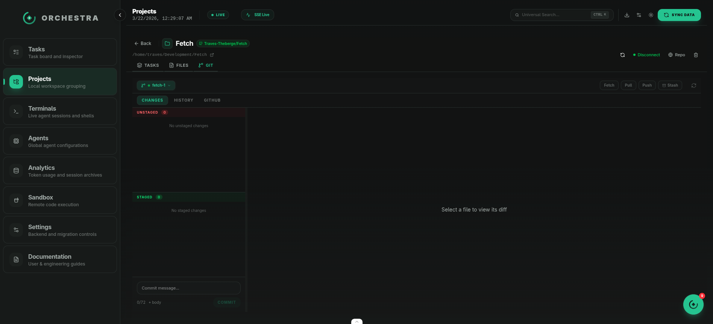

The Git tab supports working-tree review, branch operations, stash/conflict handling, and GitHub pull request flows.

---

## Sidebar Navigation

| Section | Description |
|---------|-------------|
| **Tasks** | Task board and inspector |
| **Projects** | Local workspace grouping |
| **Terminals** | Coding harnesses and development shells |
| **Agents** | Global agent configurations |
| **Analytics** | Token usage and session archives |
| **Sandbox** | Remote code execution |
| **Settings** | Backend profiles, integrations, notifications, and shortcuts |
| **Documentation** | User and engineering guides |

---

## Keyboard Shortcuts

| Shortcut | Action |
|----------|--------|
| **Ctrl+.** | Toggle embedded agent |
| **Ctrl+K** | Universal search |
| **Ctrl+Enter** | Commit (in Git tab) |
| **Escape** | Close dialogs and dropdowns |

---

## Getting Started

1. **Add a project** — go to Projects → Add Project
2. **Connect GitHub** — click the GitHub button to authenticate
3. **Create a task** — click Create Task, fill all fields, assign an agent
4. **Drag to Todo** — dispatch the task for planning
5. **Review the plan** — check the Plan tab
6. **In Progress begins** — after planning succeeds, the backend advances the task and the agent executes
7. **Review** — create/view a PR, request changes, or close the task
8. **Done** — creating the PR or closing the task moves it out of the active board
