# Orchestra Desktop — User Guide

Orchestra is a multi-agent development platform that combines task management, Git version control, GitHub integration, and AI-powered agents in a single desktop application.

---

## Task Workflow

Orchestra enforces a strict task lifecycle. Every task flows through five states with gates at each transition.

```
BACKLOG → TODO → IN PROGRESS → REVIEW → DONE
```

### Task Board


The Kanban board has five columns. Tasks can only be created using the **Create Task** button in the toolbar — other columns show "NO TASKS" until work flows into them.

- **Backlog** — drafting area where new tasks land
- **Todo** — agent creates a plan automatically
- **In Progress** — agent executes the plan
- **Review** — human reviews the work
- **Done** — completed, branch preserved for PR

The toolbar has:
- **Create Task** button (left) — opens the task creation dialog
- **Project filter** (right) — filter by project when viewing all tasks
- **Board/List toggle** (right) — switch between Kanban board and table view

### Creating a Task

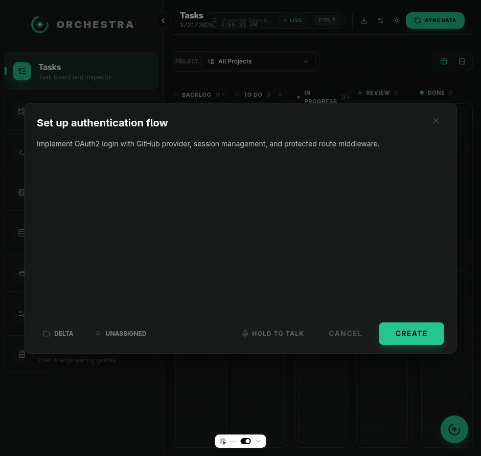

Click **Create Task** in the toolbar. All four fields are **required**:

- **Title** — what needs to be done
- **Description** — detailed instructions for the agent
- **Project** — which codebase the agent works in
- **Agent** — which AI agent to assign (Claude, Codex, Gemini, OpenCode)

The **CREATE** button stays disabled until all fields are filled. Tasks always start in Backlog.

### Backlog — The Staging Area


Tasks in Backlog are fully editable drafts. You can change the title, description, agent, and project at any time.

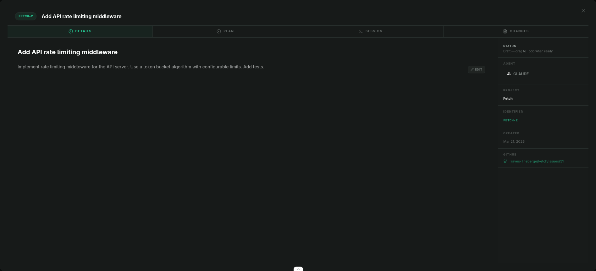

The inspector shows:
- Editable title and description (with markdown support)
- Agent and project selectors
- Status: **"Draft — drag to Todo when ready"**
- Auto-created GitHub issue link

**Moving to Todo:** Drag the task card from Backlog to the Todo column. This requires all fields to be filled — if anything is missing, the card snaps back.

### Todo — Planning Phase

When a task enters Todo:
1. The agent is automatically dispatched in **planning mode**
2. It reads the description, explores the codebase, and creates a structured plan
3. The agent stops — it does **not** write code yet
4. Review the plan in the **Plan** tab

**Fields are locked** — title, description, agent, and project cannot be changed.

Drag to **In Progress** when the plan looks good.

### In Progress — Execution Phase

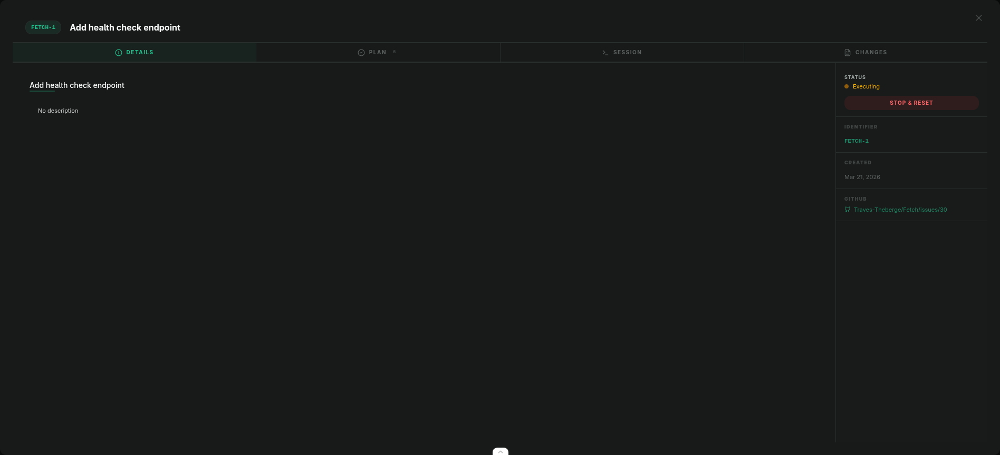

When a task enters In Progress:
1. The agent is dispatched to **execute the plan**
2. Watch progress in the **Session** tab (live terminal output)
3. See code changes in the **Changes** tab
4. The agent automatically moves the task to **Review** when done

The inspector shows:
- **Status: "Executing"** with amber pulse indicator
- **"STOP & RESET"** button — kills the agent, clears plan and changes, returns to Backlog
- All fields locked (read-only title, description, no selectors)

### Review — Human QA

When the agent completes, the task moves to Review automatically. You review:
- **Plan** tab — what the agent intended to do
- **Session** tab — what actually happened
- **Changes** tab — the code diff

Two actions:
- **Approve** → moves to Done
- **Reject** → opens a feedback dialog. Describe what needs to change. The task returns to Todo with your feedback, the agent re-plans incorporating it, and the branch is preserved.

### Done — Completed

The task is finished. All tabs remain viewable. The branch is preserved — go to the project's **Git** tab to create a PR when ready.

### Stop & Reset

Available from any active state (Todo, In Progress, Review). Pressing **STOP & RESET**:
- Kills any running agent session
- Clears the plan and changes
- Returns the task to **Backlog** for editing
- Requires confirmation: "This will clear the plan and all changes"

### Deleting Tasks

Click the delete button on any task card. If the task has a running agent session, it will be stopped automatically before deletion. The linked GitHub issue (if any) will also be closed.

---

## Drag Rules

| Transition | Allowed? | Gate |
|------------|----------|------|
| Backlog → Todo | Drag | Title + description + agent + project required |
| Todo → In Progress | Drag | Agent auto-executes plan |
| In Progress → Review | Automatic | Agent completes |
| Review → Done | Drag | Human approval |
| Review → Todo | Button only | Requires feedback text |
| Any → Backlog | Button only | Stop & Reset (clears everything) |
| Backward drag | Blocked | Cannot drag cards left |
| Skip states | Blocked | Must go through each state in order |

---

## Sidebar Navigation

| Section | Description |
|---------|-------------|
| **Tasks** | Task board and inspector |
| **Projects** | Local workspace grouping |
| **Terminals** | Live agent sessions and shells |
| **Agents** | Global agent configurations |
| **Analytics** | Token usage and session archives |
| **Sandbox** | Remote code execution |
| **Settings** | Backend and migration controls |
| **Documentation** | User and engineering guides |

---

## Projects

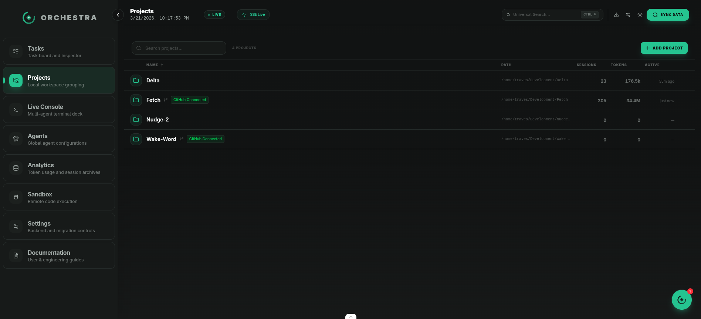

The Projects view lists all registered workspaces. Click **Add Project** to register a new local directory.

Each project row shows:
- Project name and path
- **GitHub Connected** badge (if linked)
- Session count, token usage, and last activity

Click a project to open it.

### Project Detail

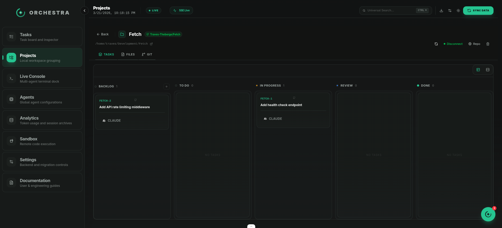

Each project has three tabs:

- **Tasks** — project-scoped Kanban board (same workflow rules)
- **Files** — browse the project's file tree
- **Git** — full Git client with Changes, History, and GitHub sub-tabs

---

## Git Tab

### Changes

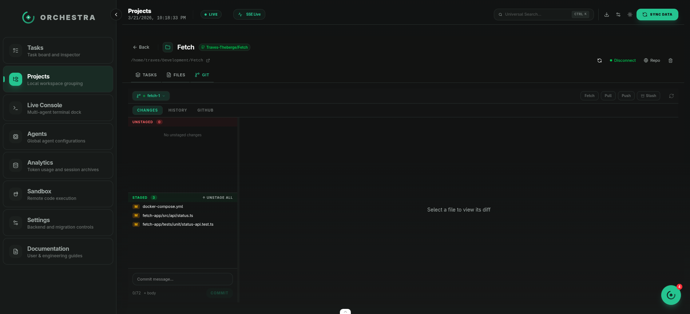

Two-panel layout:
- **Left panel**: Stacked Unstaged/Staged file lists with drag-and-drop staging, commit bar at bottom
- **Right panel**: Diff viewer for the selected file (unified or split view)

**Staging files:**
- Click a file to view its diff
- Drag files between Unstaged and Staged
- Use **Stage All** / **Unstage All** for bulk operations

**Committing:**
- Type a commit message (character count shown, warns at 72+)
- Click **+ body** to add an extended description
- Press **Commit** or **Ctrl+Enter**

**Branch bar:**
- Click the branch name to open the dropdown (local + remote branches)
- Create, delete, or merge branches
- **Fetch**, **Pull**, **Push** buttons with ahead/behind counts
- **Stash** dropdown for saving/restoring changes


### History

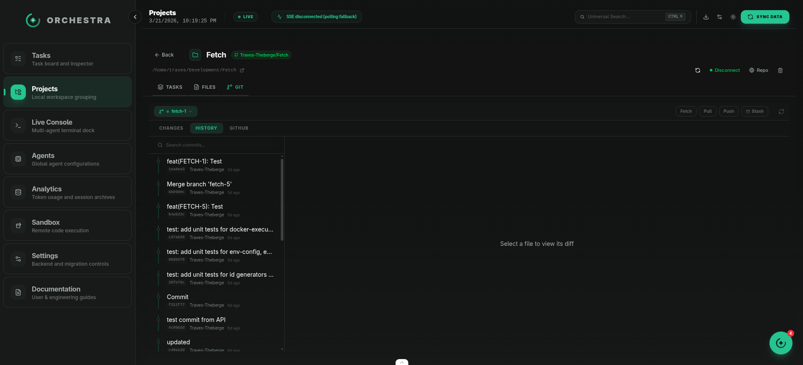

Scrollable commit timeline with search. Click a commit to view its diff. Each entry shows the commit message, short hash, author, and relative timestamp.

### GitHub

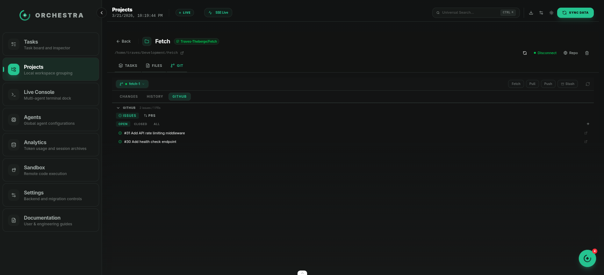

Issues and pull requests from the connected repository:
- **Issues tab** — view, create, and toggle issue state (open/close)
- **PRs tab** — view PRs, click to open the review view with diff and merge options

For projects without a GitHub connection, shows a **Create GitHub Repository** button.

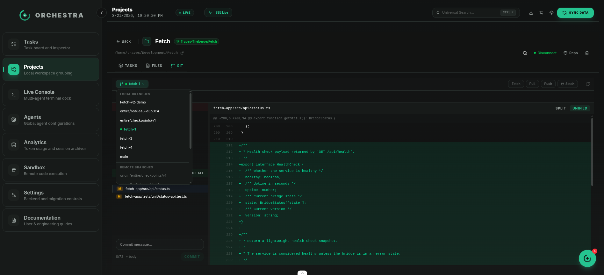

---

## Agents

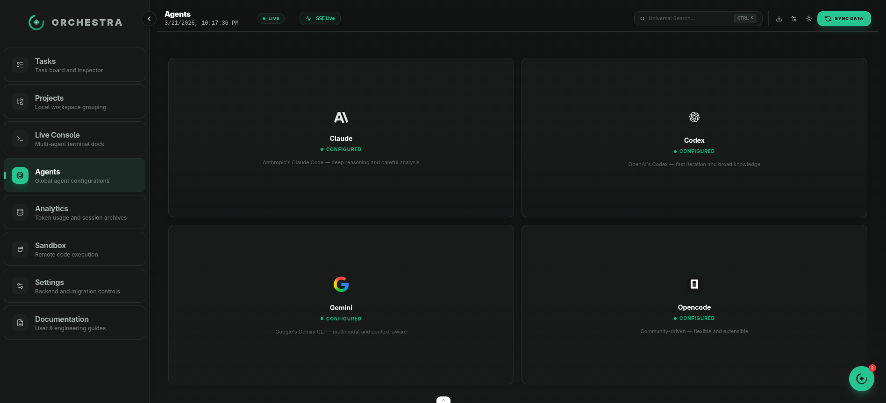

Configure AI agents (Claude, Codex, Gemini, OpenCode). Each agent card shows its configuration status and allows setting API keys and model preferences.

---

## Terminals

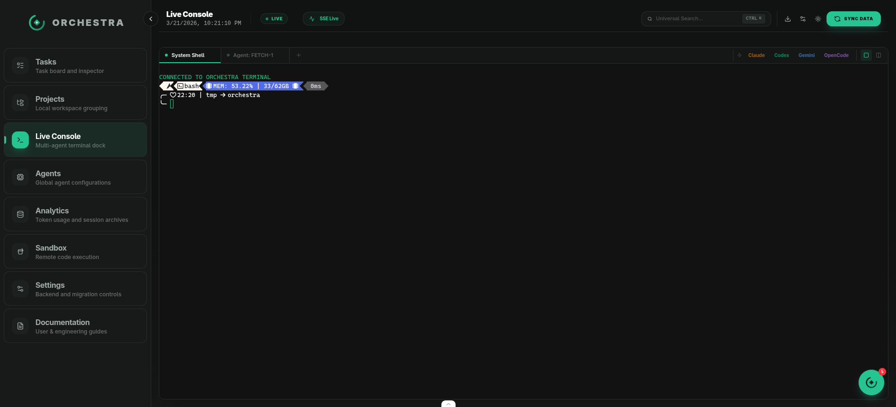

Live agent sessions and interactive shells. Monitor active agent sessions in real time with terminal output.

---

## Analytics

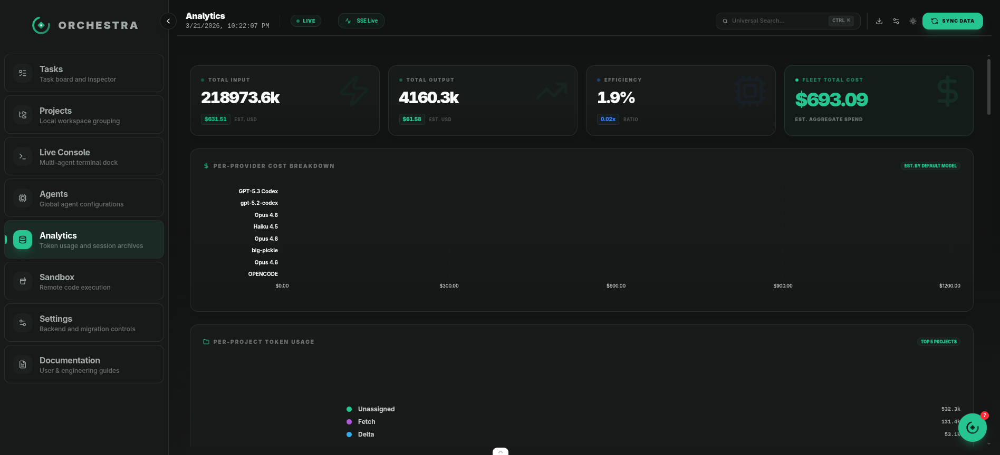

Token usage and cost tracking:
- **Total input/output tokens** with estimated USD cost
- **Per-provider cost breakdown** chart
- **Per-project token usage** chart
- **Cost over time** trend
- **Session archive** — last 50 sessions with provider, model, tokens, cost, and date

---

## Embedded Agent

Press **Ctrl+.** (or click the floating button) to open the Orchestra Agent panel. This AI assistant can:
- Create, update, and delete tasks
- Search and list tasks across projects
- Execute git operations
- Answer questions about your projects

Watch mode notifications show alerts when agents complete, fail, or stall — with action buttons to view the issue or review the diff.

---

## Keyboard Shortcuts

| Shortcut | Action |
|----------|--------|
| **Ctrl+.** | Toggle embedded agent |
| **Ctrl+K** | Universal search |
| **Ctrl+Enter** | Commit (in Git tab) |
| **Escape** | Close dialogs and dropdowns |

---

## Getting Started

1. **Add a project** — go to Projects → Add Project and select a local directory
2. **Connect GitHub** — click the GitHub button on a project to authenticate
3. **Create a task** — click Create Task, fill in all fields, assign an agent
4. **Drag to Todo** — the agent auto-plans
5. **Drag to In Progress** — the agent executes
6. **Review** — approve or reject with feedback
7. **Ship it** — go to the Git tab to create a PR
