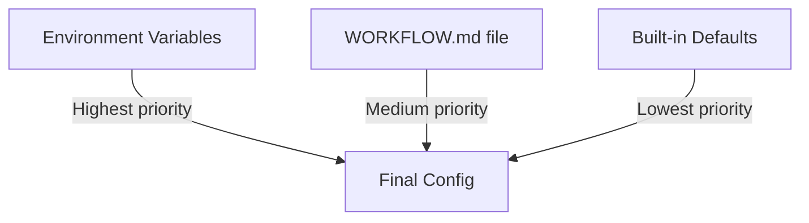

# 7.1 Configuration Guide

> **Source files:**
> - `apps/backend/internal/config/load.go` -- Configuration loading and parsing
> - `apps/backend/internal/config/load_test.go` -- Configuration tests with example values
> - `apps/desktop/electron/main.cjs` -- Desktop-specific environment variables

Orchestra is configured through environment variables, with optional overrides from a `WORKFLOW.md` file. Environment variables take highest precedence, followed by workflow file values, followed by built-in defaults.

---

### Configuration Precedence



The `WORKFLOW.md` file is a Markdown document with YAML code blocks that define configuration. Its path is set by `ORCHESTRA_WORKFLOW_FILE` (default: `WORKFLOW.md` in the working directory).

---

### Server Configuration

| Variable | Default | Description |
|----------|---------|-------------|
| `ORCHESTRA_SERVER_HOST` | `127.0.0.1` | HTTP bind address |
| `ORCHESTRA_SERVER_PORT` | `4010` | HTTP listen port |
| `ORCHESTRA_API_TOKEN` | _(empty)_ | Bearer token for API authentication. **Required** when host is non-loopback |
| `ORCHESTRA_WORKSPACE_ROOT` | `~/.orchestra/workspaces` | Root directory for agent workspaces |
| `ORCHESTRA_WORKFLOW_FILE` | `WORKFLOW.md` | Path to the workflow configuration file |

---

### Agent Configuration

| Variable | Default | Description |
|----------|---------|-------------|
| `ORCHESTRA_AGENT_PROVIDER` | `CODEX` | Default agent provider (`CLAUDE`, `CODEX`, `GEMINI`, `OPENCODE`) |
| `ORCHESTRA_AGENT_MAX_TURNS` | `10` | Maximum conversation turns per agent session |
| `ORCHESTRA_AGENT_COMMAND_CLAUDE` | `claude -p {{prompt}} --output-format stream-json --verbose --dangerously-skip-permissions` | Command template for Claude |
| `ORCHESTRA_AGENT_COMMAND_CODEX` | `codex exec --skip-git-repo-check --dangerously-bypass-approvals-and-sandbox --json {{prompt}}` | Command template for Codex |
| `ORCHESTRA_AGENT_COMMAND_OPENCODE` | `opencode run {{prompt}} --format json` | Command template for OpenCode |
| `ORCHESTRA_AGENT_COMMAND_GEMINI` | `gemini -p {{prompt}} --output-format stream-json --approval-mode yolo` | Command template for Gemini |
| `ORCHESTRA_AGENT_COMMAND_UNSANDBOX` | _(empty)_ | Command template for Unsandbox agent |

The `{{prompt}}` placeholder in command templates is replaced with the task prompt at runtime.

---

### Concurrency Controls

| Variable | Default | Description |
|----------|---------|-------------|
| `ORCHESTRA_MAX_CONCURRENT` | `16` | Maximum total concurrent agent sessions |
| `ORCHESTRA_MAX_CONCURRENT_BY_STATE` | _(empty)_ | Per-state concurrency limits. Format: `State1:N,State2:M` (e.g., `Todo:1,In Progress:2`) |

---

### Tracker Configuration

| Variable | Default | Description |
|----------|---------|-------------|
| `ORCHESTRA_TRACKER_TYPE` | _(empty)_ | Issue tracker type (e.g., `linear`) |
| `ORCHESTRA_TRACKER_ENDPOINT` | _(empty)_ | Tracker API endpoint URL |
| `ORCHESTRA_TRACKER_TOKEN` | _(empty)_ | Tracker API authentication token |
| `ORCHESTRA_TRACKER_WORKER_ASSIGNEE_IDS` | _(empty)_ | Comma-separated list of user IDs whose issues to process |
| `ORCHESTRA_ACTIVE_STATES` | `Todo, In Progress` | Comma-separated issue states that trigger agent work |
| `ORCHESTRA_TERMINAL_STATES` | `Done, Cancelled, Canceled, Closed, Duplicate` | Comma-separated issue states considered complete |

---

### Workspace Hooks

Hooks are shell commands executed at specific points in the workspace lifecycle:

| Variable | Default | Description |
|----------|---------|-------------|
| `ORCHESTRA_WORKSPACE_AFTER_CREATE` | _(empty)_ | Run after workspace directory is created |
| `ORCHESTRA_WORKSPACE_BEFORE_REMOVE` | _(empty)_ | Run before workspace directory is removed |
| `ORCHESTRA_WORKSPACE_BEFORE_RUN` | _(empty)_ | Run before each agent session starts |
| `ORCHESTRA_WORKSPACE_AFTER_RUN` | _(empty)_ | Run after each agent session completes |

---

### Project Configuration

| Variable | Default | Description |
|----------|---------|-------------|
| `ORCHESTRA_PROJECT_ROOTS` | _(empty)_ | Comma-separated list of directories to auto-register as projects |

---

### GitHub Integration

| Variable | Default | Description |
|----------|---------|-------------|
| `ORCHESTRA_GITHUB_CLIENT_ID` | _(empty)_ | GitHub OAuth app client ID |
| `ORCHESTRA_GITHUB_CLIENT_SECRET` | _(empty)_ | GitHub OAuth app client secret |

---

### MCP Server Configuration

| Variable | Default | Description |
|----------|---------|-------------|
| `ORCHESTRA_MCP_SERVERS` | _(empty)_ | Comma-separated MCP server definitions. Format: `name=command,name2=command2` |

---

### Telemetry Configuration

| Variable | Default | Description |
|----------|---------|-------------|
| `ORCHESTRA_TELEMETRY_PROVIDERS` | `CLAUDE, CODEX, GEMINI, OPENCODE` | Comma-separated list of providers to collect telemetry from |
| `ORCHESTRA_TELEMETRY_RETENTION_DAYS` | `7` | Number of days to retain telemetry data |
| `ORCHESTRA_TELEMETRY_STORE_RAW_PAYLOAD` | `false` | Whether to store raw telemetry payloads (boolean: `true`/`false`/`1`/`0`) |

---

### Speech-to-Text (Whisper)

| Variable | Default | Description |
|----------|---------|-------------|
| `ORCHESTRA_STT_WHISPER_BIN` | _(empty)_ | Path to the Whisper binary |
| `ORCHESTRA_STT_WHISPER_MODEL` | _(empty)_ | Path to the Whisper model file |
| `ORCHESTRA_STT_WHISPER_THREADS` | `0` (auto) | Number of CPU threads for Whisper inference |
| `ORCHESTRA_STT_WHISPER_LANGUAGE` | `en` | Default language for speech recognition |

---

### Security

| Variable | Default | Description |
|----------|---------|-------------|
| `ORCHESTRA_TOKEN_KEY` | _(empty)_ | 32-byte AES key (any string) for encrypting stored agent tokens at rest. If not set, tokens are stored in plaintext |

---

### Desktop-Specific Variables

These environment variables affect only the Electron desktop application:

| Variable | Default | Description |
|----------|---------|-------------|
| `ORCHESTRA_BASE_URL` | `http://127.0.0.1:4010` | Backend URL (used when no managed backend) |
| `ORCHESTRA_MANAGED_BACKEND` | _(auto)_ | `1` to force managed backend, `0` to disable, auto-detect otherwise |
| `ORCHESTRA_BACKEND_BIN` | _(auto)_ | Override path to the `orchestrad` binary for the managed sidecar |
| `VITE_DEV_SERVER_URL` | _(empty)_ | Vite dev server URL (development mode only) |

---

### WORKFLOW.md Configuration

The workflow file uses YAML blocks nested under configuration keys. Example:

```markdown
# My Orchestra Workflow

## Config

```yaml
server:
  host: 0.0.0.0
  port: 4010
  api_token: my-secret-token

workspace:
  root: /data/workspaces
  after_create: "git clone $REPO_URL ."
  before_run: "git pull origin main"

agent:
  provider: CLAUDE
  max_turns: 15
  max_concurrent: 8
  commands:
    claude: "claude -p {{prompt}} --output-format stream-json"

tracker:
  type: linear
  endpoint: https://api.linear.app/graphql
  token: lin_api_xxxxx
  active_states:
    - Todo
    - In Progress
  terminal_states:
    - Done
    - Cancelled
```
```

Supported WORKFLOW.md configuration paths:

| Path | Maps To |
|------|---------|
| `server.host` | `ORCHESTRA_SERVER_HOST` |
| `server.port` | `ORCHESTRA_SERVER_PORT` |
| `server.api_token` | `ORCHESTRA_API_TOKEN` |
| `workspace.root` | `ORCHESTRA_WORKSPACE_ROOT` |
| `workspace.after_create` | `ORCHESTRA_WORKSPACE_AFTER_CREATE` |
| `workspace.before_remove` | `ORCHESTRA_WORKSPACE_BEFORE_REMOVE` |
| `workspace.before_run` | `ORCHESTRA_WORKSPACE_BEFORE_RUN` |
| `workspace.after_run` | `ORCHESTRA_WORKSPACE_AFTER_RUN` |
| `workspace.project_roots` | `ORCHESTRA_PROJECT_ROOTS` |
| `agent.provider` | `ORCHESTRA_AGENT_PROVIDER` |
| `agent.max_turns` | `ORCHESTRA_AGENT_MAX_TURNS` |
| `agent.max_concurrent` | `ORCHESTRA_MAX_CONCURRENT` |
| `agent.max_concurrent_by_state` | `ORCHESTRA_MAX_CONCURRENT_BY_STATE` |
| `agent.commands.codex` | `ORCHESTRA_AGENT_COMMAND_CODEX` |
| `agent.commands.claude` | `ORCHESTRA_AGENT_COMMAND_CLAUDE` |
| `agent.commands.opencode` | `ORCHESTRA_AGENT_COMMAND_OPENCODE` |
| `agent.commands.gemini` | `ORCHESTRA_AGENT_COMMAND_GEMINI` |
| `tracker.type` | `ORCHESTRA_TRACKER_TYPE` |
| `tracker.endpoint` | `ORCHESTRA_TRACKER_ENDPOINT` |
| `tracker.token` | `ORCHESTRA_TRACKER_TOKEN` |
| `tracker.worker_assignee_ids` | `ORCHESTRA_TRACKER_WORKER_ASSIGNEE_IDS` |
| `tracker.active_states` | `ORCHESTRA_ACTIVE_STATES` |
| `tracker.terminal_states` | `ORCHESTRA_TERMINAL_STATES` |
| `github.client_id` | `ORCHESTRA_GITHUB_CLIENT_ID` |
| `github.client_secret` | `ORCHESTRA_GITHUB_CLIENT_SECRET` |
| `mcp.servers` | `ORCHESTRA_MCP_SERVERS` |
