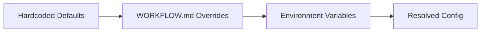

# 5.2 Configuration Guide

> **Source files:** `apps/backend/internal/config/load.go`, `apps/backend/internal/config/types.go`

Orchestra is configured through three layers, applied in order of ascending priority:

1. **Hardcoded defaults** -- Applied when neither other source provides a value (lowest priority)
2. **WORKFLOW.md file** -- YAML front-matter in a `WORKFLOW.md` file
3. **Environment variables** -- `ORCHESTRA_*` prefixed variables (highest priority)



## 7.1.1 Environment Variables Reference

### Server

| Variable | Type | Default | Description |
|----------|------|---------|-------------|
| `ORCHESTRA_SERVER_HOST` | string | `127.0.0.1` | Bind address for the HTTP server |
| `ORCHESTRA_SERVER_PORT` | int | `4010` | Port for the HTTP server (1-65535) |
| `ORCHESTRA_API_TOKEN` | string | _(none)_ | Bearer token for API authentication; if unset, auth is disabled |
| `ORCHESTRA_WORKFLOW_FILE` | string | `WORKFLOW.md` | Path to workflow configuration file |

### Agent

| Variable | Type | Default | Description |
|----------|------|---------|-------------|
| `ORCHESTRA_AGENT_PROVIDER` | string | `CODEX` | Default agent provider (`CODEX`, `CLAUDE`, `OPENCODE`, `GEMINI`) |
| `ORCHESTRA_AGENT_MAX_TURNS` | int | `25` | Maximum conversation turns per agent run |
| `ORCHESTRA_AGENT_COMMAND_CODEX` | string | `codex exec --skip-git-repo-check --dangerously-bypass-approvals-and-sandbox --json {{prompt}}` | Custom Codex command template |
| `ORCHESTRA_AGENT_COMMAND_CLAUDE` | string | `claude -p {{prompt}} --output-format stream-json --verbose --dangerously-skip-permissions` | Custom Claude command template |
| `ORCHESTRA_AGENT_COMMAND_OPENCODE` | string | `opencode -p {{prompt}} -f json` | Custom OpenCode command template |
| `ORCHESTRA_AGENT_COMMAND_GEMINI` | string | `gemini -p {{prompt}} --output-format stream-json --approval-mode yolo` | Custom Gemini command template |
| `ORCHESTRA_AGENT_COMMAND_UNSANDBOX` | string | _(none)_ | Custom Unsandbox agent command template |
| `ORCHESTRA_MAX_CONCURRENT` | int | `6` | Maximum concurrent agent runs |
| `ORCHESTRA_MAX_CONCURRENT_BY_STATE` | string | _(none)_ | Per-state concurrency limits (format: `State1:N,State2:M`) |

### Tracker

| Variable | Type | Default | Description |
|----------|------|---------|-------------|
| `ORCHESTRA_TRACKER_TYPE` | string | _(unset)_ | Issue tracker backend: `sqlite` is used for the default local runtime; `github` enables GitHub-backed issues; `memory` remains available for tests or explicit fallback |
| `ORCHESTRA_TRACKER_ENDPOINT` | string | _(none)_ | Tracker endpoint (e.g., `owner/repo` for GitHub) |
| `ORCHESTRA_TRACKER_TOKEN` | string | _(none)_ | Authentication token for the tracker |
| `ORCHESTRA_TRACKER_WORKER_ASSIGNEE_IDS` | CSV | _(none)_ | Comma-separated assignee IDs for worker filtering |
| `ORCHESTRA_ACTIVE_STATES` | CSV | `Todo, In Progress` | Comma-separated list of states considered active |
| `ORCHESTRA_TERMINAL_STATES` | CSV | `Done, Cancelled, Canceled, Closed, Duplicate` | Comma-separated list of terminal states |

### Workspace

| Variable | Type | Default | Description |
|----------|------|---------|-------------|
| `ORCHESTRA_WORKSPACE_ROOT` | string | `~/.orchestra/workspaces` | Root directory for agent workspaces |
| `ORCHESTRA_WORKTREE_ROOT` | string | same as `ORCHESTRA_WORKSPACE_ROOT` | Root directory for per-issue git worktrees |
| `ORCHESTRA_PROJECT_ROOTS` | CSV | _(none)_ | Comma-separated list of project root directories |
| `ORCHESTRA_WORKSPACE_AFTER_CREATE` | string | _(none)_ | Shell command to run after workspace creation |
| `ORCHESTRA_WORKSPACE_BEFORE_REMOVE` | string | _(none)_ | Shell command to run before workspace removal |
| `ORCHESTRA_WORKSPACE_BEFORE_RUN` | string | _(none)_ | Shell command to run before each agent run |
| `ORCHESTRA_WORKSPACE_AFTER_RUN` | string | _(none)_ | Shell command to run after each agent run |

### GitHub OAuth

| Variable | Type | Default | Description |
|----------|------|---------|-------------|
| `ORCHESTRA_GITHUB_CLIENT_ID` | string | _(none)_ | GitHub OAuth app client ID |
| `ORCHESTRA_GITHUB_CLIENT_SECRET` | string | _(none)_ | GitHub OAuth app client secret |

### External Analytics

| Variable | Type | Default | Description |
|----------|------|---------|-------------|
| `ORCHESTRA_ANTHROPIC_ADMIN_KEY` | string | _(none)_ | Anthropic Admin API key used for organization-level analytics sync |
| `ORCHESTRA_OPENAI_ADMIN_KEY` | string | _(none)_ | OpenAI organization admin key used for analytics sync |
| `ORCHESTRA_ANALYTICS_SYNC_INTERVAL` | duration | `1h` | Interval between external analytics reconciliation runs |
| `ORCHESTRA_ANALYTICS_EXTERNAL_ENABLED` | bool | `false` | Enables external analytics ingestion from provider admin APIs |

### MCP Servers

| Variable | Type | Default | Description |
|----------|------|---------|-------------|
| `ORCHESTRA_MCP_SERVERS` | string | _(none)_ | Comma-separated `name=command` pairs for MCP server registration |

### Telemetry

| Variable | Type | Default | Description |
|----------|------|---------|-------------|
| `ORCHESTRA_TELEMETRY_PROVIDERS` | CSV | `CLAUDE,CODEX,GEMINI,OPENCODE` | Providers to collect telemetry from |
| `ORCHESTRA_TELEMETRY_RETENTION_DAYS` | int | `7` | Days to retain telemetry data |
| `ORCHESTRA_TELEMETRY_STORE_RAW_PAYLOAD` | bool | `false` | Store raw telemetry payloads (accepts: `true/false/1/0/yes/no/on/off`) |

### Speech-to-Text (Whisper)

These variables configure the backend `/api/v1/stt/*` endpoints. The desktop app can still fall back to its local Whisper worker when the backend STT service is unavailable.

| Variable | Type | Default | Description |
|----------|------|---------|-------------|
| `ORCHESTRA_STT_WHISPER_BIN` | string | _(none)_ | Path to whisper.cpp binary |
| `ORCHESTRA_STT_WHISPER_MODEL` | string | _(none)_ | Path to whisper model file |
| `ORCHESTRA_STT_WHISPER_THREADS` | int | `0` | Number of threads for whisper inference |
| `ORCHESTRA_STT_WHISPER_LANGUAGE` | string | `en` | Language code for speech recognition |

## 7.1.2 WORKFLOW.md Configuration

Orchestra can load configuration from a `WORKFLOW.md` file (default path, overridable via `ORCHESTRA_WORKFLOW_FILE`). The file uses YAML front-matter with nested keys that map to the environment variables above.

### WORKFLOW.md Structure

```yaml
server:
  host: "127.0.0.1"
  port: 4010
  api_token: "my-secret-token"

agent:
  provider: "CLAUDE"
  max_turns: 15
  max_concurrent: 8
  max_concurrent_by_state:
    "In Progress": 4
    "Todo": 2
  commands:
    codex: "codex exec --json {{prompt}}"
    claude: "claude -p {{prompt}} --output-format stream-json"
    opencode: "opencode run {{prompt}} --format json"
    gemini: "gemini -p {{prompt}} --output-format stream-json"

workspace:
  root: "/var/lib/orchestra/workspaces"
  project_roots: "project-a,project-b"
  after_create: "git clone https://github.com/org/repo ."
  before_run: "git pull origin main"
  after_run: "git add -A && git commit -m 'agent work'"
  before_remove: "git push origin HEAD"

tracker:
  type: "github"
  endpoint: "myorg/myrepo"
  token: "ghp_xxxxxxxxxxxx"
  worker_assignee_ids: "bot-1,bot-2"
  active_states: "Todo,In Progress"
  terminal_states: "Done,Cancelled,Closed"

github:
  client_id: "Iv1.xxxxxxxxxx"
  client_secret: "xxxxxxxxxxxxxxxx"

mcp:
  servers: "filesystem=/usr/local/bin/mcp-fs,git=/usr/local/bin/mcp-git"
```

### Priority Rules

Environment variables always override WORKFLOW.md values. The resolution order within `config.Load()`:

1. Read environment variable
2. If empty, read from WORKFLOW.md parsed config
3. If still empty, apply hardcoded default

## 7.1.3 Config Struct

The resolved configuration is held in `config.Config` (defined in `types.go`):

| Field | Type | Maps to |
|-------|------|---------|
| `Host` | `string` | `ORCHESTRA_SERVER_HOST` |
| `Port` | `int` | `ORCHESTRA_SERVER_PORT` |
| `WorkspaceRoot` | `string` | `ORCHESTRA_WORKSPACE_ROOT` |
| `APIToken` | `string` | `ORCHESTRA_API_TOKEN` |
| `WorkflowFile` | `string` | `ORCHESTRA_WORKFLOW_FILE` |
| `AgentProvider` | `string` | `ORCHESTRA_AGENT_PROVIDER` |
| `AgentCommands` | `map[string]string` | Per-agent command env vars |
| `AgentMaxTurns` | `int` | `ORCHESTRA_AGENT_MAX_TURNS` |
| `WorktreeRoot` | `string` | `ORCHESTRA_WORKTREE_ROOT` |
| `TrackerType` | `string` | `ORCHESTRA_TRACKER_TYPE` |
| `TrackerEndpoint` | `string` | `ORCHESTRA_TRACKER_ENDPOINT` |
| `TrackerToken` | `string` | `ORCHESTRA_TRACKER_TOKEN` |
| `TrackerWorkerAssigneeIDs` | `[]string` | `ORCHESTRA_TRACKER_WORKER_ASSIGNEE_IDS` |
| `ActiveStates` | `[]string` | `ORCHESTRA_ACTIVE_STATES` |
| `TerminalStates` | `[]string` | `ORCHESTRA_TERMINAL_STATES` |
| `MaxConcurrent` | `int` | `ORCHESTRA_MAX_CONCURRENT` |
| `MaxConcurrentByState` | `map[string]int` | `ORCHESTRA_MAX_CONCURRENT_BY_STATE` |
| `WorkspaceHooks` | `workspace.Hooks` | `ORCHESTRA_WORKSPACE_*` hook vars |
| `ProjectRoots` | `[]string` | `ORCHESTRA_PROJECT_ROOTS` |
| `GitHubClientID` | `string` | `ORCHESTRA_GITHUB_CLIENT_ID` |
| `GitHubClientSecret` | `string` | `ORCHESTRA_GITHUB_CLIENT_SECRET` |
| `MCPServers` | `map[string]string` | `ORCHESTRA_MCP_SERVERS` |
| `TelemetryProviders` | `[]string` | `ORCHESTRA_TELEMETRY_PROVIDERS` |
| `TelemetryRetentionDays` | `int` | `ORCHESTRA_TELEMETRY_RETENTION_DAYS` |
| `TelemetryStoreRawPayload` | `bool` | `ORCHESTRA_TELEMETRY_STORE_RAW_PAYLOAD` |
| `STTWhisperBin` | `string` | `ORCHESTRA_STT_WHISPER_BIN` |
| `STTWhisperModelPath` | `string` | `ORCHESTRA_STT_WHISPER_MODEL` |
| `STTWhisperThreads` | `int` | `ORCHESTRA_STT_WHISPER_THREADS` |
| `STTWhisperLanguage` | `string` | `ORCHESTRA_STT_WHISPER_LANGUAGE` |
| `AnthropicAdminKey` | `string` | `ORCHESTRA_ANTHROPIC_ADMIN_KEY` |
| `OpenAIAdminKey` | `string` | `ORCHESTRA_OPENAI_ADMIN_KEY` |
| `AnalyticsSyncInterval` | `time.Duration` | `ORCHESTRA_ANALYTICS_SYNC_INTERVAL` |
| `AnalyticsExternalEnabled` | `bool` | `ORCHESTRA_ANALYTICS_EXTERNAL_ENABLED` |

## 7.1.4 Example Configurations

### Minimal (local SQLite-backed runtime)

```bash
export ORCHESTRA_WORKSPACE_ROOT=~/projects/my-repo
./orchestrad
```

Uses the local defaults: Codex provider, SQLite-backed issue persistence, workspace/worktree roots under `~/.orchestra`, and port 4010.

### GitHub Issues + Claude

```bash
export ORCHESTRA_AGENT_PROVIDER=CLAUDE
export ORCHESTRA_TRACKER_TYPE=github
export ORCHESTRA_TRACKER_ENDPOINT=myorg/myrepo
export ORCHESTRA_TRACKER_TOKEN=ghp_xxxxxxxxxxxx
export ORCHESTRA_MAX_CONCURRENT=4
./orchestrad
```

### SQLite Persistence + Workspace Hooks

```bash
export ORCHESTRA_TRACKER_TYPE=sqlite
export ORCHESTRA_WORKSPACE_ROOT=/var/lib/orchestra/workspaces
export ORCHESTRA_WORKSPACE_AFTER_CREATE="git clone https://github.com/org/repo ."
export ORCHESTRA_WORKSPACE_BEFORE_RUN="git pull origin main"
export ORCHESTRA_API_TOKEN=my-secret-token
./orchestrad
```

### Docker Deployment

```bash
docker run -d \
  -p 4010:4010 \
  -e ORCHESTRA_SERVER_HOST=0.0.0.0 \
  -e ORCHESTRA_TRACKER_TYPE=sqlite \
  -v orchestra-data:/var/lib/orchestra/workspaces \
  ghcr.io/<owner>/orchestra-backend:latest
```

---

*Cross-references: [Getting Started](getting-started.md) (Section 5.1), [Container Build](../operations/docker.md) (Section 6.2), [Backend Internals](../backend/orchestrator.md) (Section 3.1)*
