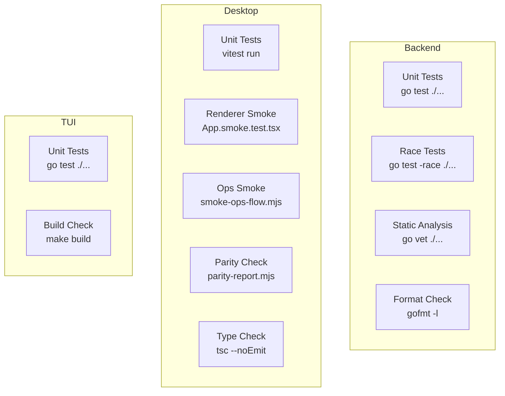

# 7.2 Development Guide

> **Source files:**
> - `apps/backend/` -- Go backend (orchestrad + CLI)
> - `apps/desktop/` -- Electron + React desktop app
> - `apps/tui/` -- Terminal UI dashboard
> - `Makefile` -- TUI build targets
> - `.github/workflows/` -- CI pipelines
> - `CLAUDE.md` -- Agent operating instructions

This guide covers setting up a development environment, building and testing each component, and contributing new functionality to Orchestra.

---

### Repository Structure

```
Orchestra/
  apps/
    backend/             # Go backend server and CLI
      cmd/orchestrad/    # Server entry point
      cmd/orchestra/     # CLI entry point
      internal/          # Internal packages (api, config, db, etc.)
    desktop/             # Electron + React desktop app
      electron/          # Main process + preload
      src/               # React frontend source
        components/      # UI components by section
        lib/             # Client, sync, store modules
        widgets/         # Complex widget modules
    tui/                 # Terminal UI dashboard (Bubble Tea)
  ops/
    docker/              # Dockerfiles
  .github/
    workflows/           # CI/CD pipelines
    actions/             # Composite actions
```

---

### Development Prerequisites

| Tool | Version | Install |
|------|---------|---------|
| Go | 1.24+ | [go.dev/dl](https://go.dev/dl/) |
| Node.js | 20+ | [nodejs.org](https://nodejs.org/) |
| npm | 10+ | Included with Node.js |
| Git | 2.x+ | System package manager |

---

### Backend Development

#### Building

```bash
cd apps/backend

# Build both binaries
go build -o orchestrad ./cmd/orchestrad
go build -o orchestra ./cmd/orchestra
```

#### Running

```bash
export ORCHESTRA_SERVER_HOST=127.0.0.1
export ORCHESTRA_SERVER_PORT=4010
./orchestrad
```

#### Testing

```bash
cd apps/backend

# Run all tests
go test ./...

# Run tests with coverage
go test -coverprofile=coverage.out ./...

# Run tests with race detector
go test -race ./...

# Verify formatting
test -z "$(gofmt -l ./cmd ./internal)"

# Run static analysis
go vet ./...
```

#### Binary Restart Protocol

When modifying Go source that produces a running binary (e.g., `orchestrad`), always:

1. Check if the binary is currently running: `pgrep -af orchestrad`
2. Rebuild: `go build -o orchestrad ./cmd/orchestrad/` from `apps/backend/`
3. Kill the old process and start the new binary
4. Verify the new process is running

---

### Desktop Development

#### Setup

```bash
cd apps/desktop
npm ci
```

#### Development Mode

```bash
# Start both Vite dev server and Electron
npm run dev

# This runs:
# 1. vite --port 5173 --strictPort
# 2. electron electron/main.cjs (with VITE_DEV_SERVER_URL=http://localhost:5173)
```

In development mode, the desktop app connects to a separately running `orchestrad` instance. Start the backend first.

#### Testing

```bash
cd apps/desktop

# Run all tests
npm test

# Run specific test suites
npm run test:smoke-renderer   # App smoke test
npm run smoke:ops             # Operational smoke test
npm run smoke:ops:go          # Smoke test with Go backend
npm run smoke:ops:go:auth     # Smoke test with authentication

# Type checking
npm run typecheck

# Parity verification (frontend/backend API alignment)
npm run parity:verify
```

#### Building

```bash
# Build frontend only (Vite)
npm run build

# Build and stage backend binary
npm run dist:prep

# Package for distribution
npm run dist:desktop
```

---

### TUI Development

```bash
cd apps/tui

# Run directly
go run .

# Run tests
go test ./...

# Build binary
cd /path/to/Orchestra
make build      # outputs ./orchestra-dash
make install    # installs to /usr/local/bin/orchestra-dash
```

---

### Code Style

#### Go

- Standard `gofmt` formatting enforced in CI
- `go vet` for static analysis
- Race detector tests run separately
- Prefer "defect" over "bug" in comments and messages

#### TypeScript/React

- Vite + TypeScript strict mode
- Radix UI / shadcn/ui primitives for UI components
- Tailwind CSS for styling
- Lucide React for icons
- Type checking via `tsc --noEmit`

---

### Testing Strategy



---

### PR Workflow

1. **Branch**: Create a feature branch from `main`
2. **Develop**: Make changes, run local tests
3. **PR Description**: Must include structured sections -- the `pr-description-lint` workflow validates format using `orchestra check-pr-body`
4. **CI**: All relevant workflows must pass:
   - `orchestra-backend` (if backend changed)
   - `orchestra-desktop-smoke` (if frontend or backend changed)
   - `make-all` (if TUI changed)
   - `pr-description-lint` (all PRs)
5. **Review**: Code review required
6. **Merge**: Squash merge to `main`

#### PR Description Format

PR descriptions are validated programmatically. They must follow the project's structured format -- the `orchestra check-pr-body` command checks for required sections.

---

### Release Process

1. Create an annotated Git tag with release notes containing `## Summary` and `## Validation` sections:

```bash
git tag -a v1.0.0 -m "$(cat <<'EOF'
v1.0.0

## Summary
- Feature X added
- Defect Y fixed

## Validation
- All CI checks pass
- Smoke tests verified on macOS, Linux, Windows
EOF
)"
```

2. Push the tag: `git push origin v1.0.0`

3. The CI automatically:
   - Validates release notes format
   - Builds desktop installers for all platforms (Linux, macOS, Windows)
   - Publishes a GitHub release with all artifacts
   - Builds and pushes the Docker image to GHCR

---

### Useful Commands Reference

| Task | Command | Working Directory |
|------|---------|-------------------|
| Start backend | `./orchestrad` | `apps/backend/` |
| Start desktop (dev) | `npm run dev` | `apps/desktop/` |
| Start TUI | `go run .` | `apps/tui/` |
| Backend tests | `go test ./...` | `apps/backend/` |
| Desktop tests | `npm test` | `apps/desktop/` |
| TUI tests | `go test ./...` | `apps/tui/` |
| Type check frontend | `npm run typecheck` | `apps/desktop/` |
| Parity check | `npm run parity:verify` | `apps/desktop/` |
| Build Docker image | `docker build -f ops/docker/Dockerfile.backend .` | repo root |
| Package desktop | `npm run dist:desktop` | `apps/desktop/` |
