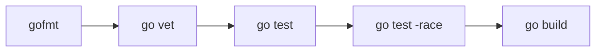
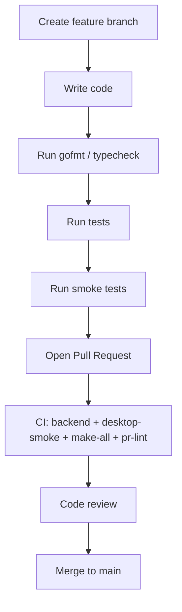

# 5.3 Development Guide

> **Source files:** `apps/backend/go.mod`, `apps/desktop/package.json`, `apps/tui/`, `Makefile`

This guide covers setting up a development environment, building and testing each component, code conventions, and extending Orchestra with new agents or endpoints.

## 7.2.1 Dev Environment Setup

### Required Toolchain

| Tool | Version | Installation |
|------|---------|-------------|
| Go | 1.25+ | [go.dev/dl](https://go.dev/dl/) |
| Node.js | 22+ | [nodejs.org](https://nodejs.org/) |
| npm | (bundled) | Comes with Node.js |
| Git | 2.x+ | System package manager |

### Repository Structure

```
Orchestra/
├── apps/
│   ├── backend/          # Go backend (module: github.com/orchestra/orchestra/apps/backend)
│   ├── desktop/          # Electron + React frontend (npm workspace)
│   └── tui/              # Terminal UI (separate Go module)
├── packages/
│   └── protocol/         # Shared JSON schemas
├── ops/
│   └── docker/           # Container build files
├── docs/                 # DeepWiki documentation
├── Makefile              # Top-level build targets
└── .github/              # CI/CD workflows and actions
```

### Initial Setup

```bash
# Clone
git clone https://github.com/Traves-Theberge/Orchestra.git
cd Orchestra

# Backend dependencies
cd apps/backend && go mod download && cd ../..

# Desktop dependencies
cd apps/desktop && npm install && cd ../..

# TUI dependencies
cd apps/tui && go mod download && cd ../..
```

## 7.2.2 Building and Testing

### Backend



```bash
cd apps/backend

# Format check
gofmt -l ./cmd ./internal

# Static analysis
go vet ./...

# Unit and integration tests
go test ./...

# Tests with coverage
go test -coverprofile=coverage.out ./...

# Race detector
go test -race ./...

# Build binaries
go build -o orchestrad ./cmd/orchestrad/
go build -o orchestra ./cmd/orchestra/
```

### Desktop

```bash
cd apps/desktop

# Type checking
npm run typecheck

# Unit tests (Vitest)
npm run test

# Renderer smoke test
npm run test:smoke-renderer

# Operations smoke tests (requires backend)
npm run smoke:ops:go

# Parity verification
npm run parity:verify

# Full release gate (parity x2 + readiness)
npm run release:gate

# Build production assets
npm run build

# Build distributable packages
npm run dist:desktop
```

### TUI

```bash
cd apps/tui

# Tests
go test ./...

# Build (via Makefile)
cd ../.. && make build
```

## 7.2.3 Key Dependencies

### Backend (Go)

| Dependency | Version | Purpose |
|------------|---------|---------|
| `go-chi/chi/v5` | v5.2.5 | HTTP router |
| `go-chi/cors` | v1.2.2 | CORS middleware |
| `rs/zerolog` | v1.34.0 | Structured logging |
| `modernc.org/sqlite` | v1.46.2 | Pure-Go SQLite driver |
| `google/go-github/v69` | v69.2.0 | GitHub API client |
| `gorilla/websocket` | v1.5.3 | WebSocket support (terminal streaming) |
| `pelletier/go-toml/v2` | v2.2.4 | TOML parsing |
| `xeipuuv/gojsonschema` | v1.2.0 | JSON schema validation |
| `google/uuid` | v1.6.0 | UUID generation |
| `creack/pty` | v1.1.24 | Pseudo-terminal for agent processes |
| `acarl005/stripansi` | - | ANSI escape code stripping |
| `golang.org/x/oauth2` | v0.36.0 | OAuth2 client |

### Desktop (Node.js)

| Dependency | Version | Purpose |
|------------|---------|---------|
| `react` | ^19.2.4 | UI framework |
| `react-dom` | ^19.2.4 | React DOM renderer |
| `electron` | ^41.0.2 | Desktop shell |
| `vite` | ^8.0.0 | Build tool and dev server |
| `typescript` | ^5.7.2 | Type system |
| `tailwindcss` | ^3.4.16 | Utility-first CSS |
| `@radix-ui/*` | various | Accessible UI primitives (dialog, tooltip, slot) |
| `react-markdown` | ^10.1.0 | Markdown rendering |
| `recharts` | ^3.8.0 | Charting library |
| `xterm` | ^5.3.0 | Terminal emulator widget |
| `d3` | ^7.9.0 | Data visualization |
| `cmdk` | ^1.1.1 | Command palette |
| `lucide-react` | ^0.577.0 | Icon library |
| `vitest` | ^2.1.8 | Test runner |
| `electron-builder` | ^26.8.1 | Desktop packaging |

## 7.2.4 Code Conventions

### Go (Backend + TUI)

- **Formatting:** All code must pass `gofmt`. CI enforces `gofmt -l` with zero output.
- **Package layout:** Business logic lives under `apps/backend/internal/`. Entry points are in `apps/backend/cmd/`.
- **Naming guard:** The `.github/scripts/check-orchestra-naming.sh` script enforces consistent naming conventions across the codebase. CI runs this on every backend change.
- **Logging:** Use `zerolog` (injected via `logging.New()`). Do not use `fmt.Println` or `log.Println` for operational output.
- **Error handling:** Return errors up the call stack. The `main()` function calls `log.Fatalf` as the single exit point.
- **Configuration:** All config goes through `config.Load()`. Do not read environment variables directly in business logic.
- **Testing:** Use `go test` standard library. Race detection tests run in a separate CI job.

### TypeScript (Desktop)

- **Type checking:** `tsc --noEmit` must pass. CI runs this via `npm run typecheck`.
- **Module format:** ESM (`"type": "module"` in package.json).
- **Electron main process:** CommonJS (`electron/main.cjs`) for Electron compatibility.
- **Styling:** Tailwind CSS with `tailwind-merge` and `class-variance-authority` for component variants.
- **Testing:** Vitest for unit tests, custom smoke test scripts for integration.

## 7.2.5 Adding New Agents

To add a new agent provider:

1. **Define the command template** in `apps/backend/internal/config/load.go`:
   ```go
   agentCommandsDefault := map[string]string{
       // ... existing agents
       "MYAGENT": "myagent run {{prompt}} --json",
   }
   ```

2. **Add the environment variable** for custom command override:
   ```go
   agentCommandMyAgent := getenvOrEmpty("ORCHESTRA_AGENT_COMMAND_MYAGENT")
   ```

3. **Wire it into the command map**:
   ```go
   if value := strings.TrimSpace(agentCommandMyAgent); value != "" {
       agentCommands["MYAGENT"] = value
   }
   ```

4. **Add WORKFLOW.md support** in the `workflowConfigOverrides` struct and `loadWorkflowOverrides()`.

5. **Update documentation** in this guide and the [Configuration Guide](configuration.md).

The agent runner system uses `{{prompt}}` as a template placeholder in command strings. The orchestrator substitutes the actual prompt at dispatch time.

## 7.2.6 Adding New API Endpoints

Backend API endpoints follow the Chi router pattern in `apps/backend/internal/api/`:

1. **Create or extend a handler file** in `internal/api/`.
2. **Register the route** in the router setup (typically in `internal/app/`).
3. **Add JSON schema validation** if the endpoint accepts a request body, using `gojsonschema` and schemas from `packages/protocol/`.
4. **Write tests** alongside the handler.
5. **Update the parity report** -- the desktop smoke tests verify API parity between the frontend and backend. Run `npm run parity:verify` from `apps/desktop/` to confirm.

## 7.2.7 Development Workflow



### Running Backend in Dev Mode

For rapid iteration, use the binary restart protocol:

```bash
cd apps/backend

# Check if already running
pgrep -af orchestrad

# Rebuild and restart
go build -o orchestrad ./cmd/orchestrad/
# Kill old process if running, then:
./orchestrad
```

### Running Desktop + Backend Together

```bash
# Terminal 1: Backend
cd apps/backend && go build -o orchestrad ./cmd/orchestrad/ && ./orchestrad

# Terminal 2: Desktop
cd apps/desktop && npm run dev
```

The desktop dev server connects to the backend at `http://127.0.0.1:4010` by default.

---

*Cross-references: [Getting Started](getting-started.md) (Section 5.1), [Configuration Guide](configuration.md) (Section 5.2), [CI/CD Pipelines](../operations/ci-cd.md) (Section 6.3), [Architecture Overview](../architecture/overview.md) (Section 1.1)*
