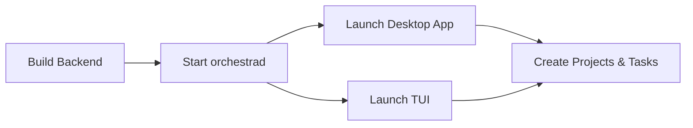

# 7. Getting Started

> **Source files:**
> - `apps/backend/cmd/orchestrad/` -- Backend server
> - `apps/backend/cmd/orchestra/` -- CLI tool
> - `apps/desktop/package.json` -- Desktop app scripts
> - `apps/desktop/electron/main.cjs` -- Managed backend lifecycle
> - `apps/tui/` -- TUI dashboard
> - `apps/backend/internal/config/load.go` -- Configuration loading

This guide walks you through installing, building, and running Orchestra for the first time.

---

### Prerequisites

| Component | Requirement | Purpose |
|-----------|-------------|---------|
| Go | 1.24+ | Backend and TUI compilation |
| Node.js | 20+ | Desktop frontend |
| npm | 10+ | Package management |
| Git | 2.x | Version control |

Optional:
- Docker (for containerized deployment)
- An agent CLI installed: `claude`, `codex`, `opencode`, or `gemini`

---

### Quick Start



---

### 1. Backend Setup

Clone the repository and build the backend:

```bash
git clone https://github.com/Traves-Theberge/Orchestra.git
cd Orchestra/apps/backend

# Build the server and CLI
go build -o orchestrad ./cmd/orchestrad
go build -o orchestra ./cmd/orchestra
```

Start the backend server:

```bash
# Minimal configuration for local development
export ORCHESTRA_SERVER_HOST=127.0.0.1
export ORCHESTRA_SERVER_PORT=4010
export ORCHESTRA_WORKSPACE_ROOT=~/.orchestra/workspaces

./orchestrad
```

Verify it is running:

```bash
curl http://127.0.0.1:4010/api/v1/state
```

You should receive a JSON response with `generated_at`, `counts`, and other runtime state.

---

### 2. Desktop App Setup

The desktop application provides the full GUI experience with an integrated backend sidecar.

```bash
cd apps/desktop

# Install dependencies
npm ci

# Option A: Development mode (connects to your running orchestrad)
npm run dev

# Option B: Build and package (bundles its own orchestrad)
npm run dist:prep
npm run dist:desktop
```

**Development mode** starts both the Vite dev server and Electron, connecting to your locally running `orchestrad` instance.

**Packaged mode** bundles the `orchestrad` binary and manages it automatically -- no separate backend required.

#### Connecting in Development

When running `npm run dev`, the desktop app connects to the backend specified by environment variables:

```bash
export ORCHESTRA_BASE_URL=http://127.0.0.1:4010
export ORCHESTRA_API_TOKEN=your-token  # optional for localhost
npm run dev
```

---

### 3. TUI Setup

The terminal dashboard provides a lightweight monitoring view:

```bash
# Run directly
cd apps/tui
go run .

# Or build and install
cd /path/to/Orchestra
make build     # outputs ./orchestra-dash
make install   # installs to /usr/local/bin/orchestra-dash
```

---

### 4. First Run Walkthrough

Once the backend and a frontend (desktop or TUI) are running:

#### Step 1: Register a Project

A project is a local Git repository that Orchestra manages.

1. Open the **Projects** section in the desktop app
2. Click **Add Project**
3. Select the root directory of a Git repository
4. The project appears in the project list

Or register via the API:

```bash
curl -X POST http://127.0.0.1:4010/api/v1/projects \
  -H "Content-Type: application/json" \
  -d '{"root_path": "/path/to/your/repo"}'
```

#### Step 2: Create a Task

Tasks (issues) are units of work assigned to machine learning agents.

1. Open the **Tasks** section
2. Click **New Task**
3. Fill in:
   - **Title**: A concise description of the work
   - **Description**: Detailed instructions (Markdown supported)
   - **Project**: The target repository
   - **Assignee**: The agent provider (claude, codex, etc.)
   - **State**: Set to an active state (e.g., "Todo")

#### Step 3: Monitor Execution

Once a task is in an active state with an assigned agent:

1. The **Dashboard** shows active agents and running sessions
2. The **Live Console** provides real-time terminal output
3. The **Tasks** kanban board shows state transitions
4. Click a task to open the inspector with history, diff, and logs tabs

---

### 5. Connecting to a Project Tracker

Orchestra can sync with external issue trackers. Configure the tracker in your environment:

```bash
# Linear tracker example
export ORCHESTRA_TRACKER_TYPE=linear
export ORCHESTRA_TRACKER_ENDPOINT=https://api.linear.app/graphql
export ORCHESTRA_TRACKER_TOKEN=lin_api_xxxxx

# Filter which issues to process
export ORCHESTRA_ACTIVE_STATES="Todo,In Progress"
export ORCHESTRA_TERMINAL_STATES="Done,Cancelled"
export ORCHESTRA_TRACKER_WORKER_ASSIGNEE_IDS="user-id-1,user-id-2"
```

Restart `orchestrad` after changing environment variables. The backend will begin polling the tracker for matching issues.

---

### 6. Agent Provider Setup

Orchestra needs at least one agent CLI installed on the system. The default provider is Codex.

| Provider | CLI Command | Install |
|----------|------------|---------|
| Codex | `codex` | `npm install -g @openai/codex` |
| Claude | `claude` | Install from Anthropic |
| Gemini | `gemini` | Install from Google |
| OpenCode | `opencode` | `go install github.com/opencode-ai/opencode@latest` |

Set the default provider:

```bash
export ORCHESTRA_AGENT_PROVIDER=CLAUDE
```

Custom agent commands can be configured per provider -- see the [Configuration Guide](configuration.md).

---

### Next Steps

- [7.1 Configuration Guide](configuration.md) -- Complete environment variable reference
- [7.2 Development Guide](development.md) -- Contributing and development workflow
- [6. Deployment & Operations](../operations/deployment.md) -- Production deployment patterns
