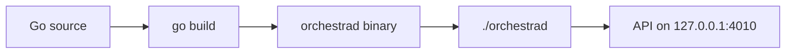
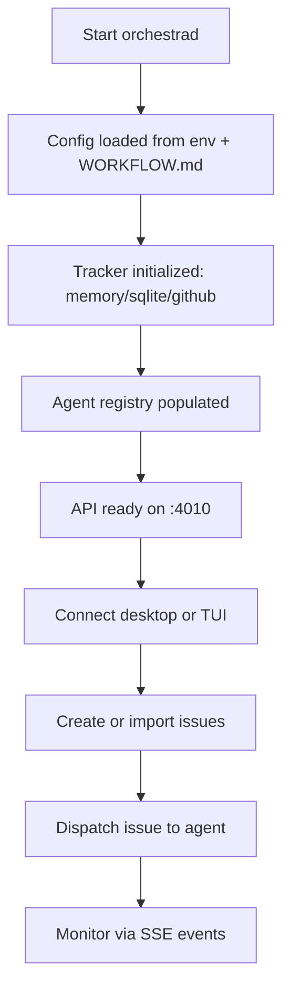

# 5.1 Getting Started

> **Source files:** `README.md`, `apps/backend/cmd/orchestrad/main.go`, `apps/desktop/package.json`, `apps/backend/internal/app/run.go`

This guide walks through setting up Orchestra from source, running each component, and verifying a working installation.

## 7.1 Prerequisites

| Requirement | Minimum Version | Purpose |
|-------------|----------------|---------|
| **Go** | 1.25+ | Backend and TUI compilation |
| **Node.js** | 22+ | Desktop app (Electron + React) |
| **npm** | (bundled with Node) | Desktop dependency management |
| **Git** | 2.x | Source checkout, workspace management |
| **Agent CLI** | Any one of: `codex`, `claude`, `opencode`, `gemini` | At least one agent must be installed and on `$PATH` |

### Optional

| Tool | Purpose |
|------|---------|
| Docker | Container-based deployment (see [Section 6.2](../operations/docker.md)) |
| Make | TUI build convenience (`make build`) |
| Electron | Bundled via npm for desktop builds |

## 7.2 Installation

### Clone the Repository

```bash
git clone https://github.com/Traves-Theberge/Orchestra.git
cd Orchestra
```

### Verify Agent Availability

Ensure at least one agent CLI is installed and accessible:

```bash
# Check whichever agents you have installed
which codex    # or: which claude, which opencode, which gemini
```

## 7.3 Running the Backend



```bash
cd apps/backend
go build -o orchestrad ./cmd/orchestrad/
./orchestrad --workspace-root /path/to/your/project
```

The `orchestrad` daemon initializes logging via `logging.New()`, then delegates to `app.Run()` which:

1. Loads configuration from environment variables and `WORKFLOW.md`
2. Sets up the HTTP server with Chi router
3. Registers agent runners, tracker, and event bus
4. Begins listening on the configured host and port (default: `127.0.0.1:4010`)

### Verify the Backend

```bash
curl http://127.0.0.1:4010/healthz
```

A successful response confirms the server is running.

## 7.4 Running the Desktop App

```bash
cd apps/desktop
npm install
npm run dev
```

This starts two processes concurrently:

1. **Vite dev server** on `http://localhost:5173` (React app with HMR)
2. **Electron main process** connecting to the Vite dev server

The desktop app communicates with the backend over HTTP and receives real-time events via Server-Sent Events (SSE).

### Building for Distribution

```bash
# Build production assets and package
npm run dist:desktop
```

This produces platform-specific installers in `apps/desktop/release/`:

| Platform | Output Formats |
|----------|---------------|
| Linux | AppImage, deb |
| macOS | dmg, zip |
| Windows | nsis (x64) |

## 7.5 Running the TUI

```bash
cd apps/tui
go run .
```

The TUI is built with Bubble Tea and provides a terminal-based interface to the same backend API.

## 7.6 First-Run Walkthrough



1. **Start the backend** with your desired workspace root:
   ```bash
   ./orchestrad --workspace-root ~/projects/my-repo
   ```

2. **Configure your tracker** (optional). By default Orchestra uses an in-memory tracker. For persistent storage, set:
   ```bash
   export ORCHESTRA_TRACKER_TYPE=sqlite
   ```
   For GitHub Issues integration:
   ```bash
   export ORCHESTRA_TRACKER_TYPE=github
   export ORCHESTRA_TRACKER_ENDPOINT=owner/repo
   export ORCHESTRA_TRACKER_TOKEN=ghp_...
   ```

3. **Choose your agent provider:**
   ```bash
   export ORCHESTRA_AGENT_PROVIDER=CLAUDE   # or CODEX, OPENCODE, GEMINI
   ```

4. **Launch the desktop app** (`npm run dev` from `apps/desktop/`) or TUI (`go run .` from `apps/tui/`).

5. **Create an issue** through the UI and dispatch it to an agent. Monitor progress in real time via the event stream.

See [Configuration Guide](configuration.md) (Section 5.2) for the full environment variable reference.

## 7.7 Troubleshooting

| Problem | Cause | Solution |
|---------|-------|----------|
| `orchestrad failed: invalid port` | `ORCHESTRA_SERVER_PORT` is not a valid integer (1-65535) | Set a valid port or unset to use default `4010` |
| `connection refused` on desktop app | Backend is not running or on a different port | Start `orchestrad` first; verify port matches desktop config |
| Agent command not found | Agent CLI not on `$PATH` | Install the agent CLI or set `ORCHESTRA_AGENT_COMMAND_<NAME>` to the full path |
| `npm run dev` fails with port conflict | Port 5173 already in use | Stop the conflicting process or change the Vite port |
| Blank workspace after dispatch | `ORCHESTRA_WORKSPACE_ROOT` points to nonexistent directory | Create the directory or set to an existing path |
| Permission denied on `orchestrad` | Binary not executable | Run `chmod +x orchestrad` |
| Desktop app shows no events | SSE connection failed | Check that backend host/port match and CORS is not blocking |
| SQLite tracker errors | Missing write permissions | Ensure the data directory is writable by the process |

---

*Cross-references: [Configuration Guide](configuration.md) (Section 5.2), [Development Guide](development.md) (Section 5.3), [Architecture Overview](../architecture/overview.md) (Section 1.1)*
